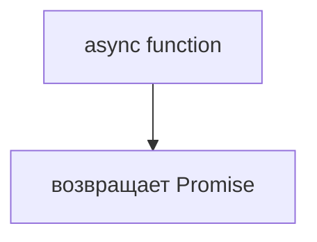
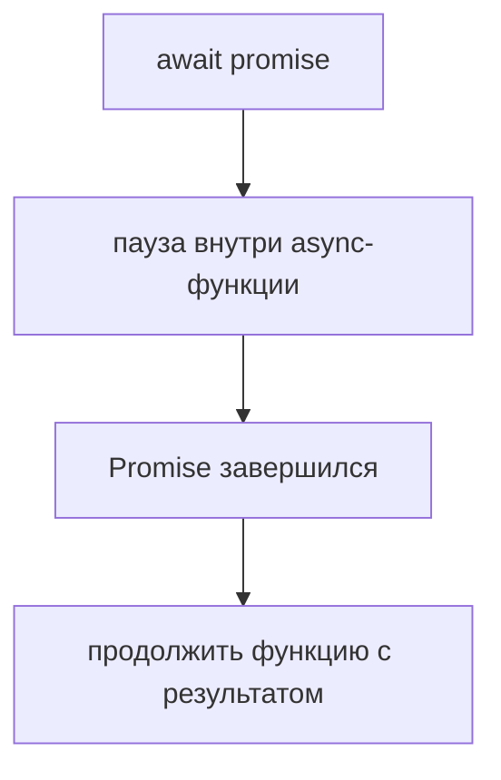
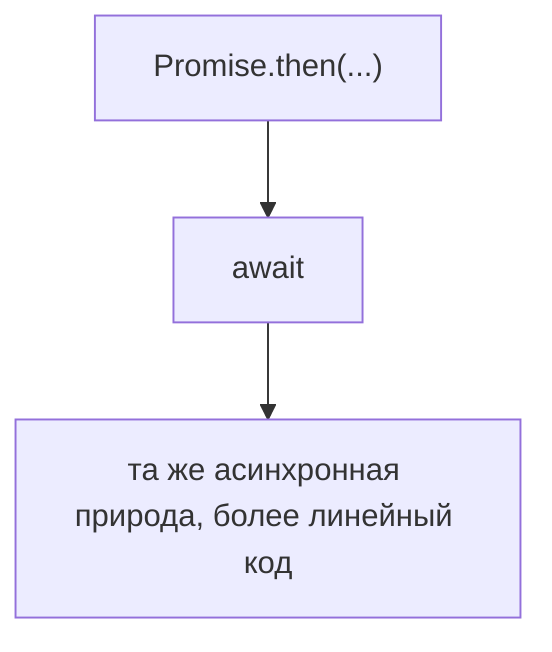
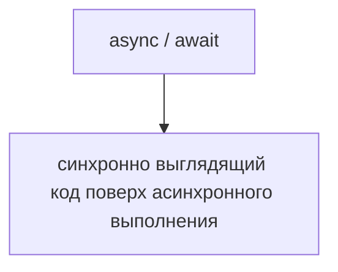

# async и await

## Связь с предыдущей главой

Предыдущая глава показала Promise API:

```text
then()
catch()
finally()
```

Теперь мы смотрим на другой способ писать тот же асинхронный поток. `async` и `await` не отменяют Promise и Event Loop. Они дают более читаемую форму записи.

## Главный вопрос

> Почему появились `async` и `await`?

Короткий ответ: чтобы асинхронный код читался как последовательный, оставаясь асинхронным внутри.

## Мотивация

Цепочка Promise может выглядеть так:

```javascript
prepareEnvironment()
  .then(function login(configuration) {
    return executeLogin(configuration);
  })
  .then(function runTests(session) {
    return executeTests(session);
  });
```

С `await` тот же поток читается как последовательность шагов:

```javascript
const configuration = await prepareEnvironment();
const session = await executeLogin(configuration);
const result = await executeTests(session);
```

Это особенно важно в тестах, где порядок действий должен быть очевидным.

## Теория

`async` перед функцией означает: функция всегда возвращает Promise.

```javascript
async function prepareEnvironment() {
  return { environment: 'staging' };
}
```

Даже если внутри возвращается обычное значение, снаружи функция возвращает Promise с этим значением.

`await` используется внутри `async`-функции. Он ожидает завершения Promise и возвращает его успешный результат:

```javascript
const configuration = await prepareEnvironment();
```

`await` не блокирует весь JavaScript. Он приостанавливает выполнение текущей `async`-функции до результата Promise, а остальной механизм асинхронности продолжает работать через Event Loop и очереди.

## Внутренний механизм

Концептуально:





Пока текущая `async`-функция ждет результат, остальной JavaScript продолжает работать обычным образом. Event Loop может обрабатывать другие готовые задачи. Приостанавливается только эта `async`-функция, а не весь JavaScript-код.

Это не новая модель выполнения. Это более удобная запись поверх Promise.



### `await` работает и с обычными значениями

Небольшая, но полезная деталь: `await` можно применить к чему угодно.

```javascript
await 5;              // 5
await Promise.resolve(5);   // 5
```

Если справа не Promise, значение оборачивается и возвращается как есть — но продолжение всё равно откладывается до следующей микрозадачи. Поэтому лишний `await` не ломает логику, но добавляет шаг в очередь.

Практическое следствие: функция, которая может вернуть и значение, и Promise, единообразно обрабатывается через `await` — проверять тип не нужно.

### `await` приостанавливает функцию, а не программу

`await` не блокирует весь JavaScript. Он приостанавливает выполнение текущей `async`-функции до результата Promise, а остальной механизм асинхронности продолжает работать через Event Loop и очереди.

Разница видна, если вспомнить главу 69: блокирующий цикл занимает стек и не даёт выполниться ничему. `await` освобождает стек: функция «уходит в ожидание», продолжение ставится в очередь микрозадач, а движок берётся за другую работу.

Именно поэтому асинхронное ожидание в тестах не мешает таймерам и обработчикам, а цикл ожидания — мешает.

### `async/await` — это тот же Promise

Синтаксис не вводит новый механизм. `async`-функция возвращает Promise, `await` разворачивает Promise, а порядок выполнения подчиняется очереди микрозадач из главы 75.

| Запись с Promise | Запись с `await` |
| --- | --- |
| `op().then((r) => use(r))` | `const r = await op(); use(r);` |
| `op().catch(handle)` | `try { await op(); } catch { handle(); }` |
| `op().finally(clean)` | `try { await op(); } finally { clean(); }` |

Обе формы взаимозаменяемы и могут встречаться в одном коде. Выбор — вопрос читаемости: цепочка преобразований нагляднее с `then()`, ветвящаяся логика — с `await`.

### Последовательность против параллельности

Главная ловушка удобного синтаксиса: два `await` подряд выполняются **последовательно**.

```javascript
await slow();   // 50 мс
await slow();   // ещё 50 мс — всего около 100
```

Измерено: два последовательных ожидания по 50 мс заняли 103 мс, а те же операции через `Promise.all` — 51 мс.

Если операции независимы, их запускают сразу, а ожидают вместе:

```javascript
const [a, b] = await Promise.all([slow(), slow()]);
```

Подробнее об этом — в главе 80. Здесь важно понимать, что последовательность создаёт не язык, а расположение `await`.

## Главная ментальная модель

Главная модель главы:



## Практические примеры

Примеры находятся в:

```text
examples/01-javascript/chapter-78/
```

Запуск:

```bash
node examples/01-javascript/chapter-78/01-async-function.js
node examples/01-javascript/chapter-78/02-await.js
node examples/01-javascript/chapter-78/03-return-value.js
node examples/01-javascript/chapter-78/04-qa-flow.js
```

## Пример Automation QA

Тестовый поток:

```javascript
async function runFramework() {
  const configuration = await prepareEnvironment();
  const session = await login(configuration);
  const result = await executeTests(session);
  return generateReport(result);
}
```

Такой код читается как сценарий тестового запуска, но каждый шаг может быть асинхронным.

## Распространённые мифы

**Миф: `await` блокирует программу.**
Он приостанавливает только текущую `async`-функцию. Стек освобождается, и движок продолжает другую работу.

**Миф: `async/await` — замена Promise.**
Это синтаксис над теми же промисами. `async`-функция возвращает Promise, `await` его разворачивает.

**Миф: `await` можно применять только к Promise.**
Можно к любому значению: оно вернётся как есть, но продолжение отложится.

**Миф: два `await` подряд выполняются параллельно.**
Они последовательны. Параллельность даёт запуск операций до ожидания.

**Миф: `async` делает функцию асинхронной.**
Он делает её возвращающей Promise. Асинхронность создают операции внутри.

## Частые вопросы

**Что вернёт `async`-функция без `await` внутри?**
Promise с возвращённым значением — всегда.

**Почему два независимых запроса выполняются вдвое дольше?**
Каждый `await` ждёт завершения предыдущего. Нужен `Promise.all`.

**Можно ли смешивать `then()` и `await`?**
Да, это один механизм. Выбор определяется читаемостью конкретного места.

**Нужен ли `await` перед возвратом значения?**
Обычно нет, но в блоке `try` он важен — об этом в следующей главе.

**Почему лишний `await` не ломает код?**
Значение просто возвращается как есть; добавляется лишь шаг в очереди микрозадач.

## Проверьте себя

1. Что возвращает `async`-функция, если внутри нет ни одного `await`?
2. Что именно приостанавливает `await` — программу или функцию?
3. Что произойдёт при `await` на обычном числе?
4. Почему два `await` подряд дают суммарное время, а `Promise.all` — нет?
5. Как записать `try/finally` эквивалент цепочки с `finally()`?

## Распространённые ошибки

### Ошибка 1. Думать, что `async` делает код синхронным

`async`-функция возвращает Promise. Она не превращает асинхронную работу в синхронную.

### Ошибка 2. Забывать `await`

Если не написать `await`, переменная получит Promise, а не готовый результат.

### Ошибка 3. Использовать `await` вне `async`-функции без понимания контекста

В этой главе используем простое правило: `await` пишется внутри `async`-функции.

## Практика

Практика находится в:

```text
practice/01-javascript/78-async-await.md
```

Решения находятся в:

```text
solutions/01-javascript/78-async-await.md
```

## Краткие итоги

`async` и `await` улучшают читаемость асинхронного кода.

Главное:

* `async`-функция возвращает Promise;
* `await` ожидает результат Promise внутри `async`-функции;
* код выглядит последовательным, но остается асинхронным;
* `await` не блокирует весь JavaScript;
* эта форма особенно удобна для тестовых сценариев.

## Переход к следующей главе

Теперь код стал читаемее.

Следующий вопрос:

> Как правильно обрабатывать ошибки в асинхронном коде?

Ответ — через rejected Promise, `try/catch` и распространение ошибок.
