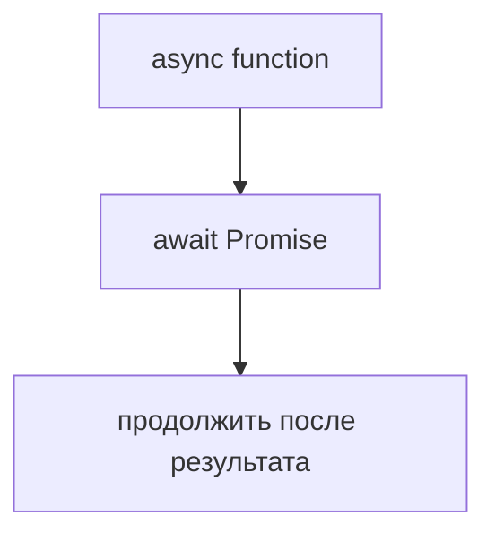
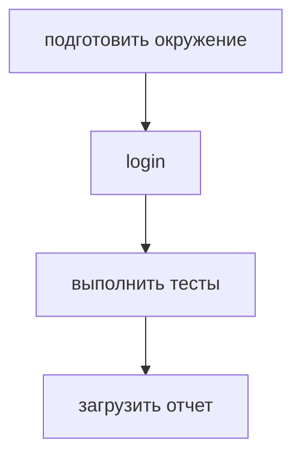
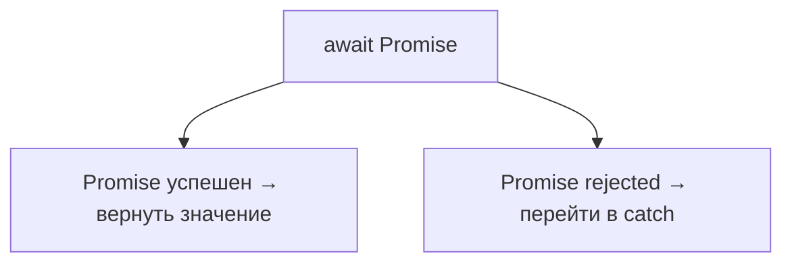
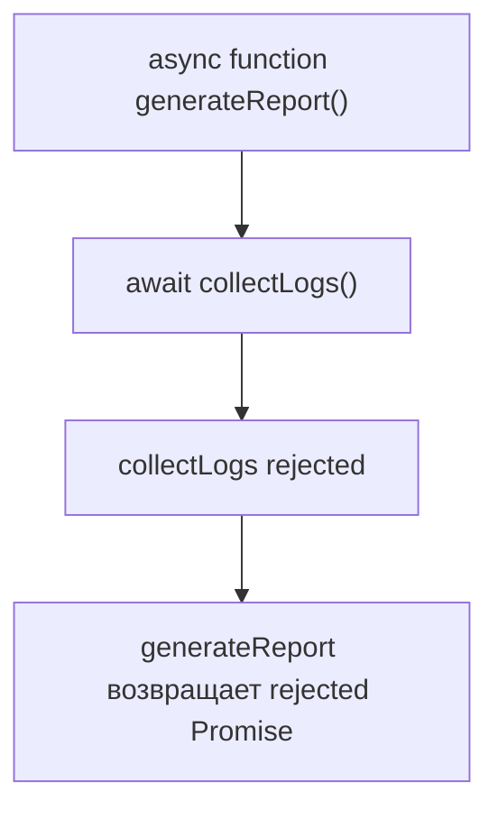
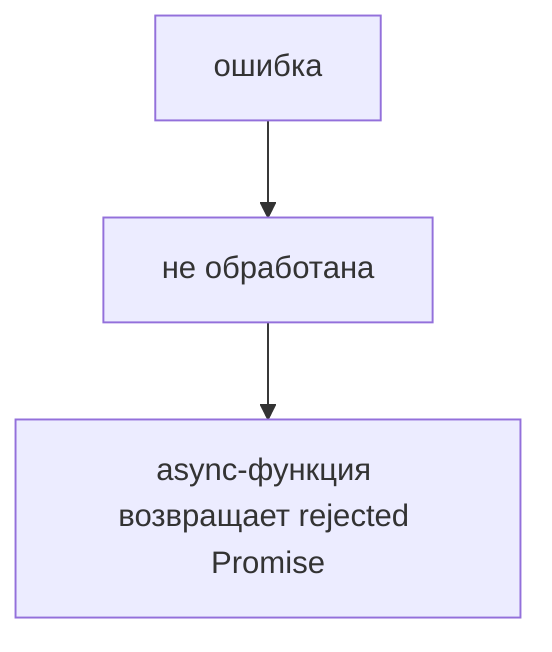
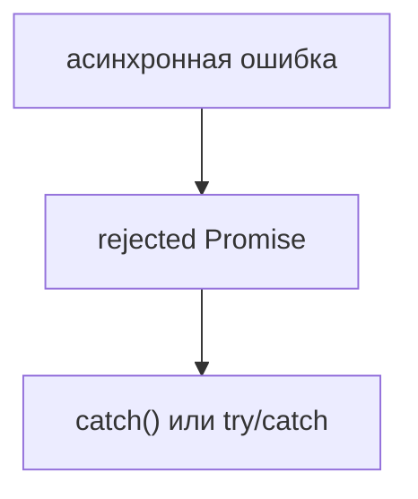

# Error Handling in Asynchronous Code

## Связь с предыдущей главой

Предыдущая глава показала `async` и `await`:



Теперь нужно понять, что происходит, если асинхронная операция завершается ошибкой.

## Главный вопрос

> Как обрабатывать асинхронные ошибки?

Короткий ответ: rejected Promise обрабатывается через `catch()` или через `try/catch` вокруг `await`.

## Мотивация

В тестовом фреймворке ошибка может возникнуть на любом шаге:



Если загрузка отчета упала, код должен:

* не скрыть ошибку;
* завершить очистку ресурсов;
* показать понятное сообщение;
* не продолжать сценарий как успешный.

## Теория

Promise может завершиться ошибкой. Такой Promise называют rejected Promise.

Через Promise API ошибка обрабатывается так:

```javascript
operation().catch(function handleError(error) {
  console.log(error);
});
```

Через `async/await`:

```javascript
try {
  const result = await operation();
  console.log(result);
} catch (error) {
  console.log(error);
}
```

`try/catch` вокруг `await` ловит ошибку, если Promise завершился неуспешно.

## Внутренний механизм

Упрощенная модель:



Если ошибка не обработана внутри текущей `async`-функции, она распространяется наружу как rejected Promise этой функции.





Это позволяет обрабатывать ошибку на более высоком уровне.

## Главная ментальная модель

Главная модель главы:



## Практические примеры

Примеры находятся в:

```text
examples/01-javascript/chapter-79/
```

Запуск:

```bash
node examples/01-javascript/chapter-79/01-try-catch-await.js
node examples/01-javascript/chapter-79/02-rejected-promise.js
node examples/01-javascript/chapter-79/03-error-propagation.js
node examples/01-javascript/chapter-79/04-qa-flow.js
```

## Пример Automation QA

Пример тестового фреймворка:

```javascript
async function runFramework() {
  try {
    const result = await executeTest();
    await uploadReport(result);
  } catch (error) {
    console.log(`framework error: ${error}`);
  } finally {
    console.log('cleanup finished');
  }
}
```

Такой код явно показывает успешный путь, обработку ошибки и очистку ресурсов.

## Распространённые ошибки

### Ошибка 1. Оборачивать асинхронный вызов в `try/catch`, но не использовать `await`

Если Promise не ожидается через `await`, ошибка не попадет в этот `try/catch` как синхронное исключение.

### Ошибка 2. Проглатывать ошибку

Если `catch` только молча скрывает ошибку, тестовый фреймворк может показать ложный успех.

### Ошибка 3. Забывать очистку ресурсов

Даже при ошибке нужно закрывать сессию, очищать данные и сохранять диагностическую информацию.

## Практика

Практика находится в:

```text
practice/01-javascript/79-async-error-handling.md
```

Решения находятся в:

```text
solutions/01-javascript/79-async-error-handling.md
```

## Краткие итоги

Асинхронные ошибки нужно обрабатывать явно.

Главное:

* ошибка Promise — это rejected Promise;
* `catch()` обрабатывает ошибку через Promise API;
* `try/catch` работает с `await`;
* ошибка может распространяться наружу;
* очистка ресурсов должна выполняться независимо от успеха или ошибки.

## Переход к следующей главе

Теперь мы умеем писать последовательный асинхронный код и обрабатывать ошибки.

Следующий вопрос:

> Нужно ли всегда ждать операции одну за другой?

Нет. Иногда асинхронную работу нужно запускать вместе.
