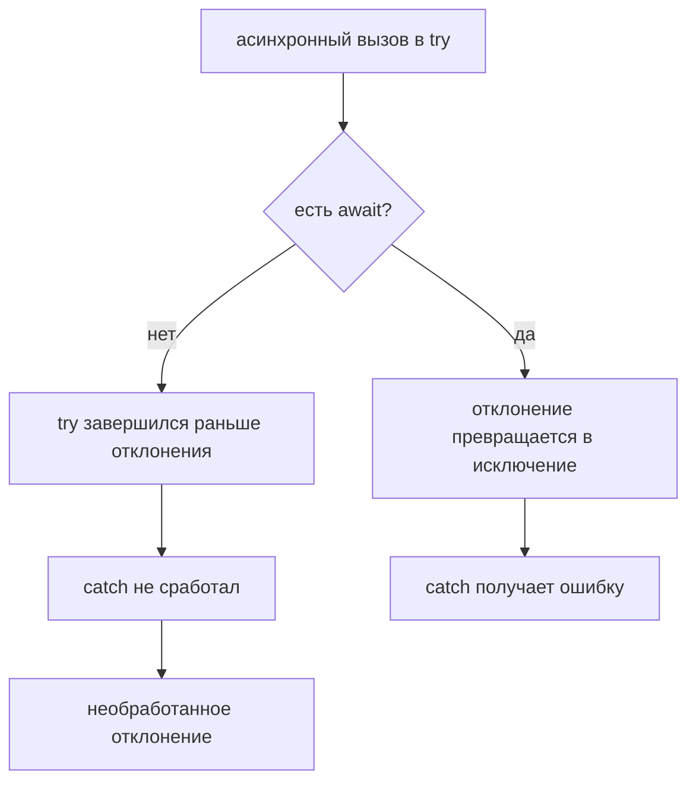

# Error Handling in Asynchronous Code

## Связь с предыдущей главой

Предыдущая глава показала `async` и `await`:

Теперь нужно понять, что происходит, если асинхронная операция завершается ошибкой.

## Главный вопрос

> Как обрабатывать асинхронные ошибки?

Короткий ответ: rejected Promise обрабатывается через `catch()` или через `try/catch` вокруг `await`.

## Мотивация

В тестовом фреймворке ошибка может возникнуть на любом шаге:

Если загрузка отчета упала, код должен:

* не скрыть ошибку;
* завершить очистку ресурсов;
* показать понятное сообщение;
* не продолжать сценарий как успешный.

## Теория

Promise может завершиться ошибкой. Такой Promise называют rejected Promise.

Через Promise API ошибка обрабатывается так:

```javascript
operation().catch(function handleError(error) {
  console.log(error);
});
```

Через `async/await`:

```javascript
try {
  const result = await operation();
  console.log(result);
} catch (error) {
  console.log(error);
}
```

`try/catch` вокруг `await` ловит ошибку, если Promise завершился неуспешно.

Без `await` ошибка проходит мимо `catch`:



## Внутренний механизм

Упрощённая модель: отклонённый Promise ведёт себя как брошенное исключение, но «бросается» он только в момент разворачивания — то есть при `await` или в обработчике `catch()`.

Если ошибка не обработана внутри текущей `async`-функции, она распространяется наружу как rejected Promise этой функции.

Это позволяет обрабатывать ошибку на более высоком уровне.

### Без `await` ошибка не попадёт в `catch`

Это самая частая ошибка в асинхронных тестах, и она проверяется одной строкой:

```javascript
try {
  failingOperation();        // без await
} catch (error) {
  // сюда не попадём
}
```

`async`-функция не выбрасывает исключение синхронно — она возвращает отклонённый Promise. К моменту выполнения `catch` бросать ещё нечего, поэтому блок не срабатывает.

С `await` поведение ожидаемое:

```javascript
try {
  await failingOperation();  // ошибка поймана
} catch (error) {
  handle(error);
}
```

Проверено: первый вариант возвращает «не поймано», второй — «поймано».

### `return` против `return await` внутри `try`

Тонкость того же рода, о которой редко знают:

```javascript
async function a() {
  try { return failing(); }          // catch НЕ сработает
  catch { return 'поймано'; }
}

async function b() {
  try { return await failing(); }    // catch сработает
  catch { return 'поймано'; }
}
```

В первом случае функция возвращает Promise и выходит из `try` **до** того, как он отклонится — ошибка уходит наружу. Во втором `await` разворачивает Promise внутри блока, и `catch` его видит.

Правило простое: внутри `try` перед возвратом промиса `await` обязателен, даже если кажется лишним.

### Необработанное отклонение завершает процесс

Отклонённый Promise, у которого нет ни `catch()`, ни `await` в блоке `try`, становится необработанным отклонением. В современном Node это не предупреждение, а фатальная ошибка: процесс завершается с ненулевым кодом.

Для тестового прогона это означает падение всего запуска, а не одного теста — и именно поэтому забытый `await` в колбэке опаснее, чем кажется.

Перехватить такие случаи глобально можно обработчиком процесса, но это средство диагностики, а не решение: правильное место обработки — там, где ошибка возникла.

### Распространение наружу

Если ошибка не обработана внутри текущей `async`-функции, она распространяется наружу как rejected Promise этой функции. Это позволяет обрабатывать ошибку на более высоком уровне.

Модель совпадает с синхронной: исключение поднимается по цепочке вызовов, пока не встретит обработчик. Разница в том, что «цепочка вызовов» здесь — цепочка `await`, и разорвать её достаточно одного пропущенного ключевого слова.

### Что делать с пойманной ошибкой

Три варианта, и выбор между ними — инженерное решение:

| Действие | Когда уместно |
| --- | --- |
| обработать и продолжить | есть осмысленное значение по умолчанию |
| дополнить и пробросить | нужно добавить контекст: `throw new Error('...', { cause: error })` |
| не ловить вовсе | обработка принадлежит вызывающему коду |

Худший вариант — поймать и промолчать: ошибка исчезает, а сценарий продолжается с неверными данными.

## Главная ментальная модель

Главная модель главы: **ошибка асинхронной операции доходит до `catch` только там, где Promise разворачивают, — забытый `await` разрывает эту связь**.

## Практические примеры

Примеры находятся в:

```text
examples/01-javascript/chapter-79/
```

Запуск:

```bash
node examples/01-javascript/chapter-79/01-try-catch-await.js
node examples/01-javascript/chapter-79/02-rejected-promise.js
node examples/01-javascript/chapter-79/03-error-propagation.js
node examples/01-javascript/chapter-79/04-qa-flow.js
```

## Пример Automation QA

Пример тестового фреймворка:

```javascript
async function runFramework() {
  try {
    const result = await executeTest();
    await uploadReport(result);
  } catch (error) {
    console.log(`framework error: ${error}`);
  } finally {
    console.log('cleanup finished');
  }
}
```

Такой код явно показывает успешный путь, обработку ошибки и очистку ресурсов.

## Распространённые мифы

**Миф: `try/catch` вокруг асинхронного вызова поймает ошибку.**
Только если внутри есть `await`. Без него функция возвращает отклонённый Promise, а блок уже завершился.

**Миф: `return promise` внутри `try` равносилен `return await promise`.**
Без `await` функция выходит из блока до отклонения, и `catch` не срабатывает.

**Миф: необработанное отклонение — это предупреждение.**
В современном Node процесс завершается с ненулевым кодом.

**Миф: `async`-функция выбрасывает исключение синхронно.**
Она возвращает отклонённый Promise; исключение появится при его разворачивании.

**Миф: поймать ошибку — значит обработать её.**
Пустой `catch` скрывает проблему, и сценарий продолжается с неверными данными.

## Частые вопросы

**Почему `catch` не сработал?**
Скорее всего, пропущен `await` перед асинхронным вызовом.

**Нужен ли `await` в `return` внутри `try`?**
Да. Без него ошибка уйдёт наружу мимо `catch`.

**Что произойдёт при необработанном отклонении в тестовом прогоне?**
Процесс завершится, и упадёт весь запуск, а не один тест.

**Как добавить контекст к ошибке?**
Пробросить новую ошибку с полем `cause`, сохранив исходную.

**Где обрабатывать ошибку?**
Там, где есть осмысленная реакция. Если её нет — пробрасывать выше.

## Проверьте себя

1. Почему `try/catch` без `await` не ловит ошибку?
2. Чем `return promise` отличается от `return await promise` внутри `try`?
3. Что делает Node при необработанном отклонении?
4. Как ошибка распространяется наружу из `async`-функции?
5. Какие три варианта действий есть с пойманной ошибкой и какой недопустим?

## Распространённые ошибки

### Ошибка 1. Оборачивать асинхронный вызов в `try/catch`, но не использовать `await`

Если Promise не ожидается через `await`, ошибка не попадет в этот `try/catch` как синхронное исключение.

### Ошибка 2. Проглатывать ошибку

Если `catch` только молча скрывает ошибку, тестовый фреймворк может показать ложный успех.

### Ошибка 3. Забывать очистку ресурсов

Даже при ошибке нужно закрывать сессию, очищать данные и сохранять диагностическую информацию.

## Практика

Практика находится в:

```text
practice/01-javascript/79-async-error-handling.md
```

Решения находятся в:

```text
solutions/01-javascript/79-async-error-handling.md
```

## Краткие итоги

Асинхронные ошибки нужно обрабатывать явно.

Главное:

* ошибка Promise — это rejected Promise;
* `catch()` обрабатывает ошибку через Promise API;
* `try/catch` работает с `await`;
* ошибка может распространяться наружу;
* очистка ресурсов должна выполняться независимо от успеха или ошибки.

## Переход к следующей главе

Теперь мы умеем писать последовательный асинхронный код и обрабатывать ошибки.

Следующий вопрос:

> Нужно ли всегда ждать операции одну за другой?

Нет. Иногда асинхронную работу нужно запускать вместе.
