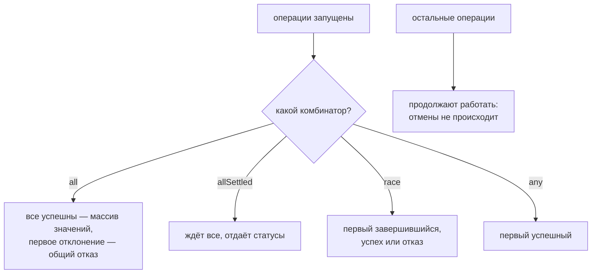

# Parallel Asynchronous Operations

## Связь с предыдущей главой

Предыдущая глава объяснила обработку асинхронных ошибок.

Теперь появляется инженерный вопрос:

```text
собрать логи
сделать скриншот
сгенерировать отчет
загрузить отчет
```

Некоторые операции зависят друг от друга. Но некоторые можно запустить одновременно.

## Главный вопрос

> Когда асинхронную работу нужно запускать вместе?

Короткий ответ: когда операции независимы и не требуют результата друг друга.

## Мотивация

После теста фреймворку нужно:

* собрать логи;
* сделать скриншот;
* собрать trace;
* загрузить отчет.

Сбор логов и скриншот могут идти независимо. Нет смысла ждать логи, чтобы только потом начинать скриншот.

## Теория

### Четыре комбинатора и их различия

Promise API даёт несколько инструментов для работы с группой операций:

| Метод | Ждёт | Результат при успехе | Поведение при ошибке |
| --- | --- | --- | --- |
| `Promise.all()` | всех | массив значений | падает на **первой** ошибке |
| `Promise.allSettled()` | всех | массив статусов | не падает никогда |
| `Promise.race()` | первого завершившегося | его значение | падает, если первым пришёл отказ |
| `Promise.any()` | первого успешного | его значение | падает, только если упали все |

`Promise.all()` ждёт успешного завершения всех Promise. Если один завершается ошибкой, весь результат становится ошибкой.

`Promise.allSettled()` ждёт завершения всех и возвращает результат каждого: успешный или ошибочный.

`Promise.race()` завершается результатом первого завершившегося Promise — успешного или ошибочного.

`Promise.any()` завершается первым успешным результатом. Если все завершились ошибкой, результат тоже будет ошибкой.

### Что именно возвращает каждый

Формы результатов различаются, и это важно при чтении кода:

```javascript
await Promise.all([ok('a'), ok('b')]);
// ['a', 'b'] — значения по порядку аргументов

await Promise.allSettled([ok('a'), fail('b')]);
// [{ status: 'fulfilled', value: 'a' }, { status: 'rejected', reason: Error }]

await Promise.any([fail('a'), ok('b')]);
// 'b' — ошибки просто игнорируются
```

У `Promise.all()` порядок значений соответствует порядку аргументов, а не порядку завершения — операция, завершившаяся первой, не окажется первой в массиве.

При полном отказе `Promise.any()` выбрасывает `AggregateError` со всеми причинами внутри — та же структура, что использовалась в главах про очистку ресурсов.

### Параллельность даёт запуск, а не комбинатор

Ключевое уточнение: `Promise.all()` ничего не запускает. Операции стартуют в момент **создания** промисов, а комбинатор лишь ждёт их вместе.

```javascript
const a = slow();          // запущена
const b = slow();          // запущена
await Promise.all([a, b]); // ждём обе
```

Измерено: два последовательных `await` по 50 мс заняли 103 мс, а `Promise.all` с теми же операциями — 51 мс. Выигрыш даёт не метод, а то, что обе операции уже выполнялись, когда началось ожидание.

Отсюда же следует ограничение: если промисы созданы внутри `Promise.all(...)`, но одна из операций зависит от результата другой, параллельности не будет — зависимую нельзя запустить раньше.

### `all` не отменяет остальные операции

Распространённое заблуждение с практическими последствиями. Когда `Promise.all()` падает на первой ошибке, остальные операции **продолжают выполняться** — просто их результат никого не интересует.

Для тестов это означает, что созданные ими данные всё равно появятся, и очистка должна это учитывать. Отмены в промисах нет вовсе: остановить начатую операцию можно только средствами самого API, например сигналом прерывания.

### Как выбирать

| Задача | Метод |
| --- | --- |
| нужны все результаты, любая ошибка критична | `all` |
| нужен отчёт по каждому, включая упавшие | `allSettled` |
| нужен самый быстрый ответ из нескольких источников | `any` |
| нужно ограничить ожидание по времени | `race` с таймером |

Последняя строка — типичное применение `race`: гонка настоящей операции с промисом-таймером даёт ожидание с ограничением. Но стоит помнить, что проигравшая операция не отменяется и продолжит работу.

Для автотестов чаще всего нужен `allSettled`: он позволяет увидеть все отказы сразу, а не только первый, — как мягкие проверки из главы про собственные матчеры.

Параллельность создаёт запуск, а не комбинатор:



## Внутренний механизм

Важно: эти методы не создают параллельность JavaScript-кода внутри Call Stack. Они позволяют запустить несколько асинхронных операций и дождаться их общей стратегии завершения.

Выбор метода зависит от вопроса:

## Главная ментальная модель

Главная модель главы: **параллельность создаёт момент запуска операций, а комбинатор лишь определяет, чего именно ждать и как реагировать на отказ**.

## Практические примеры

Примеры находятся в:

```text
examples/01-javascript/chapter-80/
```

Запуск:

```bash
node examples/01-javascript/chapter-80/01-promise-all.js
node examples/01-javascript/chapter-80/02-all-settled.js
node examples/01-javascript/chapter-80/03-race-any.js
node examples/01-javascript/chapter-80/04-qa-flow.js
```

## Пример Automation QA

После теста можно собрать артефакты вместе:

```javascript
const artifacts = await Promise.all([
  collectLogs(),
  captureScreenshot(),
]);

await uploadReport(artifacts);
```

Здесь загрузка отчета зависит от артефактов, а сбор логов и скриншота друг от друга не зависит.

## Распространённые мифы

**Миф: `Promise.all()` запускает операции параллельно.**
Он только ждёт. Операции стартуют при создании промисов.

**Миф: при ошибке `Promise.all()` остальные операции отменяются.**
Они продолжают выполняться; игнорируется лишь их результат.

**Миф: в массиве `Promise.all()` значения идут в порядке завершения.**
Порядок соответствует порядку аргументов.

**Миф: `race()` возвращает первый успешный результат.**
Он возвращает первый завершившийся — в том числе отказ. Первый успешный даёт `any()`.

**Миф: `allSettled()` может упасть.**
Нет: он всегда завершается успешно и сообщает статус каждой операции.

## Частые вопросы

**Почему код с `Promise.all()` не стал быстрее?**
Вероятно, промисы создаются внутри него по очереди или операции зависят друг от друга.

**Что вернёт `any()`, если упали все?**
`AggregateError` со всеми причинами.

**Как ограничить время ожидания операции?**
`race()` с промисом-таймером, помня, что проигравшая операция не отменится.

**Что выбрать для отчёта о нескольких проверках?**
`allSettled()`: он покажет все отказы, а не только первый.

**Как на самом деле отменить операцию?**
Средствами конкретного API — например, сигналом прерывания. В промисах отмены нет.

## Проверьте себя

1. Чем `all` отличается от `allSettled` по поведению при ошибке?
2. Чем `race` отличается от `any`?
3. Что именно создаёт параллельность — комбинатор или создание промисов?
4. Что происходит с остальными операциями при падении `all`?
5. В каком порядке идут значения в результате `all`?

## Распространённые ошибки

### Ошибка 1. Запускать независимые операции последовательно

Если операции не зависят друг от друга, последовательное ожидание делает сценарий медленнее.

### Ошибка 2. Использовать `Promise.all()` там, где нужны результаты всех попыток

Если важно увидеть и успехи, и ошибки, лучше подходит `Promise.allSettled()`.

### Ошибка 3. Думать, что `Promise.all()` делает JavaScript-код параллельным

Метод координирует Promise. Он не создает несколько Call Stack для выполнения JavaScript-кода.

## Практика

Практика находится в:

```text
practice/01-javascript/80-parallel-async.md
```

Решения находятся в:

```text
solutions/01-javascript/80-parallel-async.md
```

## Краткие итоги

Параллельно запущенные асинхронные операции нужны для независимых задач.

Главное:

* `Promise.all()` ждет все успешные результаты;
* `Promise.allSettled()` ждет все исходы;
* `Promise.race()` берет первый завершившийся Promise;
* `Promise.any()` берет первый успешный Promise;
* независимые операции можно запускать вместе;
* зависимые операции нужно оставлять последовательными.

Выбор Promise-метода зависит от нужной стратегии ожидания:

| Если нужно... | Используйте |
|----------------|-------------|
| дождаться всех успешных операций | `Promise.all()` |
| получить результат всех операций | `Promise.allSettled()` |
| получить первый завершившийся результат | `Promise.race()` |
| получить первый успешный результат | `Promise.any()` |

## Переход к следующей главе

Теперь асинхронная модель стала практической: вы умеете запускать операции вместе, дожидаться их разными способами и осознанно выбирать поведение при отказе.

Дальше эти знания можно применять в более крупных сценариях Automation QA и архитектуре тестового фреймворка.
