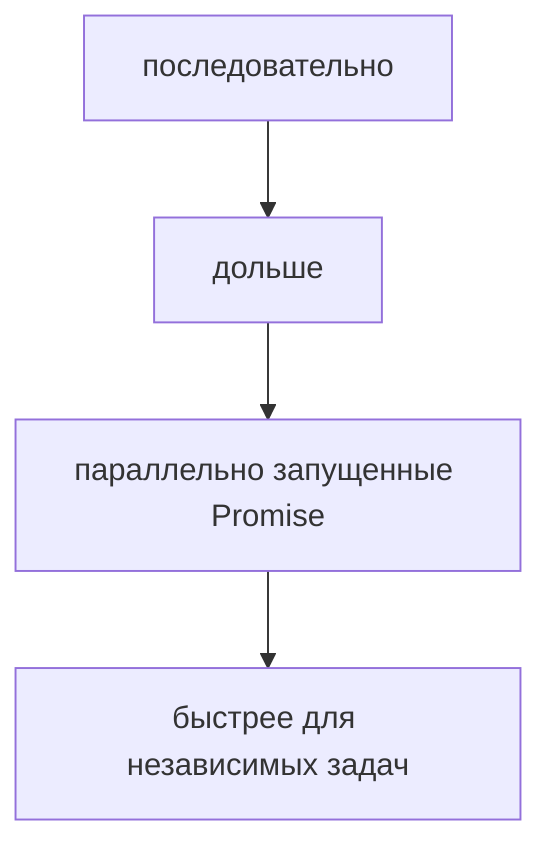
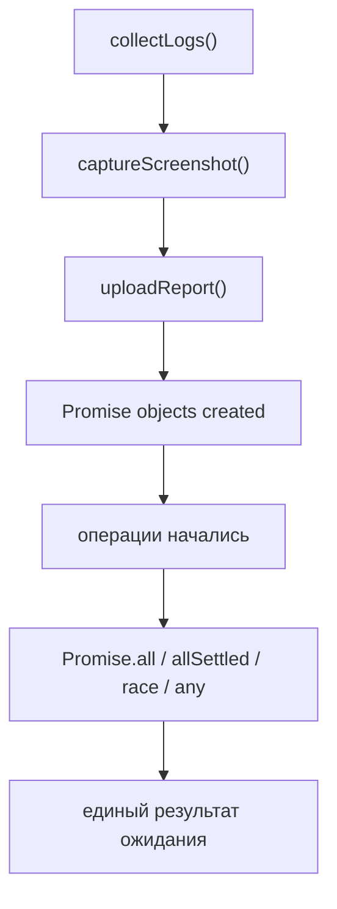
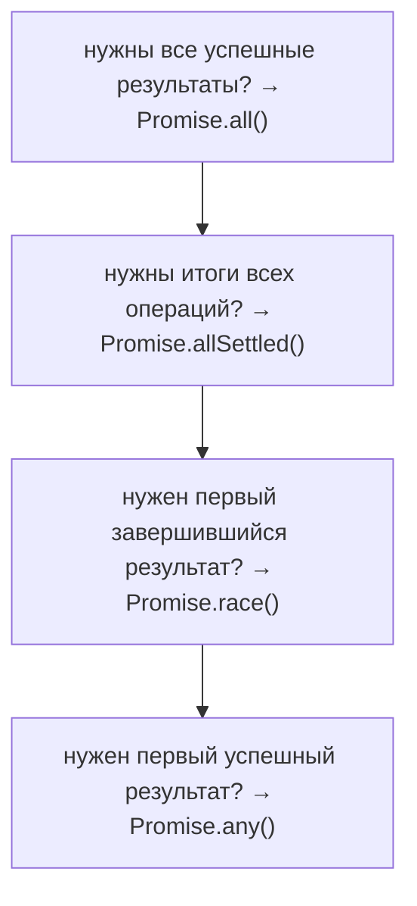
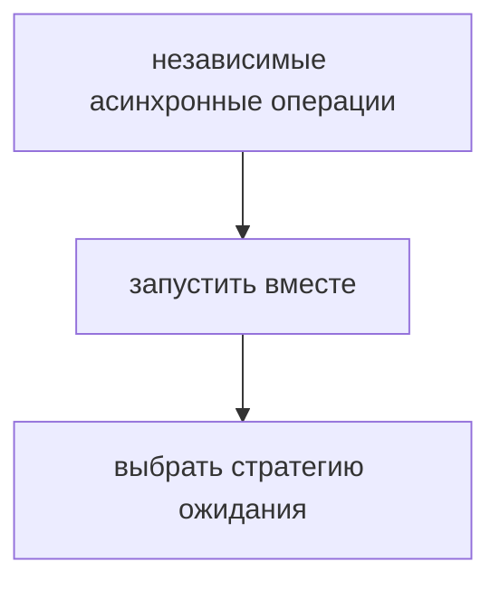
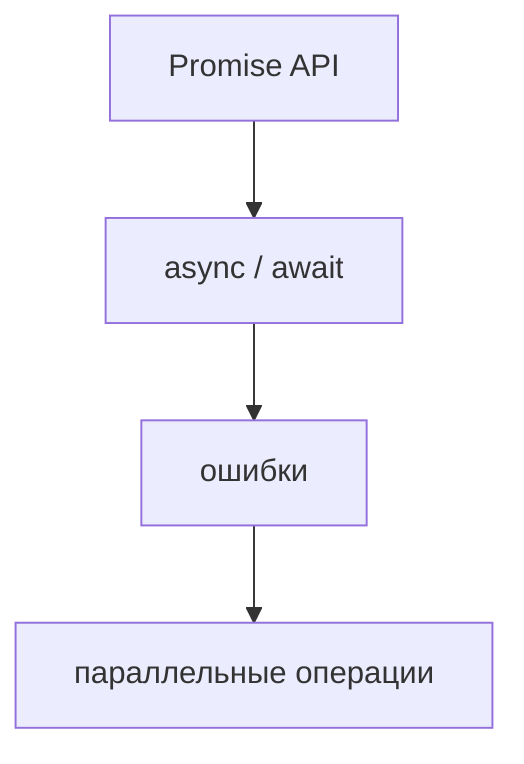

# Parallel Asynchronous Operations

## Связь с предыдущей главой

Предыдущая глава объяснила обработку асинхронных ошибок.

Теперь появляется инженерный вопрос:

```text
собрать логи
сделать скриншот
сгенерировать отчет
загрузить отчет
```

Некоторые операции зависят друг от друга. Но некоторые можно запустить одновременно.

## Главный вопрос

> Когда асинхронную работу нужно запускать вместе?

Короткий ответ: когда операции независимы и не требуют результата друг друга.

## Мотивация

После теста фреймворку нужно:

* собрать логи;
* сделать скриншот;
* собрать trace;
* загрузить отчет.

Сбор логов и скриншот могут идти независимо. Нет смысла ждать логи, чтобы только потом начинать скриншот.



## Теория

Promise API дает несколько инструментов.

`Promise.all()` ждет успешного завершения всех Promise. Если один Promise завершается ошибкой, весь результат становится ошибкой.

`Promise.allSettled()` ждет завершения всех Promise и возвращает результат каждого: успешный или ошибочный.

`Promise.race()` завершается результатом первого завершившегося Promise: успешного или ошибочного.

`Promise.any()` завершается первым успешным результатом. Если все Promise завершились ошибкой, результат тоже будет ошибкой.

## Внутренний механизм

Важно: эти методы не создают параллельность JavaScript-кода внутри Call Stack. Они позволяют запустить несколько асинхронных операций и дождаться их общей стратегии завершения.



Выбор метода зависит от вопроса:



## Главная ментальная модель

Главная модель главы:



## Практические примеры

Примеры находятся в:

```text
examples/01-javascript/chapter-80/
```

Запуск:

```bash
node examples/01-javascript/chapter-80/01-promise-all.js
node examples/01-javascript/chapter-80/02-all-settled.js
node examples/01-javascript/chapter-80/03-race-any.js
node examples/01-javascript/chapter-80/04-qa-flow.js
```

## Пример Automation QA

После теста можно собрать артефакты вместе:

```javascript
const artifacts = await Promise.all([
  collectLogs(),
  captureScreenshot(),
]);

await uploadReport(artifacts);
```

Здесь загрузка отчета зависит от артефактов, а сбор логов и скриншота друг от друга не зависит.

## Распространённые ошибки

### Ошибка 1. Запускать независимые операции последовательно

Если операции не зависят друг от друга, последовательное ожидание делает сценарий медленнее.

### Ошибка 2. Использовать `Promise.all()` там, где нужны результаты всех попыток

Если важно увидеть и успехи, и ошибки, лучше подходит `Promise.allSettled()`.

### Ошибка 3. Думать, что `Promise.all()` делает JavaScript-код параллельным

Метод координирует Promise. Он не создает несколько Call Stack для выполнения JavaScript-кода.

## Практика

Практика находится в:

```text
practice/01-javascript/80-parallel-async.md
```

Решения находятся в:

```text
solutions/01-javascript/80-parallel-async.md
```

## Краткие итоги

Параллельно запущенные асинхронные операции нужны для независимых задач.

Главное:

* `Promise.all()` ждет все успешные результаты;
* `Promise.allSettled()` ждет все исходы;
* `Promise.race()` берет первый завершившийся Promise;
* `Promise.any()` берет первый успешный Promise;
* независимые операции можно запускать вместе;
* зависимые операции нужно оставлять последовательными.

Выбор Promise-метода зависит от нужной стратегии ожидания:

| Если нужно... | Используйте |
|----------------|-------------|
| дождаться всех успешных операций | `Promise.all()` |
| получить результат всех операций | `Promise.allSettled()` |
| получить первый завершившийся результат | `Promise.race()` |
| получить первый успешный результат | `Promise.any()` |

## Переход к следующей главе

Теперь асинхронная модель стала практической:



Дальше эти знания можно применять в более крупных сценариях Automation QA и архитектуре тестового фреймворка.
