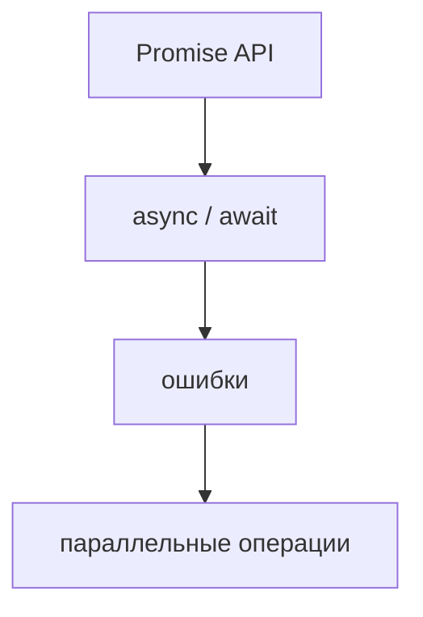
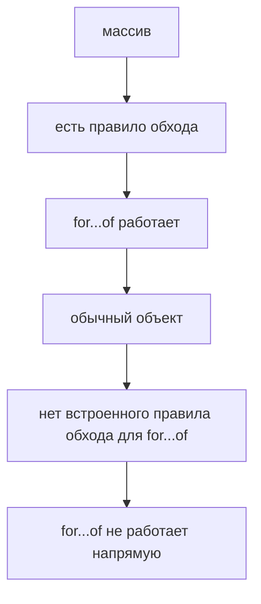
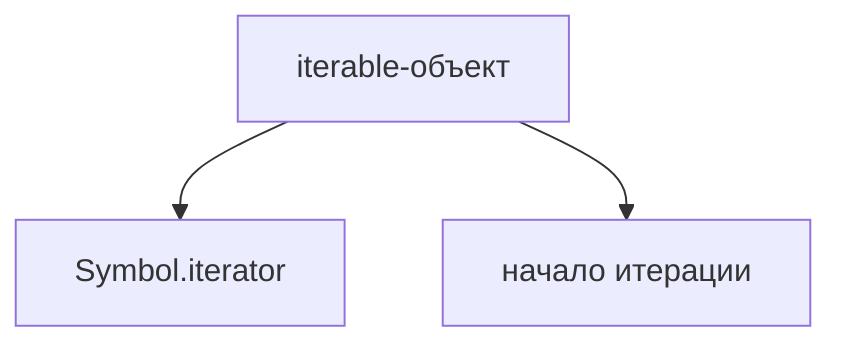
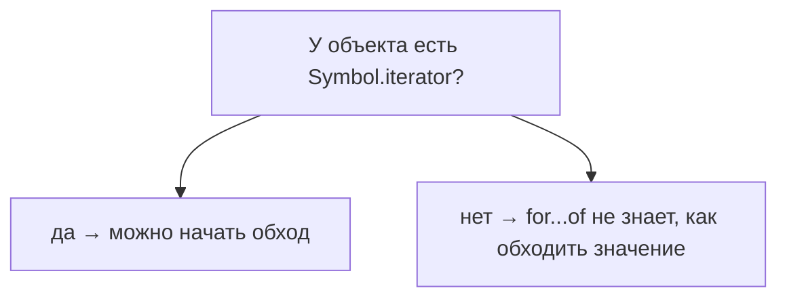
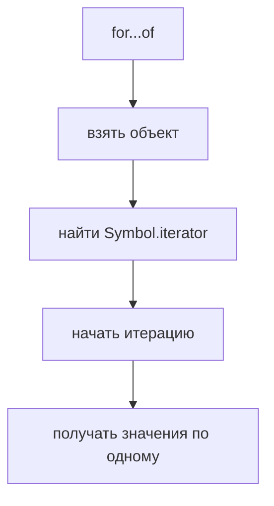
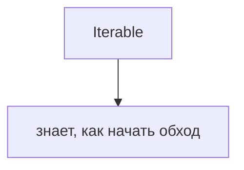
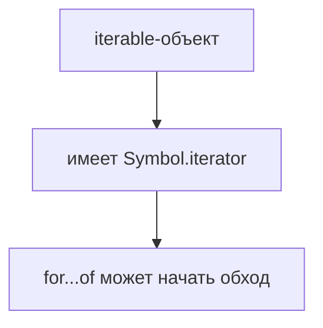
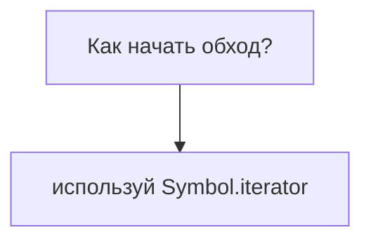

# Iterable Protocol

## Связь с предыдущей главой

Предыдущий модуль завершил практическую асинхронную часть:



Теперь мы возвращаемся к данным. В JavaScript часто нужно пройти по набору значений: тестам, логам, артефактам, строкам отчета.

Но не все значения обходятся одинаково.

## Главный вопрос

> Почему `for...of` работает с массивами, но не работает с обычными объектами?

Короткий ответ: `for...of` работает с iterable-объектами. Объект считается iterable, если он знает, как начать итерацию через `Symbol.iterator`.

## Мотивация

В тестовом фреймворке есть набор тест-кейсов:

```javascript
const testCases = [
  'login test',
  'checkout test',
  'report test',
];
```

По массиву можно пройти:

```javascript
for (const testCase of testCases) {
  console.log(testCase);
}
```

Но если данные лежат в обычном объекте:

```javascript
const testSuite = {
  smoke: 'login test',
  regression: 'checkout test',
};
```

`for...of` напрямую не знает, с чего начать и какой порядок использовать.



## Теория

Iterable Protocol — это соглашение JavaScript.

Объект является iterable, если у него есть метод с ключом `Symbol.iterator`.

Iterable не выдает значения самостоятельно.

Он предоставляет JavaScript способ получить iterator, который затем возвращает значения по одному.



`for...of` не спрашивает: "Это массив?"

Он спрашивает:



Встроенные iterable-объекты:

* Array;
* String;
* Map;
* Set.

```javascript
for (const letter of 'QA') {
  console.log(letter);
}
```

Строка не массив, но она iterable. Поэтому `for...of` может пройти по ее символам.

## Внутренний механизм

Когда JavaScript видит `for...of`, он концептуально делает так:



В этой главе важно только начало:



Что именно возвращает `Symbol.iterator`, подробно разберем в следующей главе.

## Главная ментальная модель

Главная модель главы:



Iterable-объект похож на тестовый набор, у которого есть понятная инструкция:



## Практические примеры

Примеры находятся в:

```text
examples/01-javascript/chapter-81/
```

Запуск:

```bash
node examples/01-javascript/chapter-81/01-array-iterable.js
node examples/01-javascript/chapter-81/02-string-iterable.js
node examples/01-javascript/chapter-81/03-map-set.js
node examples/01-javascript/chapter-81/04-qa-collection.js
```

## Пример Automation QA

Тестовый набор часто хранится как массив:

```javascript
const testCases = [
  { id: 'T-1', title: 'login works' },
  { id: 'T-2', title: 'checkout works' },
];

for (const testCase of testCases) {
  console.log(`${testCase.id}: ${testCase.title}`);
}
```

Массив уже является iterable, поэтому фреймворк может последовательно обойти каждый тест-кейс.

## Распространённые ошибки

### Ошибка 1. Думать, что `for...of` работает с любым объектом

Обычный объект не становится iterable автоматически.

### Ошибка 2. Путать iterable и массив

Массив iterable, но не каждый iterable является массивом.

### Ошибка 3. Искать порядок обхода там, где он не задан

Если объект не описывает правило итерации, `for...of` не должен угадывать порядок.

## Практика

Практика находится в:

```text
practice/01-javascript/81-iterable-protocol.md
```

Решения находятся в:

```text
solutions/01-javascript/81-iterable-protocol.md
```

## Краткие итоги

Iterable Protocol объясняет, почему одни значения можно обходить через `for...of`, а другие нельзя.

Главное:

* iterable-объект знает, как начать итерацию;
* `Symbol.iterator` является точкой входа в обход;
* Array, String, Map и Set уже являются iterable;
* обычный объект не становится iterable автоматически;
* `for...of` работает не с "массивностью", а с наличием правила итерации.

## Переход к следующей главе

Теперь понятно, как JavaScript начинает обход.

Следующий вопрос:

> Что именно происходит внутри `for...of`, когда значения выдаются по одному?

Ответ — Iterator.
