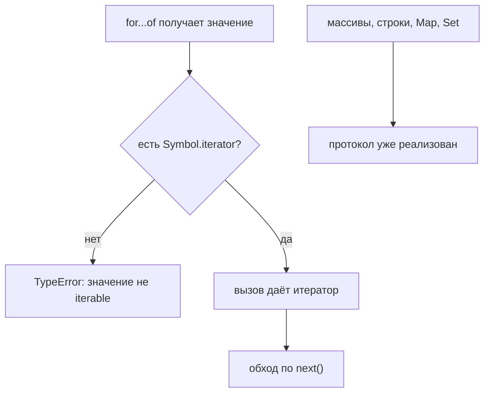

# Протокол перебора

## Связь с предыдущей главой

Предыдущий модуль завершил практическую асинхронную часть:

Теперь мы возвращаемся к данным. В JavaScript часто нужно пройти по набору значений: тестам, логам, артефактам, строкам отчета.

Но не все значения обходятся одинаково.

## Главный вопрос

> Почему `for...of` работает с массивами, но не работает с обычными объектами?

Короткий ответ: `for...of` работает с итерируемыми объектами. Объект считается итерируемым, если он знает, как начать обход, через `Symbol.iterator`.

## Мотивация

В тестовом фреймворке есть набор тест-кейсов:

```javascript
const testCases = [
  'login test',
  'checkout test',
  'report test',
];
```

По массиву можно пройти:

```javascript
for (const testCase of testCases) {
  console.log(testCase);
}
```

Но если данные лежат в обычном объекте:

```javascript
const testSuite = {
  smoke: 'login test',
  regression: 'checkout test',
};
```

`for...of` напрямую не знает, с чего начать и какой порядок использовать.

## Теория

Протокол перебора — это соглашение JavaScript.

Объект является итерируемым, если у него есть метод с ключом `Symbol.iterator`.

Итерируемый объект не выдаёт значения самостоятельно.

Он даёт JavaScript способ получить итератор, который затем возвращает значения по одному.

`for...of` не спрашивает: "Это массив?"

Он спрашивает другое: «есть ли у этого значения метод `Symbol.iterator`?» Всё,
что отвечает «да», он обойдёт — независимо от того, массив это или нет.

Встроенные итерируемые объекты:

* массив;
* строка;
* Map;
* Set.

```javascript
for (const letter of 'QA') {
  console.log(letter);
}
```

Строка не массив, но она итерируема. Поэтому `for...of` может пройти по её символам.

### `for...of` спрашивает о протоколе, а не о типе

`for...of` не спрашивает: «Это массив?» Он спрашивает: **«Есть ли у объекта метод с ключом `Symbol.iterator`?»**

Проверяется это легко:

```javascript
const plain = { a: 1 };
for (const v of plain) { }   // TypeError: plain is not iterable
```

Обычный объект не итерируем — у него нет `Symbol.iterator`. Именно поэтому по объекту нельзя пройти через `for...of`, хотя по массиву и строке можно.

Чтобы обойти свойства объекта, их сначала превращают в итерируемое значение:

```javascript
Object.entries({ a: 1, b: 2 });   // [['a', 1], ['b', 2]] — массив, а значит iterable
```

### Свой итерируемый объект пишется в несколько строк

Протокол открыт: любой объект можно сделать пригодным для `for...of`, добавив нужный метод.

```javascript
const range = {
  from: 1,
  to: 3,
  [Symbol.iterator]() {
    let current = this.from;
    const to = this.to;
    return {
      next: () => current <= to
        ? { value: current++, done: false }
        : { value: undefined, done: true },
    };
  },
};

[...range];   // [1, 2, 3]
```

Это не трюк, а обычный механизм языка: встроенные коллекции устроены так же.

### Протокол используют не только циклы

Один и тот же протокол задействован везде, где значения берутся «по одному»:

| Конструкция | Требует итерируемый объект |
| --- | --- |
| `for...of` | да |
| раскрытие `[...value]` | да |
| деструктуризация массива | да |
| `Array.from()` | да |
| `Promise.all([...])` | да |
| `new Map()`, `new Set()` | да |

Поэтому `[...{ a: 1 }]` даёт ту же ошибку, что и `for...of`: раскрытие тоже работает через протокол. А `[...'QA']` возвращает `['Q', 'A']`, потому что строка итерируема.

Знание протокола объясняет сразу весь этот набор конструкций, а не каждую по отдельности.

### Итерируемый объект не хранит состояния обхода

Он не выдаёт значения самостоятельно. Он даёт JavaScript способ получить итератор, который затем возвращает значения по одному.

Разделение существенно: итерируемый объект можно обходить многократно, потому что каждый обход получает **новый** итератор. Проверено — два вызова `Symbol.iterator` у одного массива дают независимые итераторы, и каждый начинает сначала.

Подробности того, как устроен сам итератор, — в следующей главе.

`for...of` спрашивает не тип, а наличие протокола:


```mermaid
flowchart TD
    A["for...of получает значение"] --> B{"есть Symbol.iterator?"}
    B -- "нет" --> C["TypeError: значение не iterable"]
    B -- "да" --> D["вызов даёт итератор"]
    D --> E["обход по next()"]
    F["массивы, строки, Map, Set"] --> G["протокол уже реализован"]
```

## Внутренний механизм

Когда JavaScript видит `for...of`, он концептуально делает так:

```text
1. взять значение справа от of
2. спросить у него свойство Symbol.iterator
3. свойства нет  →  TypeError: значение не iterable
4. свойство есть →  вызвать его и получить итератор
5. обходить итератор, пока он не скажет, что элементы кончились
```

В этой главе важно только начало:

```text
цикл не заглядывает внутрь значения —
он спрашивает, умеет ли значение выдать итератор
```

Что именно возвращает `Symbol.iterator`, подробно разберем в следующей главе.

### Что делает раскрытие

```javascript
const letters = [...'abc'];      // ['a', 'b', 'c']
const items = [...new Set([1, 1, 2])];   // [1, 2]
const broken = [...{ a: 1 }];    // TypeError: не iterable
```

Раскрытие в массив и `for...of` используют **один и тот же** протокол, поэтому и
ошибка у них одинаковая. Раскрытие в объект (`{ ...value }`) — другой механизм: он
копирует свойства и работает с обычными объектами.

### Встроенные итерируемые и то, что ими не является

| Итерируемые | Не итерируемые |
| --- | --- |
| массив, строка | обычный объект `{}` |
| `Map`, `Set` | `null` и `undefined` |
| `arguments`, `NodeList` | число, булево значение |

Правый верхний случай встречается чаще всего: ответ сервиса — объект, и
`for (const item of response)` даёт `TypeError`. Нужен явный выбор:
`Object.values(response)` или `response.items`.

Проверить принадлежность к протоколу можно прямо:
`typeof value?.[Symbol.iterator] === 'function'`.

## Главная ментальная модель

Главная модель главы: **итерируемый объект умеет выдать итератор, и именно об этом спрашивают `for...of`, раскрытие и деструктуризация**.

Итерируемый объект похож на тестовый набор, у которого есть понятная инструкция:

```text
«вот как меня обходить по одному элементу за раз»
```

Инструкция лежит в самом наборе, поэтому `for...of` работает одинаково с
массивом, строкой, `Map` и своим объектом.

## Практические примеры

Примеры находятся в:

```text
examples/01-javascript/chapter-81/
```

Запуск:

```bash
node examples/01-javascript/chapter-81/01-array-iterable.js
node examples/01-javascript/chapter-81/02-string-iterable.js
node examples/01-javascript/chapter-81/03-map-set.js
node examples/01-javascript/chapter-81/04-qa-collection.js
```

## Пример Automation QA

Тестовый набор часто хранится как массив:

```javascript
const testCases = [
  { id: 'T-1', title: 'login works' },
  { id: 'T-2', title: 'checkout works' },
];

for (const testCase of testCases) {
  console.log(`${testCase.id}: ${testCase.title}`);
}
```

Массив уже итерируем, поэтому фреймворк может последовательно обойти каждый тестовый случай.

### Функция принимает любой итерируемый источник

```javascript
function titlesOf(source) {
  const titles = [];

  for (const item of source) titles.push(item.title);

  return titles;
}

titlesOf(response.items);        // массив
titlesOf(cache.values());        // значения Map
titlesOf(new Set(items));        // Set
```

Протокол — это соглашение, а не тип. Вспомогательная функция, написанная под
`for...of`, работает со всем, что этот протокол поддерживает, и не требует
приводить вход к массиву.

### Объект ответа итерируемым не является

```javascript
const grouped = { NEW: [...], DONE: [...] };

for (const items of grouped) { }
// TypeError: grouped is not iterable
```

Обычный объект протокол не реализует, сколько бы свойств в нём ни лежало.
Ошибка приходит сразу и формулируется понятно — это редкий приятный случай.

Обходят его явным выбором: `Object.values(grouped)` для значений,
`Object.entries(grouped)` для пар «ключ — значение». То же правило действует
для раскрытия: `[...grouped]` упадёт, `{ ...grouped }` — нет.

## Распространённые мифы

**Миф: `for...of` работает с любым объектом.**
Только с итерируемым. Обычный объект даёт `TypeError: not iterable`.

**Миф: перебор — это про массивы.**
Это соглашение: строка, `Map`, `Set` и любой ваш объект с `Symbol.iterator` тоже итерируемы.

**Миф: раскрытие и `for...of` устроены по-разному.**
Оба используют один протокол, поэтому и ошибки у них одинаковые.

**Миф: итерируемый объект сам выдаёт значения.**
Он возвращает итератор, а значения выдаёт уже тот.

**Миф: обойти итерируемый объект можно только один раз.**
Каждый обход получает новый итератор и начинает сначала.

## Частые вопросы

**Почему `for...of` не работает с объектом?**
У него нет `Symbol.iterator`. Нужны `Object.keys()`, `Object.values()` или `Object.entries()`.

**Как сделать свой объект пригодным для `for...of`?**
Добавить метод `[Symbol.iterator]()`, возвращающий итератор.

**Почему раскрытие даёт ту же ошибку, что и цикл?**
Оно тоже работает через протокол перебора.

**Какие встроенные типы итерируемы?**
Массив, строка, `Map`, `Set` и ещё несколько — все, где есть `Symbol.iterator`.

**Можно ли обойти один итерируемый объект дважды?**
Да, если он выдаёт новый итератор на каждый обход.

## Проверьте себя

1. Какой вопрос задаёт `for...of` объекту?
2. Почему обычный объект нельзя обойти этим циклом?
3. Назовите четыре конструкции, работающие через протокол перебора.
4. Что нужно добавить объекту, чтобы он стал итерируемым?
5. Почему один итерируемый объект можно обходить многократно?

### Ответы

1. «Есть ли у тебя свойство `Symbol.iterator`?» — и если есть, вызывает его, чтобы получить итератор.
2. У обычного объекта нет `Symbol.iterator`, поэтому цикл не может получить итератор и выбрасывает `TypeError`.
3. `for...of`, раскрытие через `...`, деструктуризация массива, `Array.from()`. Также `Promise.all()` и конструкторы `Map` и `Set`.
4. Метод `Symbol.iterator`, возвращающий итератор — объект с методом `next()`.
5. Потому что `Symbol.iterator` вызывается заново на каждый обход и каждый раз возвращает новый итератор со своим состоянием.

## Распространённые ошибки

### Ошибка 1. Думать, что `for...of` работает с любым объектом

Обычный объект не становится итерируемым автоматически.

### Ошибка 2. Путать итерируемый объект и массив

Массив итерируем, но не каждый итерируемый объект является массивом.

### Ошибка 3. Искать порядок обхода там, где он не задан

Если объект не описывает правило итерации, `for...of` не должен угадывать порядок.

## Практика

Практика находится в:

```text
practice/01-javascript/81-iterable-protocol.md
```

Решения находятся в:

```text
solutions/01-javascript/81-iterable-protocol.md
```

## Краткие итоги

Протокол перебора объясняет, почему одни значения можно обходить через `for...of`, а другие нельзя.

Главное:

* итерируемый объект знает, как начать обход;
* `Symbol.iterator` является точкой входа в обход;
* массив, строка, `Map` и `Set` уже итерируемы;
* обычный объект не становится итерируемым автоматически;
* `for...of` работает не с "массивностью", а с наличием правила итерации.

## Переход к следующей главе

Теперь понятно, как JavaScript начинает обход.

Следующий вопрос:

> Что именно происходит внутри `for...of`, когда значения выдаются по одному?

Ответ — итератор.
