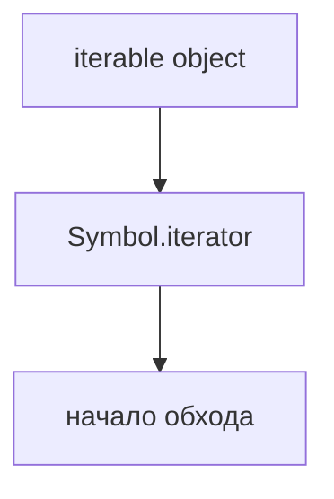
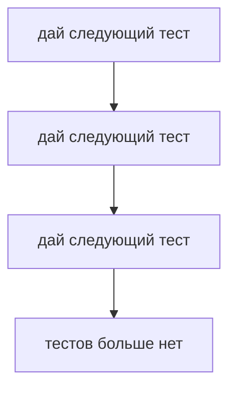
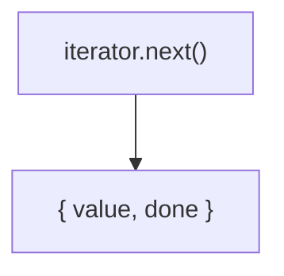
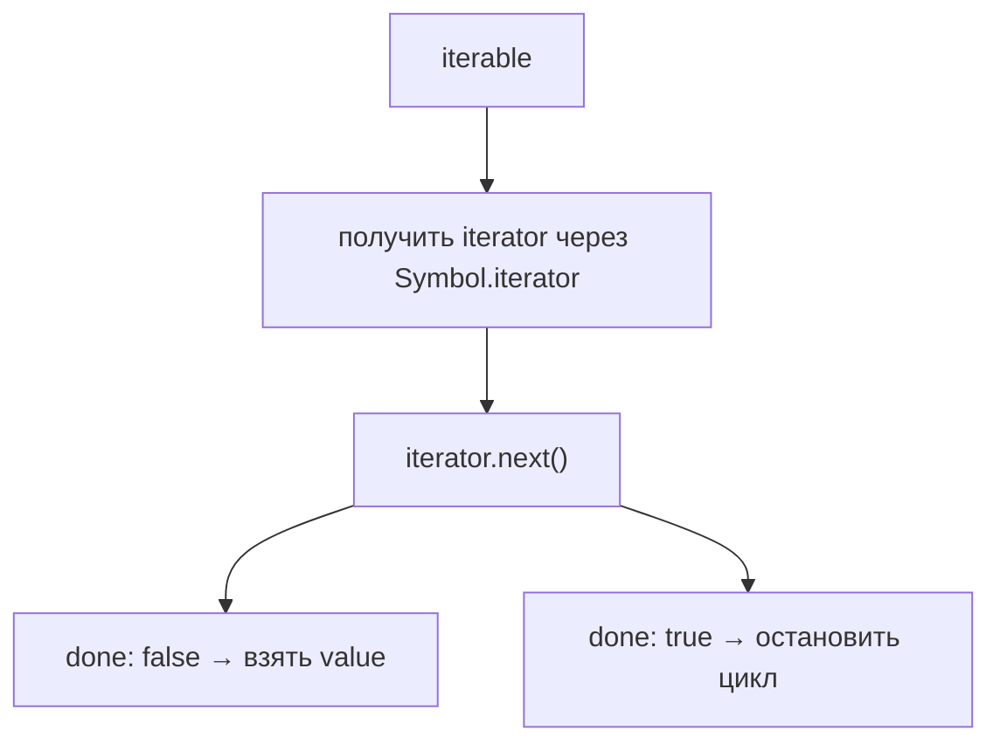
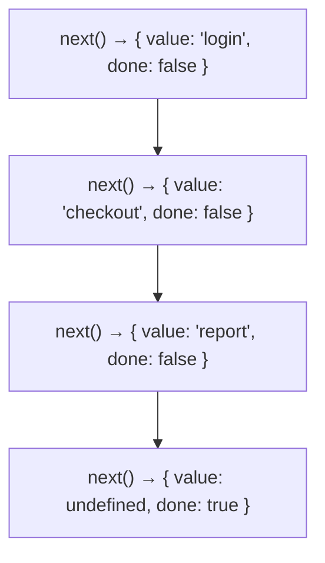
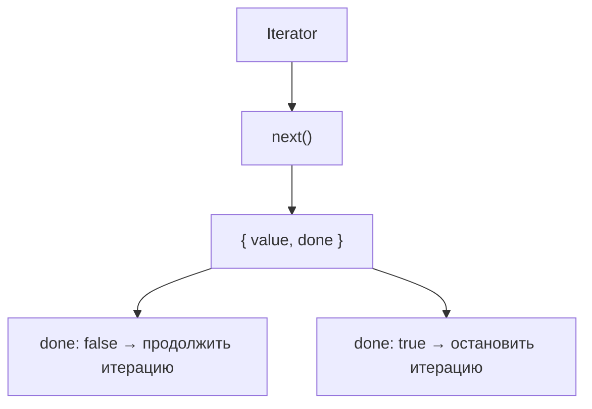

# Iterators

## Связь с предыдущей главой

Предыдущая глава показала:



Но начать обход недостаточно. JavaScript должен получать значения одно за другим.

## Главный вопрос

> Что на самом деле происходит внутри `for...of`?

Короткий ответ: `for...of` получает iterator и вызывает у него `next()`.

## Мотивация

Представим набор тестов:

```javascript
const testCases = ['login', 'checkout', 'report'];
```

`for...of` выводит значения последовательно:

```text
login
checkout
report
```

Но JavaScript не получает весь результат сразу. Он спрашивает по одному:



## Теория

Iterator — это объект, который умеет возвращать следующий результат итерации.

У iterator есть метод `next()`.

`next()` возвращает объект вида:

```javascript
{
  value: 'login',
  done: false
}
```

Где:

* `value` — текущее значение;
* `done` — закончилась ли итерация.

Когда значения закончились:

```javascript
{
  value: undefined,
  done: true
}
```



## Внутренний механизм

Концептуально `for...of` делает следующее:



Если развернуть обход массива:



В этой главе мы не используем генераторы. Важно увидеть чистый механизм iterator.

## Главная ментальная модель

Главная модель главы:



Iterator похож на выдачу тест-кейсов из очереди: за один запрос выдается только один следующий элемент.

## Практические примеры

Примеры находятся в:

```text
examples/01-javascript/chapter-82/
```

Запуск:

```bash
node examples/01-javascript/chapter-82/01-manual-next.js
node examples/01-javascript/chapter-82/02-array-iterator.js
node examples/01-javascript/chapter-82/03-done-value.js
node examples/01-javascript/chapter-82/04-qa-iterator.js
```

## Пример Automation QA

Можно вручную получить iterator из массива тестов:

```javascript
const testCases = ['login', 'checkout'];
const iterator = testCases[Symbol.iterator]();

console.log(iterator.next());
console.log(iterator.next());
console.log(iterator.next());
```

Это показывает, что `for...of` не делает магию. Он использует тот же принцип: получать следующий результат, пока `done` не станет `true`.

## Распространённые ошибки

### Ошибка 1. Думать, что iterator — это сам массив

Iterator не хранит весь массив как новая коллекция. Он хранит процесс последовательного получения значений.

### Ошибка 2. Игнорировать `done`

Если не смотреть на `done`, можно пытаться работать с `undefined` как с реальным значением.

### Ошибка 3. Считать `value` всегда полезным

Когда `done: true`, значение завершения обычно не используется в обычном обходе.

## Практика

Практика находится в:

```text
practice/01-javascript/82-iterators.md
```

Решения находятся в:

```text
solutions/01-javascript/82-iterators.md
```

## Краткие итоги

Iterator объясняет, как значения появляются одно за другим.

Главное:

* iterable начинает обход;
* iterator продолжает обход;
* `next()` возвращает объект `{ value, done }`;
* `done: false` означает, что значение есть;
* `done: true` означает, что обход завершен.

## Переход к следующей главе

Теперь мы понимаем ручной механизм iterator.

Следующий вопрос:

> Нужно ли каждый раз вручную писать объект с `next()`?

Нет. Для этого существуют generators.
