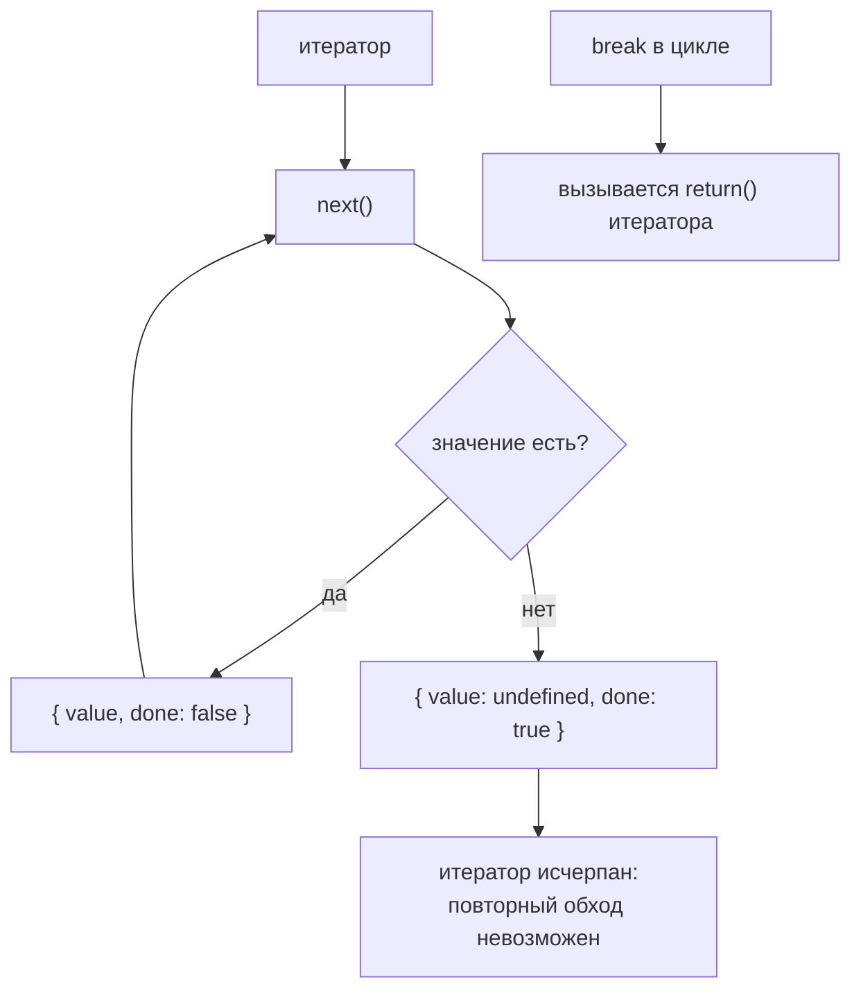

# Итераторы

## Связь с предыдущей главой

Предыдущая глава показала:

Но начать обход недостаточно. JavaScript должен получать значения одно за другим.

## Главный вопрос

> Что на самом деле происходит внутри `for...of`?

Короткий ответ: `for...of` получает итератор и вызывает у него `next()`.

## Мотивация

Представим набор тестов:

```javascript
const testCases = ['login', 'checkout', 'report'];
```

`for...of` выводит значения последовательно:

```text
login
checkout
report
```

Но JavaScript не получает весь результат сразу. Он спрашивает по одному: «следующее значение есть?» — и получает либо значение, либо признак завершения.

## Теория

Итератор — это объект, который умеет возвращать следующий результат обхода.

У итератора есть метод `next()`.

`next()` возвращает объект вида:

```javascript
{
  value: 'login',
  done: false
}
```

Где:

* `value` — текущее значение;
* `done` — закончилась ли итерация.

Когда значения закончились:

```javascript
{
  value: undefined,
  done: true
}
```

Итератор — состояние обхода, а не сама коллекция:


```mermaid
flowchart TD
    A["итератор"] --> B["next()"]
    B --> C{"значение есть?"}
    C -- "да" --> D["{ value, done: false }"]
    D --> B
    C -- "нет" --> E["{ value: undefined, done: true }"]
    E --> F["итератор исчерпан:<br/>повторный обход невозможен"]
    G["break в цикле"] --> H["вызывается return() итератора"]
```

## Внутренний механизм

Концептуально `for...of` делает следующее:

```text
1. получить итератор: вызвать value[Symbol.iterator]()
2. вызвать next()
3. done === true?  → выйти из цикла
4. связать value с переменной цикла, выполнить тело
5. вернуться к шагу 2
```

В этой главе мы не используем генераторы. Важно увидеть чистый механизм итератора.

### Как выглядит обход на самом деле

Итератор можно получить и использовать вручную — это то, что `for...of` делает за вас:

```javascript
const it = ['a', 'b'][Symbol.iterator]();

it.next();   // { value: 'a', done: false }
it.next();   // { value: 'b', done: false }
it.next();   // { value: undefined, done: true }
```

Обратите внимание на последний вызов: `done: true` приходит **отдельным** шагом, уже без значения. Именно поэтому цикл выполняет тело ровно два раза, а `next()` вызывается три.

### Итератор одноразовый

Ключевое отличие от итерируемого объекта: итератор хранит состояние обхода и не перезапускается.

```javascript
it.next();   // { done: true } — и так будет всегда
```

Исчерпанный итератор навсегда остаётся исчерпанным. Новый обход требует нового итератора — и его выдаёт итерируемый объект, как показано в предыдущей главе. Два вызова `Symbol.iterator` у одного массива дают независимые итераторы, каждый со своим состоянием.

Отсюда практическое правило: итерируемый объект можно передавать и обходить многократно, итератор — нет.

### Итератор сам итерируем

Небольшая, но полезная деталь: встроенные итераторы имеют собственный `Symbol.iterator`, возвращающий самих себя.

```javascript
typeof it[Symbol.iterator] === 'function';   // true
```

Благодаря этому итератор можно передать в `for...of` напрямую. Но помните про одноразовость: такой обход продолжится с текущей позиции и завершится навсегда.

### `break` сообщает итератору о прерывании

Протокол предусматривает необязательный метод `return()` — его вызывают, когда обход прекращают досрочно:

```javascript
for (const v of source) {
  if (v === 2) break;   // здесь вызовется source-итератор.return()
}
```

Проверено: при `break` метод `return()` итератора действительно вызывается. Это механизм освобождения ресурсов — итератор, читающий файл или соединение, получает шанс закрыть их.

Для обычных массивов это незаметно, но объясняет, почему досрочный выход из цикла безопасен и для «тяжёлых» источников данных.

### Зачем это знать

Прямая работа с итераторами в прикладном коде встречается редко. Но модель объясняет вещи, которые иначе выглядят несвязанными:

- почему `for...of` работает с любым итерируемым объектом одинаково;
- почему генераторы из следующей главы вписываются в тот же цикл;
- почему обход коллекции можно приостановить и продолжить;
- почему исчерпанный источник данных не начинает сначала.

## Главная ментальная модель

Главная модель главы: **итератор хранит позицию обхода и выдаёт по одному значению, пока не сообщит `done: true`**.

Итератор похож на выдачу тестовых случаев из очереди: за один запрос выдаётся только один следующий элемент.

## Практические примеры

Примеры находятся в:

```text
examples/01-javascript/chapter-82/
```

Запуск:

```bash
node examples/01-javascript/chapter-82/01-manual-next.js
node examples/01-javascript/chapter-82/02-array-iterator.js
node examples/01-javascript/chapter-82/03-done-value.js
node examples/01-javascript/chapter-82/04-qa-iterator.js
```

## Пример Automation QA

Можно вручную получить итератор из массива тестов:

```javascript
const testCases = ['login', 'checkout'];
const iterator = testCases[Symbol.iterator]();

console.log(iterator.next());
console.log(iterator.next());
console.log(iterator.next());
```

Это показывает, что `for...of` не делает магию. Он использует тот же принцип: получать следующий результат, пока `done` не станет `true`.

### Итератор одноразовый

```javascript
const iterator = testCases[Symbol.iterator]();

console.log([...iterator]);   // ['login', 'checkout']
console.log([...iterator]);   // [] — итератор исчерпан
```

Итератор хранит позицию, и после обхода она остаётся в конце. Массив можно
обойти сколько угодно раз, итератор — один.

В тестах это встречается там, где функция принимает «список» и обходит его
дважды: сначала для проверки, потом для отчёта. С массивом работает, с
итератором второй обход даёт пустоту — и проверка молча сравнивает ноль
элементов.

### Безопасная форма приёма коллекции

```javascript
function report(items) {
  // Материализуем один раз: дальше можно обходить сколько нужно.
  const list = [...items];

  return { total: list.length, titles: list.map(item => item.title) };
}
```

Если функция обходит вход более одного раза, она обязана его материализовать.
Это правило снимает целый класс падений, которые невозможно объяснить по
сообщению об ошибке.

## Распространённые мифы

**Миф: `done: true` приходит вместе с последним значением.**
Это отдельный вызов `next()` уже без значения.

**Миф: исчерпанный итератор можно перезапустить.**
Нельзя. Нужен новый итератор от итерируемого объекта.

**Миф: итерируемый объект и итератор — синонимы.**
Первый умеет выдавать итераторы, второй хранит состояние конкретного обхода.

**Миф: `break` просто прекращает цикл.**
Он ещё и вызывает `return()` итератора, давая источнику закрыть ресурсы.

**Миф: итератор нельзя передать в `for...of`.**
Можно: встроенные итераторы сами итерируемы. Но обход будет одноразовым.

## Частые вопросы

**Сколько раз вызовется `next()` для массива из двух элементов?**
Три: два со значениями и один с `done: true`.

**Почему повторный обход дал пустой результат?**
Обходили итератор, а не итерируемый объект: он уже был исчерпан.

**Зачем нужен метод `return()`?**
Чтобы источник данных мог освободить ресурсы при досрочном выходе из цикла.

**Как получить итератор вручную?**
Вызвать `value[Symbol.iterator]()`.

**Где это встречается на практике?**
В генераторах, потоковых источниках данных и всюду, где значения выдаются по одному.

## Проверьте себя

1. Что возвращает `next()` и когда появляется `done: true`?
2. Сколько вызовов `next()` нужно для массива из двух элементов?
3. Почему итератор нельзя обойти дважды?
4. Что происходит при `break` внутри `for...of`?
5. Чем итерируемый объект отличается от итератора по хранению состояния?

### Ответы

1. Объект вида `{ value, done }`. `done: true` появляется, когда элементы закончились.
2. Три: два вернут значения, третий сообщит `done: true`.
3. Он хранит позицию внутри себя, и после завершения она остаётся в конце. Для нового обхода нужен новый итератор.
4. Цикл вызывает у итератора метод `return()`, если он есть, — это место для освобождения ресурсов. Сам итератор дальше не используется.
5. Итерируемый объект умеет выдать итератор и состояния обхода не хранит. Итератор — это и есть состояние: он помнит текущую позицию.

## Распространённые ошибки

### Ошибка 1. Думать, что итератор — это сам массив

Итератор не хранит весь массив как новую коллекцию. Он хранит процесс последовательного получения значений.

### Ошибка 2. Игнорировать `done`

Если не смотреть на `done`, можно пытаться работать с `undefined` как с реальным значением.

### Ошибка 3. Считать `value` всегда полезным

Когда `done: true`, значение завершения обычно не используется в обычном обходе.

## Практика

Практика находится в:

```text
practice/01-javascript/82-iterators.md
```

Решения находятся в:

```text
solutions/01-javascript/82-iterators.md
```

## Краткие итоги

Итератор объясняет, как значения появляются одно за другим.

Главное:

* итерируемый объект начинает обход;
* итератор продолжает обход;
* `next()` возвращает объект `{ value, done }`;
* `done: false` означает, что значение есть;
* `done: true` означает, что обход завершен.

## Переход к следующей главе

Теперь мы понимаем ручной механизм итератора.

Следующий вопрос:

> Нужно ли каждый раз вручную писать объект с `next()`?

Нет. Для этого существуют генераторы.
