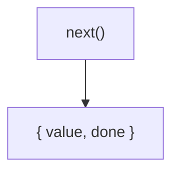
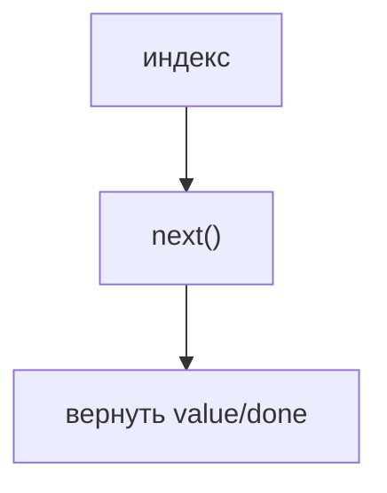
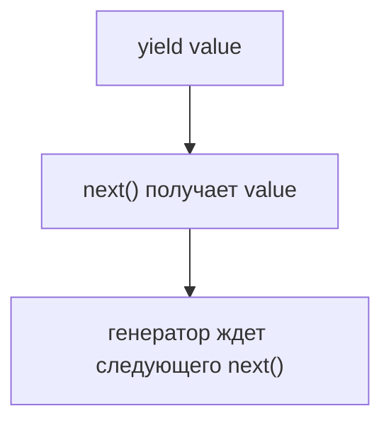
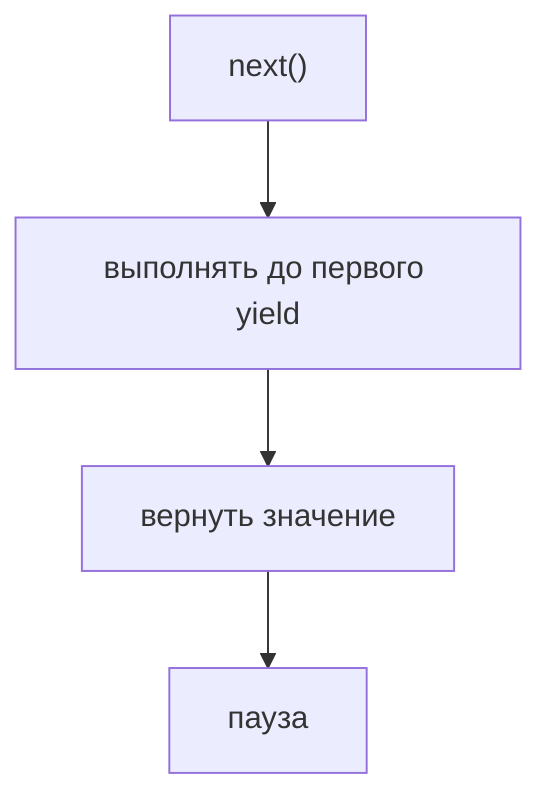
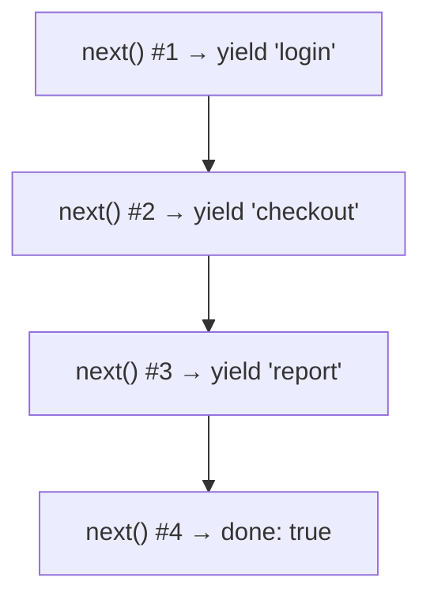
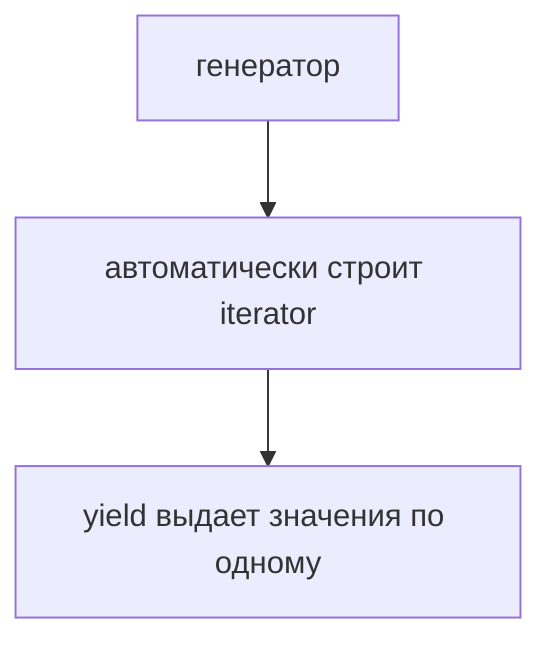
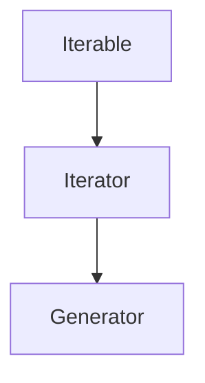

# Generators

## Связь с предыдущей главой

Предыдущая глава показала iterator:



Такой механизм точный, но ручное создание iterator быстро становится многословным.

## Главный вопрос

> Почему появились генераторы?

Короткий ответ: генератор автоматически создает iterator и позволяет выдавать значения через `yield`.

## Мотивация

Если нужно выдавать тесты по одному, ручной iterator требует хранить индекс и возвращать `{ value, done }`:



Генератор позволяет записать ту же идею как последовательность выдачи:

```javascript
function* testCaseGenerator() {
  yield 'login';
  yield 'checkout';
  yield 'report';
}
```

Код читается как список значений, которые будут выданы по одному.

## Теория

Функция-генератор объявляется через `function*`.

```javascript
function* createReportEntries() {
  yield 'logs';
  yield 'screenshot';
}
```

Вызов функции-генератора не выполняет тело сразу. Он возвращает объект-генератор (generator object).

Этот объект является iterator:

```javascript
const entries = createReportEntries();

console.log(entries.next());
```

Генератор не заменяет Iterator Protocol. Он автоматически реализует его: снаружи мы все равно работаем с iterator-механизмом из предыдущей главы.

`yield` останавливает выполнение функции-генератора и отдает значение наружу.



## Внутренний механизм

Генератор хранит позицию между вызовами `next()`.



Следующий `next()` продолжает с места остановки:



Поэтому генератор остается связан с той же моделью `next()`, `value` и `done`.

## Главная ментальная модель

Главная модель главы:



Генератор похож на сценарий тестового отчета: каждая строка `yield` говорит, какой следующий элемент можно выдать.

## Практические примеры

Примеры находятся в:

```text
examples/01-javascript/chapter-83/
```

Запуск:

```bash
node examples/01-javascript/chapter-83/01-first-generator.js
node examples/01-javascript/chapter-83/02-yield-sequence.js
node examples/01-javascript/chapter-83/03-generator-for-of.js
node examples/01-javascript/chapter-83/04-qa-generator.js
```

## Пример Automation QA

Генератор удобно использовать, когда отчетные записи нужно выдавать последовательно:

```javascript
function* reportEntries() {
  yield 'collect logs';
  yield 'capture screenshot';
  yield 'upload report';
}

for (const entry of reportEntries()) {
  console.log(entry);
}
```

Фреймворк получает значения по одному, а код генерации остается читаемым.

## Распространённые ошибки

### Ошибка 1. Думать, что вызов функции-генератора сразу выполняет тело

Вызов возвращает генератор. Выполнение начинается при `next()` или `for...of`.

### Ошибка 2. Путать `return` и `yield`

`yield` выдает очередное значение и оставляет генератор продолжимым. `return` завершает его.

### Ошибка 3. Считать генератор асинхронным механизмом

Обычные генераторы из этой главы синхронны. Асинхронные генераторы будут отдельной темой позже.

## Практика

Практика находится в:

```text
practice/01-javascript/83-generators.md
```

Решения находятся в:

```text
solutions/01-javascript/83-generators.md
```

## Краткие итоги

Генератор упрощает создание iterator.

Главное:

* `function*` создает функцию-генератор;
* вызов функции-генератора возвращает генератор;
* `yield` выдает значение наружу;
* генератор можно обходить через `for...of`;
* генераторы помогают писать итерацию без ручного `next()`.

## Переход к следующей главе

Теперь мы знаем:



Следующий вопрос:

> Как сделать собственный объект iterable?

Ответ — реализовать `Symbol.iterator`.
