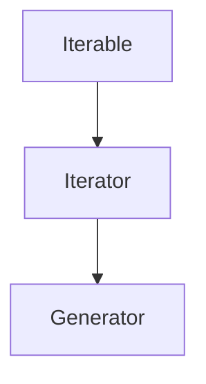
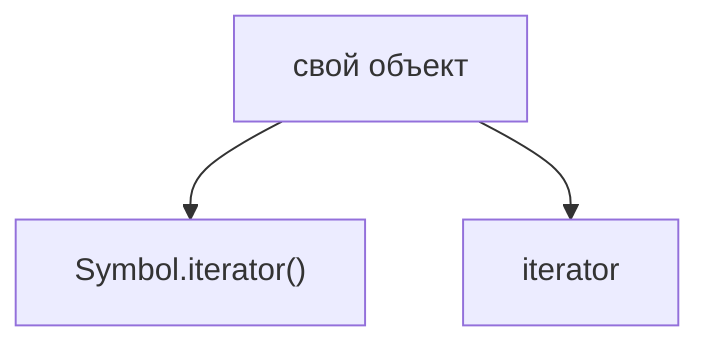
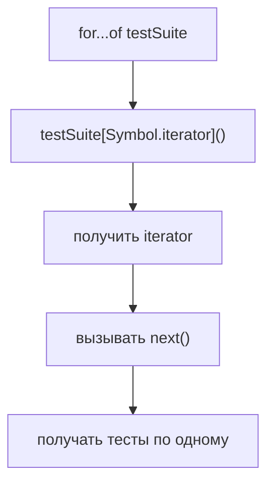
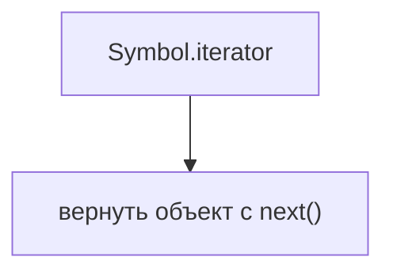
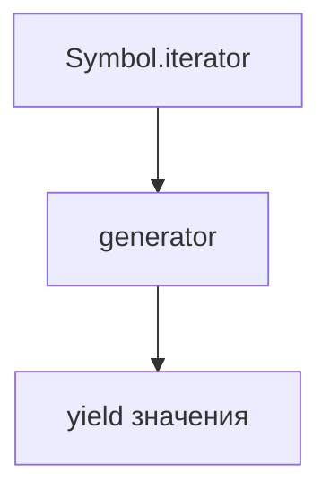
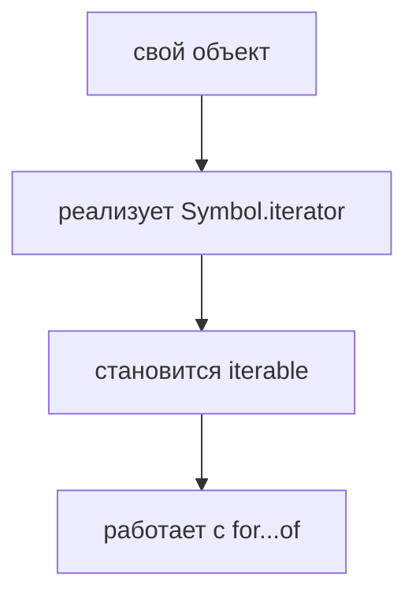
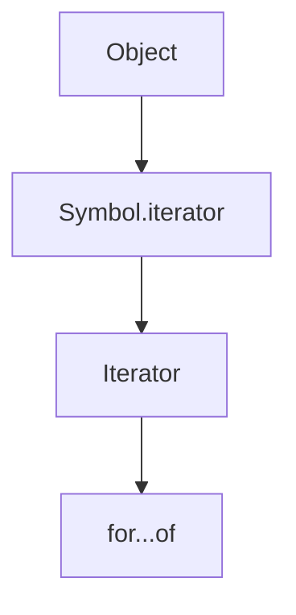

# Custom Iteration

## Связь с предыдущей главой

Предыдущие главы собрали цепочку:



Теперь можно применить ее к собственным объектам.

## Главный вопрос

> Как сделать собственный объект iterable?

Короткий ответ: добавить метод `Symbol.iterator`, который возвращает iterator.

## Мотивация

В тестовом фреймворке тестовый набор может быть не просто массивом, а объектом с метаданными:

```javascript
const testSuite = {
  name: 'smoke',
  owner: 'qa-team',
  tests: ['login', 'checkout', 'report'],
};
```

Логически мы хотим обходить именно `tests`:

```javascript
for (const test of testSuite) {
  console.log(test);
}
```

Но обычный объект сам по себе не iterable. Нужно явно описать правило обхода.

## Теория

Чтобы объект стал iterable, у него должен быть метод `Symbol.iterator`.



Есть два практических способа:

1. вернуть ручной iterator с `next()`;
2. использовать generator внутри `Symbol.iterator`.

Ручной вариант показывает механизм. Generator-вариант обычно короче и читабельнее.

## Внутренний механизм

Когда `for...of` получает собственный объект, процесс тот же:



Ручной iterator:



Iterator на основе generator:



Оба подхода подчиняются одному правилу: `Symbol.iterator` должен дать JavaScript объект, из которого можно получать значения.

## Главная ментальная модель

Главная модель главы:



Custom iteration — это не магия, а явно заданное правило обхода.

## Практические примеры

Примеры находятся в:

```text
examples/01-javascript/chapter-84/
```

Запуск:

```bash
node examples/01-javascript/chapter-84/01-manual-iterable.js
node examples/01-javascript/chapter-84/02-generator-iterable.js
node examples/01-javascript/chapter-84/03-compare-approaches.js
node examples/01-javascript/chapter-84/04-qa-suite.js
```

## Пример Automation QA

Собственный тестовый набор может скрывать служебные поля, но отдавать наружу только тесты:

```javascript
const testSuite = {
  name: 'smoke',
  tests: ['login', 'checkout'],
  *[Symbol.iterator]() {
    for (const test of this.tests) {
      yield test;
    }
  },
};

for (const test of testSuite) {
  console.log(test);
}
```

Теперь объект ведет себя как коллекция тестов, хотя внутри хранит и дополнительные данные.

## Распространённые ошибки

### Ошибка 1. Вернуть массив вместо iterator из `Symbol.iterator`

Метод должен возвращать iterator. Если нужно использовать массив, можно вернуть `this.tests[Symbol.iterator]()`.

### Ошибка 2. Потерять `this` внутри `Symbol.iterator`

Если iterator обращается к полям объекта, нужно понимать, откуда берутся данные.

### Ошибка 3. Делать собственную итерацию без причины

Если достаточно обычного массива, не нужно усложнять модель собственным iterable-объектом.

## Практика

Практика находится в:

```text
practice/01-javascript/84-custom-iteration.md
```

Решения находятся в:

```text
solutions/01-javascript/84-custom-iteration.md
```

## Краткие итоги

Custom iteration позволяет собственным объектам работать с `for...of`.

Главное:

* объект становится iterable через `Symbol.iterator`;
* `Symbol.iterator` должен вернуть iterator;
* iterator можно написать вручную;
* generator часто делает код короче;
* правило обхода должно быть очевидным для читателя.

## Завершение модуля

Теперь вся цепочка выглядит так:



После этого `for...of` перестает быть магией. Это обычный механизм языка, построенный вокруг `Symbol.iterator`, `next()`, `value` и `done`.
