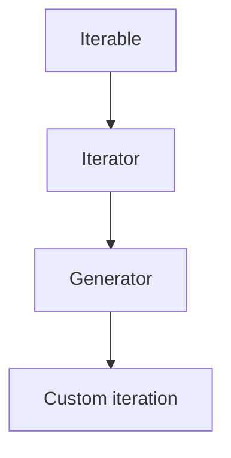
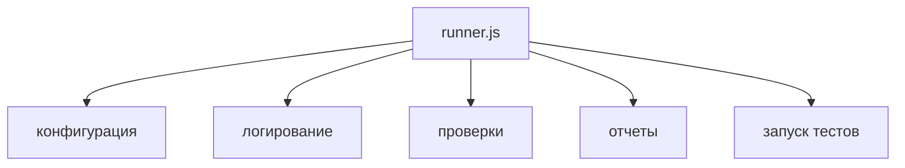
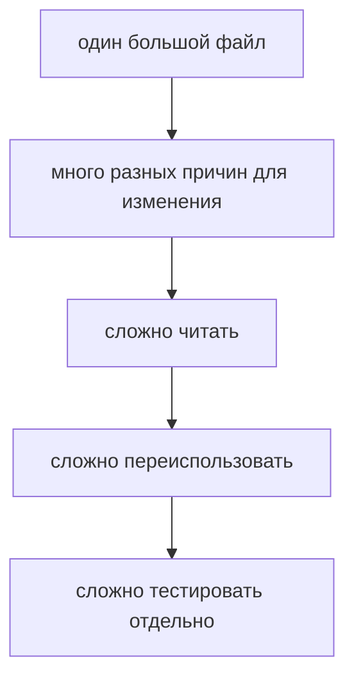
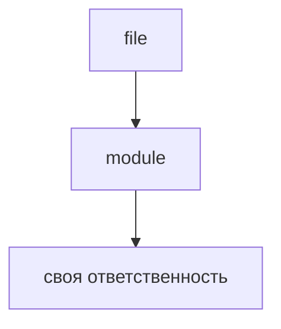

# JavaScript Modules

## Связь с предыдущей главой

Предыдущий модуль объяснил, как JavaScript проходит по данным:



Теперь вопрос меняется. Мы уже умеем описывать данные, функции, объекты и последовательный обход. Но в реальном проекте весь этот код быстро перестает помещаться в один понятный файл.

## Главный вопрос

> Почему JavaScript-код нужно разделять на модули?

Короткий ответ: модуль помогает разделить большой код на файлы с понятной ответственностью и явно показать, какие части доступны другим файлам.

## Мотивация

Представим тестовый раннер в одном файле:



Пока файл маленький, это терпимо. Но затем появляются новые окружения, новые проверки, новые форматы отчетов и больше тестовых сценариев.



Модули решают эту проблему через разделение ответственности.

```text
config.js
logger.js
assertions.js
reporter.js
runner.js
```

Каждый файл отвечает за свою часть системы.

## Теория

Модуль в JavaScript — это файл, который имеет собственную границу и может явно отдавать наружу часть своего кода.



Чтобы сделать значение доступным другим модулям, используется `export`.

```javascript
export const environment = 'staging';
```

Чтобы использовать значение из другого модуля, используется `import`.

```javascript
import { environment } from './config.js';
```

Модуль скрывает свою внутреннюю реализацию.

Другие файлы должны работать с ним только через public API. Благодаря этому внутренний код модуля можно менять без обязательного изменения всех файлов, которые его используют.

Есть два основных вида экспорта:

* named export;
* default export.

Named export удобен, когда файл отдает несколько именованных значений:

```javascript
export const baseUrl = 'https://example.test';
export const retries = 2;
```

Default export удобен, когда у модуля есть один главный результат:

```javascript
export default function log(message) {
  console.log(message);
}
```

### Модуль — это область видимости

Граница модуля — не соглашение, а свойство языка. Всё, что объявлено в файле-модуле, по умолчанию доступно только внутри него.

Это отличает модуль от обычного скрипта: в скрипте объявления верхнего уровня попадают в общую область, и два файла могут конфликтовать именами. В модуле такой проблемы нет — наружу выходит только то, что помечено `export`.

Отсюда практическое правило для тестового проекта: файл, из которого ничего не экспортируется, не может быть «случайно» использован другим файлом. Связь между модулями всегда явная.

### Named и default экспорт

| | Named export | Default export |
| --- | --- | --- |
| сколько на файл | сколько угодно | один |
| имя при импорте | фиксировано | выбирает импортирующий |
| запись | `export const a = 1` | `export default value` |
| импорт | `import { a } from './m.js'` | `import whatever from './m.js'` |

Named export удобен, когда файл отдаёт несколько именованных значений. Default — когда у модуля есть единственная главная сущность.

Практическая разница в сопровождении: при named-импорте переименование в источнике даёт ошибку сразу, а при default-импорте имя выбирает потребитель — и расхождение может остаться незамеченным. Поэтому в тестовых проектах чаще предпочитают named export.

### Импорты поднимаются и выполняются раньше

Объявления `import` обрабатываются до выполнения кода модуля. Порядок строк в файле на это не влияет: сначала загружаются и выполняются все зависимости, потом тело самого модуля.

Из этого следуют две практические вещи:

- импортировать условно нельзя — для этого существует динамический `import()`, возвращающий Promise;
- побочный эффект в импортируемом модуле выполнится раньше вашего кода, даже если импорт стоит внизу файла.

Вторая строка объясняет неожиданные эффекты: модуль, который при загрузке что-то настраивает, сделает это до первой строки вашего файла.

### Модуль выполняется один раз

Сколько бы файлов ни импортировали один и тот же модуль, его тело выполнится однократно, а результат будет общим для всех потребителей.

```javascript
// counter.js
export const state = { value: 0 };
```

Оба импортирующих файла получат **один и тот же** объект. Это удобно для конфигурации и опасно для изменяемого состояния — ровно та же проблема общего изменяемого состояния, что и в главах про тестовые данные.

Практический вывод: экспортировать константы и функции безопасно, экспортировать изменяемый объект — значит создавать скрытую связь между всеми его потребителями.

### Что даёт граница модуля в тестовом проекте

Скрытие реализации — не абстрактная ценность. Модуль позволяет менять внутренний код без изменения всех файлов, которые его используют.

Для автотестов это означает: селекторы живут в Page Object, а не в тестах; адрес стенда — в конфигурации, а не в клиентах; SQL — в слое доступа. Каждый раз граница модуля и есть тот рубеж, за который деталь не должна протекать.

## Внутренний механизм

Модуль задает границу.

Не все, что находится внутри файла, автоматически доступно снаружи.

Другие модули видят только то, что было экспортировано.

Когда один модуль импортирует другой, между ними появляется зависимость.

Набор таких связей образует dependency graph.

Dependency graph помогает понять, от каких файлов зависит запуск программы.

Зависимости помогают разработчику понимать, какие части приложения может затронуть изменение. Если меняется модуль конфигурации, нужно проверить файлы, которые его импортируют.

## Главная ментальная модель

Главная модель главы: **модуль — это файл со своей областью видимости, который отдаёт наружу только объявленное через `export`**.

Модуль похож на отдельный инструмент в тестовом фреймворке: внутри может быть много деталей, но наружу он отдает только понятный интерфейс.

## Практические примеры

Примеры находятся в:

```text
examples/01-javascript/chapter-85/
```

Запуск:

```bash
node examples/01-javascript/chapter-85/01-large-runner.mjs
node examples/01-javascript/chapter-85/02-runner.mjs
node examples/01-javascript/chapter-85/03-framework.mjs
node examples/01-javascript/chapter-85/04-dependency-graph.mjs
```

## Пример Automation QA

Структура тестового фреймворка может выглядеть так:

```text
config.js
logger.js
assertions.js
reporter.js
runner.js
```

`config.js` отвечает за настройки:

```javascript
export const baseUrl = 'https://example.test';
```

`logger.js` отвечает за вывод сообщений:

```javascript
export default function log(message) {
  console.log(message);
}
```

`runner.js` собирает части вместе:

```javascript
import { baseUrl } from './config.js';
import log from './logger.js';

log(`run tests against ${baseUrl}`);
```

Такой код легче поддерживать, потому что изменение логирования не требует переписывать конфигурацию или проверки.

## Распространённые мифы

**Миф: всё, объявленное в файле, видно другим файлам.**
В модуле наружу выходит только помеченное `export`.

**Миф: порядок импортов в файле влияет на порядок выполнения.**
Зависимости загружаются и выполняются до тела модуля независимо от расположения строк.

**Миф: модуль выполняется при каждом импорте.**
Он выполняется один раз, а результат общий для всех потребителей.

**Миф: default export лучше, потому что короче.**
Имя выбирает потребитель, и расхождение с источником может остаться незамеченным.

**Миф: экспортировать объект состояния безопасно.**
Все потребители получат один и тот же объект — это общее изменяемое состояние.

## Частые вопросы

**Почему код импортируемого модуля выполнился раньше моего?**
Зависимости выполняются до тела модуля, даже если импорт написан внизу.

**Как импортировать по условию?**
Через динамический `import()`, возвращающий Promise.

**Что выбрать — named или default?**
Named в большинстве случаев: он даёт ошибку при переименовании и лучше читается.

**Сколько раз выполнится модуль при трёх импортах?**
Один раз. Результат кэшируется и разделяется.

**Зачем нужна граница модуля в тестах?**
Чтобы детали — селекторы, адреса, SQL — не протекали в сценарии.

## Проверьте себя

1. Что по умолчанию видно другим файлам из модуля?
2. В чём практическая разница между named и default экспортом?
3. Когда выполняется код импортируемого модуля?
4. Что получат два файла, импортирующие один изменяемый объект?
5. Как выполнить импорт по условию?

## Распространённые ошибки

### Ошибка 1. Делать модуль без понятной ответственности

Если файл содержит и конфигурацию, и отчеты, и проверки, он остается большим файлом, просто с другим названием.

### Ошибка 2. Экспортировать все подряд

Модуль должен отдавать наружу только public API. Внутренние детали лучше оставлять внутри файла.

### Ошибка 3. Создавать запутанный dependency graph

Если каждый файл импортирует каждый другой файл, проект становится сложно понимать и менять.

## Практика

Практика находится в:

```text
practice/01-javascript/85-javascript-modules.md
```

Решения находятся в:

```text
solutions/01-javascript/85-javascript-modules.md
```

## Краткие итоги

Модули помогают управлять ростом проекта.

Главное:

* модуль обычно соответствует файлу;
* у модуля должна быть понятная ответственность;
* `export` открывает часть модуля наружу;
* `import` использует экспорт другого модуля;
* dependency graph показывает связи между файлами;
* в Automation QA модули помогают разделять config, logger, reporter, assertions и runner.

## Переход к следующей главе

Теперь понятно, зачем разделять код на модули.

Следующий вопрос:

> Почему в JavaScript существует несколько способов подключать модули?

Ответ — исторически в экосистеме появились разные module systems.
