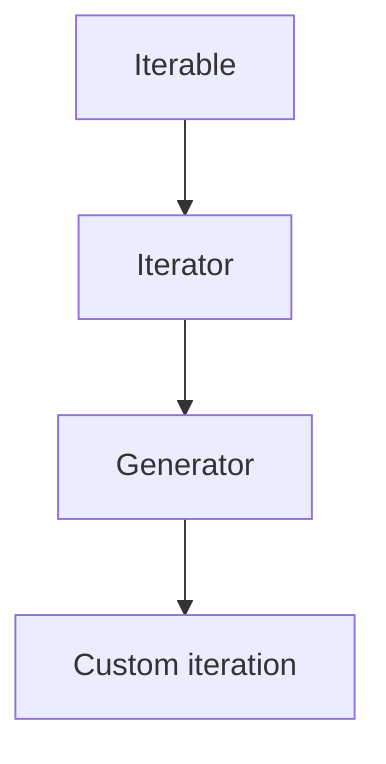
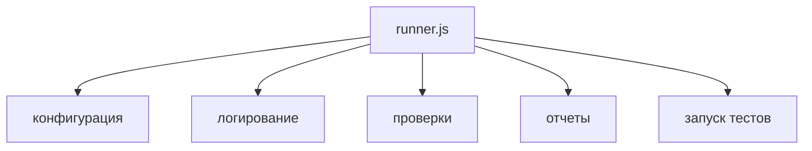
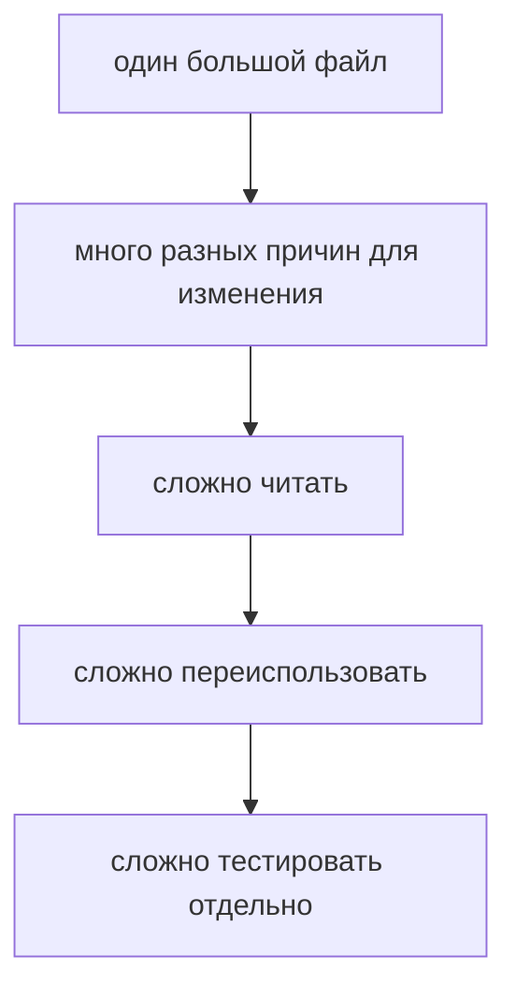
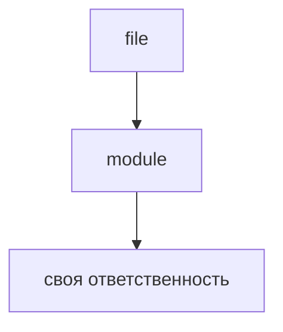
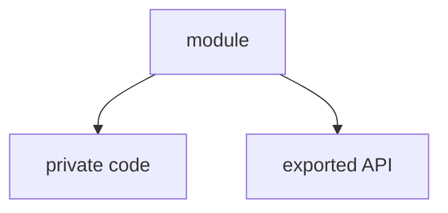
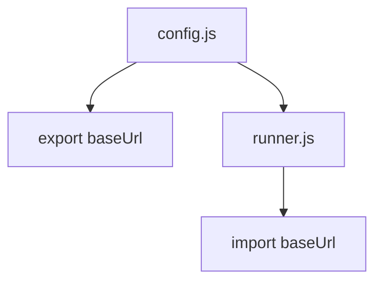
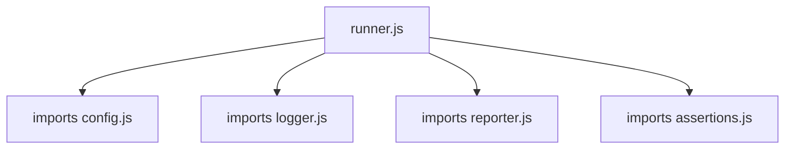
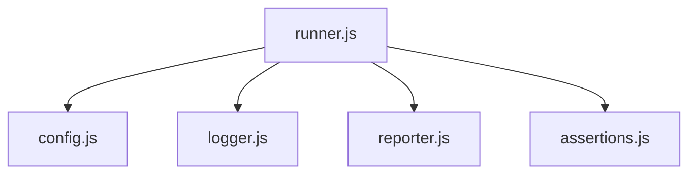
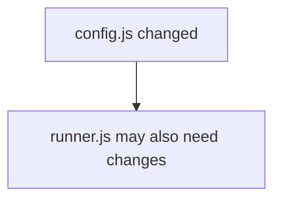
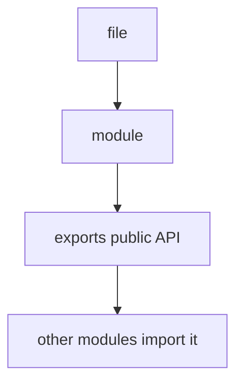

# JavaScript Modules

## Связь с предыдущей главой

Предыдущий модуль объяснил, как JavaScript проходит по данным:



Теперь вопрос меняется. Мы уже умеем описывать данные, функции, объекты и последовательный обход. Но в реальном проекте весь этот код быстро перестает помещаться в один понятный файл.

## Главный вопрос

> Почему JavaScript-код нужно разделять на модули?

Короткий ответ: модуль помогает разделить большой код на файлы с понятной ответственностью и явно показать, какие части доступны другим файлам.

## Мотивация

Представим тестовый раннер в одном файле:



Пока файл маленький, это терпимо. Но затем появляются новые окружения, новые проверки, новые форматы отчетов и больше тестовых сценариев.



Модули решают эту проблему через разделение ответственности.

```text
config.js
logger.js
assertions.js
reporter.js
runner.js
```

Каждый файл отвечает за свою часть системы.

## Теория

Модуль в JavaScript — это файл, который имеет собственную границу и может явно отдавать наружу часть своего кода.



Чтобы сделать значение доступным другим модулям, используется `export`.

```javascript
export const environment = 'staging';
```

Чтобы использовать значение из другого модуля, используется `import`.

```javascript
import { environment } from './config.js';
```

Модуль скрывает свою внутреннюю реализацию.

Другие файлы должны работать с ним только через public API. Благодаря этому внутренний код модуля можно менять без обязательного изменения всех файлов, которые его используют.

Есть два основных вида экспорта:

* named export;
* default export.

Named export удобен, когда файл отдает несколько именованных значений:

```javascript
export const baseUrl = 'https://example.test';
export const retries = 2;
```

Default export удобен, когда у модуля есть один главный результат:

```javascript
export default function log(message) {
  console.log(message);
}
```

## Внутренний механизм

Модуль задает границу.

Не все, что находится внутри файла, автоматически доступно снаружи.



Другие модули видят только то, что было экспортировано.



Когда один модуль импортирует другой, между ними появляется зависимость.



Набор таких связей образует dependency graph.



Dependency graph помогает понять, от каких файлов зависит запуск программы.



Зависимости помогают разработчику понимать, какие части приложения может затронуть изменение. Если меняется модуль конфигурации, нужно проверить файлы, которые его импортируют.

## Главная ментальная модель

Главная модель главы:



Модуль похож на отдельный инструмент в тестовом фреймворке: внутри может быть много деталей, но наружу он отдает только понятный интерфейс.

## Практические примеры

Примеры находятся в:

```text
examples/01-javascript/chapter-85/
```

Запуск:

```bash
node examples/01-javascript/chapter-85/01-large-runner.mjs
node examples/01-javascript/chapter-85/02-runner.mjs
node examples/01-javascript/chapter-85/03-framework.mjs
node examples/01-javascript/chapter-85/04-dependency-graph.mjs
```

## Пример Automation QA

Структура тестового фреймворка может выглядеть так:

```text
config.js
logger.js
assertions.js
reporter.js
runner.js
```

`config.js` отвечает за настройки:

```javascript
export const baseUrl = 'https://example.test';
```

`logger.js` отвечает за вывод сообщений:

```javascript
export default function log(message) {
  console.log(message);
}
```

`runner.js` собирает части вместе:

```javascript
import { baseUrl } from './config.js';
import log from './logger.js';

log(`run tests against ${baseUrl}`);
```

Такой код легче поддерживать, потому что изменение логирования не требует переписывать конфигурацию или проверки.

## Распространённые ошибки

### Ошибка 1. Делать модуль без понятной ответственности

Если файл содержит и конфигурацию, и отчеты, и проверки, он остается большим файлом, просто с другим названием.

### Ошибка 2. Экспортировать все подряд

Модуль должен отдавать наружу только public API. Внутренние детали лучше оставлять внутри файла.

### Ошибка 3. Создавать запутанный dependency graph

Если каждый файл импортирует каждый другой файл, проект становится сложно понимать и менять.

## Практика

Практика находится в:

```text
practice/01-javascript/85-javascript-modules.md
```

Решения находятся в:

```text
solutions/01-javascript/85-javascript-modules.md
```

## Краткие итоги

Модули помогают управлять ростом проекта.

Главное:

* модуль обычно соответствует файлу;
* у модуля должна быть понятная ответственность;
* `export` открывает часть модуля наружу;
* `import` использует экспорт другого модуля;
* dependency graph показывает связи между файлами;
* в Automation QA модули помогают разделять config, logger, reporter, assertions и runner.

## Переход к следующей главе

Теперь понятно, зачем разделять код на модули.

Следующий вопрос:

> Почему в JavaScript существует несколько способов подключать модули?

Ответ — исторически в экосистеме появились разные module systems.
