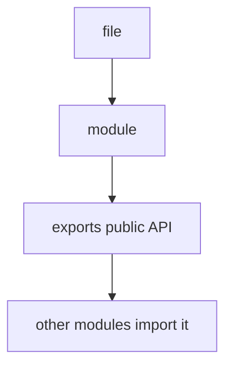
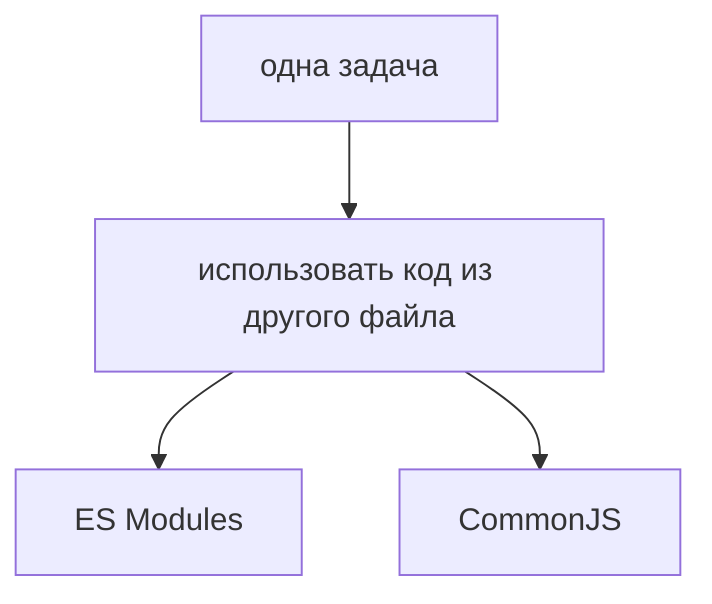
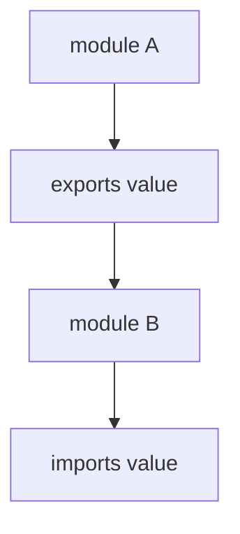
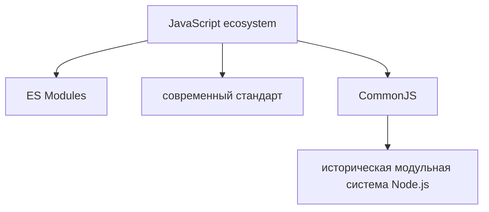

# Module Systems

## Связь с предыдущей главой

Предыдущая глава объяснила модуль как файл с ответственностью:



Теперь нужно понять, почему в JavaScript есть не один синтаксис модулей.

## Главный вопрос

> Почему в JavaScript существуют разные module systems?

Короткий ответ: CommonJS появился в Node.js раньше, а ES Modules стали современным стандартом языка.

## Мотивация

В одном проекте можно встретить такой код:

```javascript
import { baseUrl } from './config.js';
```

А в другом:

```javascript
const { baseUrl } = require('./config.cjs');
```

Оба примера решают похожую задачу: использовать код из другого файла.

Разница в том, что они принадлежат разным module systems.



## Теория

ES Modules — современная стандартная модульная система JavaScript.

Она использует `import` и `export`.

```javascript
export const baseUrl = 'https://example.test';
```

```javascript
import { baseUrl } from './config.js';
```

CommonJS — более старая модульная система, которая долго была основной в Node.js.

Она использует `require()` и `module.exports`.

```javascript
module.exports = {
  baseUrl: 'https://example.test',
};
```

```javascript
const { baseUrl } = require('./config.cjs');
```

Обе системы нужны для организации кода по файлам, но используют разные правила записи.

### Сравнение двух систем

| | ES Modules | CommonJS |
| --- | --- | --- |
| синтаксис | `import` / `export` | `require()` / `module.exports` |
| когда разрешаются зависимости | до выполнения кода | во время выполнения |
| условный импорт | только через `import()` | обычный `require()` в любом месте |
| загрузка | может быть асинхронной | синхронная |
| где работает | браузер и Node.js | Node.js |
| расширение по умолчанию | `.mjs` или `"type": "module"` | `.cjs` или обычный `.js` |

Вторая строка — принципиальная. В ES Modules связи между файлами известны до выполнения, поэтому инструменты могут проверить их заранее. В CommonJS `require()` — обычный вызов функции, и путь может вычисляться прямо во время работы.

### Как Node решает, что перед ним

Правило, из-за которого возникает больше всего вопросов при настройке проекта:

- файл `.mjs` — всегда ES Module;
- файл `.cjs` — всегда CommonJS;
- файл `.js` — зависит от поля `type` в ближайшем `package.json`: `"module"` даёт ES Modules, отсутствие или `"commonjs"` — CommonJS.

Отсюда типичная ошибка: `SyntaxError: Cannot use import statement outside a module` означает, что файл считается CommonJS, а не что синтаксис неверен.

### Что доступно только в одной из систем

Смешение проявляется в мелочах, которые ломают перенос кода:

| Возможность | ES Modules | CommonJS |
| --- | --- | --- |
| `__dirname`, `__filename` | нет | есть |
| `import.meta.url` | есть | нет |
| `require()` | нет напрямую | есть |
| `await` на верхнем уровне | есть | нет |

Строка про `await` на верхнем уровне объясняет, почему часть примеров работает в `.mjs` и не работает в обычном файле Node.

### Что импортируется из чего

Совместимость односторонняя:

- ES Module может импортировать CommonJS — обычно как default-экспорт;
- CommonJS **не может** использовать `require()` для ES Module; для этого нужен динамический `import()`.

Причина в той же первой строке сравнения: `require()` синхронен, а загрузка ES Module может требовать асинхронности.

### Что выбирать сегодня

ES Modules — современная стандартная система, и новые проекты пишут на ней. CommonJS остаётся в существующем коде и в части инструментов.

Для автотестов на TypeScript вопрос решается настройкой компилятора и `package.json`, а не предпочтением: важно, чтобы выбранная система была одна на проект. Смешение двух систем в одном пакете — источник ошибок загрузки, которые выглядят как проблемы синтаксиса.

## Внутренний механизм

Ментально обе системы можно представить одинаково:



Но синтаксис отличается.



ES Modules:

CommonJS:

В этой главе не нужно углубляться во вспомогательные инструменты или внутренние детали Node.js. Важно понимать практическую картину: при чтении проекта нужно распознать, какая module system используется.

## Главная ментальная модель

Главная модель главы: **две системы решают одну задачу, но по-разному определяют момент разрешения зависимостей — отсюда все практические различия**.

Если вы видите `import` / `export`, перед вами ES Modules.

Если вы видите `require()` / `module.exports`, перед вами CommonJS.

## Практические примеры

Примеры находятся в:

```text
examples/01-javascript/chapter-86/
```

Запуск:

```bash
node examples/01-javascript/chapter-86/01-esm-runner.mjs
node examples/01-javascript/chapter-86/02-commonjs-runner.cjs
node examples/01-javascript/chapter-86/03-comparison.mjs
node examples/01-javascript/chapter-86/04-qa-choice.cjs
```

## Пример Automation QA

Современный Playwright-проект часто использует ES Modules или TypeScript-синтаксис:

```javascript
import { createReport } from './reporter.js';
```

Но в старом Node.js-проекте можно встретить CommonJS:

```javascript
const { createReport } = require('./reporter.cjs');
```

Automation QA-инженеру важно уметь читать оба варианта, потому что тестовые фреймворки часто живут долго и могут содержать код разных поколений.

## Распространённые мифы

**Миф: `Cannot use import statement outside a module` — ошибка синтаксиса.**
Это означает, что файл считается CommonJS. Проблема в настройке, а не в коде.

**Миф: `.js` всегда означает одну и ту же систему модулей.**
Решает поле `type` в ближайшем `package.json`.

**Миф: `require()` может загрузить ES Module.**
Не может: он синхронен. Нужен динамический `import()`.

**Миф: `__dirname` доступен везде.**
В ES Modules его нет; аналог — `import.meta.url`.

**Миф: разница только в синтаксисе.**
Различается момент разрешения зависимостей, что влияет на инструменты и на возможность условного импорта.

## Частые вопросы

**Почему файл не понимает `import`?**
Он считается CommonJS. Нужно расширение `.mjs` или `"type": "module"`.

**Как получить путь к текущему файлу в ES Modules?**
Через `import.meta.url` — `__dirname` там отсутствует.

**Можно ли смешивать системы в одном проекте?**
Технически да, но это источник ошибок загрузки. Лучше выбрать одну.

**Как подключить ES Module из CommonJS?**
Через динамический `import()`, который возвращает Promise.

**Что выбрать для нового проекта?**
ES Modules: это стандарт языка, работающий и в браузере, и в Node.

## Проверьте себя

1. Чем отличается момент разрешения зависимостей в двух системах?
2. По какому правилу Node определяет тип файла `.js`?
3. Что означает ошибка про `import statement outside a module`?
4. Какие возможности есть только в ES Modules, а какие — только в CommonJS?
5. Почему `require()` не может загрузить ES Module?

## Распространённые ошибки

### Ошибка 1. Смешивать синтаксис без понимания окружения

`import` и `require()` относятся к разным системам. Их можно встретить в одном большом проекте, но смешивание требует понимания настроек окружения.

### Ошибка 2. Думать, что CommonJS устарел полностью

CommonJS все еще встречается в Node.js-проектах, пакетах и старом инфраструктурном коде.

### Ошибка 3. Изучать вспомогательные инструменты раньше базовой модели

Сначала нужно понять различие между ES Modules и CommonJS. Остальные инструменты проще изучать после этой базовой модели.

## Практика

Практика находится в:

```text
practice/01-javascript/86-module-systems.md
```

Решения находятся в:

```text
solutions/01-javascript/86-module-systems.md
```

## Краткие итоги

JavaScript имеет несколько module systems из-за истории развития языка и Node.js.

Главное:

* ES Modules используют `import` и `export`;
* CommonJS использует `require()` и `module.exports`;
* ES Modules являются современным стандартом;
* CommonJS часто встречается в старом Node.js-коде;
* обе системы решают задачу разделения кода по файлам;
* в Automation QA важно уметь читать оба стиля.

## Переход к следующей главе

Теперь написанная часть JavaScript дошла до модулей:

Теперь мы понимаем, как организуется код в крупных проектах. Следующие главы продолжают изучение современных возможностей JavaScript.
