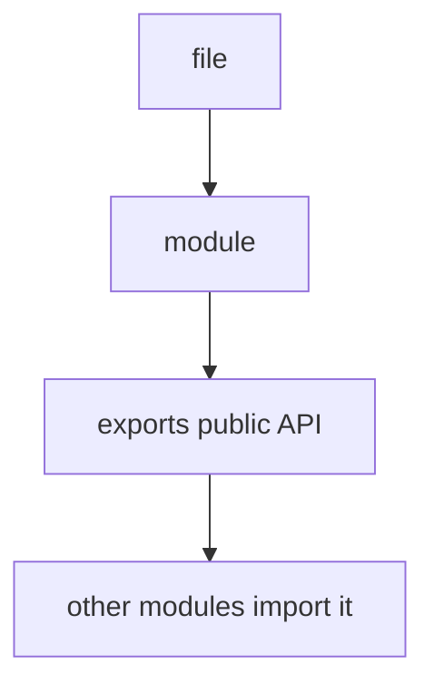
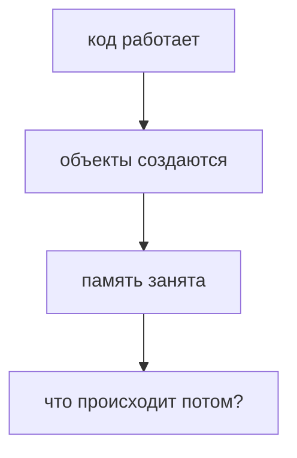
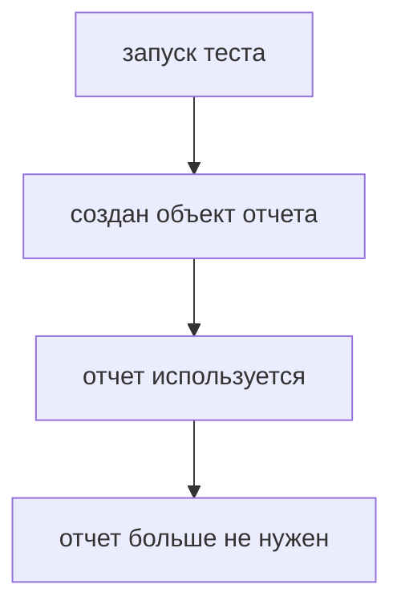
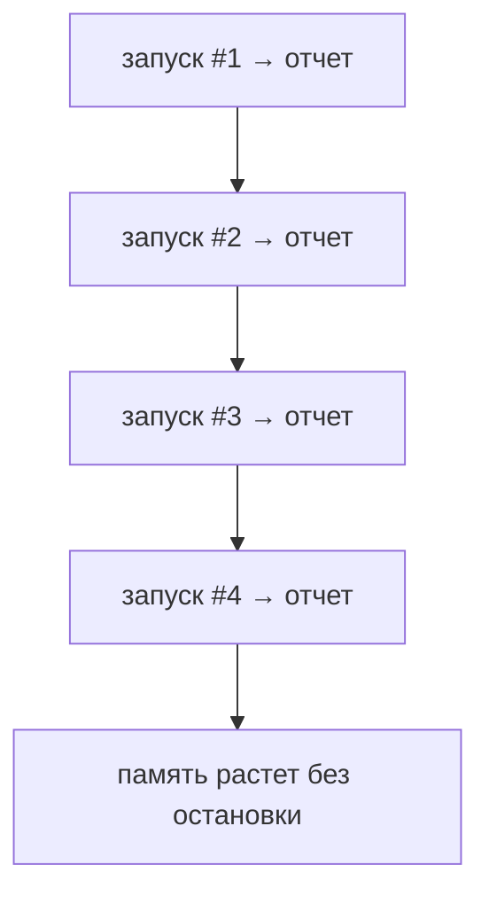
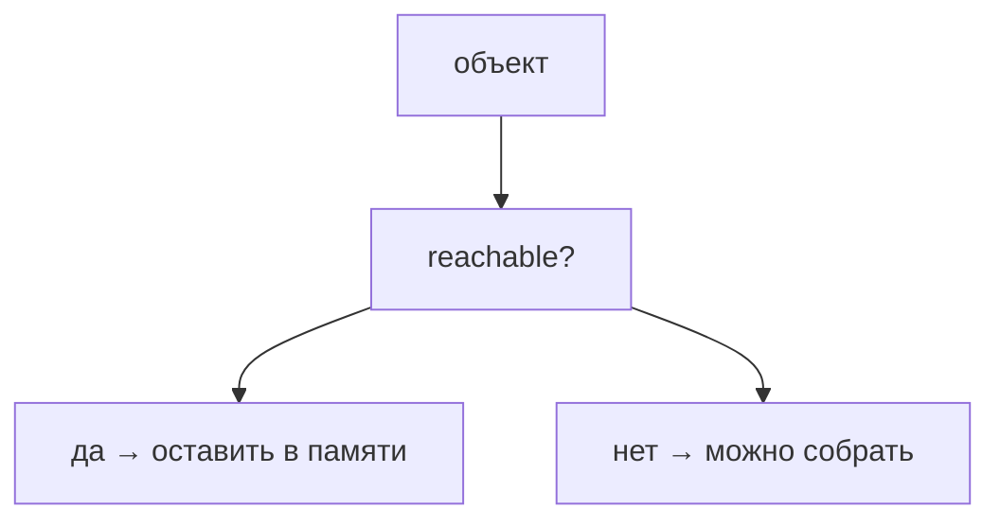
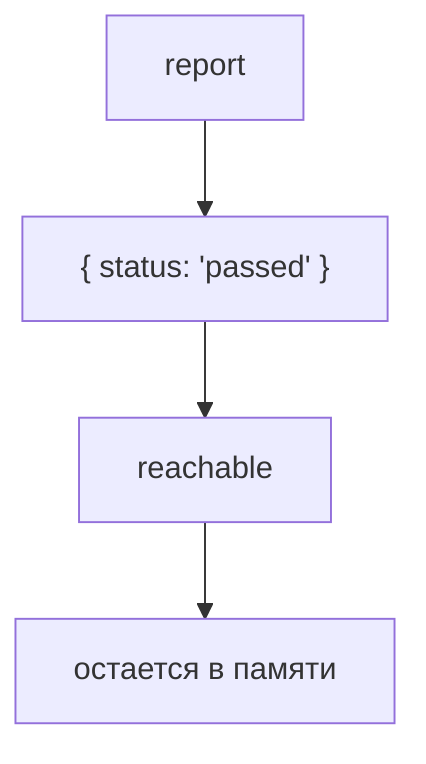

# Garbage Collector

## Связь с предыдущей главой

Предыдущий модуль объяснил, как организовывать код по файлам:



Теперь мы возвращаемся к выполнению программы. Модули создают объекты, функции, отчеты, логи и временные данные. Эти значения занимают память.

Главный вопрос становится практическим:



## Главный вопрос

> Почему JavaScript со временем не занимает всю память?

Короткий ответ: JavaScript использует автоматическое управление памятью. Garbage Collector может освободить память, занятую объектами, которые стали недостижимыми.

## Мотивация

Тестовый раннер создает много временных объектов:

```javascript
function createReport() {
  const report = {
    testName: 'login test',
    status: 'passed',
    logs: ['start', 'assert', 'finish'],
  };

  return report;
}
```

Пока отчет нужен, объект должен оставаться в памяти.

Но после завершения теста старый отчет может быть больше не нужен.



Если бы JavaScript никогда не освобождал память, каждый запуск тестов оставлял бы после себя все старые объекты.



JavaScript так не работает. Среда выполнения умеет очищать память, занятую объектами, к которым программа больше не может добраться.

## Теория

Garbage Collector — это механизм среды выполнения JavaScript, который отвечает за автоматическое освобождение памяти.

Разработчик обычно не вызывает ручное освобождение памяти.

Вместо этого модель автоматического управления памятью опирается на достижимость объектов.



Reachable object — это объект, до которого программа может добраться через ссылки.

Сначала важна именно ссылка: переменная, свойство объекта, элемент массива или другая структура данных может удерживать путь к объекту. Только после этого появляется вопрос, reachable объект или unreachable.

Например:

```javascript
const report = {
  status: 'passed',
};
```

Пока переменная `report` ссылается на объект, объект достижим.



Если ссылка исчезает, объект может стать недостижимым:

```javascript
let report = {
  status: 'passed',
};

report = null;
```

Важно: точный момент очистки выбирает среда выполнения. Код не должен зависеть от того, когда именно Garbage Collector освободит память.

## Внутренний механизм

JavaScript можно представить как граф объектов.

Если объект доступен из активной части программы, он остается в памяти.

Все эти объекты reachable.

Если ссылка на объект исчезает, путь к нему может исчезнуть:

Garbage Collector не определяет бизнес-смысл объекта: нужен он логике программы или уже нет.

Критерий другой:

Поэтому ссылка определяет время жизни объекта в памяти.

## Главная ментальная модель

Главная модель главы связывает ссылку, достижимость и время жизни объекта:

Обратный путь выглядит так:

Garbage Collector освобождает не "старые" объекты, а недостижимые объекты. Слово "может" здесь важно: код не управляет точным моментом очистки.

## Практические примеры

Примеры находятся в:

```text
examples/01-javascript/chapter-87/
```

Запуск:

```bash
node examples/01-javascript/chapter-87/01-reachable-object.js
node examples/01-javascript/chapter-87/02-unreachable-object.js
node examples/01-javascript/chapter-87/03-object-graph.js
node examples/01-javascript/chapter-87/04-qa-report.js
```

## Пример Automation QA

В тестовом фреймворке отчет может быть доступен во время выполнения теста:

```javascript
let currentReport = {
  testName: 'checkout test',
  status: 'failed',
  logs: ['open page', 'click checkout', 'assert error'],
};
```

Пока `currentReport` указывает на объект, отчет reachable.

После загрузки отчета ссылка может быть сброшена:

```javascript
currentReport = null;
```

Это не заставляет Garbage Collector немедленно запуститься. Но объект отчета больше не удерживается этой переменной.

## Распространённые ошибки

### Ошибка 1. Думать, что JavaScript освобождает память сразу после строки `object = null`

Сброс ссылки только делает объект потенциально недостижимым. Момент очистки выбирает среда выполнения.

### Ошибка 2. Думать, что Garbage Collector удаляет все "ненужные" объекты

Если объект все еще достижим через ссылку, Garbage Collector должен оставить его в памяти.

### Ошибка 3. Пытаться вручную управлять памятью как в низкоуровневых языках

В обычном JavaScript-коде разработчик управляет ссылками, а не вызывает ручное освобождение памяти.

## Практика

Практика находится в:

```text
practice/01-javascript/87-garbage-collector.md
```

Решения находятся в:

```text
solutions/01-javascript/87-garbage-collector.md
```

## Краткие итоги

Garbage Collector освобождает память автоматически.

Главное:

* объект занимает память;
* объект остается в памяти, пока он reachable;
* reachable означает, что к объекту есть путь через ссылки;
* unreachable object может быть собран Garbage Collector;
* точный момент сборки выбирает среда выполнения;
* разработчик обычно управляет не памятью напрямую, а ссылками на объекты.

## Переход

Теперь понятно, почему память не остается занятой навсегда.

Но появляется следующий вопрос:

> Если Garbage Collector существует, почему memory leaks все еще возможны?

Ответ — объект может оставаться reachable дольше, чем мы ожидали.
