# Memory Management

## Связь с предыдущей главой

Предыдущая глава показала базовую модель Garbage Collector:

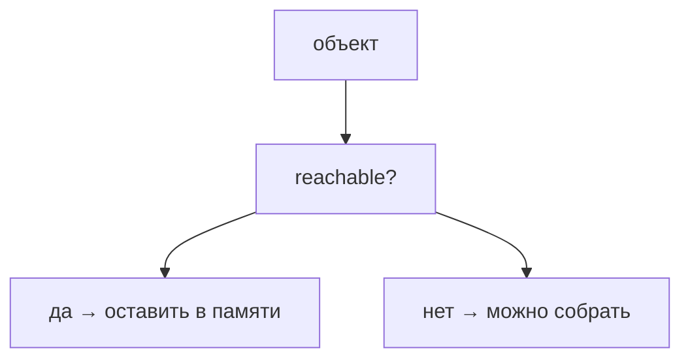

Теперь нужно понять обратную сторону этой модели.

Если объект остается reachable, Garbage Collector не может считать его мусором.

## Главный вопрос

> Если в JavaScript есть Garbage Collector, почему memory leaks все еще происходят?

Короткий ответ: memory leak возникает, когда программа продолжает удерживать ссылки на объекты, которые логически уже не нужны.

## Мотивация

Представим тестовый раннер, который сохраняет логи каждого теста:

```javascript
const logBuffer = [];

function saveLog(testName, messages) {
  logBuffer.push({
    testName,
    messages,
  });
}
```

Если буфер никогда не очищается, старые логи остаются reachable.

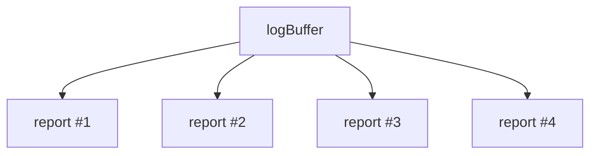

Для Garbage Collector это не мусор.

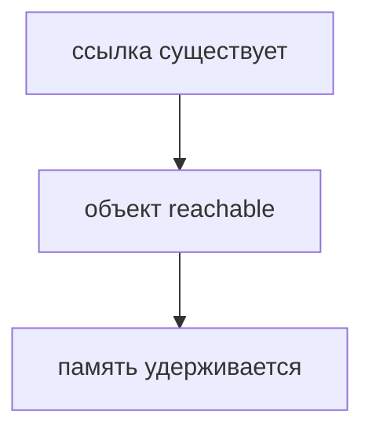

Логически старые данные могут быть уже не нужны. Но технически программа все еще держит ссылку.

## Теория

Memory management в JavaScript — это не ручное освобождение памяти.

Это аккуратное управление временем жизни ссылок.

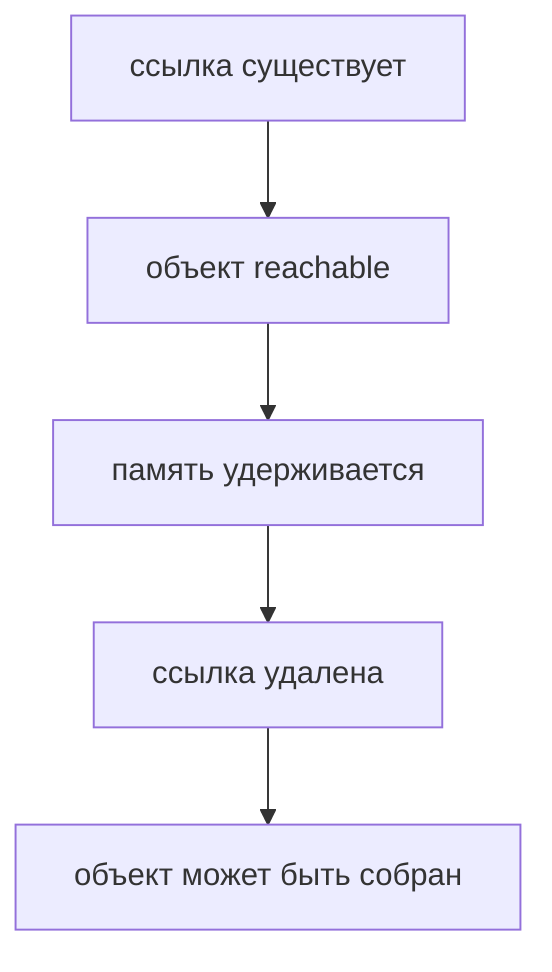

Memory leak — это ситуация, когда объект больше не нужен бизнес-логике, но остается reachable.

Типичные источники:

* long-lived references;
* случайные глобальные ссылки;
* closures, удерживающие большие объекты;
* event listeners;
* timers;
* caches.

Все эти механизмы нормальны сами по себе. Проблема появляется только тогда, когда ссылка живет дольше, чем должен жить объект.

## Внутренний механизм

Дальше каждый пример разбирается через одну и ту же цепочку:


### Long-lived references

Долгоживущая коллекция может удерживать объекты слишком долго:

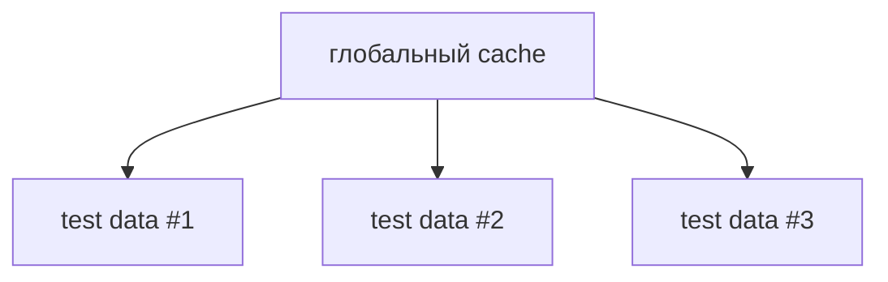

Пока cache существует и хранит ссылки, данные reachable.

### Accidental globals

Если значение случайно попадает в глобальную область, оно может жить дольше ожидаемого.

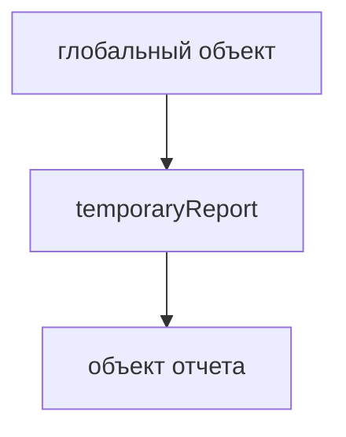

### Closures

Closure может удерживать объект через доступ к внешней переменной:

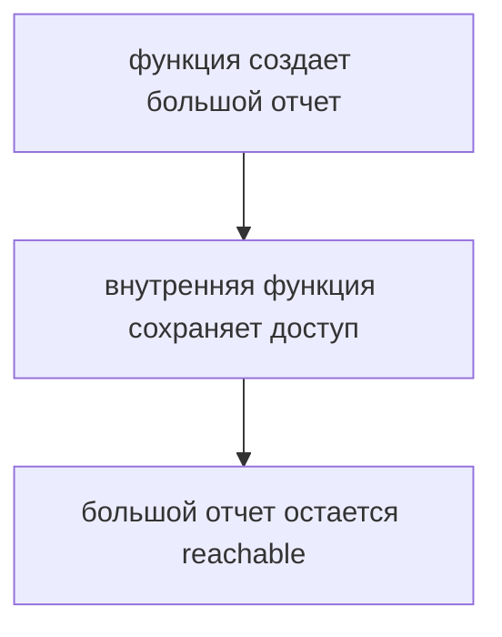

Это не ошибка само по себе. Ошибка начинается, когда такой доступ больше не нужен, но продолжает существовать.

### Event listeners

Подписка может удерживать обработчик, а обработчик — данные.

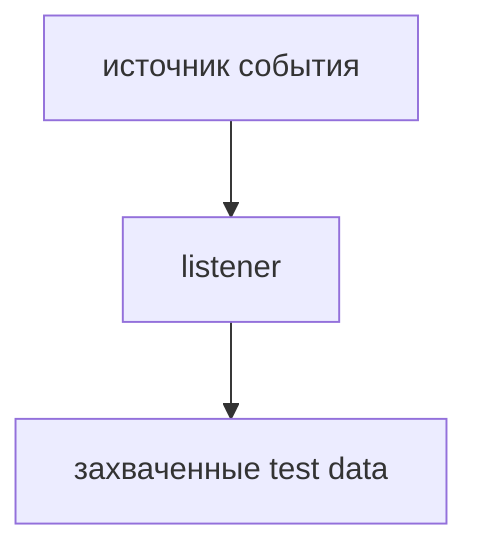

### Timers

Таймер может удерживать функцию, а функция — объекты из окружающего кода.

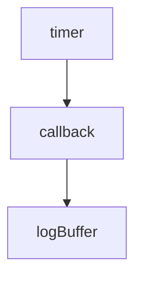

Таймер не является memory leak сам по себе. Риск появляется, когда таймер или его callback живут дольше нужного сценария.

### Caches

Cache полезен, пока есть правило очистки.

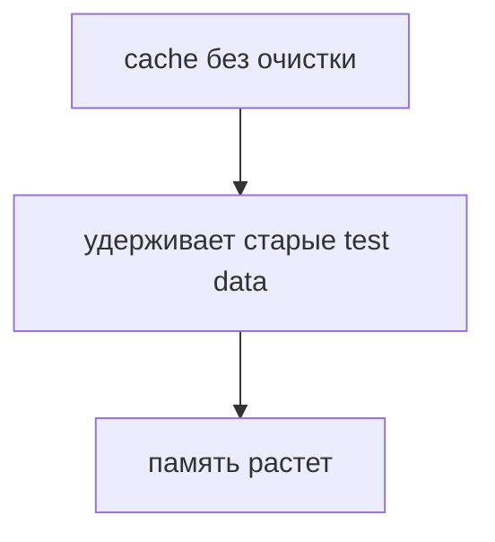

Cache не является плохой практикой. Плохой становится cache без понятного правила удаления старых данных.

## Главная ментальная модель

Главная модель главы показывает, где именно появляется memory leak:

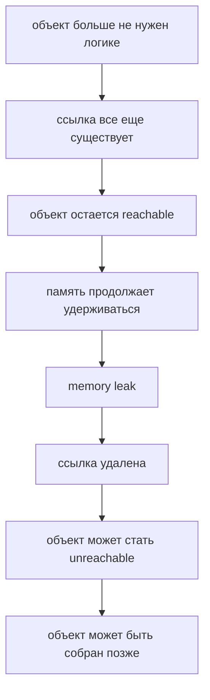

Garbage Collector не исправляет неправильное время жизни ссылок. Он только очищает то, что стало недостижимым.

## Практические примеры

Примеры находятся в:

```text
examples/01-javascript/chapter-88/
```

Запуск:

```bash
node examples/01-javascript/chapter-88/01-long-lived-reference.js
node examples/01-javascript/chapter-88/02-closure-retains-object.js
node examples/01-javascript/chapter-88/03-timer-reference.js
node examples/01-javascript/chapter-88/04-qa-cache-cleanup.js
```

## Пример Automation QA

Кэш тестовых данных может быть полезен:

```javascript
const testDataCache = new Map();

function saveTestData(testId, data) {
  testDataCache.set(testId, data);
}
```

Но если кэш никогда не очищается, данные всех старых запусков остаются reachable.

Практичнее явно определять время жизни:

```javascript
function clearTestData(testId) {
  testDataCache.delete(testId);
}
```

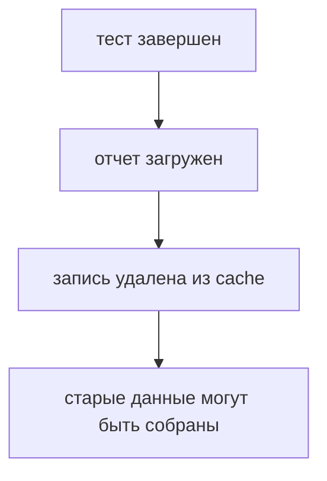

## Распространённые ошибки

### Ошибка 1. Считать, что Garbage Collector предотвращает любые memory leaks

Garbage Collector освобождает недостижимые объекты. Он не знает, какие reachable-объекты вам логически уже не нужны.

### Ошибка 2. Хранить временные данные в долгоживущих коллекциях

Если массив, Map или объект живет весь процесс, все значения внутри тоже остаются reachable.

### Ошибка 3. Не очищать listeners, timers и caches

Подписки, таймеры и кэши часто становятся причиной удержания старых данных.

Важно: они не являются ошибкой сами по себе. Ошибка — оставить их жить после завершения сценария, которому они принадлежали.

## Практика

Практика находится в:

```text
practice/01-javascript/88-memory-management.md
```

Решения находятся в:

```text
solutions/01-javascript/88-memory-management.md
```

## Краткие итоги

Memory management в JavaScript — это управление ссылками и временем жизни данных.

Главное:

* Garbage Collector работает только с недостижимыми объектами;
* memory leak возникает, когда ненужный объект остается reachable;
* долгоживущие ссылки удерживают память;
* closures, listeners, timers и caches могут продлевать жизнь объектов;
* в Automation QA важно очищать временные логи, отчеты, screenshots и test data;
* хорошая практика — заранее понимать, кто владеет объектом и когда ссылка должна исчезнуть.

## Переход

Теперь мы понимаем:

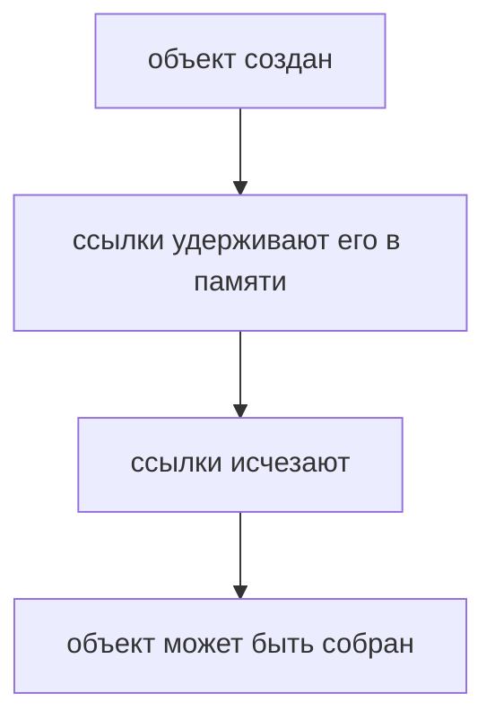

Эта модель завершает блок про память: дальше любые сложные возможности JavaScript нужно читать с учетом того, какие ссылки удерживают данные и когда эти ссылки исчезают.
