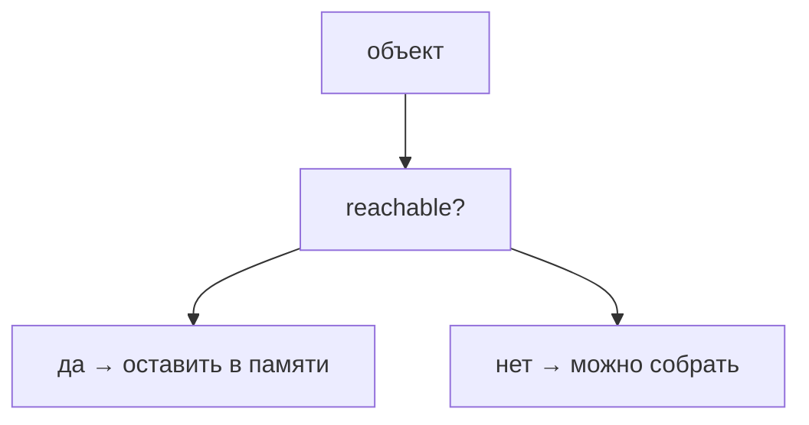
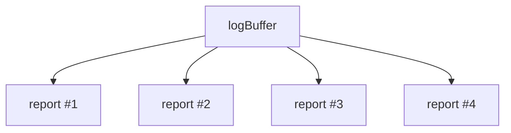
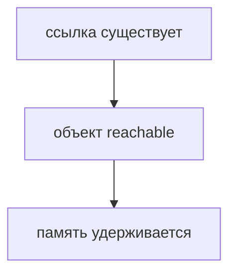
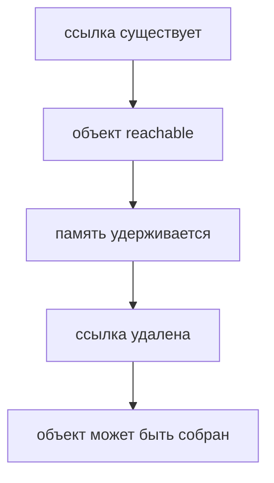
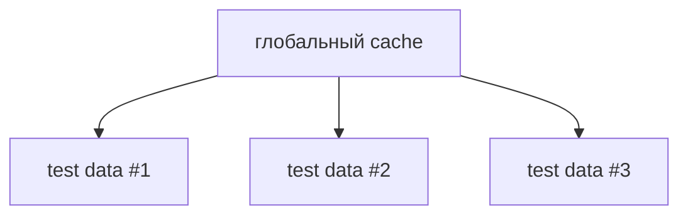

# Управление памятью

## Связь с предыдущей главой

Предыдущая глава показала базовую модель Garbage Collector:


```mermaid
flowchart TD
    N1["объект"]
    N2["reachable?"]
    N3["да → оставить в памяти"]
    N4["нет → можно собрать"]
    N1 --> N2
    N2 --> N3
    N2 --> N4
```

Теперь нужно понять обратную сторону этой модели.

Если объект остается reachable, Garbage Collector не может считать его мусором.

## Главный вопрос

> Если в JavaScript есть сборщик мусора, почему утечки памяти всё ещё происходят?

Короткий ответ: утечка возникает, когда программа продолжает удерживать ссылки на объекты, которые логически уже не нужны.

## Мотивация

Представим тестовый раннер, который сохраняет логи каждого теста:

```javascript
const logBuffer = [];

function saveLog(testName, messages) {
  logBuffer.push({
    testName,
    messages,
  });
}
```

Если буфер никогда не очищается, старые логи остаются reachable.


```mermaid
flowchart TD
    N1["logBuffer"]
    N2["report #1"]
    N3["report #2"]
    N4["report #3"]
    N5["report #4"]
    N1 --> N2
    N1 --> N3
    N1 --> N4
    N1 --> N5
```

Для Garbage Collector это не мусор.


```mermaid
flowchart TD
    N1["ссылка существует"]
    N2["объект reachable"]
    N3["память удерживается"]
    N1 --> N2
    N2 --> N3
```

Логически старые данные могут быть уже не нужны. Но технически программа все еще держит ссылку.

## Теория

Управление памятью в JavaScript — это не ручное её освобождение.

Это аккуратное управление временем жизни ссылок.


```mermaid
flowchart TD
    N1["ссылка существует"]
    N2["объект reachable"]
    N3["память удерживается"]
    N4["ссылка удалена"]
    N5["объект может быть собран"]
    N1 --> N2
    N2 --> N3
    N3 --> N4
    N4 --> N5
```

Утечка памяти — это ситуация, когда объект больше не нужен деловой логике, но остаётся достижимым.

Типичные источники:

* долгоживущие ссылки;
* случайные глобальные ссылки;
* замыкания, удерживающие большие объекты;
* обработчики событий;
* таймеры;
* кеши.

Все эти механизмы нормальны сами по себе. Проблема появляется только тогда, когда ссылка живет дольше, чем должен жить объект.

### Пять источников утечек и как они выглядят

Утечка памяти — это ситуация, когда объект больше не нужен деловой логике, но остаётся достижимым. Типичные источники стоит разобрать по отдельности, потому что чинятся они по-разному:

| Источник | Как возникает | Чем закрывается |
| --- | --- | --- |
| долгоживущий массив | результаты складывают «на всякий случай» | ограничить объём или не накапливать |
| случайная глобальная ссылка | значение положили в общий объект | локальная переменная или явная очистка |
| замыкание | функция удерживает большой объект | замыкать только нужные поля |
| обработчик события | подписались и не отписались | снимать подписку при завершении |
| таймер | `setInterval` без отмены | `clearInterval` в завершении |

Последние два — самые частые в тестовом коде: подписка и таймер живут дольше сценария, если их никто не остановил.

### Замыкание удерживает окружение целиком

Тонкость, которая делает утечки через замыкания незаметными. Функция сохраняет доступ к окружению, а не к отдельным переменным — как показано в главе 65.

```javascript
function createHandler(hugeResponse) {
  const id = hugeResponse.id;
  return () => id;        // но окружение всё ещё содержит hugeResponse
}
```

Пока жив обработчик, жив и весь контекст его создания. Если из большого объекта нужен только идентификатор, безопаснее не передавать объект в фабрику вовсе, а передать уже извлечённое значение.

### Накопление в тестовом прогоне

Для автотестов характерен свой сценарий: набор из сотен тестов складывает данные в общий массив — логи, ответы, скриншоты в памяти. Каждый отдельный тест ведёт себя корректно, а прогон целиком постепенно растёт.

Признаки, по которым это распознают:

- потребление памяти растёт монотонно и не возвращается между тестами;
- падения начинаются ближе к концу прогона, а не в начале;
- одиночный запуск теста проходит, а в наборе — нет.

Лечение то же, что и для данных на стенде: у накопленного должен быть владелец и момент освобождения.

### Освобождать — значит убирать ссылку

В JavaScript нет ручного освобождения памяти. Всё управление сводится к одному действию: **убрать последнюю ссылку**, когда объект больше не нужен.

```javascript
clearInterval(timer);          // таймер перестаёт удерживать колбэк
element.removeEventListener('click', handler);
cache.clear();                 // коллекция перестаёт удерживать значения
results.length = 0;
```

Каждая строка не «освобождает память» напрямую — она делает объекты недостижимыми, а дальше работает механизм из главы 87.

### Чего не стоит делать

Две крайности одинаково вредны.

Преждевременная борьба за память усложняет код без измеримой пользы: обнуление всех переменных в конце функции ничего не даёт, потому что её контекст и так исчезает.

Полное игнорирование темы приводит к прогонам, падающим по памяти через час работы. Разумная середина — знать пять источников из таблицы и закрывать их там, где ресурс действительно долгоживущий.

## Внутренний механизм

Дальше каждый пример разбирается через одну и ту же цепочку:


```mermaid
flowchart TD
    N1["ссылка существует"]
    N2["объект reachable"]
    N3["память удерживается"]
    N1 --> N2
    N2 --> N3
```

### Долгоживущие ссылки

Долгоживущая коллекция может удерживать объекты слишком долго:


```mermaid
flowchart TD
    N1["глобальный cache"]
    N2["test data #1"]
    N3["test data #2"]
    N4["test data #3"]
    N1 --> N2
    N1 --> N3
    N1 --> N4
```

Пока кэш существует и хранит ссылки, данные достижимы.

### Случайные глобальные переменные

Если значение случайно попадает в глобальную область, оно может жить дольше ожидаемого.

### Замыкания

Замыкание может удерживать объект через доступ к внешней переменной:

Это не ошибка само по себе. Ошибка начинается, когда такой доступ больше не нужен, но продолжает существовать.

### Обработчики событий

Подписка может удерживать обработчик, а обработчик — данные.

### Таймеры

Таймер может удерживать функцию, а функция — объекты из окружающего кода.

Таймер сам по себе не является утечкой. Риск появляется, когда таймер или его обратный вызов живут дольше нужного сценария.

### Кеши

Кэш полезен, пока есть правило очистки.

Кэш не является плохой практикой. Плохим становится кэш без понятного правила удаления старых данных.

## Главная ментальная модель

Главная модель главы показывает, где именно появляется утечка: не в движке и не в сборщике, а в коде, который продолжает держать ссылку на ненужный объект.

Сборщик мусора не исправляет неправильного времени жизни ссылок. Он только очищает то, что стало недостижимым.

## Практические примеры

Примеры находятся в:

```text
examples/01-javascript/chapter-88/
```

Запуск:

```bash
node examples/01-javascript/chapter-88/01-long-lived-reference.js
node examples/01-javascript/chapter-88/02-closure-retains-object.js
node examples/01-javascript/chapter-88/03-timer-reference.js
node examples/01-javascript/chapter-88/04-qa-cache-cleanup.js
```

## Пример Automation QA

Кэш тестовых данных может быть полезен:

```javascript
const testDataCache = new Map();

function saveTestData(testId, data) {
  testDataCache.set(testId, data);
}
```

Но если кэш никогда не очищается, данные всех старых запусков остаются достижимыми.

Практичнее явно определять время жизни:

```javascript
function clearTestData(testId) {
  testDataCache.delete(testId);
}
```

### Четыре источника утечек в тестовом проекте

| Что удерживает | Как выглядит в тестах |
| --- | --- |
| неограниченный кеш | карта результатов, которую никто не чистит |
| незакрытый ресурс | пул подключений или канал gRPC, оставленный после теста |
| обработчик события | подписка на страницу без снятия |
| таймер | `setInterval` опроса, не остановленный при выходе |

Три последние строки объединяет один симптом: **зелёный отчёт и не
завершившийся процесс**. Прогон прошёл, а задача в CI висит до ограничения
времени — и выглядит это как проблема инфраструктуры.

### Ограниченный кеш вместо ручной очистки

```javascript
const cache = new Map();

function remember(key, value) {
  cache.set(key, value);

  // Предел задан заранее: забытая очистка больше не превращается в утечку.
  if (cache.size > 100) cache.delete(cache.keys().next().value);
}
```

Явная очистка работает, пока о ней помнят. Предел размера работает всегда —
поэтому для данных прогона он надёжнее: забытый вызов `clearTestData` перестаёт
быть утечкой и становится просто вытеснением.

## Распространённые мифы

**Миф: утечка — это когда память не освобождается движком.**
Утечка — это когда объект остаётся достижимым, хотя больше не нужен.

**Миф: замыкание удерживает только использованные переменные.**
Оно сохраняет доступ к окружению целиком.

**Миф: обнуление переменных в конце функции помогает.**
Контекст функции исчезает сам. Пользы нет.

**Миф: утечки — проблема только долгоживущих приложений.**
Прогон из сотен тестов — тоже долгоживущий процесс.

**Миф: память освобождают явной командой.**
Её освобождает сборщик. Разработчик убирает последнюю ссылку.

## Частые вопросы

**Как распознать утечку в тестовом прогоне?**
Память растёт монотонно, падения ближе к концу, одиночный запуск теста проходит.

**Почему замыкание удерживает большой объект?**
Оно хранит доступ ко всему окружению создания, а не к отдельным переменным.

**Что делать с подписками и таймерами?**
Снимать и отменять при завершении сценария — это самый частый источник в тестах.

**Помогает ли `delete` от утечки?**
Только если это была последняя ссылка на объект.

**Стоит ли заранее оптимизировать память?**
Нет. Достаточно закрывать известные источники там, где ресурс долгоживущий.

## Проверьте себя

1. Что такое утечка памяти в терминах достижимости?
2. Назовите пять типичных источников и способ закрытия каждого.
3. Почему замыкание может удерживать больше, чем кажется?
4. По каким признакам распознают накопление памяти в прогоне тестов?
5. Что на самом деле означает «освободить память» в JavaScript?

### Ответы

1. Данные остаются достижимыми, хотя больше не нужны: ссылка на них не убрана, и сборщик не имеет права их удалить.
2. Не снятые обработчики событий — снимать при завершении. Незавершённые таймеры и интервалы — останавливать. Накапливаемые массивы и кэши — ограничивать размер. Замыкания, удерживающие крупные данные, — не захватывать лишнее. Глобальные переменные — не хранить состояние прогона в них.
3. Оно удерживает всё окружение, а не только используемую переменную. Одна маленькая функция способна не дать убрать большой объект, лежащий рядом.
4. Потребление памяти растёт от теста к тесту и не возвращается к исходному уровню, а длительность прогона постепенно увеличивается. Отдельный тест при этом проходит нормально.
5. Сделать данные недостижимыми — убрать последнюю ссылку. Момент фактического освобождения решает сборщик, а не код.

## Распространённые ошибки

### Ошибка 1. Считать, что сборщик мусора предотвращает любые утечки

Сборщик освобождает недостижимые объекты. Он не знает, какие достижимые объекты вам логически уже не нужны.

### Ошибка 2. Хранить временные данные в долгоживущих коллекциях

Если массив, `Map` или объект живёт весь процесс, все значения внутри тоже остаются достижимыми.

### Ошибка 3. Не убирать обработчики, таймеры и кэши

Подписки, таймеры и кэши часто становятся причиной удержания старых данных.

Важно: они не являются ошибкой сами по себе. Ошибка — оставить их жить после завершения сценария, которому они принадлежали.

## Практика

Практика находится в:

```text
practice/01-javascript/88-memory-management.md
```

Решения находятся в:

```text
solutions/01-javascript/88-memory-management.md
```

## Краткие итоги

Управление памятью в JavaScript — это управление ссылками и временем жизни данных.

Главное:

* сборщик мусора работает только с недостижимыми объектами;
* утечка возникает, когда ненужный объект остаётся достижимым;
* долгоживущие ссылки удерживают память;
* замыкания, обработчики, таймеры и кэши могут продлевать жизнь объектов;
* в автоматизации тестов важно очищать временные журналы, отчёты, снимки экрана и тестовые данные;
* хорошая практика — заранее понимать, кто владеет объектом и когда ссылка должна исчезнуть.

## Переход

Теперь мы понимаем:

Эта модель завершает блок про память: дальше любые сложные возможности JavaScript нужно читать с учетом того, какие ссылки удерживают данные и когда эти ссылки исчезают.
