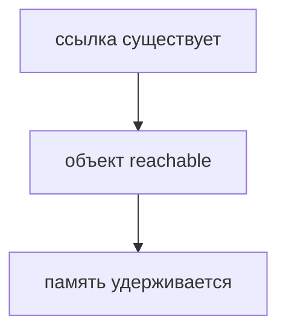
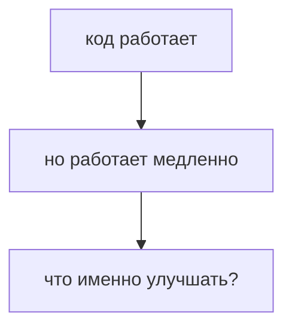
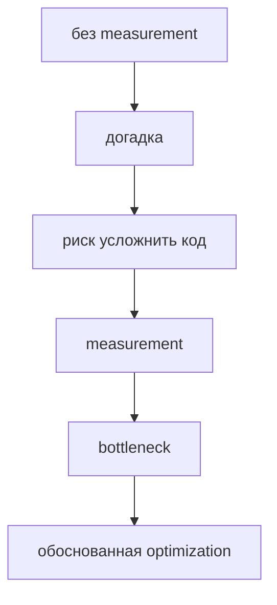
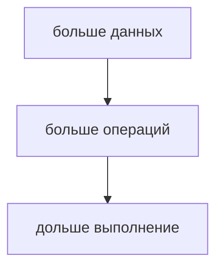
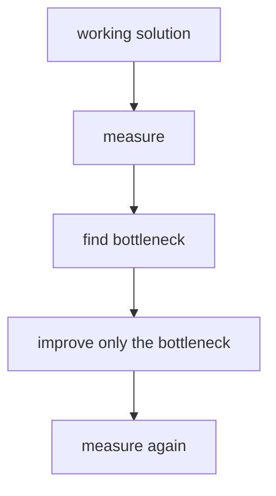
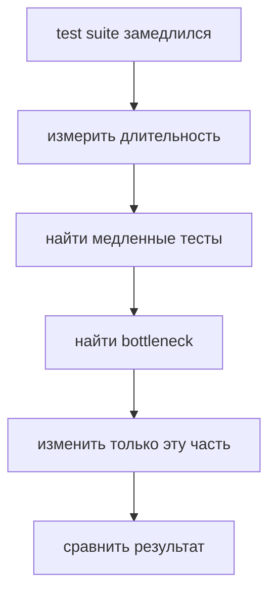
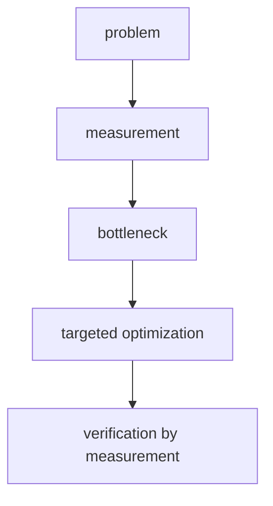
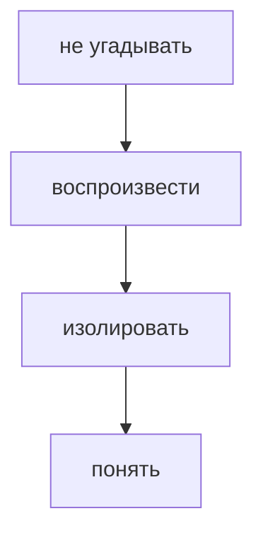

# Performance

## Связь с предыдущей главой

Предыдущий модуль завершил модель памяти:



Теперь мы смотрим шире. Программа может быть корректной, но работать медленно: делать лишние запросы, повторять вычисления, создавать ненужные объекты или гонять один и тот же тестовый сценарий слишком долго.

После памяти появляется следующий инженерный вопрос:



## Главный вопрос

> Как писать эффективный JavaScript без premature optimization?

Короткий ответ: сначала нужно написать понятный работающий код, затем измерить поведение, найти bottleneck, улучшить только его и измерить снова.

## Мотивация

В Automation QA медленный код часто выглядит не как "плохой JavaScript", а как неэффективный тестовый процесс:

```javascript
const tests = [
  { id: 'T-1', status: 'passed', durationMs: 120 },
  { id: 'T-2', status: 'failed', durationMs: 980 },
  { id: 'T-3', status: 'passed', durationMs: 140 },
];

const slowTests = tests.filter((test) => test.durationMs > 500);

console.log(slowTests);
```

Такой код сам по себе нормален. Но в большом фреймворке похожая логика может выполняться тысячи раз, повторять одни и те же расчеты или запускать лишние API-запросы.

Performance — это не соревнование за самый короткий код. Это наблюдаемое поведение программы: выполняет ли она нужную работу за приемлемое время и с разумным расходом ресурсов.

## Теория

Главное правило:



optimization без measurement — это догадка. Performance улучшается не потому, что код стал "быстрее вообще", а потому что исправлен правильный bottleneck.

До measurement неизвестно:

* какая часть кода действительно является bottleneck;
* насколько проблема заметна пользователю или тестовому пайплайну;
* не ухудшит ли изменение читаемость без реальной пользы;
* исчезла ли проблема после исправления.

На практическом уровне performance обычно страдает из-за лишней работы:

* один и тот же расчет выполняется несколько раз;
* данные фильтруются или перебираются без необходимости;
* создаются временные объекты, которые не нужны;
* выполняются повторные API-запросы;
* тестовый код ждет дольше, чем требуется;
* retry используется вместо устранения причины нестабильности.

Алгоритмическая сложность здесь нужна только как интуитивная модель: если входных данных становится больше, важно понимать, растет ли количество работы спокойно или резко.



## Внутренний механизм

JavaScript выполняет инструкции последовательно. Если код делает лишнюю работу, среда выполнения должна потратить на нее время.

Пример лишнего повторного расчета:

```javascript
const testRuns = [
  { id: 'R-1', durationMs: 300 },
  { id: 'R-2', durationMs: 700 },
  { id: 'R-3', durationMs: 200 },
];

function getTotalDuration(runs) {
  return runs.reduce((total, run) => total + run.durationMs, 0);
}

console.log(getTotalDuration(testRuns));
console.log(getTotalDuration(testRuns));
```

Код корректный. Но если результат нужен несколько раз и данные не менялись, повторный расчет может быть лишним.

Более практичная схема:

```javascript
const totalDuration = getTotalDuration(testRuns);

console.log(totalDuration);
console.log(totalDuration);
```

Такая optimization не требует знания внутренних деталей среды выполнения. Она убирает ненужную работу на уровне программы.

Еще один пример — лишнее создание объектов:

```javascript
function createAssertionResult(testId, passed) {
  return {
    testId,
    passed,
    createdAt: Date.now(),
  };
}
```

Создание объекта нормально, если результат нужен. Проблема появляется, когда такие объекты создаются в большом количестве без дальнейшего использования.

## Главная ментальная модель



Performance начинается не с переписывания кода, а с вопроса:

> Где находится bottleneck, который реально влияет на поведение программы?

## Практические примеры

Примеры находятся в:

```text
examples/01-javascript/chapter-89/
```

Запуск:

```bash
node examples/01-javascript/chapter-89/01-measure-duration.js
node examples/01-javascript/chapter-89/02-avoid-duplicate-calculation.js
node examples/01-javascript/chapter-89/03-avoid-unnecessary-work.js
node examples/01-javascript/chapter-89/04-qa-slow-tests.js
```

## Пример Automation QA

Представим тестовый отчет, где нужно найти медленные тесты:

```javascript
const testResults = [
  { id: 'T-1', title: 'login works', durationMs: 320 },
  { id: 'T-2', title: 'checkout creates order', durationMs: 1250 },
  { id: 'T-3', title: 'profile updates', durationMs: 410 },
];

const slowTests = testResults.filter((test) => test.durationMs > 1000);

console.log(slowTests);
```

Здесь optimization не нужна, пока нет проблемы. Но если suite растет, полезно сначала измерить:



В реальном Playwright-проекте это может означать:

* не выполнять login через UI в каждом тесте, если есть подготовленное состояние;
* не делать один и тот же API-запрос несколько раз;
* не создавать test data, которая не используется;
* не увеличивать timeout вместо анализа причины ожидания.

## Распространённые ошибки

### Ошибка 1. Делать optimization до measurement

Если неизвестно, где bottleneck, изменение может сделать код сложнее без пользы.

### Ошибка 2. Жертвовать читаемостью ради микровыгоды

Код читают и поддерживают люди. Если ускорение не подтверждено measurement, сложный код часто хуже простого.

### Ошибка 3. Лечить медленные тесты увеличением timeout

Timeout может скрыть проблему. Сначала нужно понять, почему тест ждет.

### Ошибка 4. Делать одну и ту же работу несколько раз

Повторные вычисления, повторные запросы и повторное создание данных часто дороже, чем кажется.

## Практика

Практика находится в:

```text
practice/01-javascript/89-performance.md
```

Решения находятся в:

```text
solutions/01-javascript/89-performance.md
```

## Краткие итоги

Performance — это инженерная дисциплина, а не набор трюков.

Главное:

* сначала код должен быть понятным и корректным;
* optimization без measurement — догадка;
* улучшать нужно bottleneck, а не случайный участок кода;
* часто достаточно убрать лишнюю работу;
* после изменения нужно измерить снова;
* в Automation QA performance часто связана с лишними запросами, ожиданиями, retries и подготовкой данных.

Финальная схема главы:



## Переход

Performance учит не угадывать, а проверять.

Та же идея нужна при поиске ошибок:



Следующая глава показывает, как профессионально искать bugs.
