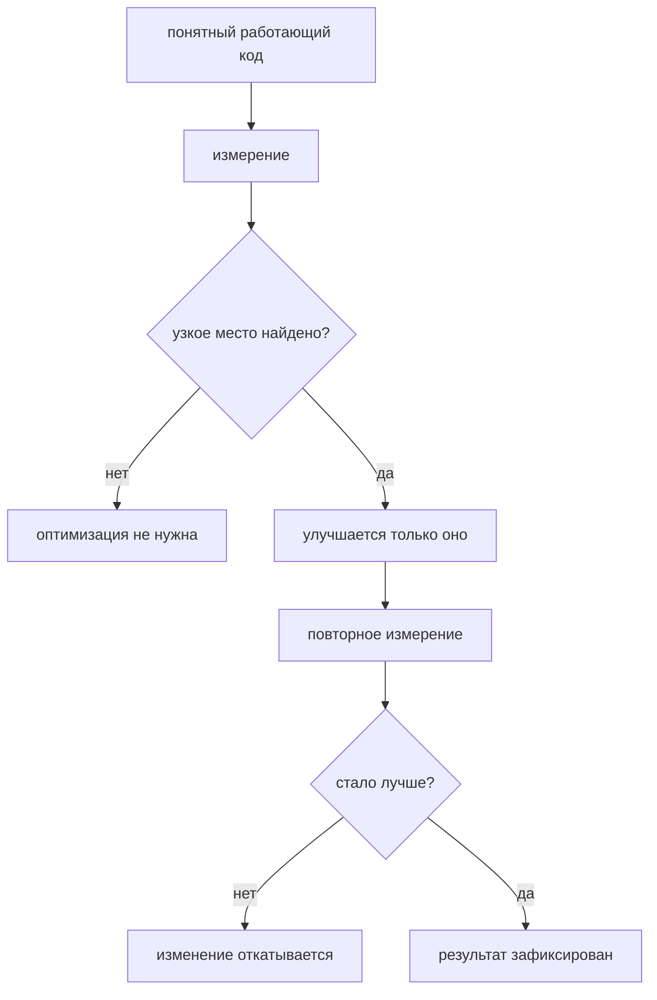

# Производительность

## Связь с предыдущей главой

Предыдущий модуль завершил модель памяти:

Теперь мы смотрим шире. Программа может быть корректной, но работать медленно: делать лишние запросы, повторять вычисления, создавать ненужные объекты или гонять один и тот же тестовый сценарий слишком долго.

После памяти появляется следующий инженерный вопрос:

## Главный вопрос

> Как писать эффективный код без преждевременной оптимизации?

Короткий ответ: сначала нужно написать понятный работающий код, затем измерить поведение, найти узкое место, улучшить только его и измерить снова.

## Мотивация

В Automation QA медленный код часто выглядит не как "плохой JavaScript", а как неэффективный тестовый процесс:

```javascript
const tests = [
  { id: 'T-1', status: 'passed', durationMs: 120 },
  { id: 'T-2', status: 'failed', durationMs: 980 },
  { id: 'T-3', status: 'passed', durationMs: 140 },
];

const slowTests = tests.filter((test) => test.durationMs > 500);

console.log(slowTests);
```

Такой код сам по себе нормален. Но в большом фреймворке похожая логика может выполняться тысячи раз, повторять одни и те же расчеты или запускать лишние API-запросы.

Performance — это не соревнование за самый короткий код. Это наблюдаемое поведение программы: выполняет ли она нужную работу за приемлемое время и с разумным расходом ресурсов.

## Теория

Главное правило:

Оптимизация без измерения — это догадка. Скорость улучшается не потому, что код стал «быстрее вообще», а потому что исправлено правильное узкое место.

До измерения неизвестно:

* какая часть кода действительно является узким местом;
* насколько проблема заметна пользователю или тестовому конвейеру;
* не ухудшит ли изменение читаемость без реальной пользы;
* исчезла ли проблема после исправления.

На практике производительность обычно страдает из-за лишней работы:

* один и тот же расчет выполняется несколько раз;
* данные фильтруются или перебираются без необходимости;
* создаются временные объекты, которые не нужны;
* выполняются повторные API-запросы;
* тестовый код ждет дольше, чем требуется;
* повторы используются вместо устранения причины нестабильности.

Алгоритмическая сложность здесь нужна только как интуитивная модель: если входных данных становится больше, важно понимать, растет ли количество работы спокойно или резко.

Оптимизация начинается с измерения, а не с догадки:


```mermaid
flowchart TD
    A["понятный работающий код"] --> B["измерение"]
    B --> C{"узкое место найдено?"}
    C -- "нет" --> D["оптимизация не нужна"]
    C -- "да" --> E["улучшается только оно"]
    E --> F["повторное измерение"]
    F --> G{"стало лучше?"}
    G -- "нет" --> H["изменение откатывается"]
    G -- "да" --> I["результат зафиксирован"]
```

## Внутренний механизм

JavaScript выполняет инструкции последовательно. Если код делает лишнюю работу, среда выполнения должна потратить на нее время.

Пример лишнего повторного расчета:

```javascript
const testRuns = [
  { id: 'R-1', durationMs: 300 },
  { id: 'R-2', durationMs: 700 },
  { id: 'R-3', durationMs: 200 },
];

function getTotalDuration(runs) {
  return runs.reduce((total, run) => total + run.durationMs, 0);
}

console.log(getTotalDuration(testRuns));
console.log(getTotalDuration(testRuns));
```

Код корректный. Но если результат нужен несколько раз и данные не менялись, повторный расчет может быть лишним.

Более практичная схема:

```javascript
const totalDuration = getTotalDuration(testRuns);

console.log(totalDuration);
console.log(totalDuration);
```

Такая оптимизация не требует знания внутренних деталей среды выполнения. Она убирает ненужную работу на уровне программы.

Еще один пример — лишнее создание объектов:

```javascript
function createAssertionResult(testId, passed) {
  return {
    testId,
    passed,
    createdAt: Date.now(),
  };
}
```

Создание объекта нормально, если результат нужен. Проблема появляется, когда такие объекты создаются в большом количестве без дальнейшего использования.

## Главная ментальная модель

Производительность начинается не с переписывания кода, а с вопроса:

> Где находится узкое место, которое реально влияет на поведение программы?

## Практические примеры

Примеры находятся в:

```text
examples/01-javascript/chapter-89/
```

Запуск:

```bash
node examples/01-javascript/chapter-89/01-measure-duration.js
node examples/01-javascript/chapter-89/02-avoid-duplicate-calculation.js
node examples/01-javascript/chapter-89/03-avoid-unnecessary-work.js
node examples/01-javascript/chapter-89/04-qa-slow-tests.js
```

## Пример Automation QA

Представим тестовый отчет, где нужно найти медленные тесты:

```javascript
const testResults = [
  { id: 'T-1', title: 'login works', durationMs: 320 },
  { id: 'T-2', title: 'checkout creates order', durationMs: 1250 },
  { id: 'T-3', title: 'profile updates', durationMs: 410 },
];

const slowTests = testResults.filter((test) => test.durationMs > 1000);

console.log(slowTests);
```

Здесь оптимизация не нужна, пока нет проблемы. Но если набор тестов растёт,
сначала измеряют — и только потом правят то, что действительно занимает время.

В реальном Playwright-проекте это может означать:

* не выполнять вход через интерфейс в каждом тесте, если есть подготовленное состояние;
* не делать один и тот же API-запрос несколько раз;
* не создавать тестовые данные, которые не используются;
* не увеличивать срок ожидания вместо анализа причины ожидания.

## Распространённые мифы

**Миф: оптимизация — это про то, чтобы писать код «быстрее вообще».**
Она про устранение конкретного узкого места, найденного измерением. Без измерения непонятно, что исправлять.

**Миф: чем короче код, тем он быстрее.**
Краткость и скорость не связаны. Одна строка с цепочкой методов может делать три полных прохода по данным.

**Миф: если после изменения стало быстрее, причина найдена.**
Измерение зависит от загрузки машины и работы сборщика мусора. Разовое улучшение нужно подтвердить повторами.

**Миф: медленный тест — это медленный код теста.**
Чаще время уходит на ожидания, сеть и подготовку стенда, а не на вычисления.

**Миф: повторы ускоряют прохождение набора.**
Он маскирует нестабильность и добавляет полный повтор сценария — то есть делает прогон дольше.

## Частые вопросы

**С чего начинать оптимизацию?**
С измерения: какая часть действительно занимает время и насколько это заметно.

**Почему одинаковый код показывает разное время?**
Влияют загрузка машины, состояние кеша и работа сборщика мусора. Нужны повторные замеры.

**Что чаще всего тормозит автотесты?**
Лишние ожидания, повторные запросы и дорогая подготовка данных, а не сам код проверок.

**Когда оптимизация не нужна?**
Когда выигрыш не измерен или несопоставим с усложнением кода.

**Как понять, что стало лучше?**
Повторить то же измерение после изменения и сравнить с исходным.

## Проверьте себя

1. Почему оптимизация без измерения считается догадкой?
2. Назовите типичные источники лишней работы в коде.
3. Почему разовое улучшение времени не доказывает результат?
4. Что обычно занимает время в автотестах?
5. Почему повтор не является способом ускорить прогон?

### Ответы

1. Без измерения непонятно, что именно занимает время. Изменения вносятся в место, которое кажется медленным, а не в то, которое им является.
2. Повторные вычисления одного и того же, лишние проходы по данным, работа внутри цикла, которую можно вынести наружу, и данные, загружаемые целиком вместо нужной части.
3. Один замер включает случайные факторы: состояние машины, сборку мусора, кэши. Вывод делают по нескольким замерам и их разбросу.
4. Ожидания: запросы к сети, загрузка страниц, ожидание элементов. Само выполнение кода теста занимает ничтожную долю.
5. Повтор не устраняет причину и увеличивает общее время: неустойчивый тест выполняется по два-три раза. Он скрывает проблему, а не решает её.

## Распространённые ошибки

### Ошибка 1. Оптимизировать до измерения

Если неизвестно, где узкое место, изменение может сделать код сложнее без пользы.

### Ошибка 2. Жертвовать читаемостью ради микровыгоды

Код читают и поддерживают люди. Если ускорение не подтверждено измерением, сложный код часто хуже простого.

### Ошибка 3. Лечить медленные тесты увеличением срока ожидания

Увеличенный срок ожидания может скрыть проблему. Сначала нужно понять, почему тест ждёт.

### Ошибка 4. Делать одну и ту же работу несколько раз

Повторные вычисления, повторные запросы и повторное создание данных часто дороже, чем кажется.

## Практика

Практика находится в:

```text
practice/01-javascript/89-performance.md
```

Решения находятся в:

```text
solutions/01-javascript/89-performance.md
```

## Краткие итоги

Производительность — это инженерная дисциплина, а не набор трюков.

Главное:

* сначала код должен быть понятным и корректным;
* оптимизация без измерения — догадка;
* улучшать нужно узкое место, а не случайный участок кода;
* часто достаточно убрать лишнюю работу;
* после изменения нужно измерить снова;
* в автоматизации тестов скорость чаще связана с лишними запросами, ожиданиями, повторами и подготовкой данных.

Финальная схема главы:

```text
измерить  →  найти узкое место  →  изменить  →  измерить снова
```

## Переход

Работа над производительностью учит не угадывать, а проверять.

Та же идея нужна при поиске ошибок:

Следующая глава показывает, как профессионально искать ошибки.
