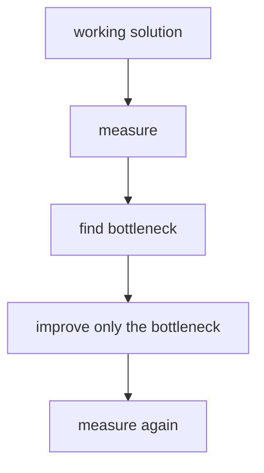
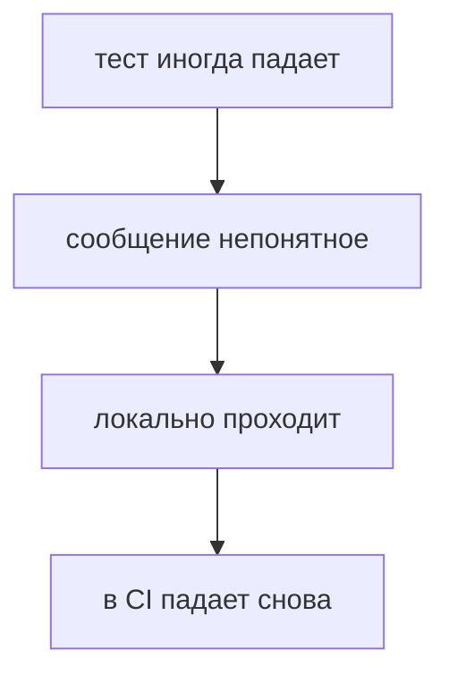
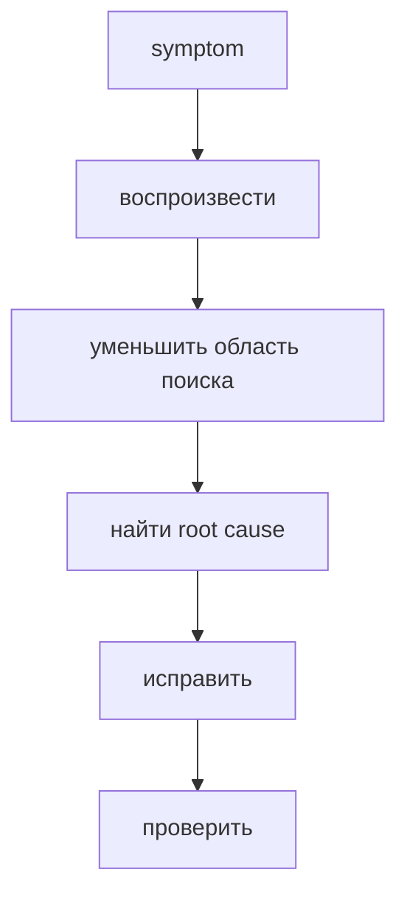
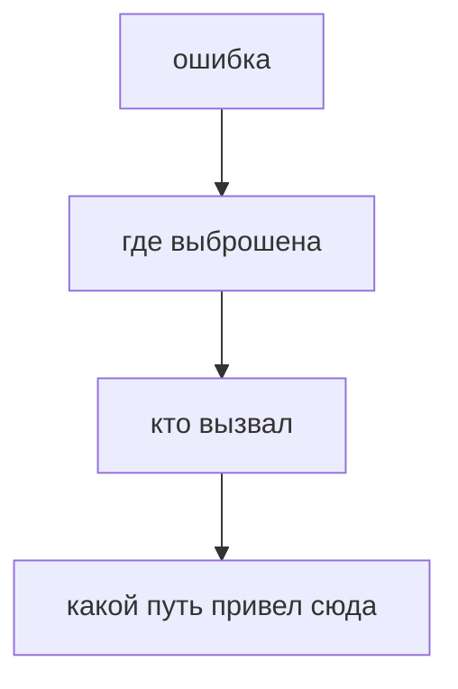
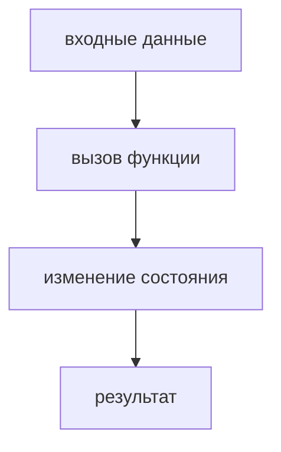
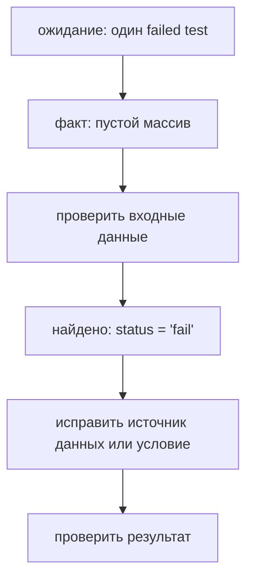
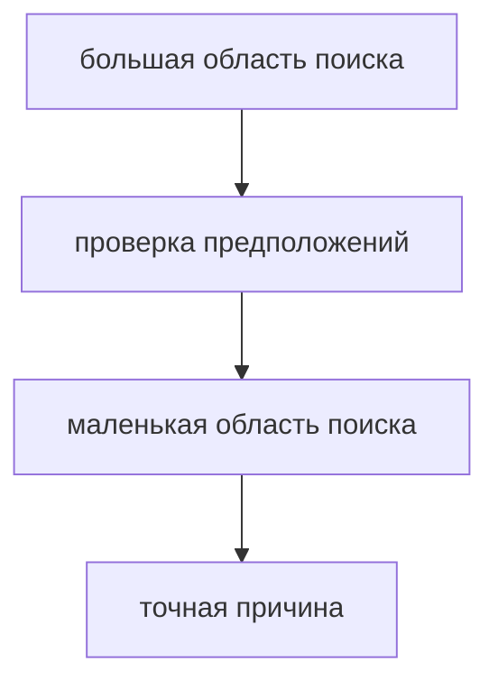
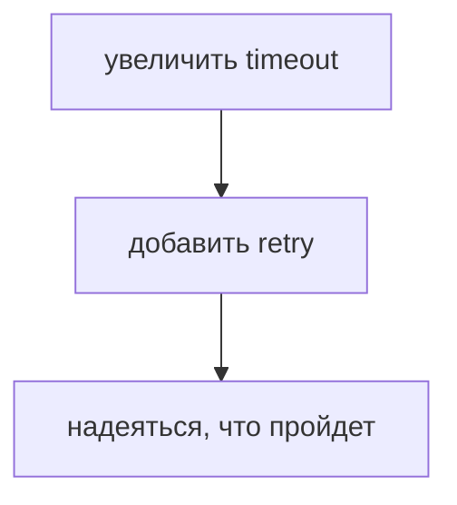
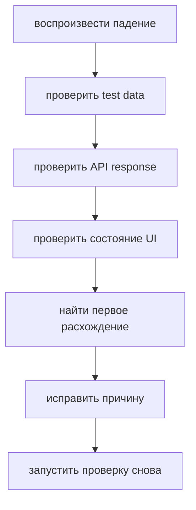
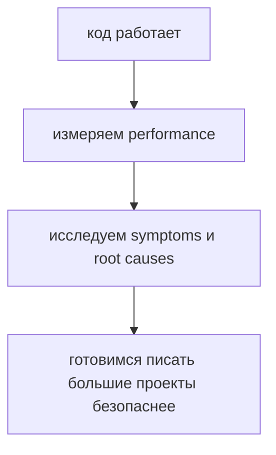

# Debugging

## Связь с предыдущей главой

Предыдущая глава показала инженерный подход к performance:



Debugging строится на похожей дисциплине. Ошибку нельзя надежно исправить догадкой. Сначала виден только symptom. Его нужно воспроизвести, сузить область поиска, найти root cause, исправить и проверить результат.

## Главный вопрос

> Как профессиональные разработчики находят bugs?

Короткий ответ: они не угадывают. Они систематически воспроизводят symptom, проверяют предположения, уменьшают область поиска и находят root cause.

## Мотивация

В Automation QA ошибка часто выглядит так:



Новичок часто начинает менять код наугад: увеличить timeout, добавить retry, заменить selector, переписать assertion.

Профессиональный подход другой:



Debugging — это процесс исследования, а не набор случайных правок.

## Теория

Bug — это расхождение между ожидаемым поведением и фактическим поведением.

Первый шаг — воспроизведение. Если проблему нельзя повторить, ее трудно проверить после исправления.

Второй шаг — изоляция. Нужно понять, где именно возникает расхождение:

* входные данные;
* состояние объекта;
* вызов функции;
* результат API-запроса;
* selector;
* assertion;
* порядок выполнения.

Третий шаг — проверка предположений. Хороший debugging постоянно задает вопросы:

* что я считаю истинным?
* где это можно проверить?
* какие данные реально пришли?
* какая функция была вызвана?
* какой путь выполнения привел к ошибке?

`console.log()` полезен, если он проверяет конкретное предположение.

Плохо:

```javascript
console.log('here');
```

Лучше:

```javascript
console.log('current status:', testResult.status);
```

Breakpoint по смыслу делает то же самое: останавливает выполнение в выбранной точке, чтобы проверить состояние программы.

Stack trace — это стартовая точка расследования.

Он показывает цепочку вызовов, которая привела к ошибке.

Но stack trace не всегда автоматически указывает root cause: причина может быть в данных, состоянии или более раннем вызове.



## Внутренний механизм

Во время выполнения JavaScript проходит по конкретному пути.



Debugging пытается найти первое место, где ожидание расходится с реальностью. Именно там symptom начинает превращаться в объяснимую root cause.

Пример:

```javascript
function getFailedTests(results) {
  return results.filter((result) => result.status === 'failed');
}

const testResults = [
  { id: 'T-1', status: 'passed' },
  { id: 'T-2', status: 'fail' },
];

console.log(getFailedTests(testResults));
```

Код выводит пустой массив, хотя второй тест логически failed. Проблема не в `filter()`. Проблема в данных: статус записан как `'fail'`, а код ожидает `'failed'`.

Системный debugging идет так:



## Главная ментальная модель


Debugging — это уменьшение неизвестности.



## Практические примеры

Примеры находятся в:

```text
examples/01-javascript/chapter-90/
```

Запуск:

```bash
node examples/01-javascript/chapter-90/01-reproduce-bug.js
node examples/01-javascript/chapter-90/02-isolate-condition.js
node examples/01-javascript/chapter-90/03-read-stack-trace.js
node examples/01-javascript/chapter-90/04-qa-debug-report.js
```

## Пример Automation QA

Представим падающий Playwright-тест:

```text
expected status: paid
actual status: pending
```

Плохой путь:



Инженерный путь:



Если API возвращает `pending`, а UI показывает `pending`, bug может быть не в selector. Если API возвращает `paid`, но UI показывает `pending`, нужно смотреть обновление состояния на странице или ожидание нужного условия. Так область поиска становится меньше.

## Распространённые ошибки

### Ошибка 1. Исправлять до воспроизведения

Если проблема не воспроизведена, трудно доказать, что исправление действительно помогло.

### Ошибка 2. Менять несколько вещей сразу

После нескольких одновременных изменений непонятно, что именно повлияло на результат.

### Ошибка 3. Использовать `console.log()` без вопроса

Логи полезны, когда проверяют конкретное предположение.

### Ошибка 4. Игнорировать stack trace

Stack trace часто показывает не только место ошибки, но и путь вызовов.

### Ошибка 5. Маскировать flaky test через retry

Retry может быть временной защитой, но он не объясняет причину нестабильности.

## Практика

Практика находится в:

```text
practice/01-javascript/90-debugging.md
```

Решения находятся в:

```text
solutions/01-javascript/90-debugging.md
```

## Краткие итоги

Debugging — это системный процесс поиска причины.

Главное:

* сначала нужно воспроизвести проблему;
* затем уменьшить область поиска;
* `console.log()` должен проверять предположение;
* breakpoint помогает остановиться и изучить состояние;
* stack trace — стартовая точка расследования, но не готовый ответ;
* исправление нужно проверить тем же сценарием, где ошибка проявлялась;
* в Automation QA важно отличать проблему теста, данных, API и UI.

## Переход

На этом JavaScript-блок становится ближе к инженерной практике:



Следующий большой вопрос курса — как TypeScript помогает поддерживать крупный JavaScript-код.
