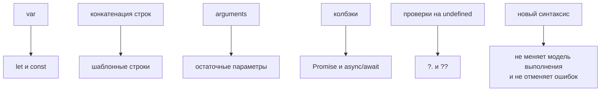

# Возможности современного JavaScript

## Связь с предыдущей главой

Предыдущий модуль завершил инженерный блок JavaScript:

Теперь важно собрать язык в одну картину. Мы уже изучили модули, функции, объекты, async/await, классы, итерацию и управление ошибками. В реальном проекте эти возможности почти никогда не живут отдельно.

## Главный вопрос

> Как обычно выглядит современный JavaScript-код?

Короткий ответ: современный JavaScript — это сочетание уже изученных механизмов, которые помогают писать модульный, читаемый и предсказуемый код.

## Мотивация

В Automation QA проект редко состоит из одного файла. Обычно есть:

```text
config
helpers
page objects
fixtures
assertions
reporting
test data
```

Современный JavaScript помогает связать эти части без хаоса:

## Теория

Эта глава не вводит новый синтаксис. Она показывает, как уже изученные возможности работают вместе.

Типичный современный JavaScript-код использует:

* `import` / `export` для границ модулей;
* деструктуризация для аккуратного извлечения данных;
* безопасное чтение цепочки для доступа к вложенным полям;
* оператор `??` для осмысленных значений по умолчанию;
* раскрытие и сбор для работы с наборами данных;
* `async` / `await` для читаемого асинхронного потока;
* классы там, где нужна сущность с состоянием и поведением;
* итераторы и генераторы там, где данные удобно выдавать постепенно.

Главная идея:

Главная идея: современный JavaScript — это не набор новых ключевых слов, а привычка выражать намерение прямо, вместо того чтобы описывать шаги его достижения.

### Как это выглядит в коде

Одна и та же задача в двух стилях:

```javascript
// было
var names = [];
for (var i = 0; i < tests.length; i++) {
  if (tests[i].status === 'failed') {
    names.push(tests[i].name);
  }
}

// стало
const names = tests
  .filter((test) => test.status === 'failed')
  .map((test) => test.name);
```

Второй вариант короче не ради краткости: из него видно **что** происходит, а не как устроен обход. Это та же мысль, что в главе 54 про цепочки.

### Что чем заменилось

| Задача | Раньше | Сейчас |
| --- | --- | --- |
| значение по умолчанию | `a \|\| b` | `a ?? b` |
| безопасный доступ | `a && a.b && a.b.c` | `a?.b?.c` |
| извлечение полей | обращения по одному | деструктуризация |
| копия с изменением | `Object.assign({}, o, p)` | раскрытие |
| асинхронная цепочка | вложенные колбэки | `async` / `await` |
| границы кода | глобальные имена | `import` / `export` |

Вторая строка таблицы важна практически: `||` подменяет `0` и пустую строку, а `??` реагирует только на `null` и `undefined` — ровно та ловушка, что разбиралась при нормализации данных.

### Чего современный синтаксис не делает

Он не отменяет модель выполнения. Стрелка не меняет правил `this` — она просто не создаёт своего. `async/await` не убирает очередь микрозадач. Деструктуризация не копирует вложенные объекты.

Поэтому знание из предыдущих глав остаётся необходимым: новый синтаксис делает намерение видимым, но работает на тех же механизмах.

Современный синтаксис заменил приёмы, но не правила языка:



## Главная ментальная модель

Современный JavaScript — это не набор модных конструкций. Это способ соединять уже понятные механизмы так, чтобы код оставался читаемым.

## Практические примеры

Примеры находятся в:

```text
examples/01-javascript/chapter-91/
```

Запуск:

```bash
node examples/01-javascript/chapter-91/01-modern-data-access.js
node examples/01-javascript/chapter-91/02-async-helper-flow.js
node examples/01-javascript/chapter-91/03-class-and-report.js
node examples/01-javascript/chapter-91/04-generator-log-reader.js
```

## Automation QA

Пример современной вспомогательной функции:

```javascript
async function createTestSummary(testResult) {
  const {
    title,
    status,
    meta = {},
  } = testResult;

  const owner = meta.owner ?? 'unknown';
  const browser = meta.environment?.browser ?? 'chromium';

  return {
    title,
    status,
    owner,
    browser,
  };
}
```

Здесь вместе работают:

* деструктуризация;
* значение по умолчанию;
* опциональная цепочка;
* нулевое слияние;
* асинхронная функция;
* объект результата.

Это не "сложный синтаксис". Это аккуратная сборка уже изученных механизмов.

## Распространённые мифы

**Миф: современный JavaScript — это новый язык.**
Это те же механизмы. Меняется способ выражать намерение.

**Миф: `||` и `??` взаимозаменяемы.**
`||` подменяет `0` и пустую строку, `??` реагирует только на `null` и `undefined`.

**Миф: стрелочные функции — просто короткая запись.**
Они не создают своего `this`, и это меняет поведение.

**Миф: `async/await` убирает асинхронность.**
Он делает её читаемой. Очередь микрозадач работает по-прежнему.

**Миф: деструктуризация копирует данные.**
Она извлекает значения; вложенные объекты остаются общими.

## Частые вопросы

**Когда использовать `??`, а когда `||`?**
`??` — если `0` и пустая строка допустимы. `||` — если любое ложное значение должно быть заменено.

**Опциональная цепочка скрывает ошибки?**
Она заменяет отсутствующий путь на `undefined`. Если отсутствие — дефект, проверять нужно явно.

**Стоит ли переписывать старый код?**
Только там, где это упрощает чтение. Ради стиля — нет.

**Почему цепочка методов предпочтительнее цикла?**
Из неё видно намерение, а не механика обхода.

**Что остаётся неизменным при переходе на современный синтаксис?**
Модель выполнения: контексты, очереди, ссылки.

## Проверьте себя

1. В чём главная идея современного стиля, если новых механизмов не появилось?
2. Чем `??` отличается от `||` и когда разница критична?
3. Что стрелочная функция меняет в поведении `this`?
4. Копирует ли деструктуризация вложенные данные?
5. Какие знания из предыдущих глав остаются нужными?

### Ответы

1. Выражать намерение короче и точнее. Механизмы те же: область видимости, ссылки, асинхронность работают как раньше.
2. `||` заменяет любое ложное значение, `??` — только `null` и `undefined`. Разница критична там, где `0`, `''` и `false` законны: число повторов, пустой префикс, выключённый флаг.
3. У неё нет своего `this` — он берётся из окружающего кода. Это удобно в обратных вызовах и делает её непригодной как метод объекта.
4. Нет. Копируются только значения верхнего уровня: вложенные объекты остаются теми же ссылками.
5. Все: область видимости и замыкания, ссылки и изменяемость, цикл событий, порядок выполнения. Современный синтаксис ничего из этого не отменяет.

## Распространённые ошибки

### Ошибка 1. Использовать современный синтаксис ради самого синтаксиса

Если конструкция не делает код понятнее, она не улучшает проект.

### Ошибка 2. Смешивать слишком много идей в одной функции

Даже современный JavaScript становится тяжёлым, если одна функция делает подготовку данных, запрос, проверку и отчёт одновременно.

### Ошибка 3. Забывать про границы модулей

Если каждый файл знает слишком много о других файлах, `import` / `export` не спасают архитектуру.

## Практика

Практика находится в:

```text
practice/01-javascript/91-modern-javascript.md
```

Решения находятся в:

```text
solutions/01-javascript/91-modern-javascript.md
```

## Краткие итоги

Современный JavaScript — это соединение уже изученных механизмов.

Главное:

* модули задают границы;
* деструктуризация упрощает работу с данными;
* безопасное чтение цепочки и оператор `??` делают доступ безопаснее;
* `async` и `await` помогают читать асинхронный поток;
* раскрытие и сбор помогают передавать наборы данных;
* классы, итераторы и генераторы применяются там, где они выражают модель задачи;
* качество кода зависит не от количества фич, а от ясности решения.

## Переход

Теперь мы видим, как современный JavaScript собирается в рабочий проект.

Следующий вопрос уже не про синтаксис:

> Что отличает поддерживаемый JavaScript от хаотичного JavaScript?
