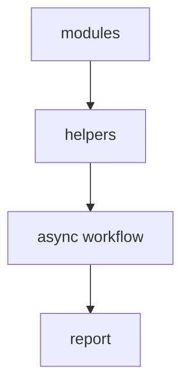
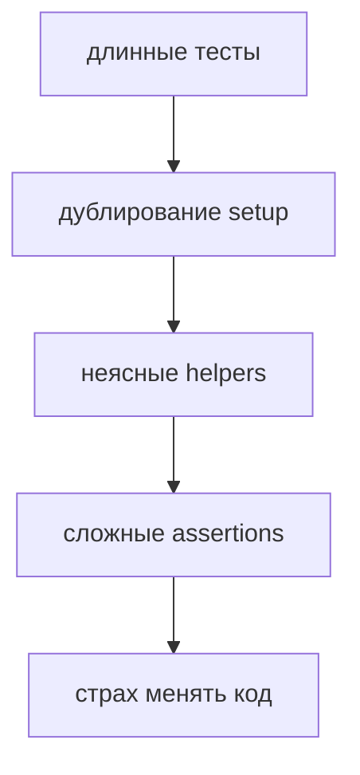
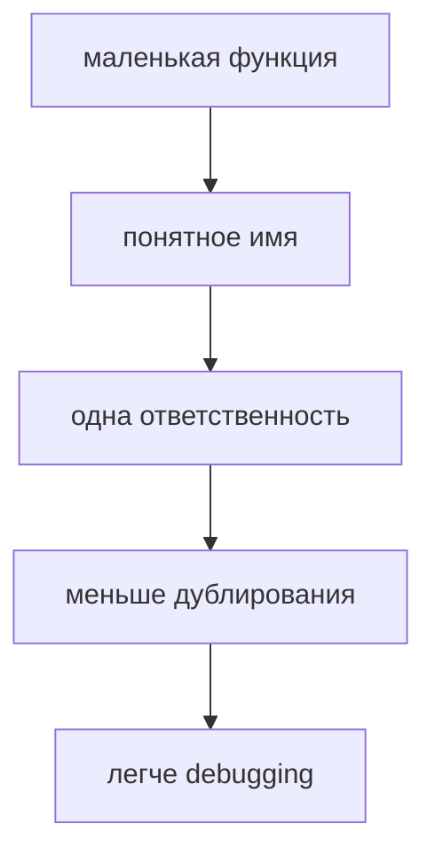
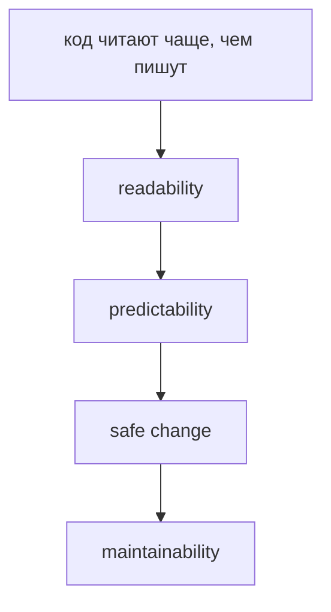
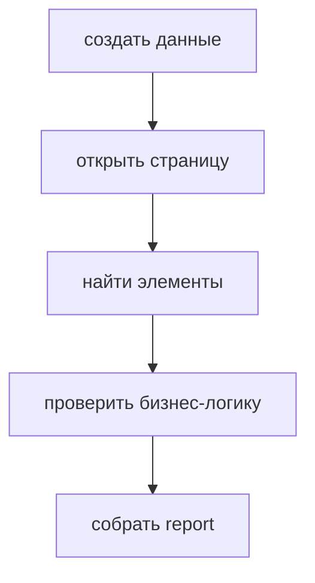
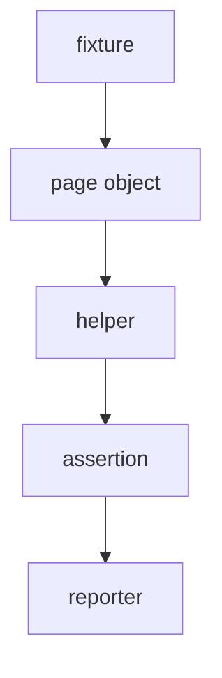
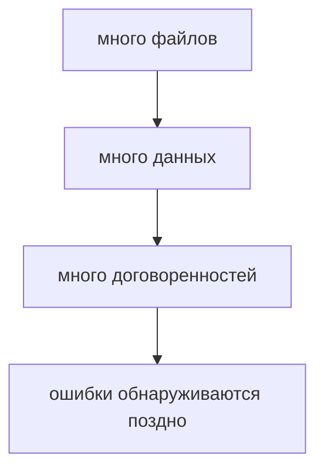

# JavaScript Best Practices

## Связь с предыдущей главой

Предыдущая глава показала, как современные возможности JavaScript работают вместе:



Но знание возможностей языка еще не гарантирует хорошую архитектуру. Один и тот же JavaScript можно написать понятно или превратить в набор случайных решений.

## Главный вопрос

> Что отличает поддерживаемый JavaScript от хаотичного JavaScript?

Короткий ответ: поддерживаемый JavaScript строится вокруг ясной ответственности, понятных имен, предсказуемого потока и небольших функций.

## Мотивация

В большом Playwright-проекте проблемы редко начинаются внезапно. Обычно они накапливаются:



Best practices нужны не для красоты. Они уменьшают стоимость изменений.

## Теория

Главные правила поддерживаемого JavaScript:

* small functions;
* clear naming;
* single responsibility;
* avoid duplication;
* predictable flow;
* consistent style;
* avoid premature optimization;
* defensive programming;
* readability over cleverness.

Это не независимые советы. Они работают как система:



Поддерживаемый код не требует от читателя угадывать намерение автора.

## Главная ментальная модель



Best practices — это правила, которые помогают команде безопасно менять код через месяцы после написания.

## Практические примеры

Примеры находятся в:

```text
examples/01-javascript/chapter-92/
```

Запуск:

```bash
node examples/01-javascript/chapter-92/01-clear-naming.js
node examples/01-javascript/chapter-92/02-small-functions.js
node examples/01-javascript/chapter-92/03-avoid-duplication.js
node examples/01-javascript/chapter-92/04-defensive-helper.js
```

## Automation QA

Плохой тест часто смешивает всё:



Поддерживаемый подход разделяет ответственность:



Пример:

```javascript
function isSuccessfulStatus(status) {
  return status === 'passed' || status === 'skipped';
}

function createAssertionMessage(testTitle, status) {
  return `${testTitle}: ${status}`;
}
```

Функции маленькие, имена объясняют намерение, каждая функция делает одну вещь.

## Распространённые ошибки

### Ошибка 1. Писать clever code вместо readable code

Короткий код не всегда понятный. Поддерживаемость важнее впечатления.

### Ошибка 2. Смешивать ответственность

Если helper одновременно создает данные, вызывает API и проверяет UI, его трудно тестировать и менять.

### Ошибка 3. Копировать код вместо выделения общего смысла

Дублирование делает изменения дорогими: исправление нужно повторять во многих местах.

### Ошибка 4. Делать defensive programming как набор случайных проверок

Защитная проверка должна объяснять, какой некорректный вход она предотвращает.

## Практика

Практика находится в:

```text
practice/01-javascript/92-javascript-best-practices.md
```

Решения находятся в:

```text
solutions/01-javascript/92-javascript-best-practices.md
```

## Краткие итоги

Поддерживаемый JavaScript — это не просто код без ошибок.

Главное:

* функции должны быть маленькими;
* имена должны объяснять намерение;
* одна функция должна иметь одну ответственность;
* duplication нужно убирать осмысленно;
* поток выполнения должен быть предсказуемым;
* style должен быть единым;
* premature optimization опасна без measurement;
* defensive programming должен защищать реальные границы;
* readability важнее cleverness.

## Переход

JavaScript позволяет писать большие проекты. Но в больших проектах остается системная проблема:



Следующая глава объясняет, почему из этой проблемы естественно появился TypeScript.
