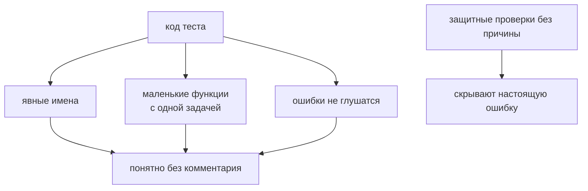

# JavaScript Best Practices

## Связь с предыдущей главой

Предыдущая глава показала, как современные возможности JavaScript работают вместе:

Но знание возможностей языка еще не гарантирует хорошую архитектуру. Один и тот же JavaScript можно написать понятно или превратить в набор случайных решений.

## Главный вопрос

> Что отличает поддерживаемый JavaScript от хаотичного JavaScript?

Короткий ответ: поддерживаемый JavaScript строится вокруг ясной ответственности, понятных имен, предсказуемого потока и небольших функций.

## Мотивация

В большом Playwright-проекте проблемы редко начинаются внезапно. Обычно они накапливаются:

Best practices нужны не для красоты. Они уменьшают стоимость изменений.

## Теория

Главные правила поддерживаемого JavaScript:

* small functions;
* clear naming;
* single responsibility;
* avoid duplication;
* predictable flow;
* consistent style;
* avoid premature optimization;
* defensive programming;
* readability over cleverness.

Это не независимые советы. Они работают как система:

Поддерживаемый код не требует от читателя угадывать намерение автора.

Они работают как система: маленькие функции проще называть, понятное имя снимает нужду в комментарии, одна ответственность делает поток предсказуемым, а предсказуемый поток не требует защитных проверок на каждом шаге.

### Как это выглядит в тестовом коде

| Правило | Признак нарушения в тестах |
| --- | --- |
| маленькие функции | helper, который авторизуется, создаёт данные и проверяет результат |
| понятные имена | `test1`, `doStuff`, `data2` |
| одна ответственность | Page Object, который сам решает, прошёл ли тест |
| без дублирования | одинаковая подготовка, скопированная в пять файлов |
| предсказуемый поток | функция, поведение которой зависит от порядка вызовов |
| читаемость важнее ловкости | цепочка из семи методов вместо двух шагов с именами |

Каждая строка встречалась в части про Automation QA — и это не совпадение: принципы поддерживаемого кода не меняются от того, тестовый он или продуктовый.

### Где заканчивается «защитное программирование»

Защитные проверки уместны на границе — там, где данные приходят извне: ответ API, переменная окружения, пользовательский ввод. Внутри собственного кода они превращаются в шум: проверка аргумента, который вы сами и передали, не добавляет надёжности, а прячет ошибку.

Правило простое: проверять на входе в модуль, а не в каждой функции внутри него.

### Про преждевременную оптимизацию

Отказ от неё — не отказ от здравого смысла. Различие практическое: ускорять то, что измерено медленным, — инженерия; усложнять код ради предполагаемого выигрыша — потеря.

В тестовом коде цена ошибки здесь выше обычного: непрозрачная оптимизация в общем helper затрагивает весь набор, а выигрыш обычно теряется на фоне ожиданий сети и браузера.

Поддерживаемый код не требует от читателя угадывать намерение автора.

Правила служат читаемости, а не сами себе:



## Главная ментальная модель

Best practices — это правила, которые помогают команде безопасно менять код через месяцы после написания.

## Практические примеры

Примеры находятся в:

```text
examples/01-javascript/chapter-92/
```

Запуск:

```bash
node examples/01-javascript/chapter-92/01-clear-naming.js
node examples/01-javascript/chapter-92/02-small-functions.js
node examples/01-javascript/chapter-92/03-avoid-duplication.js
node examples/01-javascript/chapter-92/04-defensive-helper.js
```

## Automation QA

Плохой тест часто смешивает всё: подготовку данных, авторизацию, действие и проверку в одном длинном теле без имён.

Поддерживаемый подход разделяет ответственность:

Пример:

```javascript
function isSuccessfulStatus(status) {
  return status === 'passed' || status === 'skipped';
}

function createAssertionMessage(testTitle, status) {
  return `${testTitle}: ${status}`;
}
```

Функции маленькие, имена объясняют намерение, каждая функция делает одну вещь.

## Распространённые мифы

**Миф: это независимые советы.**
Они усиливают друг друга: маленькие функции легче называть, понятные имена снимают нужду в комментариях.

**Миф: защитные проверки нужны везде.**
Они уместны на границе с внешними данными. Внутри модуля они прячут ошибки.

**Миф: короткий код — хороший код.**
Ценится читаемость. Цепочка из семи методов короче, но требует мысленного выполнения.

**Миф: оптимизировать нужно заранее.**
Ускоряют измеренное. Предполагаемый выигрыш обычно не окупает усложнения.

**Миф: к тестовому коду требования мягче.**
Он живёт столько же и читается чаще. Правила те же.

## Частые вопросы

**Какой размер функции считать большим?**
Тот, при котором её трудно назвать одним глаголом без союза «и».

**Где ставить проверки входных данных?**
На границе модуля: там, где данные приходят извне.

**Всегда ли дублирование — зло?**
Нет. Случайное совпадение двух мест не требует общей функции — важна общая причина изменения.

**Как понять, что имя плохое?**
Если рядом нужен комментарий, объясняющий, что оно значит.

**С чего начать наведение порядка?**
С имён: они дешевле всего и дают наибольший эффект при чтении.

## Проверьте себя

1. Почему перечисленные правила называют системой, а не списком?
2. Где уместны защитные проверки и где они вредны?
3. Чем оправданная оптимизация отличается от преждевременной?
4. По какому признаку видно, что функция делает слишком много?
5. Почему требования к тестовому коду не мягче, чем к продуктовому?

## Распространённые ошибки

### Ошибка 1. Писать clever code вместо readable code

Короткий код не всегда понятный. Поддерживаемость важнее впечатления.

### Ошибка 2. Смешивать ответственность

Если helper одновременно создает данные, вызывает API и проверяет UI, его трудно тестировать и менять.

### Ошибка 3. Копировать код вместо выделения общего смысла

Дублирование делает изменения дорогими: исправление нужно повторять во многих местах.

### Ошибка 4. Делать defensive programming как набор случайных проверок

Защитная проверка должна объяснять, какой некорректный вход она предотвращает.

## Практика

Практика находится в:

```text
practice/01-javascript/92-javascript-best-practices.md
```

Решения находятся в:

```text
solutions/01-javascript/92-javascript-best-practices.md
```

## Краткие итоги

Поддерживаемый JavaScript — это не просто код без ошибок.

Главное:

* функции должны быть маленькими;
* имена должны объяснять намерение;
* одна функция должна иметь одну ответственность;
* duplication нужно убирать осмысленно;
* поток выполнения должен быть предсказуемым;
* style должен быть единым;
* premature optimization опасна без measurement;
* defensive programming должен защищать реальные границы;
* readability важнее cleverness.

## Переход

JavaScript позволяет писать большие проекты. Но в больших проектах остается системная проблема:

Следующая глава объясняет, почему из этой проблемы естественно появился TypeScript.
