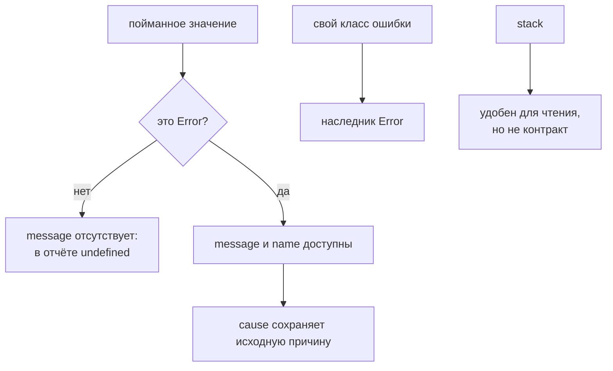

# Error Objects

## Связь с предыдущей главой

Предыдущая глава показала, что поддерживаемый JavaScript строится вокруг ясных границ, маленьких функций и предсказуемого потока.

Но даже в аккуратном коде ошибки неизбежны:

Теперь важно понять, как JavaScript представляет ошибку как значение.

## Главный вопрос

> Почему нужно выбрасывать Error objects, а не произвольные значения?

Короткий ответ: `Error` хранит не только сообщение, но и тип ошибки, имя и информацию для отладки.

## Мотивация

В JavaScript можно написать так:

```javascript
throw 'invalid config';
```

Код сработает, но обработчик получит обычную строку. У строки нет `name`, нет стандартного `message`, нет нормального `stack`.

В большом Automation QA проекте этого мало. Ошибка должна отвечать на вопросы:

Именно для этого используются Error objects.

## Теория

`Error` — стандартный объект JavaScript для представления ошибки.

Обычно ошибка создается так:

```javascript
throw new Error('Config file is missing');
```

У такого объекта есть важные свойства:

* `message` — текст ошибки;
* `name` — имя типа ошибки;
* `stack` — информация о пути вызовов для отладки.

В JavaScript есть встроенные типы ошибок:

* `Error` — общий тип ошибки;
* `TypeError` — операция выполнена с неподходящим типом;
* `ReferenceError` — обращение к несуществующей переменной;
* `RangeError` — значение вне допустимого диапазона;
* `SyntaxError` — ошибка синтаксиса.

`stack` полезен для отладки, но его не стоит разбирать программно. Формат stack trace зависит от среды выполнения и не является надежным контрактом приложения.

### Выбросить можно что угодно — и это проблема

`throw` не требует объекта `Error`. Выбросить можно строку, число, объект — и тогда пойманное значение не будет иметь ни `message`, ни `stack`:

```javascript
try { throw 'строка'; }
catch (error) { error instanceof Error; }   // false
```

Отсюда правило для обработчиков: пойманное значение проверяют перед использованием. Обращение к `error.message` без проверки даёт `undefined` в журнале — ровно там, где нужна причина.

```javascript
const message = error instanceof Error ? error.message : String(error);
```

### Своя ошибка — это класс-наследник

Когда нужно различать виды отказов, создают подкласс:

```javascript
class ConfigError extends Error {
  constructor(message, options) {
    super(message, options);
    this.name = 'ConfigError';
  }
}
```

Такой объект остаётся `instanceof Error`, но дополнительно проходит проверку `instanceof ConfigError` — это и позволяет обрабатывать разные ошибки по-разному, не сравнивая тексты сообщений.

Присваивание `name` нужно явно: без него в выводе будет `Error`, а не имя вашего класса.

### `cause` сохраняет исходную причину

Второй аргумент конструктора связывает ошибки в цепочку:

```javascript
throw new ConfigError('конфигурация не загружена', { cause: originalError });
```

Исходная ошибка доступна через `error.cause`, и по ней восстанавливается путь от симптома к причине. Это тот же механизм, что используется в диагностике из части про Automation QA, — и там же действует правило ограничивать глубину обхода цепочки.

### Ошибка не сериализуется в JSON

Практическая ловушка при логировании: `JSON.stringify` не видит стандартных полей ошибки.

```javascript
JSON.stringify(new Error('упало'));   // {}
```

Причина в том, что `message` и `stack` не перечисляемые. Чтобы записать ошибку в журнал, поля извлекают явно:

```javascript
Object.getOwnPropertyNames(error);   // ['stack', 'message', ...]
```

У подкласса с присвоенным `name` результат будет чуть лучше — `{"name":"ConfigError"}`, — но всё равно без сообщения и стека.

### Почему `stack` не контракт

`stack` полезен для отладки, но его не стоит разбирать программно. Формат stack trace зависит от среды выполнения и не является надёжным контрактом приложения.

Для машинной обработки используют то, что вы контролируете: тип ошибки, собственное поле кода, `cause`. Текст и стек остаются для человека.

Выброшено может быть что угодно — поэтому его проверяют:



## Внутренний механизм

Когда выполняется `throw`, JavaScript прекращает обычное выполнение текущего участка кода и начинает искать ближайший `catch`.

Если `catch` найден, ошибка попадает туда как объект. Если обработчика нет, выполнение завершается ошибкой.

## Главная ментальная модель

`Error object` делает ошибку частью модели данных программы.

## Практические примеры

Примеры находятся в:

```text
examples/01-javascript/chapter-93/
```

Запуск:

```bash
node examples/01-javascript/chapter-93/01-throw-error.js
node examples/01-javascript/chapter-93/02-error-types.js
node examples/01-javascript/chapter-93/03-custom-error.js
node examples/01-javascript/chapter-93/04-qa-assertion-helper.js
```

## Automation QA

Assertion helper должен выбрасывать понятную ошибку:

```javascript
function assertStatusCode(response, expectedStatus) {
  if (response.status !== expectedStatus) {
    throw new Error(`Expected ${expectedStatus}, received ${response.status}`);
  }
}
```

Такой helper лучше, чем `throw false` или `throw 'failed'`, потому что обработчик получает полноценный Error object.

В реальном framework это помогает:

* понять, какая проверка сломалась;
* увидеть сообщение ошибки в report;
* найти место ошибки по stack trace;
* отличить ошибку данных от ошибки helper-функции.

## Распространённые мифы

**Миф: в `catch` всегда приходит объект `Error`.**
Выбросить можно что угодно. Пойманное значение проверяют перед использованием.

**Миф: `JSON.stringify(error)` сохранит ошибку.**
Вернётся `{}`: стандартные поля не перечисляемые.

**Миф: имя своего класса ошибки подставится само.**
`name` присваивают явно, иначе в выводе будет `Error`.

**Миф: по тексту сообщения удобно различать ошибки.**
Текст меняется. Различают по типу или собственному полю кода.

**Миф: `stack` можно разбирать программно.**
Его формат зависит от среды и не является контрактом.

## Частые вопросы

**Как безопасно получить сообщение из пойманного значения?**
Проверить `instanceof Error`, иначе привести значение к строке.

**Как сохранить исходную причину при пробросе?**
Передать её в `cause` новой ошибки.

**Как записать ошибку в журнал?**
Извлечь поля явно — например, через `Object.getOwnPropertyNames`.

**Зачем создавать свой класс ошибки?**
Чтобы различать виды отказов по типу, а не по тексту.

**Какие встроенные типы стоит знать?**
`TypeError`, `ReferenceError`, `RangeError`, `SyntaxError` — они подсказывают характер дефекта.

## Проверьте себя

1. Что может оказаться в переменной `catch` кроме `Error`?
2. Почему `JSON.stringify` теряет ошибку и как это обойти?
3. Что нужно сделать в своём классе ошибки помимо наследования?
4. Для чего нужен `cause`?
5. Почему `stack` нельзя считать контрактом?

## Распространённые ошибки

### Ошибка 1. Выбрасывать строки

Строка не содержит стандартной структуры ошибки.

### Ошибка 2. Игнорировать тип ошибки

`TypeError`, `RangeError` и custom Error classes помогают точнее описывать проблему.

### Ошибка 3. Парсить stack trace

Stack trace нужен человеку для отладки. Его формат не должен становиться частью логики приложения.

### Ошибка 4. Скрывать исходную ошибку

Если `catch` заменяет ошибку новым сообщением без контекста, отладка становится сложнее.

## Практика

Практика находится в:

```text
practice/01-javascript/93-error-objects.md
```

Решения находятся в:

```text
solutions/01-javascript/93-error-objects.md
```

## Краткие итоги

Главное:

* `Error` представляет ошибку как объект;
* `throw new Error()` лучше, чем `throw` строки или числа;
* `message` хранит описание проблемы;
* `name` помогает понять тип ошибки;
* `stack` помогает при отладке, но не является программным контрактом;
* custom Error classes полезны для доменных ошибок framework.

## Переход

Ошибки показывают, как JavaScript передает информацию о проблемах внутри программы.

Следующий вопрос связан с передачей обычных данных между системами:

> Почему JavaScript object нельзя просто отправить по сети?
