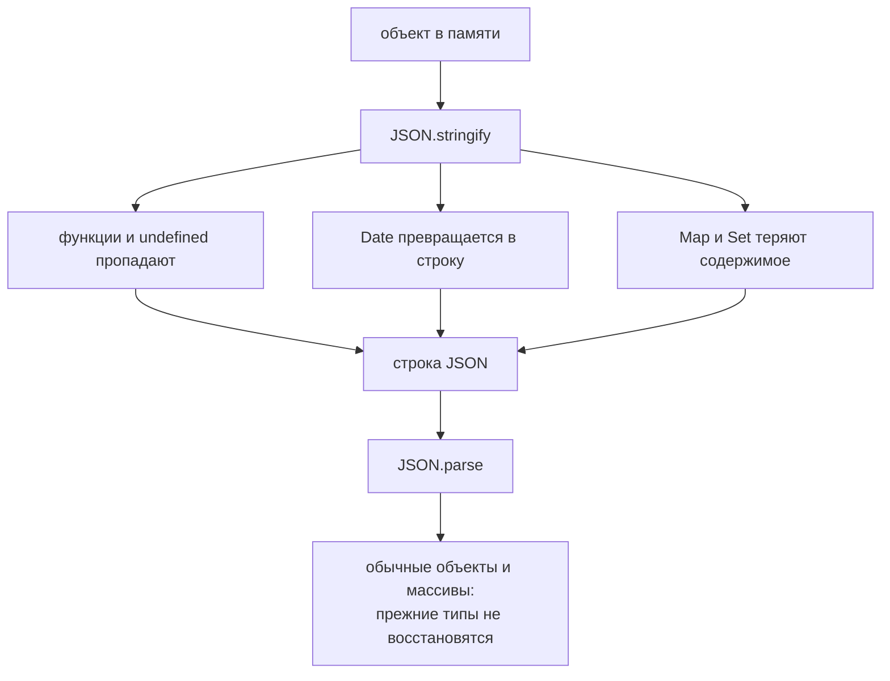

# JSON

## Связь с предыдущей главой

Предыдущая глава показала, что ошибки удобно передавать как структурированные объекты.

Теперь посмотрим на другую задачу: как передавать обычные данные между программами.

JavaScript object существует в памяти программы. Сеть передает текст или байты. Между ними нужен общий формат.

## Главный вопрос

> Почему JavaScript objects нельзя отправлять по сети напрямую?

Короткий ответ: объект в памяти нужно превратить в текстовый формат, который понимает другая система.

## Мотивация

В API testing мы часто работаем с объектом:

```javascript
const payload = {
  email: 'qa@example.com',
  role: 'admin',
};
```

Но HTTP-запрос не отправляет JavaScript object как структуру из памяти. Для передачи нужен текст:

```json
{"email":"qa@example.com","role":"admin"}
```

JSON решает эту задачу.

## Теория

JSON — текстовый формат обмена данными.

Он похож на JavaScript object literal, но это не одно и то же:

Главные операции:

* `JSON.stringify()` превращает JavaScript value в JSON text;
* `JSON.parse()` превращает JSON text обратно в JavaScript value.

JSON поддерживает:

* objects;
* arrays;
* strings;
* numbers;
* booleans;
* `null`.

JSON не хранит:

* functions;
* `undefined`;
* `Symbol`;
* circular references.

### Что теряется при сериализации

Разница между объектом JavaScript и JSON проявляется не в синтаксисе, а в том, что исчезает при преобразовании:

| Значение | Результат `JSON.stringify` |
| --- | --- |
| `undefined` в свойстве | свойство пропадает |
| функция в свойстве | свойство пропадает |
| `undefined` или функция в массиве | становится `null` |
| `NaN`, `Infinity` | становится `null` |
| `Date` | строка ISO |
| `Map`, `Set` | `{}` |
| `BigInt` | **TypeError** |
| циклическая ссылка | **TypeError** |

Первые четыре строки опаснее остальных: потеря происходит молча. Объект `{ a: undefined, c: 1 }` превращается в `{"c":1}`, а массив `[undefined, 1]` — в `[null,1]`.

Последние две — шумные: они бросают исключение, и о проблеме вы узнаете сразу.

### Преобразование необратимо

Круговой путь «объект → JSON → объект» не восстанавливает исходные значения:

```javascript
const back = JSON.parse(JSON.stringify({ d: new Date() }));
typeof back.d;   // 'string', а не объект Date
```

Дата стала строкой и осталась строкой. То же с `Map`, `Set`, классами и любыми объектами со своим поведением: JSON хранит данные, а не типы.

Практическое следствие для тестов: сравнивать объект с результатом разбора JSON нужно после явной нормализации — та же мысль, что в главе про межслойное сравнение.

### Управление сериализацией

Два механизма позволяют вмешаться в процесс:

**`toJSON()`** — метод объекта, который вызывается автоматически и решает, чем объект представить:

```javascript
JSON.stringify({ toJSON: () => 'своё' });   // '"своё"'
```

Именно так работает `Date`: у него есть собственный `toJSON`, возвращающий строку ISO.

**Второй аргумент `JSON.parse`** — функция-ревайвер, которая может преобразовать значения при разборе:

```javascript
JSON.parse('{"n":"5"}', (key, value) => key === 'n' ? Number(value) : value);
// { n: 5 }
```

Это штатный способ восстановить типы, потерянные при сериализации.

### Форматирование и ошибки разбора

Третий аргумент `JSON.stringify` задаёт отступы — удобно для вложений в отчёт:

```javascript
JSON.stringify(data, null, 2);
```

`JSON.parse` на некорректном тексте выбрасывает `SyntaxError` с указанием позиции:

```text
SyntaxError: Expected property name or '}' in JSON at position 1
```

Это сообщение стоит узнавать: чаще всего оно означает, что вместо JSON пришёл HTML страницы ошибки или пустой ответ — ровно тот случай, что разбирался в главе про проверку ответов API.

Сериализация теряет часть значений безвозвратно:



## Внутренний механизм

Сериализация превращает значение JavaScript в текст:

Десериализация делает обратное:

Полный путь в API выглядит так:

## Главная ментальная модель

JSON — это мост между JavaScript value и внешней системой.

## Практические примеры

Примеры находятся в:

```text
examples/01-javascript/chapter-94/
```

Запуск:

```bash
node examples/01-javascript/chapter-94/01-stringify-request.js
node examples/01-javascript/chapter-94/02-parse-response.js
node examples/01-javascript/chapter-94/03-unsupported-values.js
node examples/01-javascript/chapter-94/04-circular-reference.js
node examples/01-javascript/chapter-94/05-qa-fixture.js
```

## Automation QA

В API tests JSON встречается постоянно:

```javascript
const requestBody = {
  email: 'qa@example.com',
  password: 'secret',
};

const jsonBody = JSON.stringify(requestBody);
```

Ответ API обычно приходит как JSON text и превращается обратно в объект:

```javascript
const responseText = '{"status":"passed","duration":1200}';
const responseBody = JSON.parse(responseText);
```

Это важно для:

* request body;
* API response;
* fixtures;
* сохраненных test data;
* report entries.

## Распространённые мифы

**Миф: JSON и объектный литерал — одно и то же.**
JSON — текстовый формат. Он не хранит функции, `undefined`, `Map`, `Set` и типы объектов.

**Миф: потери при сериализации заметны.**
`undefined` и функции исчезают молча, `NaN` превращается в `null`. Шумно падают только `BigInt` и циклы.

**Миф: `JSON.parse(JSON.stringify(x))` — полноценная глубокая копия.**
Даты станут строками, `Map` и `Set` — пустыми объектами, методы исчезнут.

**Миф: дата восстановится сама при разборе.**
Она останется строкой. Восстанавливают её ревайвером.

**Миф: ошибка разбора означает сломанный код.**
Чаще всего пришёл не JSON: страница ошибки, ответ прокси или пустое тело.

## Частые вопросы

**Почему поле пропало после сериализации?**
Скорее всего, его значение было `undefined` или функцией.

**Как сохранить объект со своим представлением?**
Добавить ему метод `toJSON()`.

**Как восстановить типы при разборе?**
Передать функцию-ревайвер вторым аргументом `JSON.parse`.

**Как получить читаемый JSON для отчёта?**
Третьим аргументом `JSON.stringify` задать отступ.

**Что делать при `SyntaxError` разбора?**
Посмотреть на сам текст ответа: обычно это HTML или пустая строка.

## Проверьте себя

1. Какие значения исчезают молча, а какие вызывают исключение?
2. Во что превращаются `undefined` и функции внутри массива?
3. Почему круговое преобразование не возвращает `Date`?
4. Как объект может управлять своим представлением в JSON?
5. О чём обычно говорит `SyntaxError` при разборе ответа API?

## Распространённые ошибки

### Ошибка 1. Путать object и JSON text

Object — это значение в JavaScript. JSON text — это строка.

### Ошибка 2. Ожидать, что functions попадут в JSON

Functions не являются данными JSON.

### Ошибка 3. Не обрабатывать неверный JSON

`JSON.parse()` выбрасывает ошибку, если текст не является корректным JSON.

### Ошибка 4. Пытаться сериализовать circular references

Если объект ссылается сам на себя, `JSON.stringify()` не сможет создать обычный JSON text.

## Практика

Практика находится в:

```text
practice/01-javascript/94-json.md
```

Решения находятся в:

```text
solutions/01-javascript/94-json.md
```

## Краткие итоги

Главное:

* JSON — текстовый формат обмена данными;
* JavaScript object и JSON text — разные вещи;
* `JSON.stringify()` выполняет сериализацию;
* `JSON.parse()` выполняет десериализацию;
* JSON не хранит functions и `undefined`;
* API testing постоянно использует JSON для request и response.

## Переход

Теперь мы умеем передавать данные между системами.

Следующая частая задача в тестах — время:

> Как JavaScript представляет дату, момент времени и длительность?
