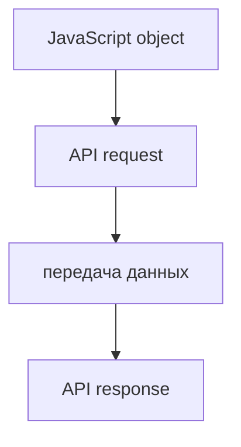
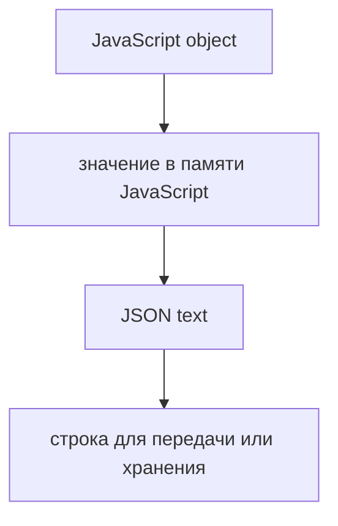
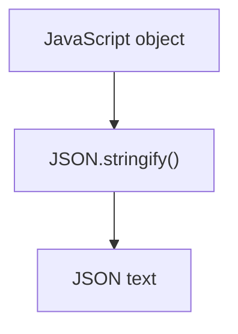
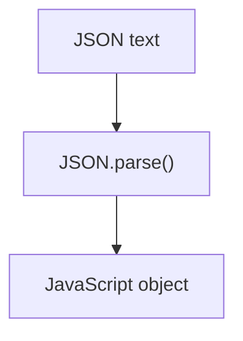
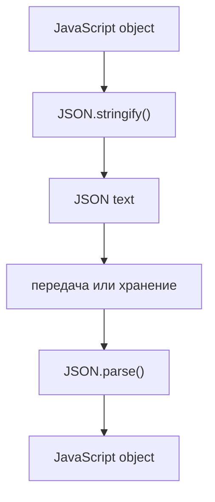
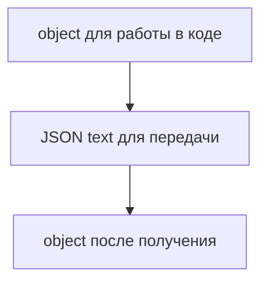

# JSON

## Связь с предыдущей главой

Предыдущая глава показала, что ошибки удобно передавать как структурированные объекты.

Теперь посмотрим на другую задачу: как передавать обычные данные между программами.



JavaScript object существует в памяти программы. Сеть передает текст или байты. Между ними нужен общий формат.

## Главный вопрос

> Почему JavaScript objects нельзя отправлять по сети напрямую?

Короткий ответ: объект в памяти нужно превратить в текстовый формат, который понимает другая система.

## Мотивация

В API testing мы часто работаем с объектом:

```javascript
const payload = {
  email: 'qa@example.com',
  role: 'admin',
};
```

Но HTTP-запрос не отправляет JavaScript object как структуру из памяти. Для передачи нужен текст:

```json
{"email":"qa@example.com","role":"admin"}
```

JSON решает эту задачу.

## Теория

JSON — текстовый формат обмена данными.

Он похож на JavaScript object literal, но это не одно и то же:



Главные операции:

* `JSON.stringify()` превращает JavaScript value в JSON text;
* `JSON.parse()` превращает JSON text обратно в JavaScript value.

JSON поддерживает:

* objects;
* arrays;
* strings;
* numbers;
* booleans;
* `null`.

JSON не хранит:

* functions;
* `undefined`;
* `Symbol`;
* circular references.

## Внутренний механизм

Сериализация превращает значение JavaScript в текст:



Десериализация делает обратное:



Полный путь в API выглядит так:



## Главная ментальная модель



JSON — это мост между JavaScript value и внешней системой.

## Практические примеры

Примеры находятся в:

```text
examples/01-javascript/chapter-94/
```

Запуск:

```bash
node examples/01-javascript/chapter-94/01-stringify-request.js
node examples/01-javascript/chapter-94/02-parse-response.js
node examples/01-javascript/chapter-94/03-unsupported-values.js
node examples/01-javascript/chapter-94/04-circular-reference.js
node examples/01-javascript/chapter-94/05-qa-fixture.js
```

## Automation QA

В API tests JSON встречается постоянно:

```javascript
const requestBody = {
  email: 'qa@example.com',
  password: 'secret',
};

const jsonBody = JSON.stringify(requestBody);
```

Ответ API обычно приходит как JSON text и превращается обратно в объект:

```javascript
const responseText = '{"status":"passed","duration":1200}';
const responseBody = JSON.parse(responseText);
```

Это важно для:

* request body;
* API response;
* fixtures;
* сохраненных test data;
* report entries.

## Распространённые ошибки

### Ошибка 1. Путать object и JSON text

Object — это значение в JavaScript. JSON text — это строка.

### Ошибка 2. Ожидать, что functions попадут в JSON

Functions не являются данными JSON.

### Ошибка 3. Не обрабатывать неверный JSON

`JSON.parse()` выбрасывает ошибку, если текст не является корректным JSON.

### Ошибка 4. Пытаться сериализовать circular references

Если объект ссылается сам на себя, `JSON.stringify()` не сможет создать обычный JSON text.

## Практика

Практика находится в:

```text
practice/01-javascript/94-json.md
```

Решения находятся в:

```text
solutions/01-javascript/94-json.md
```

## Краткие итоги

Главное:

* JSON — текстовый формат обмена данными;
* JavaScript object и JSON text — разные вещи;
* `JSON.stringify()` выполняет сериализацию;
* `JSON.parse()` выполняет десериализацию;
* JSON не хранит functions и `undefined`;
* API testing постоянно использует JSON для request и response.

## Переход

Теперь мы умеем передавать данные между системами.

Следующая частая задача в тестах — время:

> Как JavaScript представляет дату, момент времени и длительность?
