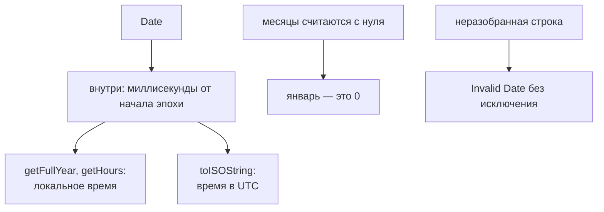

# Дата и время

## Связь с предыдущей главой

Предыдущая глава показала, как JavaScript превращает данные в JSON text и обратно.

Во многих данных есть время:

Чтобы сравнивать такие значения, нужно понимать, как JavaScript представляет время.

## Главный вопрос

> Как JavaScript представляет время?

Короткий ответ: `Date` хранит момент времени, а метка времени позволяет сравнивать и измерять интервалы.

## Мотивация

В Automation QA часто нужно проверить:

* токен еще не истек;
* заказ создан после запуска теста;
* report содержит время генерации;
* тест выполнился быстрее допустимого лимита.

Все эти задачи требуют одного базового умения: работать с моментами времени как со значениями.

## Теория

`Date` — встроенный объект JavaScript для работы с датой и временем.

Создание текущего момента:

```javascript
const now = new Date();
```

Создание из строки:

```javascript
const createdAt = new Date('2026-06-28T10:00:00.000Z');
```

Метка времени — это числовое представление момента времени.

```javascript
const timestamp = createdAt.getTime();
```

`Date.now()` сразу возвращает текущую метку времени:

```javascript
const startedAt = Date.now();
```

`toISOString()` превращает дату в удобную строку для API, логов и отчетов:

```javascript
const value = new Date().toISOString();
```

### Месяцы считаются с нуля

Самая известная особенность `Date`, и она действительно работает так:

```javascript
new Date(Date.UTC(2026, 8, 22));   // 22 сентября 2026
d.getMonth();                       // 8 для сентября
```

Нумерация с нуля действует для месяцев — но **не** для дней месяца: `getDate()` возвращает обычное число от 1 до 31. Это несоответствие и порождает ошибки на единицу.

Ещё одна деталь того же рода: значения переполняются вместо ошибки. `Date.UTC(2026, 12, 1)` даёт январь **2027 года**, а не исключение.

### Локальное время против UTC

У большинства методов есть две версии, и путать их дорого:

| Локальное время | UTC |
| --- | --- |
| `getMonth()`, `getDate()`, `getHours()` | `getUTCMonth()`, `getUTCDate()`, `getUTCHours()` |
| `toString()` | `toISOString()` |

Локальные методы зависят от часового пояса машины — то есть один и тот же код даёт разный результат на ноутбуке разработчика и на агенте CI.

Для тестов правило простое: хранить и сравнивать в UTC через `toISOString()`, а локальное представление использовать только там, где проверяется отображение для пользователя.

### Сравнение дат

Объекты `Date` нельзя сравнивать через `===`: это разные объекты, даже если момент один.

```javascript
new Date(0) === new Date(0);                     // false
new Date(0).getTime() === new Date(0).getTime(); // true
```

Зато вычитание работает: результат — разница в миллисекундах. `new Date('2026-09-23') - new Date('2026-09-22')` даёт `86400000`, то есть сутки.

Операторы `<` и `>` тоже работают корректно, потому что приводят объект к числу.

### Невалидная дата не бросает исключение

```javascript
const bad = new Date('не дата');
String(bad);                    // 'Invalid Date'
Number.isNaN(bad.getTime());    // true
```

Объект создаётся, ошибки нет, а любые операции с ним дают `NaN`. Поэтому дату, пришедшую извне, проверяют явно — через `Number.isNaN(value.getTime())`. Это прямая параллель с проверкой внешних данных из глав про нормализацию.

### `Date` изменяемый

Методы вида `setUTCDate()` меняют **сам объект**, а не возвращают новый:

```javascript
const d = new Date('2026-09-22T00:00:00Z');
d.setUTCDate(1);
d.toISOString();   // '2026-09-01T00:00:00.000Z'
```

Это то же свойство, что у `sort()` и `splice()` из главы 59: общий объект, изменённый в одном месте, виден везде. Если исходная дата нужна, работают с копией: `new Date(original)`.

`Date` хранит момент времени, а показывает его по-разному:



## Внутренний механизм

Практическая модель: внутри программы дата — это число миллисекунд, а строковые представления нужны только на границах — при выводе и при обмене данными.

Для сравнения дат удобно сравнивать метки времени:

```javascript
const createdAt = new Date('2026-06-28T10:00:00.000Z');
const finishedAt = new Date('2026-06-28T10:00:05.000Z');

console.log(finishedAt.getTime() > createdAt.getTime());
```

Для длительности нужно вычесть одну метку времени из другой:

```javascript
const duration = finishedAt.getTime() - createdAt.getTime();
```

Если дата не может быть разобрана, получится некорректная дата. Такой объект существует, но его метка времени равна `NaN`.

### Внутри — число, снаружи — строка

```text
'2026-09-28T10:00:00.000Z'  ──new Date()──→  объект Date
объект Date  ──getTime()──→  1790000000000 (мс от начала эпохи)
объект Date  ──toISOString()──→  '2026-09-28T10:00:00.000Z'
```

Все сравнения и вычисления выполняются на числе, а строки нужны только на
границах — в запросе, в ответе, в отчёте. Поэтому `date1 === date2` всегда ложно
(это разные объекты), а `date1.getTime() === date2.getTime()` работает.

### Разбор строки: где легко ошибиться

| Строка | Как понимается |
| --- | --- |
| `'2026-09-28'` | полночь **UTC** |
| `'2026-09-28T00:00:00'` | полночь в зоне машины |
| `'2026-09-28T00:00:00Z'` | полночь UTC, явно |
| `'28.09.2026'` | не гарантировано: зависит от среды |
| `'не дата'` | `Invalid Date`, `getTime()` даёт `NaN` |

Первые две строки — причина падений, которые случаются только в CI: там зона
обычно `UTC`, а у разработчика своя.

Нижняя строка опаснее: разбор не бросает исключения. Объект создаётся, и
некорректность обнаруживается только проверкой `Number.isNaN(date.getTime())`.

## Главная ментальная модель

`Date` нужен не только для красивого отображения. Он помогает сравнивать моменты и считать интервалы.

## Практические примеры

Примеры находятся в:

```text
examples/01-javascript/chapter-95/
```

Запуск:

```bash
node examples/01-javascript/chapter-95/01-create-date.js
node examples/01-javascript/chapter-95/02-timestamp.js
node examples/01-javascript/chapter-95/03-compare-dates.js
node examples/01-javascript/chapter-95/04-duration.js
node examples/01-javascript/chapter-95/05-invalid-date.js
node examples/01-javascript/chapter-95/06-qa-token-expiration.js
```

## Automation QA

Проверка срока действия токена:

```javascript
function isTokenExpired(expiresAtIso) {
  const expiresAt = new Date(expiresAtIso).getTime();
  return Date.now() >= expiresAt;
}
```

Измерение длительности тестового шага:

```javascript
const startedAt = Date.now();

// выполнить действие

const finishedAt = Date.now();
const durationMs = finishedAt - startedAt;
```

Такая модель полезна для проверок API, отчётов, логов и анализа медленных тестов.

### Время сравнивают с допуском

```javascript
const before = Date.now();
const item = await createWorkItem(payload);
const createdAt = new Date(item.createdAt).getTime();

// Часы сервиса и часы теста не совпадают до миллисекунды.
expect(createdAt).toBeGreaterThanOrEqual(before - 5000);
expect(createdAt).toBeLessThanOrEqual(Date.now() + 5000);
```

Точное равенство меток времени не проверяют никогда: расхождение часов между
машиной теста и стендом — норма, а не дефект. Проверяют попадание в окно.

Для отметок в базе данных добавляется вторая разница: драйвер отдаёт `Date`,
а REST — строку ISO. Сравнивать их нужно после приведения к одному виду —
обычно к числу миллисекунд.

### Строка даты без времени разбирается как UTC

```javascript
new Date('2026-09-28');            // полночь UTC
new Date('2026-09-28T00:00:00');   // полночь в зоне машины
```

Это правило языка, а не особенность среды: дата без времени считается UTC, а
дата со временем и без смещения — локальной.

В тестах разница проявляется как падение только в CI, где зона обычно `UTC`, а
у разработчика — своя. Лекарство одно: хранить и сравнивать время в UTC, а
строки писать со смещением (`2026-09-28T00:00:00Z`).

## Распространённые мифы

**Миф: нумерация с нуля действует везде.**
Только для месяцев. Дни месяца считаются с единицы.

**Миф: неверные значения вызовут ошибку.**
Они переполняются: тринадцатый месяц становится январём следующего года.

**Миф: даты можно сравнивать через `===`.**
Это разные объекты. Сравнивают `getTime()` или используют `<` и `>`.

**Миф: невалидная строка даты вызовет исключение.**
Объект создастся, а все операции дадут `NaN`. Проверять нужно явно.

**Миф: `setDate()` возвращает новую дату.**
Он изменяет исходный объект. Для сохранности работают с копией.

## Частые вопросы

**Почему тест проходит локально и падает в CI?**
Вероятно, используются локальные методы, зависящие от часового пояса.

**Как сравнить две даты?**
Через `getTime()` или операторы сравнения; вычитание даёт разницу в миллисекундах.

**Как проверить, что дата корректна?**
`Number.isNaN(date.getTime())`.

**Как получить копию даты?**
`new Date(original)`.

**Что использовать для хранения и сравнения?**
UTC и `toISOString()`; локальное представление — только для отображения.

## Проверьте себя

1. С какого числа считаются месяцы и с какого — дни?
2. Что произойдёт при указании месяца `12`?
3. Почему `new Date(0) === new Date(0)` возвращает `false`?
4. Как определить невалидную дату?
5. Почему локальные методы опасны в тестах?

### Ответы

1. Месяцы — с нуля: январь равен `0`, декабрь равен `11`. Дни месяца — с единицы.
2. Дата перейдёт на январь следующего года: значения вне диапазона не вызывают ошибку, а переносятся.
3. Сравниваются ссылки: это два разных объекта. Сравнивать нужно числовые значения, например через `getTime()`.
4. Проверить `Number.isNaN(date.getTime())`. Сам объект при этом существует и ошибки не вызывает.
5. Их результат зависит от часового пояса машины. Тест проходит локально и падает в CI, где пояс другой.

## Распространённые ошибки

### Ошибка 1. Сравнивать строки вместо времени

Для надёжного сравнения лучше использовать метку времени.

### Ошибка 2. Не проверять некорректную дату

`new Date('wrong')` создаёт объект даты, но его значение не является корректной датой.

### Ошибка 3. Путать дату и длительность

Дата — это момент времени. Длительность — разница между двумя моментами.

### Ошибка 4. Делать сложную работу с часовыми поясами без необходимости

В этой главе достаточно понимать метку времени, `Date`, `getTime()`, `Date.now()` и `toISOString()`.

## Практика

Практика находится в:

```text
practice/01-javascript/95-date.md
```

Решения находятся в:

```text
solutions/01-javascript/95-date.md
```

## Краткие итоги

Главное:

* `Date` представляет момент времени;
* `new Date()` создаёт объект даты;
* метка времени удобна для сравнения и расчёта интервалов;
* `getTime()` возвращает метку времени конкретной даты;
* `Date.now()` возвращает текущую метку времени;
* `toISOString()` полезен для API, журналов и отчётов;
* некорректную дату нужно проверять явно.

## Переход

Мы завершили основные темы JavaScript: данные, ошибки, время, модули, асинхронность, память и инженерную практику.

Остается финальный вопрос:

> Если JavaScript настолько способен, почему появился TypeScript?
