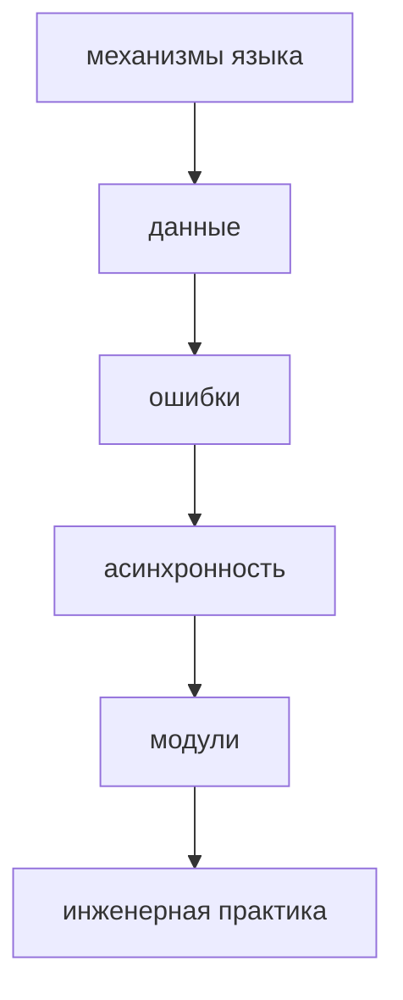
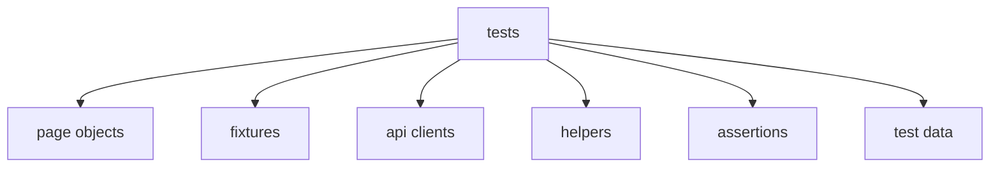
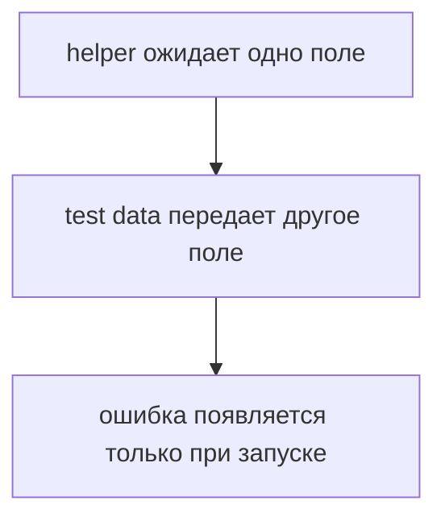
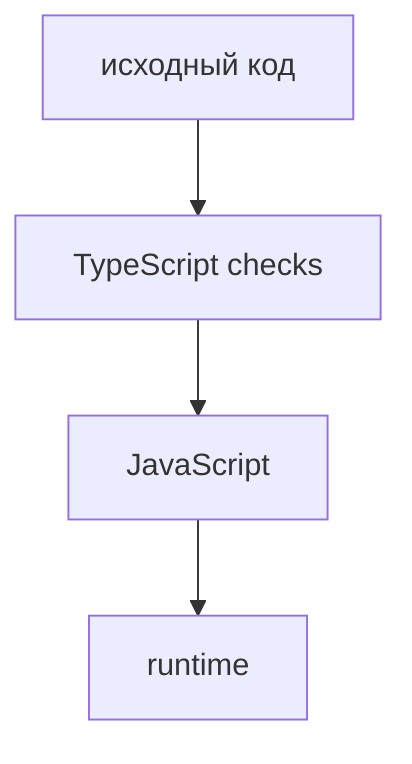
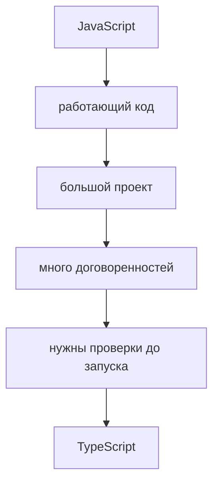
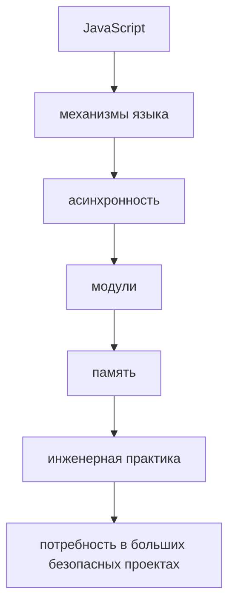

# Почему появился TypeScript

## Связь с предыдущей главой

Предыдущая глава завершила последние прикладные темы JavaScript: как представлять время, сравнивать даты и считать интервалы.

Теперь JavaScript-раздел можно собрать в одну картину:



Но даже хороший JavaScript остается динамическим языком. Многие ошибки обнаруживаются только во время выполнения.

## Главный вопрос

> Если JavaScript настолько способен, зачем появился TypeScript?

Короткий ответ: TypeScript появился, чтобы большие JavaScript-проекты было легче поддерживать, менять и проверять до запуска.

## Мотивация

Представим большой Automation QA framework:



В JavaScript все эти части договариваются между собой через имена, форму объектов и ожидания команды.

Проблема:



Чем больше проект, тем дороже такие ошибки.

## Теория

JavaScript силен:

* он гибкий;
* он работает в разных средах;
* у него богатая экосистема;
* он подходит для UI, API helpers, test runners и tooling;
* все знания предыдущих глав остаются важными.

Но у JavaScript есть ограничения в больших проектах:

* dynamic typing;
* позднее обнаружение ошибок;
* сложный refactoring;
* слабые гарантии между модулями;
* часть ошибок видна только после запуска;
* tooling не всегда понимает намерение автора.

TypeScript появился не потому, что JavaScript "плохой".

TypeScript появился потому, что большие JavaScript-проекты нуждаются в дополнительных проверках.

## Внутренний механизм

На уровне идеи TypeScript добавляет слой проверки перед выполнением JavaScript:



В этой главе мы не изучаем синтаксис TypeScript. Важно только понять направление: часть ошибок можно находить раньше, до запуска тестов.

## Главная ментальная модель



TypeScript не заменяет JavaScript.

Он строится поверх JavaScript.

## Практические примеры

Примеры находятся в:

```text
examples/01-javascript/chapter-96/
```

Запуск:

```bash
node examples/01-javascript/chapter-96/01-dynamic-data-shape.js
node examples/01-javascript/chapter-96/02-late-error.js
node examples/01-javascript/chapter-96/03-refactor-risk.js
node examples/01-javascript/chapter-96/04-qa-contract-problem.js
```

## Automation QA

В тестовом framework часто есть общие helper-функции:

```javascript
function createUserPayload(user) {
  return {
    name: user.name,
    role: user.role,
  };
}
```

Если test data изменится:

```javascript
const user = {
  fullName: 'Anna',
  role: 'admin',
};
```

JavaScript не остановит код заранее. Ошибка проявится позже: payload получит `name: undefined`.

В маленьком проекте это легко заметить. В большом framework ошибка может пройти через helper, request builder, API client и только потом стать failed test.

## Распространённые ошибки

### Ошибка 1. Думать, что TypeScript заменяет JavaScript

TypeScript строится поверх JavaScript. Runtime остается JavaScript.

### Ошибка 2. Думать, что TypeScript отменяет знание JavaScript

Без понимания JavaScript невозможно правильно понимать TypeScript.

### Ошибка 3. Думать, что TypeScript нужен только ради syntax

Главная причина — поддержка больших проектов, раннее обнаружение ошибок и лучший tooling.

### Ошибка 4. Ожидать, что TypeScript исправит плохую архитектуру

TypeScript помогает видеть ошибки, но не заменяет clear naming, small functions и single responsibility.

## Практика

Практика находится в:

```text
practice/01-javascript/96-why-typescript.md
```

Решения находятся в:

```text
solutions/01-javascript/96-why-typescript.md
```

## Краткие итоги

JavaScript остается фундаментом.

Главное:

* JavaScript способен строить большие проекты;
* dynamic typing делает язык гибким, но переносит часть ошибок на runtime;
* в больших проектах ошибки договоренностей становятся дорогими;
* refactoring в JavaScript требует высокой дисциплины;
* TypeScript появился как способ проверять больше проблем до запуска;
* TypeScript не заменяет JavaScript, а расширяет его проверками;
* все знания JavaScript остаются необходимыми.

## Переход

JavaScript-раздел завершен.

Теперь у нас есть фундамент:



Следующий раздел отвечает на этот запрос:

> Как TypeScript помогает писать большие JavaScript-проекты безопаснее?
