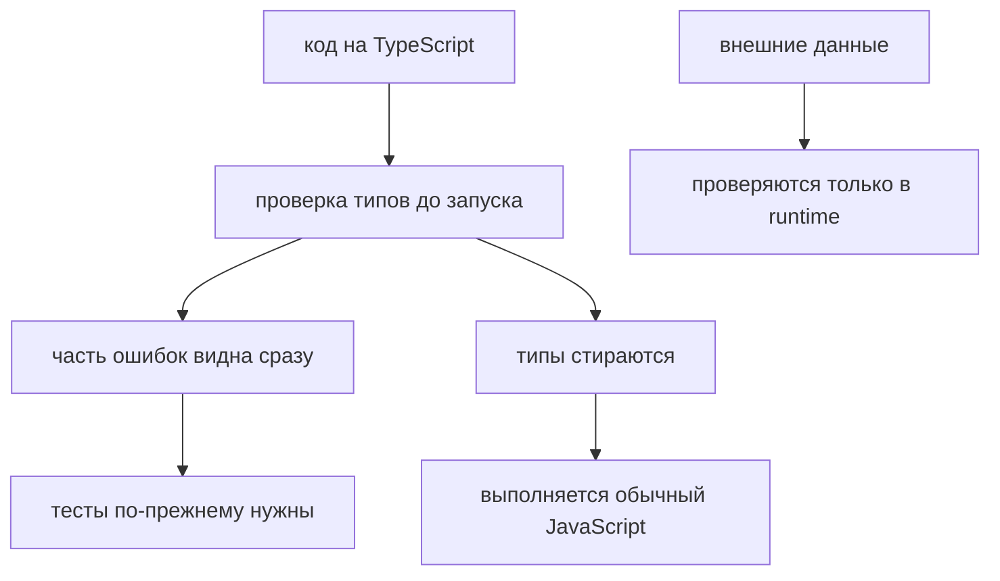

# Почему появился TypeScript

## Связь с предыдущей главой

Предыдущая глава завершила последние прикладные темы JavaScript: как представлять время, сравнивать даты и считать интервалы.

Теперь JavaScript-раздел можно собрать в одну картину:

Но даже хороший JavaScript остается динамическим языком. Многие ошибки обнаруживаются только во время выполнения.

## Главный вопрос

> Если JavaScript настолько способен, зачем появился TypeScript?

Короткий ответ: TypeScript появился, чтобы большие JavaScript-проекты было легче поддерживать, менять и проверять до запуска.

## Мотивация

Представим большой Automation QA framework:

В JavaScript все эти части договариваются между собой через имена, форму объектов и ожидания команды.

Проблема:

Чем больше проект, тем дороже такие ошибки.

## Теория

JavaScript силен:

* он гибкий;
* он работает в разных средах;
* у него богатая экосистема;
* он подходит для UI, API helpers, test runners и tooling;
* все знания предыдущих глав остаются важными.

Но у JavaScript есть ограничения в больших проектах:

* dynamic typing;
* позднее обнаружение ошибок;
* сложный refactoring;
* слабые гарантии между модулями;
* часть ошибок видна только после запуска;
* tooling не всегда понимает намерение автора.

TypeScript появился не потому, что JavaScript "плохой".

TypeScript появился потому, что большие JavaScript-проекты нуждаются в дополнительных проверках.

### Что именно добавляет TypeScript

Он не меняет поведение программы. Всё, что изучено в предыдущих главах, продолжает работать так же: та же модель выполнения, те же очереди, те же ссылки.

Добавляется один слой — проверка до запуска:

| Что проверяется | Пример |
| --- | --- |
| соответствие аргументов | передали число там, где ожидалась строка |
| наличие свойства | обращение к полю, которого нет в типе |
| полнота обработки | не разобран один из вариантов объединения |
| согласованность модулей | изменение сигнатуры видно всем потребителям |

Последняя строка — главная ценность для больших проектов и для тестовых фреймворков: переименование метода Page Object даёт ошибку компиляции во всех тестах сразу, а не падение на прогоне.

### Где проверка бессильна

Об этом стоит знать до того, как появится ложная уверенность. Типы стираются при компиляции, поэтому TypeScript ничего не знает о:

- реальной форме ответа API;
- содержимом переменных окружения;
- данных из базы и файлов;
- результате `JSON.parse`.

Всё это приходит во время выполнения, и проверять его нужно кодом — ровно так, как разбиралось в главах про JSON и объекты ошибок.

### Почему именно для автотестов

У тестового проекта есть особенность: он растёт быстро и состоит в основном из связей — клиенты, фикстуры, объекты страниц, данные. Ошибки в связях дороже всего:

- неверный аргумент обнаруживается через двадцать минут прогона;
- переименованное поле ломает десяток тестов одновременно;
- опечатка в имени свойства даёт `undefined`, а не отказ.

Статическая проверка превращает всё это в ошибку компиляции за секунды. Именно поэтому следующая часть курса построена на TypeScript.

### Цена

Она тоже есть, и честно назвать её полезно: появляется шаг сборки, нужно описывать типы, часть ошибок компилятора поначалу кажется придирками.

Опыт показывает, что на проекте из нескольких десятков тестов вложение окупается быстро, а на трёх сценариях — может и не окупиться. TypeScript появился не потому, что JavaScript плохой, а потому что большие JavaScript-проекты нуждаются в дополнительных проверках.

TypeScript добавляет проверку до запуска — и только её:



## Внутренний механизм

На уровне идеи TypeScript добавляет слой проверки перед выполнением JavaScript:

В этой главе мы не изучаем синтаксис TypeScript. Важно только понять направление: часть ошибок можно находить раньше, до запуска тестов.

## Главная ментальная модель

TypeScript не заменяет JavaScript.

Он строится поверх JavaScript.

## Практические примеры

Примеры находятся в:

```text
examples/01-javascript/chapter-96/
```

Запуск:

```bash
node examples/01-javascript/chapter-96/01-dynamic-data-shape.js
node examples/01-javascript/chapter-96/02-late-error.js
node examples/01-javascript/chapter-96/03-refactor-risk.js
node examples/01-javascript/chapter-96/04-qa-contract-problem.js
```

## Automation QA

В тестовом framework часто есть общие helper-функции:

```javascript
function createUserPayload(user) {
  return {
    name: user.name,
    role: user.role,
  };
}
```

Если test data изменится:

```javascript
const user = {
  fullName: 'Anna',
  role: 'admin',
};
```

JavaScript не остановит код заранее. Ошибка проявится позже: payload получит `name: undefined`.

В маленьком проекте это легко заметить. В большом framework ошибка может пройти через helper, request builder, API client и только потом стать failed test.

## Распространённые мифы

**Миф: TypeScript — другой язык.**
Это надстройка над JavaScript. Модель выполнения не меняется.

**Миф: типы защищают от неверных данных API.**
Они стираются при компиляции. Внешние данные проверяются кодом.

**Миф: со статической проверкой ошибок в рантайме не будет.**
Она ловит несогласованность кода, а не логические и данные из внешних источников.

**Миф: TypeScript замедляет разработку.**
Он добавляет шаг сборки, но экономит время на поиске ошибок связей.

**Миф: знания JavaScript станут ненужными.**
Они остаются основой: TypeScript ничего не отменяет.

## Частые вопросы

**Что TypeScript ловит, а что нет?**
Ловит несогласованность кода. Не ловит поведение внешних данных и логические ошибки.

**Почему это особенно ценно в автотестах?**
Проект состоит из связей, и ошибка в них обнаруживается через минуты прогона вместо секунд компиляции.

**Нужно ли переписывать существующие тесты?**
Нет. Обычно переходят постепенно, начиная с новых файлов.

**Останется ли нужной проверка данных во время выполнения?**
Да, для всего, что приходит извне.

**Когда TypeScript может не окупиться?**
На очень маленьком наборе сценариев с коротким сроком жизни.

## Проверьте себя

1. Что TypeScript добавляет и чего не меняет?
2. Какие четыре источника данных остаются вне его проверки?
3. Почему статическая проверка особенно ценна для тестового проекта?
4. Какова цена перехода?
5. Почему знания JavaScript остаются необходимыми?

## Распространённые ошибки

### Ошибка 1. Думать, что TypeScript заменяет JavaScript

TypeScript строится поверх JavaScript. Runtime остается JavaScript.

### Ошибка 2. Думать, что TypeScript отменяет знание JavaScript

Без понимания JavaScript невозможно правильно понимать TypeScript.

### Ошибка 3. Думать, что TypeScript нужен только ради syntax

Главная причина — поддержка больших проектов, раннее обнаружение ошибок и лучший tooling.

### Ошибка 4. Ожидать, что TypeScript исправит плохую архитектуру

TypeScript помогает видеть ошибки, но не заменяет clear naming, small functions и single responsibility.

## Практика

Практика находится в:

```text
practice/01-javascript/96-why-typescript.md
```

Решения находятся в:

```text
solutions/01-javascript/96-why-typescript.md
```

## Краткие итоги

JavaScript остается фундаментом.

Главное:

* JavaScript способен строить большие проекты;
* dynamic typing делает язык гибким, но переносит часть ошибок на runtime;
* в больших проектах ошибки договоренностей становятся дорогими;
* refactoring в JavaScript требует высокой дисциплины;
* TypeScript появился как способ проверять больше проблем до запуска;
* TypeScript не заменяет JavaScript, а расширяет его проверками;
* все знания JavaScript остаются необходимыми.

## Переход

JavaScript-раздел завершен.

Теперь у нас есть фундамент:

Следующий раздел отвечает на этот запрос:

> Как TypeScript помогает писать большие JavaScript-проекты безопаснее?
