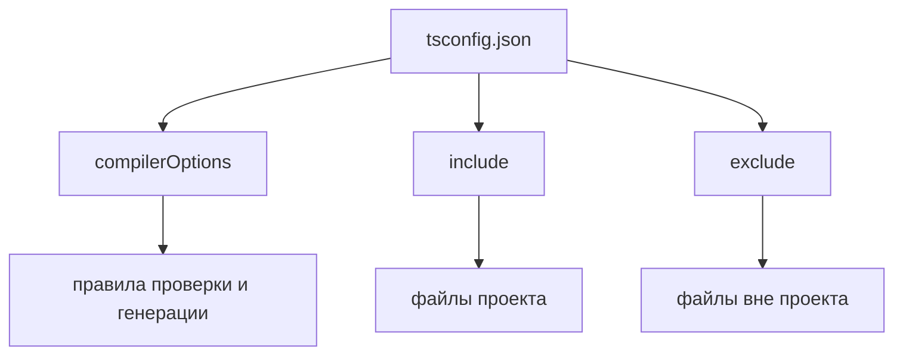
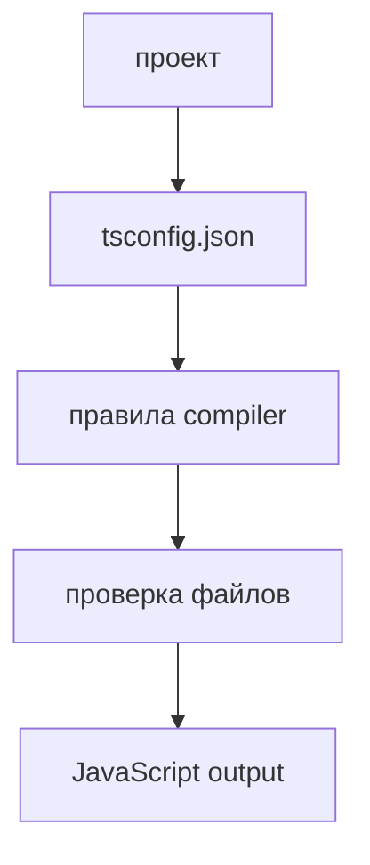

# tsconfig.json

## Связь с предыдущей главой

Предыдущая глава показала, что TypeScript Compiler проверяет код и генерирует JavaScript.

Теперь нужно понять, как компилятор TypeScript узнает правила конкретного проекта.

## Главный вопрос

> Как TypeScript понимает правила проекта?

Короткий ответ: через `tsconfig.json`.

## Мотивация

В маленьком примере можно передать компилятору TypeScript один файл.

В реальном Automation QA проекте есть:

* tests;
* pages;
* fixtures;
* helpers;
* API clients;
* config files;
* generated reports.

Компилятор TypeScript должен понимать:

* какие файлы относятся к проекту;
* какие файлы исключить;
* какой JavaScript генерировать;
* насколько строго проверять код.

Для этого нужен `tsconfig.json`.

## Теория

`tsconfig.json` — это конфигурационный файл TypeScript-проекта.

Он описывает договор между проектом и компилятором TypeScript.

Поле `strict` в примере ниже включено как preview следующей главы. Здесь важно только увидеть, что такие правила задаются в `tsconfig.json`.



В этой главе мы не изучаем все compiler options.

Важно понять роль файла.

## Внутренний механизм

Когда TypeScript запускается в режиме проекта, он ищет `tsconfig.json`.

Из него компилятор TypeScript узнает:

* `compilerOptions` — как проверять и во что генерировать;
* `include` — какие файлы считать частью проекта;
* `exclude` — какие файлы не включать;
* `target` — какую версию JavaScript генерировать;
* `module` — какой module format использовать.

Пример:

```json
{
  "compilerOptions": {
    "target": "ES2022",
    "module": "ES2022",
    "strict": true
  },
  "include": ["src/**/*.ts"],
  "exclude": ["node_modules"]
}
```

## Главная ментальная модель



`tsconfig.json` задает границы и правила TypeScript-проекта.

## Практические примеры

Примеры находятся в:

```text
examples/02-typescript/chapter-100/
```

`01-project-boundary.ts` показывает обычный файл проекта.

`02-sample-tsconfig.json` показывает минимальный конфигурационный файл.

`03-project-rules.ts` показывает код, который проверяется по правилам проекта.

## Automation QA

В Playwright-проекте `tsconfig.json` помогает держать единые правила для:

* test files;
* Page Objects;
* fixtures;
* API helpers;
* configuration modules.

Без общего project boundary разные части framework могут проверяться по-разному или не проверяться вообще.

## Распространённые ошибки

### Ошибка 1. Думать, что `tsconfig.json` нужен только большому проекту

Даже небольшой проект выигрывает от явных правил.

### Ошибка 2. Смешивать файлы проекта и generated files

Generated output не должен случайно становиться исходным кодом для проверки.

### Ошибка 3. Включать слишком много файлов

Чем шире project boundary, тем сложнее понять, что именно проверяет компилятор TypeScript.

## Практика

Практика находится в:

```text
practice/02-typescript/100-tsconfig-json.md
```

Решения находятся в:

```text
solutions/02-typescript/100-tsconfig-json.md
```

## Краткие итоги

Главное:

* `tsconfig.json` описывает TypeScript-проект;
* `compilerOptions` задает правила проверки и генерации;
* `include` задает файлы проекта;
* `exclude` исключает лишние файлы;
* project boundary особенно важен для большого Automation QA framework.

## Переход к следующей теме

Теперь компилятор TypeScript знает правила проекта.

Следующий вопрос: почему строгие правила делают проект надежнее.
