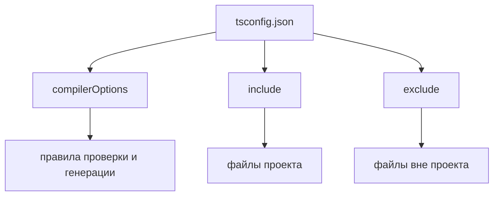

# tsconfig.json

## Связь с предыдущей главой

Предыдущая глава показала, что TypeScript Compiler проверяет код и генерирует JavaScript.

Теперь нужно понять, как компилятор TypeScript узнает правила конкретного проекта.

## Главный вопрос

> Как TypeScript понимает правила проекта?

Короткий ответ: через `tsconfig.json`.

## Мотивация

В маленьком примере можно передать компилятору TypeScript один файл.

В реальном Automation QA проекте есть:

* tests;
* pages;
* fixtures;
* helpers;
* API clients;
* config files;
* generated reports.

Компилятор TypeScript должен понимать, что из этого — исходный код проекта, по каким правилам его проверять и во что превращать.

## Теория

### Что такое проект для компилятора

`tsconfig.json` отвечает на два вопроса: **какие файлы** составляют проект и **по каким правилам** их проверять.

Наличие этого файла переключает компилятор в режим проекта. Он перестаёт быть инструментом для одного файла и начинает видеть связи между модулями.



### Указание файла отключает конфигурацию

Свойство, на которое натыкаются почти все:

```bash
npx tsc src/index.ts    # tsconfig.json ИГНОРИРУЕТСЯ
npx tsc -p tsconfig.json # конфигурация применяется
npx tsc                  # ищет tsconfig.json вверх по дереву
```

Когда файлы переданы явно, компилятор считает, что вы задаёте всё вручную, и конфигурацию не читает. Отсюда классическая ситуация: «у меня strict включён, но ошибок нет» — просто конфигурация не применилась.

В проекте почти всегда нужен запуск через `-p` или без аргументов.

### Границы проекта: include, exclude, files

Три поля задают состав проекта:

- `include` — шаблоны путей, которые входят в проект;
- `exclude` — что исключить из найденного по `include`;
- `files` — точный список файлов, без шаблонов.

Важная тонкость: `exclude` **не может** исключить файл, который импортируется из включённого кода. Компилятор обязан проверить всю цепочку зависимостей, иначе проверка была бы неполной. `exclude` влияет на то, что становится точкой входа, а не на то, что вообще анализируется.

### Ключевые опции и их смысл

| Опция | Что определяет |
| --- | --- |
| `target` | Версию JavaScript на выходе |
| `module` | Формат модулей на выходе |
| `strict` | Набор строгих проверок (тема главы 101) |
| `outDir` | Куда складывать сгенерированные файлы |
| `noEmit` | Только проверять, ничего не генерировать |
| `noEmitOnError` | Не генерировать при ошибках |
| `lib` | Какие стандартные API считать доступными |
| `types` | Какие глобальные пакеты типов подключать |

`target` влияет не только на синтаксис вывода, но и на то, какие возможности языка компилятор считает доступными без дополнительных настроек.

### Несколько конфигураций в одном проекте

В тестовом проекте части кода нередко живут по разным правилам: тесты, инфраструктура, сгенерированный клиент.

Распространённое решение — базовый конфиг и наследники:

```json
{
  "extends": "./tsconfig.base.json",
  "compilerOptions": { "noEmit": true },
  "include": ["tests/**/*.ts"]
}
```

`extends` берёт настройки из базового файла и позволяет переопределить нужные. Так общие правила задаются один раз, а различия остаются видимыми.

### Сгенерированный код не должен становиться исходным

Если `outDir` попадает внутрь `include`, компилятор начнёт проверять собственный вывод: появятся странные ошибки о повторных объявлениях, а сборка будет расти с каждым запуском.

Каталог вывода исключают явно и обычно добавляют в `.gitignore`.

## Внутренний механизм

Когда TypeScript запускается в режиме проекта, он ищет `tsconfig.json`.

Из него компилятор TypeScript узнает:

* `compilerOptions` — как проверять и во что генерировать;
* `include` — какие файлы считать частью проекта;
* `exclude` — какие файлы не включать;
* `target` — какую версию JavaScript генерировать;
* `module` — какой module format использовать.

Пример:

```json
{
  "compilerOptions": {
    "target": "ES2022",
    "module": "ES2022",
    "strict": true
  },
  "include": ["src/**/*.ts"],
  "exclude": ["node_modules"]
}
```

Поиск конфигурации идёт от текущего каталога вверх по дереву, пока файл не найдётся. Поэтому запуск из другого каталога может неожиданно подхватить не тот конфиг.

## Главная ментальная модель

`tsconfig.json` задает границы и правила TypeScript-проекта.

## Практические примеры

Примеры находятся в:

```text
examples/02-typescript/chapter-100/
```

`01-project-boundary.ts` показывает обычный файл проекта.

`02-sample-tsconfig.json` показывает минимальный конфигурационный файл.

`03-project-rules.ts` показывает код, который проверяется по правилам проекта.

## Automation QA

В Playwright-проекте `tsconfig.json` помогает держать единые правила для:

* test files;
* Page Objects;
* fixtures;
* API helpers;
* configuration modules.

Без общего project boundary разные части framework могут проверяться по-разному или не проверяться вообще.

Практический приём: проверяйте, что границы проекта действительно покрывают код. Добавьте заведомо ошибочную строку в файл, который считаете частью проекта, и запустите проверку. Если ошибки нет — файл не входит в `include`, и всё это время он не проверялся.

Для тестового фреймворка удобна конфигурация с `noEmit: true`: файлы на диск не нужны, потому что тесты запускает Playwright, а компилятор работает только проверяющим.

## Распространённые мифы

**Миф: `tsc file.ts` применит мой `tsconfig.json`.**
Явно указанные файлы отключают чтение конфигурации. Нужен `-p` или запуск без аргументов.

**Миф: `exclude` гарантированно исключит файл из проверки.**
Если файл импортируется из включённого кода, он всё равно будет проанализирован.

**Миф: конфигурация нужна только большим проектам.**
Без неё нет единых правил: каждый запуск компилятора может проверять по-разному.

**Миф: `target` влияет только на синтаксис вывода.**
Он также определяет, какие возможности языка считаются доступными по умолчанию.

## Частые вопросы

**Почему проверка не находит ошибок в моих тестах?**
Чаще всего каталог с тестами не попал в `include`. Проверяется это заведомо ошибочной строкой.

**Зачем несколько конфигураций?**
Когда части проекта живут по разным правилам: тесты, инфраструктура, сгенерированный код. `extends` позволяет не дублировать общие настройки.

**Нужен ли `outDir`, если генерация не нужна?**
Нет. При `noEmit: true` вывод не создаётся, и каталог не требуется.

**Почему компилятор жалуется на дублирующиеся объявления?**
Типичная причина — каталог вывода попал в состав проекта, и компилятор проверяет собственный результат.

## Распространённые ошибки

### Ошибка 1. Думать, что `tsconfig.json` нужен только большому проекту

Даже небольшой проект выигрывает от явных правил.

### Ошибка 2. Смешивать файлы проекта и generated files

Generated output не должен случайно становиться исходным кодом для проверки.

### Ошибка 3. Включать слишком много файлов

Чем шире project boundary, тем сложнее понять, что именно проверяет компилятор TypeScript.

### Ошибка 4. Запускать `tsc` с именем файла и ждать применения конфигурации

В этом режиме конфигурация игнорируется полностью.

## Проверьте себя

1. Чем `npx tsc src/index.ts` отличается от `npx tsc -p tsconfig.json`?
2. Может ли `exclude` исключить файл, который импортируется из проекта?
3. Зачем нужен `extends` и какую проблему он решает?
4. Как проверить, что файл действительно входит в границы проекта?
5. Что произойдёт, если каталог вывода попадёт в `include`?

## Практика

Практика находится в:

```text
practice/02-typescript/100-tsconfig-json.md
```

Решения находятся в:

```text
solutions/02-typescript/100-tsconfig-json.md
```

## Краткие итоги

Главное:

* `tsconfig.json` описывает TypeScript-проект;
* `compilerOptions` задает правила проверки и генерации;
* `include` задает файлы проекта, `exclude` исключает лишние;
* указание файлов в командной строке отключает конфигурацию;
* project boundary особенно важен для большого Automation QA framework.

## Переход к следующей теме

Теперь компилятор TypeScript знает правила проекта.

Следующий вопрос: почему строгие правила делают проект надежнее.
