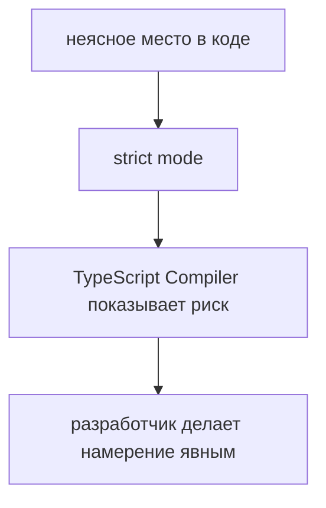

# strict mode

## Связь с предыдущей главой

Предыдущая глава показала `tsconfig.json` как место, где проект задает правила TypeScript Compiler.

Одно из самых важных правил — `strict`.

## Главный вопрос

> Почему строгая проверка делает проект надежнее?

Короткий ответ: `strict mode` заставляет явно описывать сомнительные места, которые иначе могли бы стать runtime-ошибками.

## Мотивация

Если проверка слишком мягкая, TypeScript пропускает больше неопределенности.

В небольшом скрипте это может быть терпимо.

В большом Automation QA framework это становится риском:

* helper получает неясное значение;
* config может быть `undefined`;
* test data содержит пропущенное поле;
* ошибка проявляется только в длинном сценарии.

`strict mode` делает такие места заметнее.

## Теория

### `strict` — это переключатель группы проверок

`strict: true` не отдельное правило, а включение сразу нескольких.

Самые заметные из них:

| Проверка | Что требует |
| --- | --- |
| `strictNullChecks` | Учитывать, что значение может быть `null` или `undefined` |
| `noImplicitAny` | Не оставлять тип невыведенным молча |
| `strictFunctionTypes` | Согласованность типов аргументов при подстановке функций |
| `strictPropertyInitialization` | Инициализировать поля класса |
| `useUnknownInCatchVariables` | Считать пойманную ошибку `unknown`, а не `any` |

Каждую можно включить отдельно, но по отдельности они оставляют дыры: пропущенная проверка обычно и есть то место, где живёт ошибка.

### `strictNullChecks` — самая важная из них

Без неё `null` и `undefined` допустимы **везде**. Тип `string` на самом деле означает «строка, или ничего», и компилятор об этом молчит.

С включённой проверкой отсутствие значения становится частью типа:

```typescript
function normalizeBaseUrl(baseUrl: string | undefined) {
  return baseUrl.toLowerCase();
}
```

Компилятор сообщит, что `baseUrl` может быть `undefined`. Вариантов ответа ровно три, и все они осознанные:

```typescript
// 1. Значение обязательно — меняем сигнатуру
function a(baseUrl: string) { return baseUrl.toLowerCase(); }

// 2. Есть запасной вариант
function b(baseUrl: string | undefined) {
  return (baseUrl ?? 'http://127.0.0.1').toLowerCase();
}

// 3. Отсутствие — ошибка конфигурации
function c(baseUrl: string | undefined) {
  if (baseUrl === undefined) {
    throw new Error('baseUrl не задан в конфигурации');
  }
  return baseUrl.toLowerCase();
}
```

Ценность режима именно в этом: он не запрещает отсутствие значения, а требует **решить**, что оно означает.

### `noImplicitAny` возвращает выведение к работе

Когда тип невозможно вывести, без этой проверки компилятор молча подставляет `any` — и вся цепочка дальше перестаёт проверяться.

Одна невыведенная переменная способна отключить проверку в десятке зависимых мест. Именно поэтому «ошибок нет» в нестрогом проекте часто означает «проверять было нечего».

### `useUnknownInCatchVariables` и работа с ошибками

В JavaScript выбросить можно что угодно, поэтому пойманное значение не обязано быть `Error`.

Строгий режим делает его `unknown` и требует проверки:

```typescript
try {
  await runScenario();
} catch (error) {
  const message = error instanceof Error ? error.message : String(error);
  throw new Error(`Сценарий не выполнен: ${message}`);
}
```

Для тестового фреймворка это прямо влияет на качество диагностики: обращение к `error.message` без проверки даёт `undefined` в отчёте там, где выброшена строка.

### Как включать строгость в существующем проекте

Включение `strict` в старом коде даёт сотни ошибок сразу, и это останавливает работу.

Рабочий порядок — по одной проверке, начиная с самой ценной:

1. `noImplicitAny` — возвращает выведение типов.
2. `strictNullChecks` — самая объёмная, но и самая полезная.
3. Остальные проверки группы.
4. `strict: true` как итог, когда список пуст.

Полезно зафиксировать правило: новые файлы пишутся сразу по строгим правилам, старые чинятся по мере изменения.

### Чего строгий режим не делает

Он проверяет согласованность кода, а не его смысл. Строгий режим не заметит:

* неверную бизнес-логику при корректных типах;
* неудачную структуру проекта;
* неверное предположение о форме внешних данных, если оно закреплено через `as`;
* отсутствие нужных тестов.

`any` и утверждения типов остаются доступны и в строгом режиме — они и есть штатный способ выйти из-под проверки. Поэтому строгость конфигурации сама по себе не гарантирует строгости кода.



## Внутренний механизм

Когда `strict` включен, компилятор TypeScript применяет более требовательные проверки.

Например, если значение может отсутствовать, это нельзя игнорировать:

```typescript
function normalizeBaseUrl(baseUrl: string | undefined) {
  return baseUrl.toLowerCase();
}
```

Здесь `baseUrl` может быть `undefined`.

Строгая проверка требует обработать этот случай явно.

В этой главе это только preview nullability. Подробно безопасная работа с вариантами значений будет изучаться позже.

## Главная ментальная модель

`strict mode` превращает скрытые сомнения в видимые решения.

## Практические примеры

Примеры находятся в:

```text
examples/02-typescript/chapter-101/
```

`01-without-clear-value.ts` показывает неявное значение.

`02-strict-requires-clarity.ts` показывает более явную функцию.

`03-strict-catches-missing-case.ts` показывает явную обработку отсутствующего значения.

## Automation QA

В test framework строгая проверка полезна для configuration.

Например, `baseUrl` может прийти из окружения.

Если код считает, что значение всегда есть, тесты могут упасть только при запуске в CI.

`strict mode` помогает заметить такие места раньше и заставляет явно решить:

* значение обязательно;
* значение имеет fallback;
* отсутствие значения является ошибкой конфигурации.

Особенно заметна польза в чтении конфигурации: `process.env.BASE_URL` всегда имеет тип `string | undefined`, и строгий режим не даст забыть об этом. Проверка на границе конфигурации превращает «тест упал в CI по непонятной причине» в «переменная окружения не задана».

Второе место, где строгость окупается сразу, — обработка ошибок в helper-функциях. Пойманное значение типа `unknown` заставляет формировать сообщение аккуратно, и отчёт перестаёт содержать `undefined` вместо описания проблемы.

## Распространённые мифы

**Миф: `strict` — одна проверка.**
Это группа проверок. Их можно включать по отдельности, и при постепенном переходе так и делают.

**Миф: строгий режим делает код многословным.**
Он делает явными решения, которые всё равно приходилось принимать — просто раньше они принимались молча и не всегда верно.

**Миф: со `strict` ошибок в runtime не будет.**
Он не контролирует внешние данные и не мешает использовать `as` и `any`.

**Миф: включать `strict` в старом проекте бессмысленно.**
Постепенное включение по одной проверке работает и даёт результат уже на первом шаге.

## Частые вопросы

**С какой проверки начать в существующем проекте?**
С `noImplicitAny`: она возвращает выведение типов и делает последующие шаги осмысленными.

**Почему после включения `strictNullChecks` ошибок так много?**
Раньше `null` и `undefined` были допустимы везде. Ошибки показывают места, где отсутствие значения не обработано, — они существовали и до включения.

**Можно ли оставить часть проекта нестрогой?**
Да, через отдельную конфигурацию для каталога. Но это должно быть временной мерой с планом, а не постоянным состоянием.

**Строгий режим включён, а `any` всё ещё используется. Это нормально?**
Он разрешён и в строгом режиме. Осознанный `any` с комментарием допустим; `any` по умолчанию сводит строгость на нет.

## Распространённые ошибки

### Ошибка 1. Отключать `strict`, чтобы стало меньше ошибок

Ошибки не исчезают. Они просто становятся менее видимыми.

### Ошибка 2. Включать `strict` без плана

В большом старом проекте строгий режим лучше вводить осознанно и постепенно.

### Ошибка 3. Думать, что `strict` заменяет архитектуру

Строгая проверка помогает, но не заменяет понятные boundaries, naming и decomposition.

### Ошибка 4. Гасить сообщения строгого режима через `as` и `any`

Так проверка формально включена, но фактически обойдена.

## Проверьте себя

1. Почему `strict` называют группой проверок, а не одной?
2. Что означает тип `string` при выключенном `strictNullChecks`?
3. Какие три осознанных ответа возможны на сообщение о возможном `undefined`?
4. Почему одна невыведенная переменная снижает проверку в других местах?
5. Почему включённый `strict` не гарантирует строгости кода?

## Практика

Практика находится в:

```text
practice/02-typescript/101-strict-mode.md
```

Решения находятся в:

```text
solutions/02-typescript/101-strict-mode.md
```

## Краткие итоги

Главное:

* `strict` включает группу строгих проверок;
* `strictNullChecks` делает отсутствие значения частью типа;
* `noImplicitAny` не даёт проверке молча отключиться;
* в существующем проекте строгость вводят по одной проверке;
* `as` и `any` остаются способом выйти из-под проверки.

## Переход к следующей теме

Строгие правила заданы. Дальше нужно понять, откуда TypeScript берёт типы, когда мы их не пишем, и когда аннотация действительно необходима.
