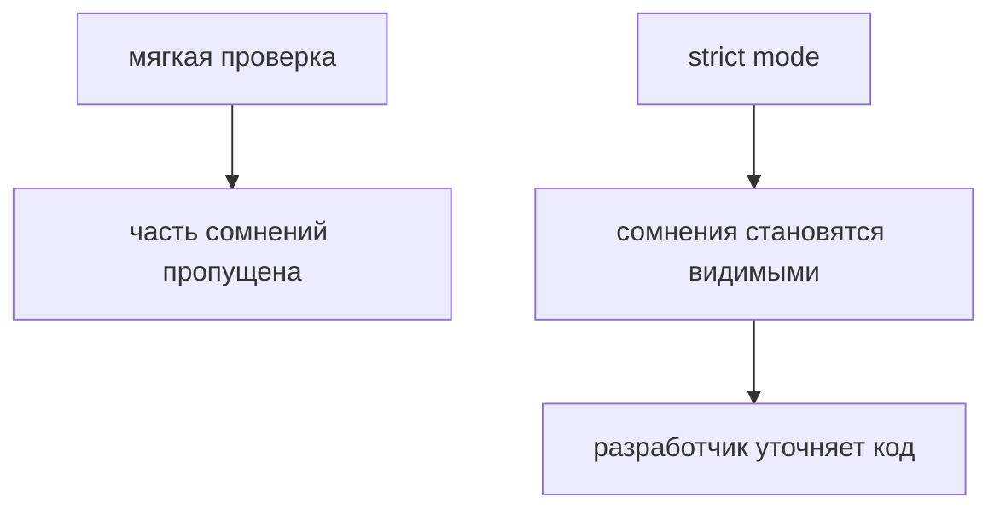
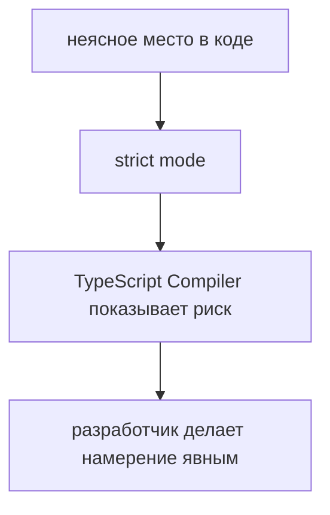

# strict mode

## Связь с предыдущей главой

Предыдущая глава показала `tsconfig.json` как место, где проект задает правила TypeScript Compiler.

Одно из самых важных правил — `strict`.

## Главный вопрос

> Почему строгая проверка делает проект надежнее?

Короткий ответ: `strict mode` заставляет явно описывать сомнительные места, которые иначе могли бы стать runtime-ошибками.

## Мотивация

Если проверка слишком мягкая, TypeScript пропускает больше неопределенности.

В небольшом скрипте это может быть терпимо.

В большом Automation QA framework это становится риском:

* helper получает неясное значение;
* config может быть `undefined`;
* test data содержит пропущенное поле;
* ошибка проявляется только в длинном сценарии.

`strict mode` делает такие места заметнее.

## Теория

`strict` — это набор строгих правил TypeScript.

Он не делает код сложнее ради сложности.

Он заставляет проект честно отвечать на вопросы:

* может ли значение отсутствовать;
* достаточно ли явно описана функция;
* не скрыта ли ошибка за слишком широким типом;
* понятно ли компилятору TypeScript, что разработчик хотел выразить.



## Внутренний механизм

Когда `strict` включен, компилятор TypeScript применяет более требовательные проверки.

Например, если значение может отсутствовать, это нельзя игнорировать:

```typescript
function normalizeBaseUrl(baseUrl: string | undefined) {
  return baseUrl.toLowerCase();
}
```

Здесь `baseUrl` может быть `undefined`.

Строгая проверка требует обработать этот случай явно.

В этой главе это только preview nullability. Подробно безопасная работа с вариантами значений будет изучаться позже.

## Главная ментальная модель



`strict mode` превращает скрытые сомнения в видимые решения.

## Практические примеры

Примеры находятся в:

```text
examples/02-typescript/chapter-101/
```

`01-without-clear-value.ts` показывает неявное значение.

`02-strict-requires-clarity.ts` показывает более явную функцию.

`03-strict-catches-missing-case.ts` показывает явную обработку отсутствующего значения.

## Automation QA

В test framework строгая проверка полезна для configuration.

Например, `baseUrl` может прийти из окружения.

Если код считает, что значение всегда есть, тесты могут упасть только при запуске в CI.

`strict mode` помогает заметить такие места раньше и заставляет явно решить:

* значение обязательно;
* значение имеет fallback;
* отсутствие значения является ошибкой конфигурации.

## Распространённые ошибки

### Ошибка 1. Отключать `strict`, чтобы стало меньше ошибок

Ошибки не исчезают. Они просто становятся менее видимыми.

### Ошибка 2. Включать `strict` без плана

В большом старом проекте строгий режим лучше вводить осознанно и постепенно.

### Ошибка 3. Думать, что `strict` заменяет архитектуру

Строгая проверка помогает, но не заменяет понятные boundaries, naming и decomposition.

## Практика

Практика находится в:

```text
practice/02-typescript/101-strict-mode.md
```

Решения находятся в:

```text
solutions/02-typescript/101-strict-mode.md
```

## Краткие итоги

Главное:

* `strict` включает более требовательную проверку;
* строгий режим делает сомнительные места видимыми;
* он особенно полезен для config, helpers и test data;
* `strict` не заменяет runtime-проверки;
* в больших проектах строгие правила повышают поддерживаемость.

## Переход к следующей теме

Первый TypeScript-модуль показал границу компилятора TypeScript, runtime и правил проекта.

Дальше начинается базовый словарь типов: как TypeScript описывает значения, которые уже знакомы по JavaScript.
