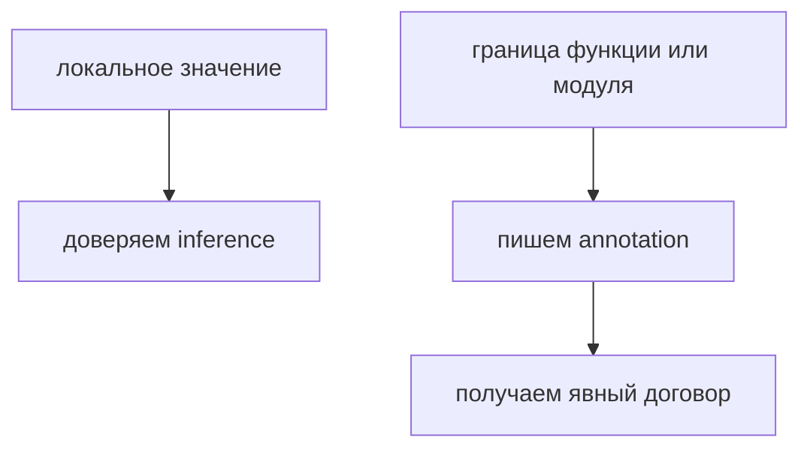

# Type Annotations and Type Inference

## Связь с предыдущей главой

Глава про `strict mode` показала, что TypeScript требует ясности там, где код может быть неоднозначным.

Теперь нужно понять первый практический инструмент этой ясности: когда тип пишется явно, а когда TypeScript выводит его сам.

## Главный вопрос

> Когда TypeScript сам понимает тип, а когда ему нужно помочь?

Короткий ответ: TypeScript выводит тип из очевидного значения, но аннотация нужна там, где важен договор, граница функции или будущая читаемость.

## Мотивация

В JavaScript переменная может получить любое значение.

Для маленького скрипта это удобно.

В большом QA-проекте это становится источником ошибок:

* config меняет форму;
* helper начинает принимать не то значение;
* test data становится неоднозначной;
* ошибка видна только после запуска тестов.

TypeScript помогает описывать намерение заранее.

## Теория

### Два источника знания о типе

У компилятора есть два способа узнать тип значения.

**Аннотация** — явная запись:

```typescript
const timeoutMs: number = 5000;
```

**Вывод** — определение типа из выражения:

```typescript
const retryCount = 2;
```

TypeScript видит значение `2` и понимает, что переменная хранит число. Результат одинаковый; разница в том, кто принял решение и кто его увидит при чтении кода.

### Вывод даёт разный тип для `const` и `let`

Это первое место, где вывод ведёт себя не так, как ожидают.

```typescript
const method = 'GET';   // тип: 'GET'  — литеральный тип
let   verb   = 'GET';   // тип: string — расширенный тип
```

Причина проста: `const` нельзя переприсвоить, поэтому значение не изменится никогда, и компилятор сохраняет точный тип. У `let` значение может измениться, поэтому тип расширяется до `string`.

Практическое следствие проявляется при передаче в функцию, ожидающую конкретные значения:

```typescript
function request(method: 'GET' | 'POST') { }

const a = 'GET';
let   b = 'GET';

request(a);  // работает: тип 'GET'
request(b);  // ошибка: тип string шире, чем 'GET' | 'POST'
```

### Где вывод не работает

Вывод опирается на выражение. Если выражения нет, выводить не из чего.

Главный случай — параметры функции:

```typescript
function setTimeoutMs(timeoutMs: number) {
  console.log(timeoutMs);
}
```

В момент объявления значения ещё нет, поэтому аннотация обязательна. При включённом `noImplicitAny` её отсутствие становится ошибкой.

### Контекстная типизация

Есть обратный случай: тип приходит не из значения, а из места использования.

```typescript
const codes = [200, 201, 404];

codes.filter(code => code >= 400);
```

Параметр `code` не аннотирован, но компилятор знает, что это `number`: тип пришёл из `filter` массива чисел. Это называется контекстной типизацией.

Поэтому в колбэках аннотации обычно лишние — и, более того, вредны: написанный вручную тип может разойтись с контекстом.

### Возвращаемый тип: выводить или писать

Возвращаемый тип функции выводится почти всегда. Аннотировать его стоит в двух случаях:

1. Функция — публичная граница модуля, и договор должен быть виден при чтении.
2. Нужно поймать расхождение: если реализация начнёт возвращать другое, ошибка появится в функции, а не у вызывающего кода.

Во втором случае аннотация работает как проверка намерения, а не как дублирование.

### Слишком широкая аннотация ослабляет проверку

Аннотация может не только уточнять, но и портить вывод:

```typescript
const status: string = 'passed';  // тип: string, литерал потерян
```

Здесь аннотация **шире**, чем то, что вывел бы компилятор. Информация потеряна, и передать такое значение в функцию с объединением литералов уже нельзя.

Правило: аннотация должна выражать договор, а не понижать точность. Если она делает тип шире выведенного — это, скорее всего, ошибка.

## Внутренний механизм

TypeScript анализирует выражение справа от `=`.

Если из выражения можно надежно понять тип, компилятор запоминает этот тип.

```typescript
const baseUrl = 'https://api.example.test';
```

Для TypeScript это строковое значение.

Но у параметра функции нет значения в момент объявления:

```typescript
function setTimeoutMs(timeoutMs: number) {
  console.log(timeoutMs);
}
```

Здесь аннотация нужна, потому что параметр — это входная граница функции.

## Главная ментальная модель



Type inference — это помощь компилятора.

Type annotation — это явный договор для человека и компилятора.

## Практические примеры

Примеры находятся в:

```text
examples/02-typescript/chapter-102/
```

`01-inference.ts` показывает вывод типа из значения.

`02-annotation-boundary.ts` показывает аннотации на границе функции.

`03-too-wide-type.ts` показывает, как слишком широкая аннотация ослабляет проверку.

## Automation QA

В QA-проекте удобно позволять TypeScript выводить типы локальных значений:

```typescript
const reportName = 'smoke';
const retries = 2;
```

Но границы helpers лучше описывать явно:

```typescript
function buildReportTitle(suiteName: string, failedCount: number) {
  return `${suiteName}: ${failedCount} failed`;
}
```

Так helper становится понятнее для других частей проекта.

## Распространённые ошибки

### Ошибка 1. Аннотировать каждую переменную

Если тип очевиден, аннотация может ухудшить читаемость.

### Ошибка 2. Не аннотировать параметры функций

Параметры часто являются публичной границей кода. Их стоит описывать явно.

### Ошибка 3. Использовать слишком широкий тип

Аннотация должна уточнять намерение, а не отключать полезную проверку.

## Распространённые мифы

**Миф: аннотации делают код надёжнее, поэтому их нужно писать везде.**
Аннотация, повторяющая очевидный вывод, добавляет шум. Аннотация шире выведенного типа — ухудшает проверку.

**Миф: `const` и `let` с одинаковым значением дают одинаковый тип.**
`const` сохраняет литеральный тип, `let` расширяет его.

**Миф: параметры колбэков нужно аннотировать.**
Их тип обычно приходит из контекста. Ручная аннотация может с ним разойтись.

**Миф: вывод типов — это «магия» и ему нельзя доверять.**
Вывод детерминирован и предсказуем. Наведите курсор на переменную в редакторе — увидите ровно то, что вывел компилятор.

## Частые вопросы

**Как узнать, что именно вывел компилятор?**
Навести курсор в редакторе или временно присвоить значение переменной заведомо неверного типа: сообщение об ошибке покажет выведенный тип.

**Когда точно нужна аннотация?**
Параметры функций, публичные границы модулей и случаи, когда вывод даёт слишком широкий тип.

**Почему функция не принимает мою переменную, хотя значение подходит?**
Частая причина — `let` вместо `const`: тип расширился до `string`, а функция ждёт конкретный литерал.

**Стоит ли аннотировать возвращаемый тип?**
Для публичных функций — да, это часть договора. Для локальных вспомогательных обычно лишнее.

## Проверьте себя

1. Какие два источника знания о типе есть у компилятора?
2. Почему `const method = 'GET'` и `let verb = 'GET'` получают разные типы?
3. Что такое контекстная типизация и где она встречается чаще всего?
4. В каких двух случаях стоит аннотировать возвращаемый тип?
5. Почему `const status: string = 'passed'` — потенциальная ошибка?

## Практика

Практика находится в:

```text
practice/02-typescript/102-type-annotations-and-type-inference.md
```

Решения находятся в:

```text
solutions/02-typescript/102-type-annotations-and-type-inference.md
```

## Краткие итоги

Главное:

* TypeScript умеет выводить тип из очевидного значения;
* аннотации нужны на важных границах кода;
* параметры функций обычно лучше описывать явно;
* лишние аннотации создают шум;
* слишком широкие аннотации ослабляют проверку.

## Переход

Теперь мы умеем выбирать между явной аннотацией и выводом типа.

Дальше нужно связать знакомые JavaScript-примитивы с их TypeScript-типами.
