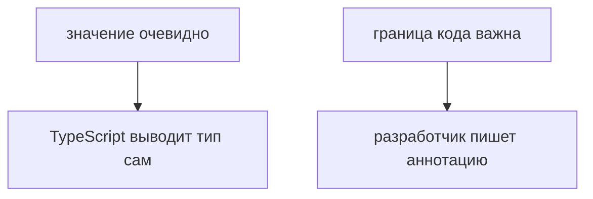
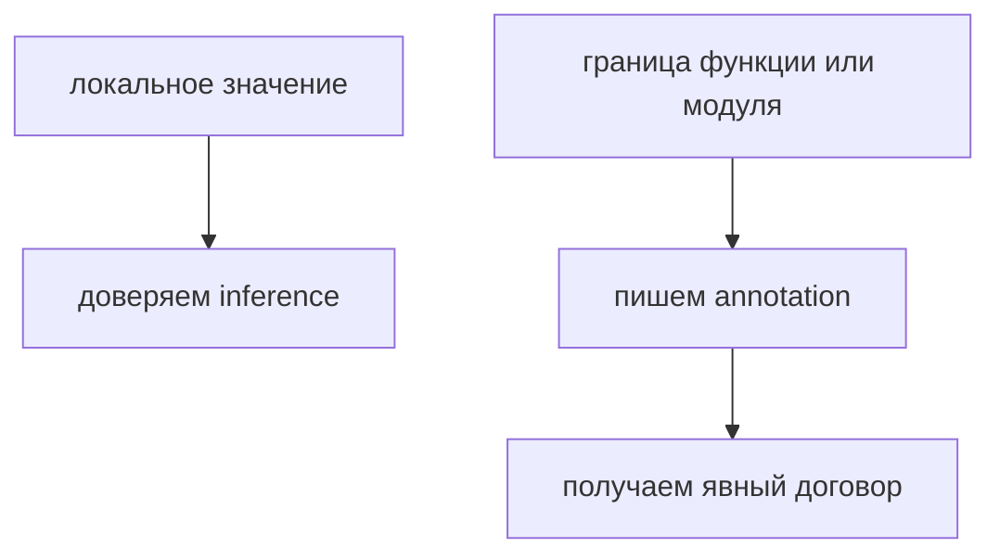

# Type Annotations and Type Inference

## Связь с предыдущей главой

Глава про `strict mode` показала, что TypeScript требует ясности там, где код может быть неоднозначным.

Теперь нужно понять первый практический инструмент этой ясности: когда тип пишется явно, а когда TypeScript выводит его сам.

## Главный вопрос

> Когда TypeScript сам понимает тип, а когда ему нужно помочь?

Короткий ответ: TypeScript выводит тип из очевидного значения, но аннотация нужна там, где важен договор, граница функции или будущая читаемость.

## Мотивация

В JavaScript переменная может получить любое значение.

Для маленького скрипта это удобно.

В большом QA-проекте это становится источником ошибок:

* config меняет форму;
* helper начинает принимать не то значение;
* test data становится неоднозначной;
* ошибка видна только после запуска тестов.

TypeScript помогает описывать намерение заранее.

## Теория

`type annotation` — это явная запись ожидаемого типа.

```typescript
const timeoutMs: number = 5000;
```

`type inference` — это вывод типа без явной записи.

```typescript
const retryCount = 2;
```

TypeScript видит значение `2` и понимает, что переменная хранит число.

Главная идея:



Аннотации нужны не везде.

Если тип очевиден из значения, лишняя аннотация часто только шумит.

## Внутренний механизм

TypeScript анализирует выражение справа от `=`.

Если из выражения можно надежно понять тип, компилятор запоминает этот тип.

```typescript
const baseUrl = 'https://api.example.test';
```

Для TypeScript это строковое значение.

Но у параметра функции нет значения в момент объявления:

```typescript
function setTimeoutMs(timeoutMs: number) {
  console.log(timeoutMs);
}
```

Здесь аннотация нужна, потому что параметр — это входная граница функции.

## Главная ментальная модель



Type inference — это помощь компилятора.

Type annotation — это явный договор для человека и компилятора.

## Практические примеры

Примеры находятся в:

```text
examples/02-typescript/chapter-102/
```

`01-inference.ts` показывает вывод типа из значения.

`02-annotation-boundary.ts` показывает аннотации на границе функции.

`03-too-wide-type.ts` показывает, как слишком широкая аннотация ослабляет проверку.

## Automation QA

В QA-проекте удобно позволять TypeScript выводить типы локальных значений:

```typescript
const reportName = 'smoke';
const retries = 2;
```

Но границы helpers лучше описывать явно:

```typescript
function buildReportTitle(suiteName: string, failedCount: number) {
  return `${suiteName}: ${failedCount} failed`;
}
```

Так helper становится понятнее для других частей проекта.

## Распространённые ошибки

### Ошибка 1. Аннотировать каждую переменную

Если тип очевиден, аннотация может ухудшить читаемость.

### Ошибка 2. Не аннотировать параметры функций

Параметры часто являются публичной границей кода. Их стоит описывать явно.

### Ошибка 3. Использовать слишком широкий тип

Аннотация должна уточнять намерение, а не отключать полезную проверку.

## Практика

Практика находится в:

```text
practice/02-typescript/102-type-annotations-and-type-inference.md
```

Решения находятся в:

```text
solutions/02-typescript/102-type-annotations-and-type-inference.md
```

## Краткие итоги

Главное:

* TypeScript умеет выводить тип из очевидного значения;
* аннотации нужны на важных границах кода;
* параметры функций обычно лучше описывать явно;
* лишние аннотации создают шум;
* слишком широкие аннотации ослабляют проверку.

## Переход

Теперь мы умеем выбирать между явной аннотацией и выводом типа.

Дальше нужно связать знакомые JavaScript-примитивы с их TypeScript-типами.
