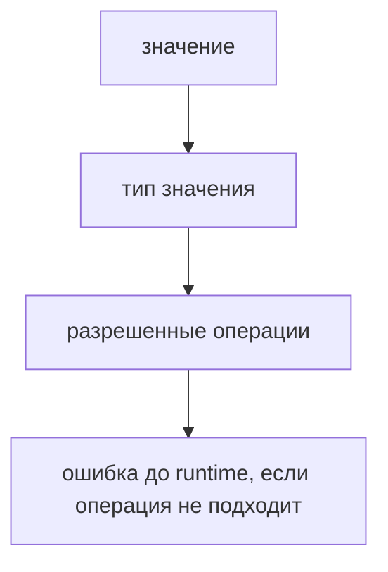

# Primitive Types

## Связь с предыдущей главой

Предыдущая глава показала, как TypeScript получает информацию о типе: через annotation или inference.

Теперь применим это к значениям, которые уже знакомы по JavaScript: строкам, числам, boolean и другим примитивам.

## Главный вопрос

> Как TypeScript описывает примитивные значения JavaScript?

Короткий ответ: TypeScript использует типы `string`, `number`, `boolean`, `bigint`, `symbol`, `null` и `undefined`, чтобы проверять работу с примитивами до runtime.

## Мотивация

JavaScript умеет работать с разными примитивами, но не требует заранее описывать, что именно ожидается.

Из-за этого ошибка может появиться поздно:

```typescript
function formatRetries(retries: number) {
  return `retries: ${retries}`;
}
```

Если передать строку вместо числа, TypeScript может заметить это до запуска.

## Теория

### Примитивы JavaScript и их типы

Основные примитивные типы TypeScript соответствуют знакомым значениям JavaScript:

* `string` — строка;
* `number` — число;
* `boolean` — логическое значение;
* `bigint` — большое целое число;
* `symbol` — уникальный идентификатор;
* `null` — намеренное отсутствие значения;
* `undefined` — значение не задано.

TypeScript не меняет сами значения. Он проверяет, что код обращается с ними согласованно.

### Литеральный тип — тоже тип

Типом может быть не только «любая строка», но и **одно конкретное значение**:

```typescript
type Method = 'GET';
const method: Method = 'GET';
```

Сам по себе такой тип бесполезен, но вместе с объединением он становится основным инструментом описания допустимых значений:

```typescript
type Method = 'GET' | 'POST' | 'DELETE';
type Status = 200 | 201 | 404;
```

Это гораздо точнее, чем `string` и `number`: компилятор поймает опечатку `'POTS'` и не даст передать код `999`, где ожидался один из трёх.

### `string` и `String` — разные вещи

```typescript
const a: string = 'ok';   // примитив
const b: String = 'ok';   // объектный wrapper
```

`String`, `Number`, `Boolean` с большой буквы — это типы объектов-обёрток. Они почти никогда не нужны: значение такого типа нельзя присвоить туда, где ожидается примитив, а поведение отличается в неочевидных местах.

Правило простое: для примитивов всегда пишется строчная буква.

### `null` и `undefined` — разные намерения

Оба означают отсутствие значения, но по-разному:

| | Смысл | Типичный источник |
| --- | --- | --- |
| `undefined` | Значение не задано | Необъявленное поле, отсутствующий аргумент, `process.env.X` |
| `null` | Намеренно пусто | Явное «здесь ничего нет», часто из JSON или базы |

При выключенном `strictNullChecks` оба допустимы в любом типе, и различие пропадает. При включённом они становятся полноправными типами, и выбор между ними становится решением.

Для тестового кода практичное правило: `undefined` — «не задано», `null` — «задано как пустое». Ответ API чаще содержит `null`, конфигурация — `undefined`.

### Приведение типов остаётся проблемой JavaScript

TypeScript проверяет операции, но не отменяет правила выполнения:

```typescript
const timeout: number = 5000;
const label: string = 'timeout: ' + timeout;  // допустимо
```

Сложение числа со строкой разрешено и в JavaScript, и в TypeScript. Компилятор не защищает от логических ошибок приведения — он лишь не даёт использовать значение там, где тип явно не подходит.

### `bigint` и `symbol`

Встречаются реже, но существуют как отдельные примитивные типы.

`bigint` нужен для целых чисел, выходящих за безопасный диапазон `number`. Смешивать их нельзя: `1n + 1` — ошибка, и это правильно, потому что в JavaScript такая операция выбрасывает исключение.

`symbol` — уникальный идентификатор; два символа с одинаковым описанием не равны. В тестовом коде встречается редко, чаще в библиотеках.

## Внутренний механизм

Когда переменная получает примитивное значение, TypeScript связывает ее с соответствующим типом.

```typescript
const baseUrl = 'https://api.example.test';
const timeoutMs = 5000;
const headless = true;
```

TypeScript понимает:

* `baseUrl` связан со строкой;
* `timeoutMs` связан с числом;
* `headless` связан с boolean.

Для `bigint` и `symbol` работает та же идея: TypeScript связывает значение с соответствующим примитивным типом и не разрешает использовать его как другой примитив без явного намерения.

Если позже код использует значение как другой тип, компилятор покажет диагностическое сообщение.

## Главная ментальная модель



Тип примитива описывает, какие операции с этим значением ожидаемы.

## Практические примеры

Примеры находятся в:

```text
examples/02-typescript/chapter-103/
```

`01-primitive-config.ts` показывает типы для простого config.

`02-primitive-mismatch.ts` показывает намеренную ошибку типа.

`03-null-and-undefined.ts` показывает `null` и `undefined` как отдельные значения отсутствия.

## Automation QA

В QA-коде примитивы часто встречаются в конфигурации:

```typescript
const baseUrl: string = 'https://api.example.test';
const timeoutMs: number = 5000;
const isDebug: boolean = false;
```

Такие типы помогают раньше увидеть ошибку в test settings, report metadata или request options.

## Распространённые ошибки

### Ошибка 1. Писать `String` вместо `string`

Для примитивных значений обычно используют `string`, `number`, `boolean`, а не объектные wrapper-типы.

### Ошибка 2. Думать, что TypeScript меняет runtime-тип

Типы исчезают после компиляции. Runtime остается JavaScript.

### Ошибка 3. Смешивать `null` и `undefined` без намерения

Лучше явно понимать: значение отсутствует намеренно или еще не задано.

## Распространённые мифы

**Миф: `String` и `string` взаимозаменяемы.**
Первый — объектная обёртка, второй — примитив. Для значений используется примитив.

**Миф: `null` и `undefined` — одно и то же.**
При включённом `strictNullChecks` это разные типы с разным смыслом.

**Миф: типы защищают от неявного приведения.**
Сложение числа со строкой допустимо и проверку проходит. Приведение — правило JavaScript, а не упущение TypeScript.

**Миф: литеральные типы — редкая экзотика.**
Объединения литералов — основной способ описать набор допустимых значений: методы, статусы, роли, окружения.

## Частые вопросы

**Когда использовать литеральные типы вместо `string`?**
Когда множество допустимых значений известно и конечно: методы HTTP, статусы, названия окружений. Компилятор тогда ловит опечатки.

**Что выбрать для «значения нет» — `null` или `undefined`?**
Договориться в проекте. Практичный вариант: `undefined` — не задано, `null` — задано пустым. Важнее последовательность, чем сам выбор.

**Почему `1n + 1` не компилируется?**
Смешивать `bigint` и `number` нельзя: в JavaScript такая операция выбрасывает исключение. Компилятор останавливает её заранее.

**Нужно ли аннотировать примитивы в конфигурации?**
Если значение задано литералом, вывод справится сам. Аннотация полезна там, где значение приходит извне и тип нужно зафиксировать явно.

## Проверьте себя

1. Чем отличается `string` от `String` и почему второй почти не используется?
2. Что такое литеральный тип и зачем он нужен вместе с объединением?
3. Как различаются `null` и `undefined` по смыслу?
4. Защищает ли TypeScript от сложения числа со строкой? Почему?
5. Почему нельзя смешивать `bigint` и `number`?

## Практика

Практика находится в:

```text
practice/02-typescript/103-primitive-types.md
```

Решения находятся в:

```text
solutions/02-typescript/103-primitive-types.md
```

## Краткие итоги

Главное:

* TypeScript описывает JavaScript-примитивы отдельными типами;
* `string`, `number` и `boolean` чаще всего встречаются в config и helpers;
* `null` и `undefined` описывают разные варианты отсутствия значения;
* TypeScript проверяет операции, но не меняет runtime;
* примитивные типы — основа дальнейших TypeScript-договоров.

## Переход

Теперь мы умеем описывать известные примитивные значения.

Дальше разберем ситуацию, когда тип данных пока неизвестен.
