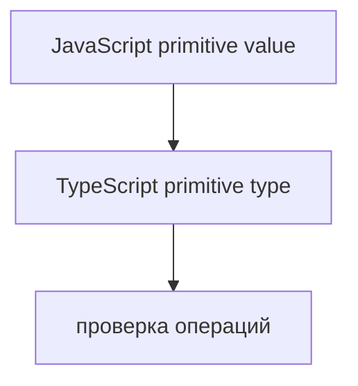
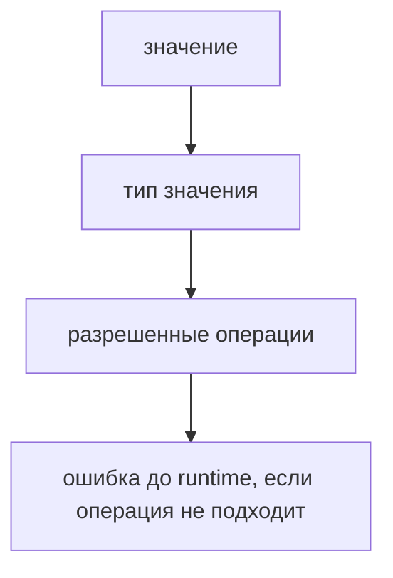

# Primitive Types

## Связь с предыдущей главой

Предыдущая глава показала, как TypeScript получает информацию о типе: через annotation или inference.

Теперь применим это к значениям, которые уже знакомы по JavaScript: строкам, числам, boolean и другим примитивам.

## Главный вопрос

> Как TypeScript описывает примитивные значения JavaScript?

Короткий ответ: TypeScript использует типы `string`, `number`, `boolean`, `bigint`, `symbol`, `null` и `undefined`, чтобы проверять работу с примитивами до runtime.

## Мотивация

JavaScript умеет работать с разными примитивами, но не требует заранее описывать, что именно ожидается.

Из-за этого ошибка может появиться поздно:

```typescript
function formatRetries(retries: number) {
  return `retries: ${retries}`;
}
```

Если передать строку вместо числа, TypeScript может заметить это до запуска.

## Теория

Основные примитивные типы TypeScript соответствуют знакомым значениям JavaScript:

* `string` — строка;
* `number` — число;
* `boolean` — логическое значение;
* `bigint` — большое целое число;
* `symbol` — уникальный идентификатор;
* `null` — намеренное отсутствие значения;
* `undefined` — значение не задано.



TypeScript не меняет сами значения.

Он проверяет, что код обращается с ними согласованно.

`bigint` и `symbol` встречаются реже, чем `string`, `number` и `boolean`, но TypeScript описывает их как отдельные примитивные типы. Это важно, потому что большое целое число и уникальный идентификатор нельзя безопасно подменять обычным `number` или строкой.

## Внутренний механизм

Когда переменная получает примитивное значение, TypeScript связывает ее с соответствующим типом.

```typescript
const baseUrl = 'https://api.example.test';
const timeoutMs = 5000;
const headless = true;
```

TypeScript понимает:

* `baseUrl` связан со строкой;
* `timeoutMs` связан с числом;
* `headless` связан с boolean.

Для `bigint` и `symbol` работает та же идея: TypeScript связывает значение с соответствующим примитивным типом и не разрешает использовать его как другой примитив без явного намерения.

Если позже код использует значение как другой тип, компилятор покажет диагностическое сообщение.

## Главная ментальная модель



Тип примитива описывает, какие операции с этим значением ожидаемы.

## Практические примеры

Примеры находятся в:

```text
examples/02-typescript/chapter-103/
```

`01-primitive-config.ts` показывает типы для простого config.

`02-primitive-mismatch.ts` показывает намеренную ошибку типа.

`03-null-and-undefined.ts` показывает `null` и `undefined` как отдельные значения отсутствия.

## Automation QA

В QA-коде примитивы часто встречаются в конфигурации:

```typescript
const baseUrl: string = 'https://api.example.test';
const timeoutMs: number = 5000;
const isDebug: boolean = false;
```

Такие типы помогают раньше увидеть ошибку в test settings, report metadata или request options.

## Распространённые ошибки

### Ошибка 1. Писать `String` вместо `string`

Для примитивных значений обычно используют `string`, `number`, `boolean`, а не объектные wrapper-типы.

### Ошибка 2. Думать, что TypeScript меняет runtime-тип

Типы исчезают после компиляции. Runtime остается JavaScript.

### Ошибка 3. Смешивать `null` и `undefined` без намерения

Лучше явно понимать: значение отсутствует намеренно или еще не задано.

## Практика

Практика находится в:

```text
practice/02-typescript/103-primitive-types.md
```

Решения находятся в:

```text
solutions/02-typescript/103-primitive-types.md
```

## Краткие итоги

Главное:

* TypeScript описывает JavaScript-примитивы отдельными типами;
* `string`, `number` и `boolean` чаще всего встречаются в config и helpers;
* `null` и `undefined` описывают разные варианты отсутствия значения;
* TypeScript проверяет операции, но не меняет runtime;
* примитивные типы — основа дальнейших TypeScript-договоров.

## Переход

Теперь мы умеем описывать известные примитивные значения.

Дальше разберем ситуацию, когда тип данных пока неизвестен.
