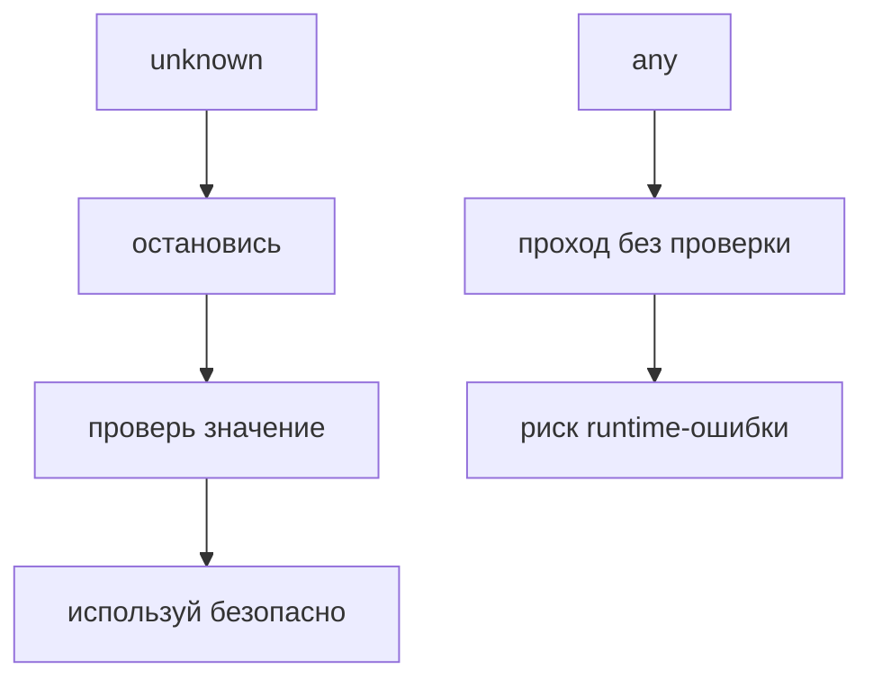

# any и unknown

## Связь с предыдущей главой

Предыдущая глава показала типы для известных примитивных значений.

Но в реальном проекте не все данные сразу понятны: часть приходит из внешних источников, файлов, API или пользовательского ввода.

## Главный вопрос

> Как описывать данные, тип которых пока неизвестен?

Короткий ответ: `any` отключает проверку, а `unknown` сохраняет проверку и требует сначала убедиться, что с данными можно безопасно работать.

## Мотивация

В JavaScript внешние данные часто приходят без гарантий.

Например, API response может содержать не то, что ожидал helper.

Если в TypeScript обозначить такие данные как `any`, компилятор перестает защищать код.

Если использовать `unknown`, TypeScript заставляет сначала проверить значение.

## Теория

### `any` отключает проверку

`any` означает: «не проверяй это значение».

```typescript
const responseBody: any = '{ "status": "ok" }';
responseBody.foo.bar.baz();   // ошибки нет — проверка отключена
```

Компилятор разрешает обращаться к любым свойствам, вызывать любые методы и передавать значение почти куда угодно.

### `any` распространяется по цепочке

Это свойство делает `any` опаснее, чем кажется.

```typescript
const raw: any = JSON.parse(text);
const id = raw.id;          // id тоже any
const key = buildKey(id);   // проверка аргумента не сработает
```

Значение типа `any` «заражает» всё, что из него получено. Одно место, где проверка отключена, снимает проверку с целого участка кода — и ошибка всплывает далеко от источника.

### `unknown` требует сузить тип

`unknown` тоже означает «тип неизвестен», но ведёт себя противоположно:

```typescript
const responseBody: unknown = JSON.parse(text);

responseBody.status;          // ошибка: тип неизвестен
```

Пока тип не уточнён, со значением ничего нельзя сделать. Это не ограничение, а перенос проверки на нужный момент.

### Чем сужают тип

Сужение выполняется обычными средствами JavaScript, а компилятор следит за результатом:

| Инструмент | Для чего |
| --- | --- |
| `typeof` | Примитивы и функции |
| `instanceof` | Экземпляры классов |
| `Array.isArray` | Массивы |
| `in` | Наличие свойства у объекта |
| Предикат `value is T` | Собственная проверка сложной формы |

```typescript
function printValue(value: unknown) {
  if (typeof value === 'string') {
    console.log(value.toUpperCase());   // здесь value уже string
  }
}
```

Внутри ветки компилятор знает больше, чем снаружи: проверка действительно выполнена во время выполнения.

### Где `any` появляется незаметно

Его не всегда пишут руками. Типичные источники:

* **`JSON.parse`** — возвращает `any`, поэтому разобранный ответ по умолчанию не проверяется;
* **переменная в `catch`** — без `useUnknownInCatchVariables` имеет тип `any`;
* **библиотеки без описания типов** — всё, что из них приходит, не проверяется;
* **невыведенные параметры** при выключенном `noImplicitAny`.

Первый пункт особенно важен для тестов: именно так внешние данные попадают в код без проверки.

### Рабочая схема: `unknown` на границе

Практичный подход — сузить область неопределённости до одной точки:

```typescript
const parsed: unknown = JSON.parse(text);

if (!isWorkItem(parsed)) {
  throw new Error('Ответ не соответствует ожидаемой форме');
}

// дальше по коду parsed уже WorkItem
```

Неопределённость существует ровно до проверки. После неё весь остальной код работает с конкретным типом и проверяется полностью.

## Внутренний механизм

`any` выводит значение из нормальной проверки TypeScript.

Компилятор разрешает обращаться к свойствам, вызывать методы и передавать значение почти куда угодно.

`unknown` работает иначе.

TypeScript не разрешит использовать значение как строку, число или объект, пока код не уточнит это проверкой.

```typescript
function printValue(value: unknown) {
  if (typeof value === 'string') {
    console.log(value.toUpperCase());
  }
}
```

Здесь проверка `typeof` делает работу со строкой безопасной.

## Главная ментальная модель



`unknown` — это честное признание неопределенности.

`any` — это временное отключение TypeScript.

## Практические примеры

Примеры находятся в:

```text
examples/02-typescript/chapter-104/
```

`01-any-loses-checking.ts` показывает потерю проверки.

`02-unknown-requires-check.ts` показывает безопасную проверку перед использованием.

`03-api-data.ts` показывает внешний источник данных.

## Automation QA

В QA-проектах неизвестные данные часто приходят из API:

```typescript
const rawBody: unknown = JSON.parse('{"status":"ok"}');
```

До проверки TypeScript не должен позволять обращаться к `rawBody.status`.

Такой подход помогает не доверять внешним данным автоматически.

## Распространённые ошибки

### Ошибка 1. Использовать `any`, чтобы убрать ошибку

Ошибка исчезает из компилятора, но риск остается в runtime.

### Ошибка 2. Использовать `unknown` без проверки

`unknown` требует уточнения перед использованием.

### Ошибка 3. Думать, что `unknown` проверяет данные сам

`unknown` не валидирует runtime-данные. Он заставляет написать проверку в коде.

## Распространённые мифы

**Миф: `any` — это «любой тип».**
Практически это «не проверяй». Значение отключает проверку у всего, что из него получено.

**Миф: `unknown` проверяет данные.**
Он только запрещает работать с ними до проверки. Саму проверку пишет разработчик.

**Миф: `JSON.parse` возвращает типизированный объект.**
Он возвращает `any`. Без явной проверки разобранные данные не контролируются.

**Миф: `as` можно использовать вместо сужения.**
`as` убирает сообщение компилятора, но не проверяет значение. Это не сужение, а отказ от него.

## Частые вопросы

**Что делать со старым кодом, где всюду `any`?**
Менять на `unknown` по одному месту, начиная с границ — там, где данные попадают в программу. Каждая замена потребует добавить проверку, и это именно то, чего не хватало.

**Как типизировать результат `JSON.parse`?**
Присвоить его `unknown` и проверить функцией-стражем. Указание конкретного типа через `as` даёт ложную уверенность.

**Всегда ли `any` — зло?**
Нет. Осознанный `any` с комментарием о причине допустим — например, при работе с нетипизированной библиотекой. Плохо, когда он появляется молча.

**Почему в `catch` нельзя сразу взять `error.message`?**
Выбросить можно любое значение, не только `Error`. Поэтому переменная имеет тип `unknown`, и нужна проверка через `instanceof Error`.

## Проверьте себя

1. Чем `any` отличается от `unknown` по разрешённым операциям?
2. Почему одно значение типа `any` снижает проверку в нескольких местах?
3. Перечислите способы сузить `unknown`.
4. Какой тип возвращает `JSON.parse` и почему это важно для тестов?
5. Почему `as` не является сужением типа?

## Практика

Практика находится в:

```text
practice/02-typescript/104-any-and-unknown.md
```

Решения находятся в:

```text
solutions/02-typescript/104-any-and-unknown.md
```

## Краткие итоги

Главное:

* `any` отключает значимую часть проверки TypeScript;
* `unknown` сохраняет безопасность;
* неизвестные данные нужно проверять перед использованием;
* `unknown` полезен для API, config и внешних источников;
* `any` допустим только как временная техническая мера.

## Переход

Теперь мы умеем описывать как известные, так и неизвестные значения.

Дальше нужно разобраться с функциями, которые ничего не возвращают или вообще не могут завершиться обычным результатом.
