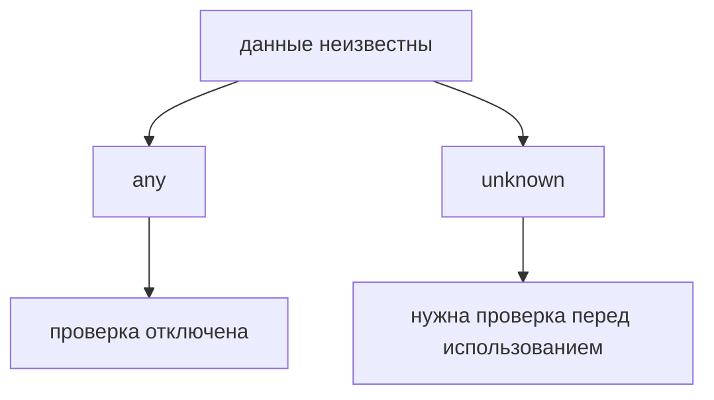
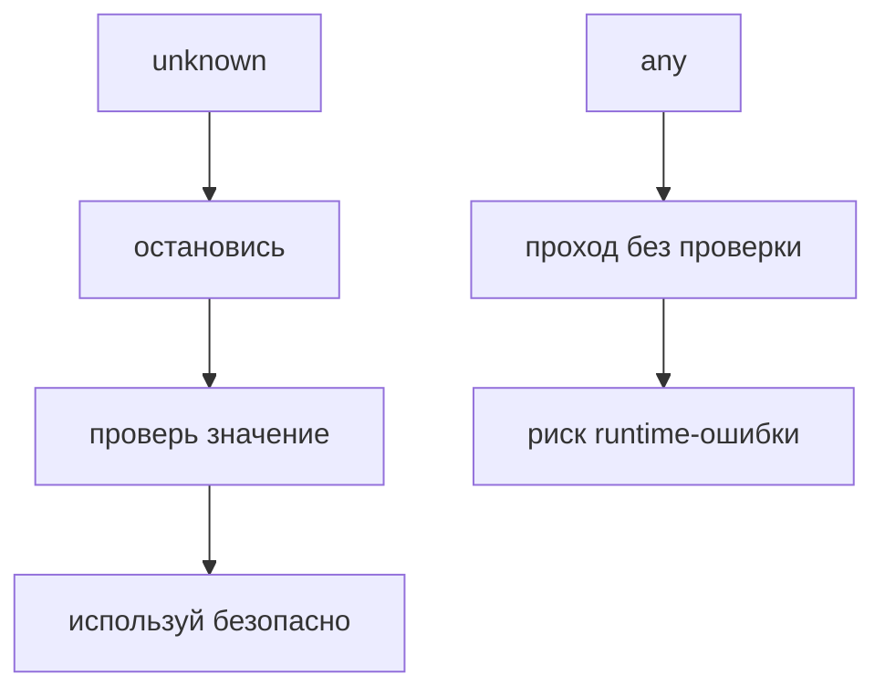

# any и unknown

## Связь с предыдущей главой

Предыдущая глава показала типы для известных примитивных значений.

Но в реальном проекте не все данные сразу понятны: часть приходит из внешних источников, файлов, API или пользовательского ввода.

## Главный вопрос

> Как описывать данные, тип которых пока неизвестен?

Короткий ответ: `any` отключает проверку, а `unknown` сохраняет проверку и требует сначала убедиться, что с данными можно безопасно работать.

## Мотивация

В JavaScript внешние данные часто приходят без гарантий.

Например, API response может содержать не то, что ожидал helper.

Если в TypeScript обозначить такие данные как `any`, компилятор перестает защищать код.

Если использовать `unknown`, TypeScript заставляет сначала проверить значение.

## Теория

`any` означает: "не проверяй это значение".

```typescript
const responseBody: any = '{ "status": "ok" }';
```

С таким значением TypeScript почти ничего не запрещает.

`unknown` означает: "тип пока неизвестен".

```typescript
const responseBody: unknown = '{ "status": "ok" }';
```

Перед использованием нужно проверить, что это за значение.



## Внутренний механизм

`any` выводит значение из нормальной проверки TypeScript.

Компилятор разрешает обращаться к свойствам, вызывать методы и передавать значение почти куда угодно.

`unknown` работает иначе.

TypeScript не разрешит использовать значение как строку, число или объект, пока код не уточнит это проверкой.

```typescript
function printValue(value: unknown) {
  if (typeof value === 'string') {
    console.log(value.toUpperCase());
  }
}
```

Здесь проверка `typeof` делает работу со строкой безопасной.

## Главная ментальная модель



`unknown` — это честное признание неопределенности.

`any` — это временное отключение TypeScript.

## Практические примеры

Примеры находятся в:

```text
examples/02-typescript/chapter-104/
```

`01-any-loses-checking.ts` показывает потерю проверки.

`02-unknown-requires-check.ts` показывает безопасную проверку перед использованием.

`03-api-data.ts` показывает внешний источник данных.

## Automation QA

В QA-проектах неизвестные данные часто приходят из API:

```typescript
const rawBody: unknown = JSON.parse('{"status":"ok"}');
```

До проверки TypeScript не должен позволять обращаться к `rawBody.status`.

Такой подход помогает не доверять внешним данным автоматически.

## Распространённые ошибки

### Ошибка 1. Использовать `any`, чтобы убрать ошибку

Ошибка исчезает из компилятора, но риск остается в runtime.

### Ошибка 2. Использовать `unknown` без проверки

`unknown` требует уточнения перед использованием.

### Ошибка 3. Думать, что `unknown` проверяет данные сам

`unknown` не валидирует runtime-данные. Он заставляет написать проверку в коде.

## Практика

Практика находится в:

```text
practice/02-typescript/104-any-and-unknown.md
```

Решения находятся в:

```text
solutions/02-typescript/104-any-and-unknown.md
```

## Краткие итоги

Главное:

* `any` отключает значимую часть проверки TypeScript;
* `unknown` сохраняет безопасность;
* неизвестные данные нужно проверять перед использованием;
* `unknown` полезен для API, config и внешних источников;
* `any` допустим только как временная техническая мера.

## Переход

Теперь мы умеем описывать как известные, так и неизвестные значения.

Дальше нужно разобраться с функциями, которые ничего не возвращают или вообще не могут завершиться обычным результатом.
