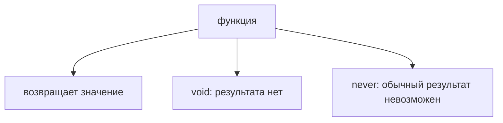
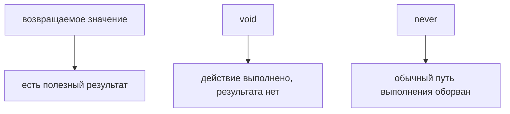

# void и never

## Связь с предыдущей главой

Предыдущая глава показала, как описывать неизвестные данные через `unknown` и почему опасно отключать проверку через `any`.

Теперь посмотрим на особые результаты функций: отсутствие результата и невозможность получить обычный результат.

## Главный вопрос

> Как типизировать отсутствие результата и невозможный результат?

Короткий ответ: `void` описывает функцию, которая не возвращает полезное значение, а `never` описывает ситуацию, где обычный результат невозможен.

## Мотивация

В JavaScript функция может:

* вернуть значение;
* ничего не вернуть;
* выбросить ошибку;
* никогда не дойти до конца.

TypeScript помогает сделать это намерение видимым.

Для QA-кода это важно в helpers, assertions и error handling.

## Теория

`void` обычно используют для функций, которые выполняют действие, но не возвращают полезный результат.

```typescript
function logStep(message: string): void {
  console.log(message);
}
```

`never` означает, что функция не возвращает обычный результат.

```typescript
function failTest(message: string): never {
  throw new Error(message);
}
```



## Внутренний механизм

Если функция помечена как `void`, TypeScript не ожидает от нее полезного возвращаемого значения.

Если функция помечена как `never`, TypeScript понимает, что после ее вызова выполнение обычным образом не продолжается.

```typescript
function fail(message: string): never {
  throw new Error(message);
}
```

В этой главе важно понять идею: не каждый вызов функции дает значение для дальнейшей работы.

## Главная ментальная модель



`void` — нет полезного значения.

`never` — нет обычного завершения.

## Практические примеры

Примеры находятся в:

```text
examples/02-typescript/chapter-105/
```

`01-void-logger.ts` показывает функцию-действие.

`02-never-throws.ts` показывает функцию, которая всегда бросает ошибку.

`03-assertion-helper.ts` показывает QA-helper для обязательного значения.

## Automation QA

В Automation QA `void` часто подходит для логирования:

```typescript
function writeStep(stepName: string): void {
  console.log(`step: ${stepName}`);
}
```

`never` полезен для helpers, которые останавливают выполнение через ошибку:

```typescript
function missingConfig(name: string): never {
  throw new Error(`Missing config: ${name}`);
}
```

## Распространённые ошибки

### Ошибка 1. Ожидать значение от `void`-функции

`void` означает, что полезного результата нет.

### Ошибка 2. Использовать `never` для обычной функции

`never` нужен только там, где нормальный результат невозможен.

### Ошибка 3. Думать, что `void` и `undefined` — одно и то же намерение

`void` описывает отсутствие полезного результата функции, а `undefined` является значением JavaScript.

## Практика

Практика находится в:

```text
practice/02-typescript/105-void-and-never.md
```

Решения находятся в:

```text
solutions/02-typescript/105-void-and-never.md
```

## Краткие итоги

Главное:

* `void` описывает отсутствие полезного результата;
* `never` описывает невозможность обычного результата;
* `throw` часто связан с `never`;
* эти типы помогают точнее описывать функции;
* в QA-коде они полезны для logging, assertions и config helpers.

## Переход

Теперь мы умеем описывать одиночные значения и результаты функций.

Следующий шаг — коллекции однотипных значений.
