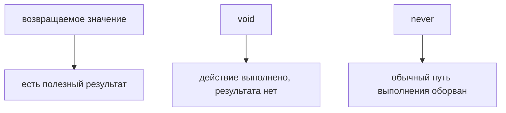

# void и never

## Связь с предыдущей главой

Предыдущая глава показала, как описывать неизвестные данные через `unknown` и почему опасно отключать проверку через `any`.

Теперь посмотрим на особые результаты функций: отсутствие результата и невозможность получить обычный результат.

## Главный вопрос

> Как типизировать отсутствие результата и невозможный результат?

Короткий ответ: `void` описывает функцию, которая не возвращает полезное значение, а `never` описывает ситуацию, где обычный результат невозможен.

## Мотивация

В JavaScript функция может:

* вернуть значение;
* ничего не вернуть;
* выбросить ошибку;
* никогда не дойти до конца.

TypeScript помогает сделать это намерение видимым.

Для QA-кода это важно в helpers, assertions и error handling.

## Теория

### `void` — нет полезного результата

`void` описывает функцию, которая выполняет действие и не возвращает значения для дальнейшей работы:

```typescript
function logStep(message: string): void {
  console.log(message);
}
```

Обращение к результату такой функции бессмысленно: значения нет.

### `void` в типе функции работает мягче

Неочевидное правило, о которое спотыкаются регулярно.

Когда `void` стоит в **типе функции**, реализация всё же может вернуть значение — оно просто игнорируется:

```typescript
type Handler = () => void;

const handler: Handler = () => 42;   // допустимо
```

Так сделано намеренно, и благодаря этому работает распространённый приём:

```typescript
const source = [1, 2, 3];
const target: number[] = [];

source.forEach(value => target.push(value));
```

`push` возвращает число, а `forEach` ожидает `void`. Без этого послабления пришлось бы писать тело в фигурных скобках.

Смысл правила: `void` здесь означает «результат не будет использован», а не «его не должно быть».

### `never` — обычного завершения нет

`never` описывает функцию, которая не возвращает управление нормальным путём:

```typescript
function failTest(message: string): never {
  throw new Error(message);
}
```

Разница с `void` принципиальная: функция типа `void` завершается и возвращает управление, просто без значения. Функция типа `never` не завершается обычным образом — она выбрасывает исключение или никогда не заканчивается.

### `never` как результат сужения

Второе применение `never` — не объявление, а следствие. Когда сужение исчерпало все варианты, остаётся тип `never`.

Это даёт проверку полноты разбора:

```typescript
type Status = 'passed' | 'failed' | 'skipped';

function describe(status: Status): string {
  switch (status) {
    case 'passed': return 'успех';
    case 'failed': return 'падение';
    case 'skipped': return 'пропуск';
    default: {
      const exhaustive: never = status;
      throw new Error(`Неизвестный статус: ${String(exhaustive)}`);
    }
  }
}
```

Пока все варианты разобраны, в `default` попадает `never` и присваивание проходит. Стоит добавить в `Status` четвёртое значение — присваивание сломается, и компилятор укажет на функцию, которую забыли обновить.

Для тестового кода это очень практично: список статусов, ролей или окружений расширяется, и компилятор сам находит все места, требующие правки.

### `never` в объединениях исчезает

`never` — тип, у которого нет ни одного значения. Поэтому в объединении он растворяется:

```typescript
type A = string | never;   // это просто string
```

Отсюда и смысл названия: значения такого типа не существует, а значит функция, «возвращающая» его, вернуть ничего не может.

### `void` и `undefined` — разные вещи

`undefined` — настоящее значение JavaScript, его можно присвоить и передать.

`void` — утверждение о функции: её результат не предназначен для использования. Функция с типом `void` фактически возвращает `undefined`, но тип выражает намерение, а не значение.

## Внутренний механизм

Если функция помечена как `void`, TypeScript не ожидает от нее полезного возвращаемого значения.

Если функция помечена как `never`, TypeScript понимает, что после ее вызова выполнение обычным образом не продолжается.

```typescript
function fail(message: string): never {
  throw new Error(message);
}
```

В этой главе важно понять идею: не каждый вызов функции дает значение для дальнейшей работы.

## Главная ментальная модель



`void` — нет полезного значения.

`never` — нет обычного завершения.

## Практические примеры

Примеры находятся в:

```text
examples/02-typescript/chapter-105/
```

`01-void-logger.ts` показывает функцию-действие.

`02-never-throws.ts` показывает функцию, которая всегда бросает ошибку.

`03-assertion-helper.ts` показывает QA-helper для обязательного значения.

## Automation QA

В Automation QA `void` часто подходит для логирования:

```typescript
function writeStep(stepName: string): void {
  console.log(`step: ${stepName}`);
}
```

`never` полезен для helpers, которые останавливают выполнение через ошибку:

```typescript
function missingConfig(name: string): never {
  throw new Error(`Missing config: ${name}`);
}
```

## Распространённые ошибки

### Ошибка 1. Ожидать значение от `void`-функции

`void` означает, что полезного результата нет.

### Ошибка 2. Использовать `never` для обычной функции

`never` нужен только там, где нормальный результат невозможен.

### Ошибка 3. Думать, что `void` и `undefined` — одно и то же намерение

`void` описывает отсутствие полезного результата функции, а `undefined` является значением JavaScript.

## Распространённые мифы

**Миф: функция типа `void` не может содержать `return`.**
Может: `return` без значения завершает функцию. А в позиции типа функции допустим и `return` со значением — оно игнорируется.

**Миф: `void` и `undefined` — синонимы.**
`undefined` — значение, `void` — утверждение о том, что результат не используется.

**Миф: `never` нужен только для функций, бросающих исключения.**
Второе и более частое применение — проверка полноты разбора вариантов.

**Миф: `never` можно присвоить любому значению.**
Наоборот: `never` присваивается куда угодно, но ему нельзя присвоить ничего. Значений этого типа не существует.

## Частые вопросы

**Когда писать `: void` явно?**
Обычно не нужно — вывод справится. Полезно на публичных границах, чтобы намерение «результата нет» было видно при чтении.

**Почему `forEach(x => arr.push(x))` компилируется, хотя `push` возвращает число?**
Потому что в позиции типа функции `void` означает «результат не будет использован», и возвращаемое значение игнорируется.

**Как проверить, что разобраны все варианты объединения?**
Присвоить значение переменной типа `never` в ветке `default`. Появление нового варианта сломает присваивание.

**Функция иногда бросает исключение, иногда возвращает значение. Это `never`?**
Нет. `never` подходит, только если обычного завершения не бывает никогда. Иначе тип — то, что возвращается в нормальном случае.

## Проверьте себя

1. В чём принципиальная разница между `void` и `never` по завершению функции?
2. Почему реализация типа `() => void` может возвращать значение?
3. Как `never` помогает поймать забытый вариант при расширении объединения?
4. Почему `string | never` — это просто `string`?
5. Чем `void` отличается от `undefined`?

## Практика

Практика находится в:

```text
practice/02-typescript/105-void-and-never.md
```

Решения находятся в:

```text
solutions/02-typescript/105-void-and-never.md
```

## Краткие итоги

Главное:

* `void` описывает отсутствие полезного результата;
* `never` описывает невозможность обычного результата;
* `throw` часто связан с `never`;
* эти типы помогают точнее описывать функции;
* в QA-коде они полезны для logging, assertions и config helpers.

## Переход

Теперь мы умеем описывать одиночные значения и результаты функций.

Следующий шаг — коллекции однотипных значений.
