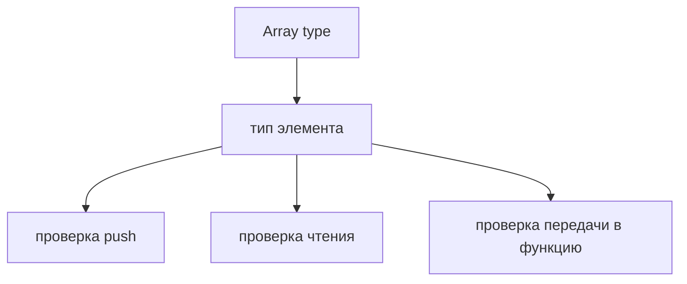
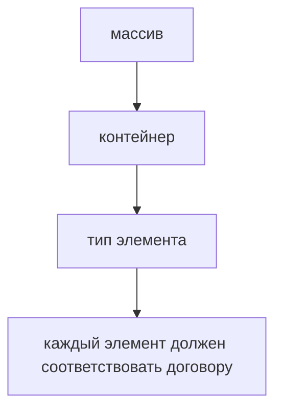

# Arrays

## Связь с предыдущей главой

Предыдущая глава показала, как TypeScript описывает результат функции.

Теперь перейдем к коллекциям: как описывать массивы значений одного ожидаемого типа.

## Главный вопрос

> Как TypeScript защищает массив от элементов неправильного типа?

Короткий ответ: TypeScript связывает массив с типом его элементов и проверяет добавление, чтение и передачу элементов между функциями.

## Мотивация

В JavaScript массив может содержать значения разных типов.

Иногда это намеренно.

Но чаще в QA-коде массив ожидается однотипным:

* список URL;
* список test users;
* список статус-кодов;
* список названий suites.

Если в такой массив случайно попадет значение другого типа, ошибка может проявиться далеко от места добавления.

## Теория

Массив можно описать двумя основными способами:

```typescript
const testNames: string[] = ['login', 'checkout'];
const statusCodes: Array<number> = [200, 201, 204];
```

`string[]` и `Array<string>` описывают массив строк.

`number[]` и `Array<number>` описывают массив чисел.



## Внутренний механизм

TypeScript проверяет не сам массив в runtime, а операции с ним в коде.

```typescript
const retries: number[] = [1, 2, 3];
```

После такой записи TypeScript ожидает, что элементы массива — числа.

Если добавить строку, компилятор покажет ошибку.

`ReadonlyArray<T>` описывает массив, который не должен изменяться через этот TypeScript-договор.

```typescript
const suites: ReadonlyArray<string> = ['smoke', 'regression'];
```

## Главная ментальная модель



Массив в TypeScript — это контейнер с ожидаемым типом элементов.

## Практические примеры

Примеры находятся в:

```text
examples/02-typescript/chapter-106/
```

`01-string-array.ts` показывает массив строк.

`02-array-of-objects.ts` показывает массив простых объектов.

`03-readonly-array.ts` показывает `ReadonlyArray`.

## Automation QA

В QA-проекте массивы часто описывают test data:

```typescript
const environments: string[] = ['local', 'staging', 'production'];
const expectedStatusCodes: number[] = [200, 201, 204];
```

Так TypeScript помогает не смешивать значения, которые должны обрабатываться одинаково.

## Распространённые ошибки

### Ошибка 1. Смешивать типы в массиве без необходимости

Если массив должен быть однотипным, лучше описать это явно.

### Ошибка 2. Думать, что `ReadonlyArray` делает runtime-значение неизменяемым

`ReadonlyArray` ограничивает операции через TypeScript-договор, но runtime остается JavaScript.

### Ошибка 3. Использовать слишком общий тип

Если массив строк описать слишком широко, TypeScript хуже помогает при рефакторинге.

## Практика

Практика находится в:

```text
practice/02-typescript/106-arrays.md
```

Решения находятся в:

```text
solutions/02-typescript/106-arrays.md
```

## Краткие итоги

Главное:

* массив связывается с типом элемента;
* `T[]` и `Array<T>` описывают одну идею;
* TypeScript проверяет операции с элементами;
* `ReadonlyArray` полезен для данных, которые не должны меняться через TypeScript-договор;
* массивы часто используются как коллекции тестовых данных.

## Переход

Массивы описывают коллекции однотипных элементов.

Но иногда важен не только тип элемента, а точная длина и порядок позиций. Это задача tuple.
