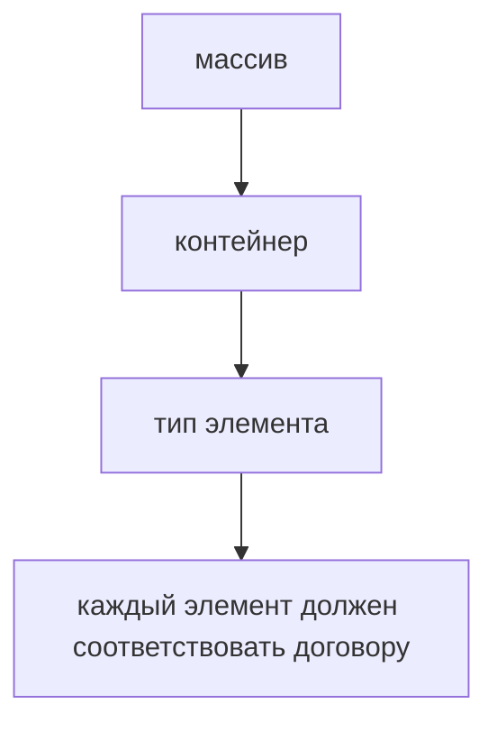

# Arrays

## Связь с предыдущей главой

Предыдущая глава показала, как TypeScript описывает результат функции.

Теперь перейдем к коллекциям: как описывать массивы значений одного ожидаемого типа.

## Главный вопрос

> Как TypeScript защищает массив от элементов неправильного типа?

Короткий ответ: TypeScript связывает массив с типом его элементов и проверяет добавление, чтение и передачу элементов между функциями.

## Мотивация

В JavaScript массив может содержать значения разных типов.

Иногда это намеренно.

Но чаще в QA-коде массив ожидается однотипным:

* список URL;
* список test users;
* список статус-кодов;
* список названий suites.

Если в такой массив случайно попадет значение другого типа, ошибка может проявиться далеко от места добавления.

## Теория

### Две записи одного типа

Массив описывается двумя равнозначными способами:

```typescript
const testNames: string[] = ['login', 'checkout'];
const statusCodes: Array<number> = [200, 201, 204];
```

`string[]` и `Array<string>` означают одно и то же. Первая запись короче и встречается чаще; вторая удобнее, когда тип элемента сам по себе сложный.

### Вывод типа массива

Из литерала массива тип выводится по элементам:

```typescript
const codes = [200, 404];        // number[]
const mixed = [200, 'ok'];       // (number | string)[]
const empty = [];                // any[] — выводить не из чего
```

Последняя строка — ловушка: пустой массив без аннотации получает `any[]`, и проверка элементов отключается. Пустой массив всегда стоит аннотировать.

Обратите внимание и на вторую строку: смешанный литерал даёт массив объединения, а не ошибку. Если смешение не задумано, это нужно ловить аннотацией.

### Индекс не гарантирует наличие элемента

Важнейшее практическое свойство, о котором молчит тип.

```typescript
const items: string[] = [];
const first = items[0];     // тип: string
console.log(first.length);  // компилируется, падает во время выполнения
```

Тип говорит `string`, но в массиве ничего нет. По умолчанию TypeScript считает, что обращение по индексу всегда даёт элемент — это сознательное упрощение ради удобства.

Включить честное поведение можно настройкой:

```json
{ "compilerOptions": { "noUncheckedIndexedAccess": true } }
```

Тогда `items[0]` получит тип `string | undefined`, и компилятор потребует проверку. Для тестового кода, где массивы часто приходят из ответов API, это настройка с высокой отдачей.

Методы поиска ведут себя честно и без неё: `find` возвращает `T | undefined`, `at` — тоже.

### `readonly` ограничивает договор, а не значение

```typescript
const suites: readonly string[] = ['smoke', 'regression'];
suites.push('unit');   // ошибка компиляции
```

Запись `readonly string[]` и `ReadonlyArray<string>` равнозначны. Они убирают из типа изменяющие методы, поэтому компилятор не даст их вызвать.

Но это договор времени компиляции: после стирания типов остаётся обычный массив, и ничто не мешает изменить его в обход проверки. `readonly` защищает от случайной ошибки в своём коде, а не от изменения извне.

Полезное применение — параметры функций: `readonly` в сигнатуре сообщает, что функция не изменит переданный массив.

### Массивы объектов и структурная проверка

```typescript
type Task = { id: string; done: boolean };

const tasks: Task[] = [
  { id: 'a', done: false },
  { id: 'b', done: true }
];
```

Проверка структурная: подойдёт любой объект с нужными свойствами подходящих типов. Лишние свойства в переменной допустимы, но в литерале, записанном прямо в месте присваивания, вызовут ошибку — это защита от опечаток в имени поля.

### Массив не проверяется во время выполнения

Как и всё остальное в системе типов, тип массива стирается. Если из API пришёл массив с элементами другой формы, компилятор об этом не узнает — понадобится проверка на границе.

## Внутренний механизм

TypeScript проверяет не сам массив в runtime, а операции с ним в коде.

```typescript
const retries: number[] = [1, 2, 3];
```

После такой записи TypeScript ожидает, что элементы массива — числа.

Если добавить строку, компилятор покажет ошибку.

`ReadonlyArray<T>` описывает массив, который не должен изменяться через этот TypeScript-договор.

```typescript
const suites: ReadonlyArray<string> = ['smoke', 'regression'];
```

## Главная ментальная модель



Массив в TypeScript — это контейнер с ожидаемым типом элементов.

## Практические примеры

Примеры находятся в:

```text
examples/02-typescript/chapter-106/
```

`01-string-array.ts` показывает массив строк.

`02-array-of-objects.ts` показывает массив простых объектов.

`03-readonly-array.ts` показывает `ReadonlyArray`.

## Automation QA

В QA-проекте массивы часто описывают test data:

```typescript
const environments: string[] = ['local', 'staging', 'production'];
const expectedStatusCodes: number[] = [200, 201, 204];
```

Так TypeScript помогает не смешивать значения, которые должны обрабатываться одинаково.

## Распространённые ошибки

### Ошибка 1. Смешивать типы в массиве без необходимости

Если массив должен быть однотипным, лучше описать это явно.

### Ошибка 2. Думать, что `ReadonlyArray` делает runtime-значение неизменяемым

`ReadonlyArray` ограничивает операции через TypeScript-договор, но runtime остается JavaScript.

### Ошибка 3. Использовать слишком общий тип

Если массив строк описать слишком широко, TypeScript хуже помогает при рефакторинге.

## Распространённые мифы

**Миф: `string[]` и `Array<string>` чем-то отличаются.**
Это две записи одного типа. Выбор — вопрос стиля.

**Миф: `readonly` делает массив неизменяемым.**
Он убирает изменяющие методы из типа. Во время выполнения остаётся обычный массив.

**Миф: если тип элемента `string`, то `arr[0]` точно строка.**
По умолчанию — только по предположению компилятора. Массив может быть пустым; честное поведение включает `noUncheckedIndexedAccess`.

**Миф: пустой массив получит нужный тип из первого добавленного элемента.**
Он получит `any[]` сразу при объявлении. Тип нужно указать явно.

## Частые вопросы

**Почему `items[0].length` падает, хотя компилятор не возражал?**
Обращение по индексу по умолчанию не учитывает, что элемента может не быть. Помогают `noUncheckedIndexedAccess`, `at()` или `find()`.

**Когда использовать `readonly` для массивов?**
В параметрах функций и в данных, которые не должны меняться. Это выражает намерение и ловит случайные изменения.

**Как описать массив из двух элементов разного типа?**
Это кортеж — тема отдельной главы. Массив описывает произвольное количество однотипных элементов.

**Нужно ли проверять массив из ответа API?**
Да. Тип описывает ожидание; реальную форму нужно проверять на границе, как и для любых внешних данных.

## Проверьте себя

1. Чем `string[]` отличается от `Array<string>`?
2. Какой тип получит `const empty = []` и почему это опасно?
3. Что на самом деле означает тип `string` у выражения `items[0]`?
4. Что даёт `noUncheckedIndexedAccess` и кому это особенно полезно?
5. От чего защищает `readonly` и от чего не защищает?

## Практика

Практика находится в:

```text
practice/02-typescript/106-arrays.md
```

Решения находятся в:

```text
solutions/02-typescript/106-arrays.md
```

## Краткие итоги

Главное:

* массив связывается с типом элемента;
* `T[]` и `Array<T>` описывают одну идею;
* TypeScript проверяет операции с элементами;
* `ReadonlyArray` полезен для данных, которые не должны меняться через TypeScript-договор;
* массивы часто используются как коллекции тестовых данных.

## Переход

Массивы описывают коллекции однотипных элементов.

Но иногда важен не только тип элемента, а точная длина и порядок позиций. Это задача tuple.
