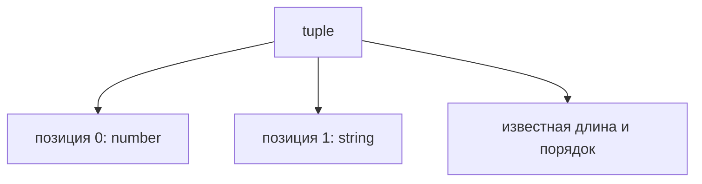
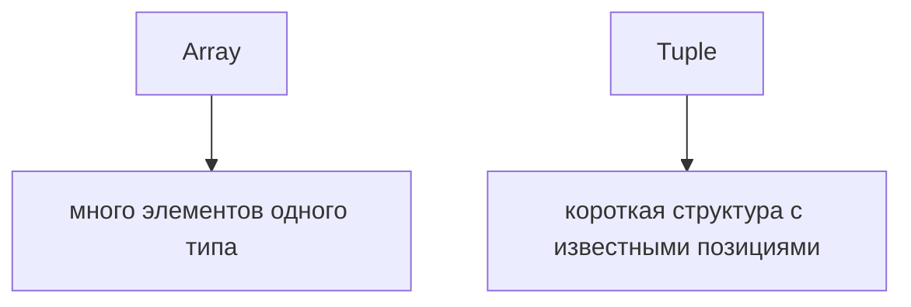

# Tuples

## Связь с предыдущей главой

Предыдущая глава показала массив как коллекцию однотипных элементов.

Tuple нужен для другой ситуации: когда массив используется как короткая структура с фиксированными позициями.

## Главный вопрос

> Когда массив превращается в структуру фиксированной формы?

Короткий ответ: tuple используют, когда важны длина, порядок и тип каждой позиции.

## Мотивация

В JavaScript массив может быть просто списком.

Но иногда массив означает не "много одинаковых элементов", а "несколько значений в известном порядке".

Например:

* `[statusCode, statusText]`;
* `[name, enabled]`;
* `[x, y]`.

Обычный массив не объясняет, что находится на каждой позиции.

Tuple делает эту договоренность явной.

## Теория

Tuple записывается как массив типов фиксированной формы:

```typescript
const result: [number, string] = [200, 'OK'];
```

Первая позиция должна быть числом.

Вторая позиция должна быть строкой.



Tuple может иметь optional element:

```typescript
const checkResult: [string, boolean, string?] = ['login', false, 'timeout'];
```

`readonly tuple` запрещает изменение через этот TypeScript-договор.

```typescript
const point: readonly [number, number] = [10, 20];
```

## Внутренний механизм

TypeScript проверяет позицию, а не только общий тип элемента.

```typescript
const response: [number, string] = [200, 'OK'];

const statusCode = response[0];
const statusText = response[1];
```

TypeScript понимает, что `response[0]` — число, а `response[1]` — строка.

Это отличается от обычного массива, где все элементы описываются одним общим типом.

## Главная ментальная модель



Tuple — это не просто массив.

Это позиционный договор.

## Практические примеры

Примеры находятся в:

```text
examples/02-typescript/chapter-107/
```

`01-basic-tuple.ts` показывает фиксированный порядок.

`02-optional-element.ts` показывает optional element.

`03-readonly-tuple.ts` показывает readonly tuple.

## Automation QA

Tuple может быть полезен для коротких технических результатов:

```typescript
const apiResult: [number, string] = [200, 'OK'];
```

Но если данных становится больше, лучше перейти к объекту.

Tuple удобен для компактной структуры, но хуже читается при большом количестве позиций.

## Распространённые ошибки

### Ошибка 1. Использовать tuple для больших структур

Если позиций много, объект обычно понятнее.

### Ошибка 2. Путать tuple с обычным массивом

Tuple описывает конкретные позиции, а массив — общий тип элементов.

### Ошибка 3. Игнорировать читаемость

`[string, number, boolean]` может быть технически корректно, но не всегда понятно без контекста.

## Практика

Практика находится в:

```text
practice/02-typescript/107-tuples.md
```

Решения находятся в:

```text
solutions/02-typescript/107-tuples.md
```

## Краткие итоги

Главное:

* tuple описывает фиксированную форму массива;
* важны длина, порядок и тип каждой позиции;
* optional element разрешает необязательную позицию;
* readonly tuple запрещает изменение через TypeScript-договор;
* для больших структур объект обычно читается лучше.

## Переход

Мы завершили базовый словарь типов: одиночные значения, неизвестные данные, результаты функций, массивы и tuple.

Следующий модуль перейдет к объектным контрактам: как TypeScript описывает форму объектов.
