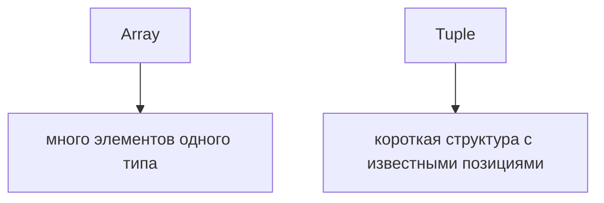

# Tuples

## Связь с предыдущей главой

Предыдущая глава показала массив как коллекцию однотипных элементов.

Tuple нужен для другой ситуации: когда массив используется как короткая структура с фиксированными позициями.

## Главный вопрос

> Когда массив превращается в структуру фиксированной формы?

Короткий ответ: tuple используют, когда важны длина, порядок и тип каждой позиции.

## Мотивация

В JavaScript массив может быть просто списком.

Но иногда массив означает не "много одинаковых элементов", а "несколько значений в известном порядке".

Например:

* `[statusCode, statusText]`;
* `[name, enabled]`;
* `[x, y]`.

Обычный массив не объясняет, что находится на каждой позиции.

Tuple делает эту договоренность явной.

## Теория

### Кортеж — позиционный договор

Tuple описывает массив фиксированной длины, где **каждая позиция имеет свой тип**:

```typescript
const result: [number, string] = [200, 'OK'];
```

Первая позиция обязана быть числом, вторая — строкой. Компилятор знает это при чтении:

```typescript
const statusCode = result[0];   // number
const statusText = result[1];   // string
```

В обычном массиве так не получится: там все элементы описаны одним типом.

### Кортеж не выводится сам

Важное практическое свойство: из литерала массива компилятор выводит **массив**, а не кортеж.

```typescript
const pair = [200, 'OK'];       // (string | number)[]
```

Чтобы получить кортеж, нужна либо аннотация, либо `as const`:

```typescript
const a: [number, string] = [200, 'OK'];
const b = [200, 'OK'] as const;   // readonly [200, "OK"]
```

Разница между ними существенна: `as const` даёт **readonly-кортеж с литеральными типами**, и его нельзя присвоить обычному изменяемому кортежу.

### Именованные позиции

У позиций могут быть имена — они не влияют на проверку, но радикально улучшают читаемость:

```typescript
type ApiResult = [status: number, text: string];
```

Редактор будет подсказывать `status` и `text` вместо безымянных индексов. Для кортежа, который живёт дольше пары строк, именование позиций почти обязательно.

### Необязательные и остаточные элементы

```typescript
type Check = [name: string, passed: boolean, comment?: string];
type Command = [name: string, ...args: number[]];
```

`?` делает позицию необязательной, `...` собирает произвольное число элементов одного типа. Так описываются, например, аргументы функций переменной длины.

### Когда кортеж, а когда объект

Кортеж силён в одном сценарии: **короткий результат, который сразу разбирается по местам**.

```typescript
const [status, text] = result;
```

Как только позиций становится больше трёх или порядок перестаёт быть очевидным, объект читается лучше: у свойств есть имена, их не нужно помнить по номерам, и добавление поля не ломает существующую деструктуризацию.

Практический ориентир: если при чтении кода приходится возвращаться к объявлению типа, чтобы понять, что в позиции 2, — нужен объект.

## Внутренний механизм

TypeScript проверяет позицию, а не только общий тип элемента.

```typescript
const response: [number, string] = [200, 'OK'];

const statusCode = response[0];
const statusText = response[1];
```

TypeScript понимает, что `response[0]` — число, а `response[1]` — строка.

Это отличается от обычного массива, где все элементы описываются одним общим типом.

## Главная ментальная модель



Tuple — это не просто массив.

Это позиционный договор.

## Практические примеры

Примеры находятся в:

```text
examples/02-typescript/chapter-107/
```

`01-basic-tuple.ts` показывает фиксированный порядок.

`02-optional-element.ts` показывает optional element.

`03-readonly-tuple.ts` показывает readonly tuple.

## Automation QA

Tuple может быть полезен для коротких технических результатов:

```typescript
const apiResult: [number, string] = [200, 'OK'];
```

Но если данных становится больше, лучше перейти к объекту.

Tuple удобен для компактной структуры, но хуже читается при большом количестве позиций.

## Распространённые ошибки

### Ошибка 1. Использовать tuple для больших структур

Если позиций много, объект обычно понятнее.

### Ошибка 2. Путать tuple с обычным массивом

Tuple описывает конкретные позиции, а массив — общий тип элементов.

### Ошибка 3. Игнорировать читаемость

`[string, number, boolean]` может быть технически корректно, но не всегда понятно без контекста.

## Распространённые мифы

**Миф: литерал `[200, 'OK']` — это кортеж.**
Без аннотации или `as const` компилятор выведет массив объединения.

**Миф: имена позиций влияют на проверку.**
Они только для чтения кода и подсказок редактора; на совместимость типов не влияют.

**Миф: `readonly`-кортеж можно передать туда, где ждут обычный.**
Нельзя: изменяемый кортеж допускает операции, запрещённые для readonly.

**Миф: кортеж — просто короткая запись массива.**
Это другой договор: фиксированная длина и тип для каждой позиции.

## Частые вопросы

**Почему моя переменная не подходит под тип кортежа?**
Скорее всего она выведена как массив. Добавьте аннотацию или `as const`.

**Когда использовать `as const`?**
Когда нужен неизменяемый набор фиксированных значений — например, справочник допустимых вариантов или пара, которую передают дальше без изменений.

**Сколько позиций допустимо?**
Технически сколько угодно, практически — две-три. Дальше выигрывает объект.

**Можно ли деструктурировать кортеж с пропуском?**
Да: `const [, text] = result`. Это одна из причин, почему кортежи удобны для коротких результатов.

## Проверьте себя

1. Чем кортеж отличается от массива с точки зрения проверки?
2. Какой тип получит `const pair = [200, 'OK']` и почему это не кортеж?
3. Что даёт `as const` применительно к литералу массива?
4. Зачем нужны имена позиций, если они не влияют на проверку?
5. По какому признаку выбирают объект вместо кортежа?

## Практика

Практика находится в:

```text
practice/02-typescript/107-tuples.md
```

Решения находятся в:

```text
solutions/02-typescript/107-tuples.md
```

## Краткие итоги

Главное:

* tuple описывает фиксированную форму массива;
* важны длина, порядок и тип каждой позиции;
* optional element разрешает необязательную позицию;
* readonly tuple запрещает изменение через TypeScript-договор;
* для больших структур объект обычно читается лучше.

## Переход

Мы завершили базовый словарь типов: одиночные значения, неизвестные данные, результаты функций, массивы и tuple.

Следующий модуль перейдет к объектным контрактам: как TypeScript описывает форму объектов.
