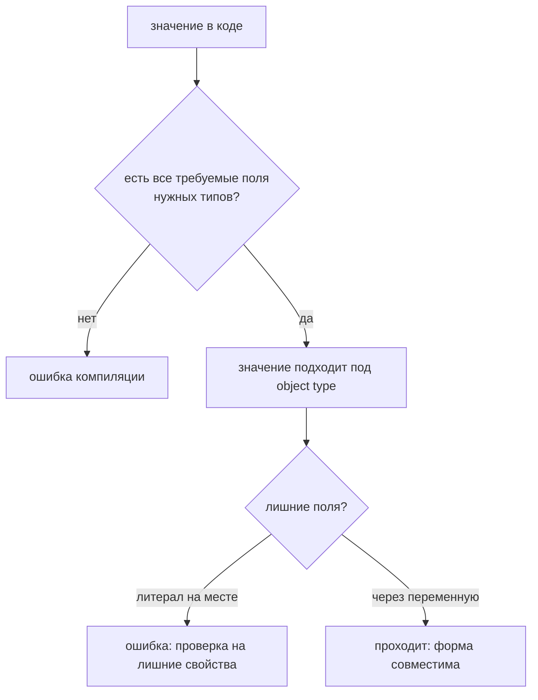

# Object Types

## Связь с предыдущей главой

Предыдущий модуль завершился tuple: короткой позиционной структурой.

В реальных проектах чаще важны не позиции, а именованные свойства объекта.

## Главный вопрос

> Как описать форму объекта в TypeScript?

Короткий ответ: object type описывает, какие свойства должен иметь объект и какие типы у этих свойств.

## Мотивация

В JavaScript объект легко передать с пропущенным или неверным свойством.

В QA-коде это особенно заметно в конфигурации, объектах ответа и тестовых данных.

TypeScript позволяет заранее описать форму объекта, чтобы ошибка стала видимой до runtime.

## Теория

### Форма важнее имени

Object type перечисляет свойства и их типы:

```typescript
const user: { id: number; name: string; active: boolean } = {
  id: 1,
  name: 'Anna',
  active: true,
};
```

Проверка **структурная**: значение подходит, если у него есть нужные свойства подходящих типов. Имя типа при этом роли не играет — два одинаково устроенных типа взаимозаменяемы.

Это отличает TypeScript от языков с номинальной типизацией, где совпадение имени обязательно.

### Проверка на лишние свойства

Структурность породила бы проблему: объект с лишними полями формально подходит. Поэтому для **литералов** действует дополнительная проверка:

```typescript
type Task = { id: string };

const direct: Task = { id: 'a', extra: 1 };   // ошибка: лишнее свойство

const prepared = { id: 'a', extra: 1 };
const indirect: Task = prepared;              // допустимо
```

Разница намеренная. Литерал, написанный прямо в месте присваивания, почти всегда означает опечатку в имени поля — и компилятор её ловит. Значение, пришедшее из переменной, может быть частью большего объекта, и это нормально.

### `object`, `Object` и `{}` — три разные вещи

Источник регулярной путаницы:

| Запись | Что означает | Принимает `42`? |
| --- | --- | --- |
| `object` | Любое непримитивное значение | Нет |
| `{}` | Любое значение, кроме `null` и `undefined` | Да |
| `Object` | Объектная обёртка | Да |

Ни одна из трёх записей не говорит о свойствах, поэтому все они почти бесполезны как описание данных. Если форма неизвестна — нужен `unknown` и проверка, а не `{}`.

### Вложенные объекты

Тип описывается рекурсивно:

```typescript
type WorkItem = {
  id: string;
  owner: { id: string; login: string };
};
```

Вложенный тип, который используется больше одного раза, стоит вынести в отдельное имя — иначе описание разрастается и дублируется.

### Inline или именованный тип

Inline-запись уместна для разового описания в одном месте. Как только форма встречается второй раз, её выносят в имя — это тема главы 111.

Практический признак: если тип не помещается в одну строку сигнатуры и мешает её читать, ему пора дать имя.

### Форма проверяется до запуска

Object type описывает ожидание компилятора и исчезает после компиляции. Если объект пришёл из сети или файла, его реальная форма может отличаться — нужна проверка во время выполнения.

Проверка идёт по форме, а не по имени типа:



## Внутренний механизм

TypeScript проверяет форму объекта на этапе компиляции.

Если объект должен иметь `id`, `name` и `active`, то отсутствие одного свойства нарушает договор.

В runtime объект остается обычным JavaScript-объектом.

## Главная ментальная модель

Object type — это чертеж объекта.

Чертеж не создает объект в runtime, но помогает компилятору проверить, что объект собран в ожидаемой форме.

## Практические примеры

Примеры находятся в:

```text
examples/02-typescript/chapter-108/
```

`01-required-properties.ts` показывает обязательные свойства.

`02-nested-object.ts` показывает вложенный объект.

`03-response-object.ts` показывает объект ответа.

## Automation QA

Object types удобны для тестовых данных и краткого описания API-ответа:

```typescript
const response: { statusCode: number; statusText: string } = {
  statusCode: 200,
  statusText: 'OK',
};
```

Так helper сразу видит ожидаемую форму данных.

## Распространённые ошибки

### Ошибка 1. Описывать объект слишком широко

Если использовать просто `object`, TypeScript почти ничего не знает о свойствах.

### Ошибка 2. Полагаться только на имя переменной

Имя `user` не объясняет форму объекта. Object type делает форму явной.

### Ошибка 3. Ожидать runtime-проверку

Object type проверяет код до запуска, но не валидирует внешние данные в runtime.

## Распространённые мифы

**Миф: типы с разными именами несовместимы.**
Проверка структурная: совпадает форма — значения взаимозаменяемы.

**Миф: лишние свойства запрещены всегда.**
Только в литерале на месте присваивания. Через переменную они проходят.

**Миф: `{}` означает «пустой объект».**
Он означает «любое значение, кроме `null` и `undefined`», включая числа и строки.

**Миф: object type проверяет данные из API.**
Он проверяет код. Форма ответа известна только во время выполнения.

## Частые вопросы

**Почему объект с лишним полем проходит через переменную, но не напрямую?**
Проверка на лишние свойства применяется к литералам: там лишнее поле обычно опечатка. Через переменную объект может быть частью большего целого.

**Что использовать, если форма объекта неизвестна?**
`unknown` и проверку. `{}` и `object` не дают ни информации, ни безопасности.

**Когда выносить вложенный тип в отдельное имя?**
Когда он встречается второй раз или мешает читать сигнатуру.

**Нужно ли описывать все свойства ответа API?**
Достаточно тех, которые используются. Описание лишнего создаёт ложное ощущение контроля над полями, которые никто не проверяет.

## Проверьте себя

1. Что означает структурная проверка типов?
2. Почему литерал с лишним свойством вызывает ошибку, а переменная — нет?
3. Чем различаются `object`, `{}` и `Object`?
4. Что использовать вместо `{}`, если форма значения неизвестна?
5. Проверяет ли object type данные, пришедшие из сети?

## Практика

Практика находится в:

```text
practice/02-typescript/108-object-types.md
```

Решения находятся в:

```text
solutions/02-typescript/108-object-types.md
```

## Краткие итоги

Главное:

* object type описывает форму объекта;
* свойства могут быть обязательными;
* тип свойства проверяется отдельно;
* вложенные объекты описываются вложенной формой;
* runtime остается обычным JavaScript.

## Переход

Теперь мы умеем описывать обязательные свойства объекта.

Дальше нужно научиться описывать свойства, которые могут отсутствовать, и свойства, которые не должны переназначаться.
