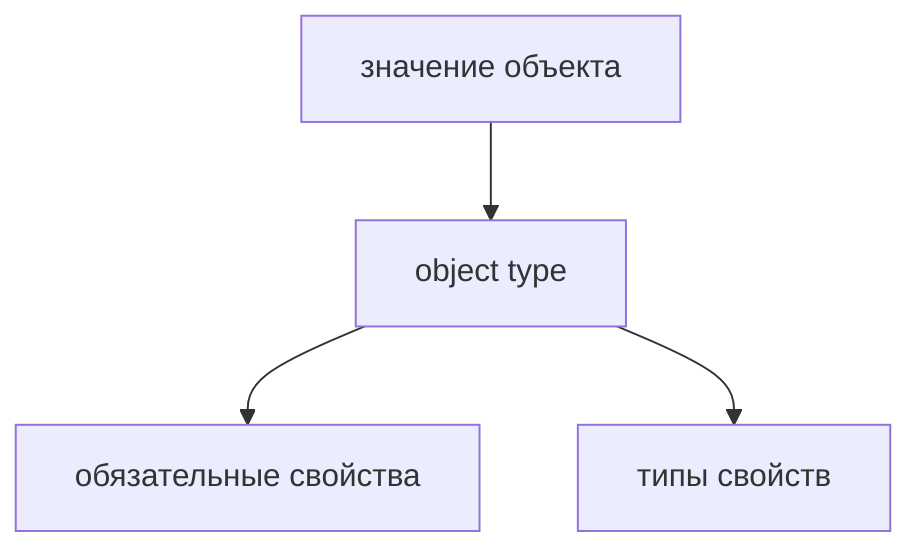

# Object Types

## Связь с предыдущей главой

Предыдущий модуль завершился tuple: короткой позиционной структурой.

В реальных проектах чаще важны не позиции, а именованные свойства объекта.

## Главный вопрос

> Как описать форму объекта в TypeScript?

Короткий ответ: object type описывает, какие свойства должен иметь объект и какие типы у этих свойств.

## Мотивация

В JavaScript объект легко передать с пропущенным или неверным свойством.

В QA-коде это особенно заметно в конфигурации, объектах ответа и тестовых данных.

TypeScript позволяет заранее описать форму объекта, чтобы ошибка стала видимой до runtime.

## Теория

Object type записывает свойства внутри фигурных скобок:

```typescript
const user: { id: number; name: string; active: boolean } = {
  id: 1,
  name: 'Anna',
  active: true,
};
```

Каждое свойство имеет имя и тип.



## Внутренний механизм

TypeScript проверяет форму объекта на этапе компиляции.

Если объект должен иметь `id`, `name` и `active`, то отсутствие одного свойства нарушает договор.

В runtime объект остается обычным JavaScript-объектом.

## Главная ментальная модель

Object type — это чертеж объекта.

Чертеж не создает объект в runtime, но помогает компилятору проверить, что объект собран в ожидаемой форме.

## Практические примеры

Примеры находятся в:

```text
examples/02-typescript/chapter-108/
```

`01-required-properties.ts` показывает обязательные свойства.

`02-nested-object.ts` показывает вложенный объект.

`03-response-object.ts` показывает объект ответа.

## Automation QA

Object types удобны для тестовых данных и краткого описания API-ответа:

```typescript
const response: { statusCode: number; statusText: string } = {
  statusCode: 200,
  statusText: 'OK',
};
```

Так helper сразу видит ожидаемую форму данных.

## Распространённые ошибки

### Ошибка 1. Описывать объект слишком широко

Если использовать просто `object`, TypeScript почти ничего не знает о свойствах.

### Ошибка 2. Полагаться только на имя переменной

Имя `user` не объясняет форму объекта. Object type делает форму явной.

### Ошибка 3. Ожидать runtime-проверку

Object type проверяет код до запуска, но не валидирует внешние данные в runtime.

## Практика

Практика находится в:

```text
practice/02-typescript/108-object-types.md
```

Решения находятся в:

```text
solutions/02-typescript/108-object-types.md
```

## Краткие итоги

Главное:

* object type описывает форму объекта;
* свойства могут быть обязательными;
* тип свойства проверяется отдельно;
* вложенные объекты описываются вложенной формой;
* runtime остается обычным JavaScript.

## Переход

Теперь мы умеем описывать обязательные свойства объекта.

Дальше нужно научиться описывать свойства, которые могут отсутствовать, и свойства, которые не должны переназначаться.
