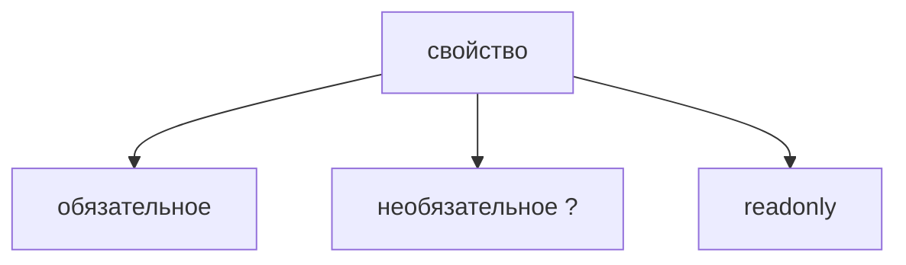

# Optional and Readonly Properties

## Связь с предыдущей главой

Предыдущая глава показала object type с обязательными свойствами.

Но в реальных объектах часть данных может отсутствовать, а часть свойств не должна изменяться после создания.

## Главный вопрос

> Как описывать необязательные и неизменяемые свойства?

Короткий ответ: `?` делает свойство необязательным, а `readonly` запрещает переназначать свойство через TypeScript-договор.

## Мотивация

В QA-проекте test metadata может содержать необязательный комментарий.

Configuration может иметь `readonly` поля, которые не должны меняться после загрузки.

TypeScript помогает показать эти намерения явно.

## Теория

Optional property записывается через `?`:

```typescript
const testResult: { name: string; errorMessage?: string } = {
  name: 'checkout submit',
};
```

Readonly property записывается через `readonly`:

```typescript
const config: { readonly baseUrl: string; timeoutMs: number } = {
  baseUrl: 'https://api.example.test',
  timeoutMs: 5000,
};
```



## Внутренний механизм

Optional property означает, что свойства может не быть в объекте.

Это не то же самое, что обязательное свойство со значением `undefined`.

В текущей конфигурации проверки явное значение `undefined` для optional property допустимо, но смысл свойства остается прежним: оно может отсутствовать.

`readonly` работает на этапе компиляции: TypeScript запрещает переназначение свойства через этот договор.

`readonly` не делает объект глубоко неизменяемым: если readonly-свойство хранит вложенный объект, его внутренние свойства остаются изменяемыми, пока они сами не описаны как `readonly`.

В runtime объект остается JavaScript-объектом.

## Главная ментальная модель

Optional property отвечает на вопрос: "Это свойство обязательно есть?"

Readonly property отвечает на вопрос: "Можно ли переназначить это свойство через этот договор?"

## Практические примеры

Примеры находятся в:

```text
examples/02-typescript/chapter-109/
```

`01-optional-property.ts` показывает необязательное свойство.

`02-readonly-property.ts` показывает запрет переназначения.

`03-test-metadata.ts` показывает metadata для теста.

## Automation QA

Для test metadata можно описать обязательные и необязательные части:

```typescript
const metadata: {
  readonly testId: string;
  title: string;
  errorMessage?: string;
} = {
  testId: 'T-101',
  title: 'checkout submit',
};
```

## Распространённые ошибки

### Ошибка 1. Считать optional property обязательным

Перед использованием такого свойства нужно помнить, что его может не быть.

### Ошибка 2. Считать `readonly` runtime-защитой

`readonly` — проверка TypeScript, а не runtime-заморозка объекта.

### Ошибка 3. Путать отсутствие свойства и `undefined`

Это близкие, но не полностью одинаковые ситуации.

## Практика

Практика находится в:

```text
practice/02-typescript/109-optional-and-readonly-properties.md
```

Решения находятся в:

```text
solutions/02-typescript/109-optional-and-readonly-properties.md
```

## Краткие итоги

Главное:

* `?` делает свойство необязательным;
* `readonly` запрещает переназначение свойства через TypeScript;
* optional property может отсутствовать;
* `readonly` не создает неизменяемость во время выполнения;
* эти свойства полезны для конфигурации и metadata.

## Переход

Теперь мы умеем описывать известные свойства.

Дальше разберем объекты, у которых заранее неизвестны все ключи.
