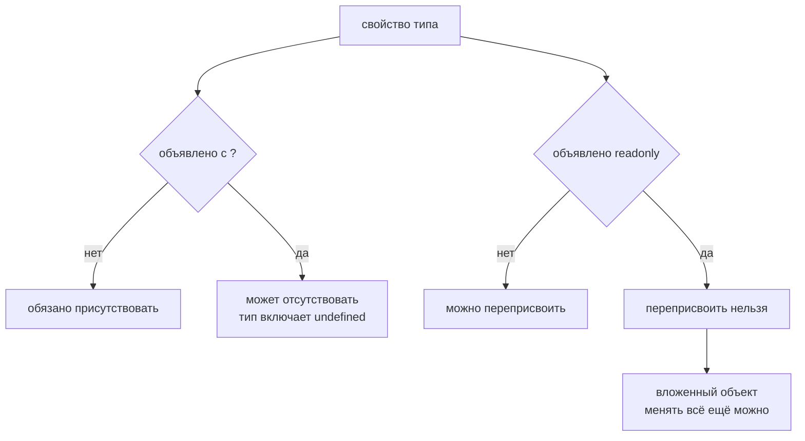

# Необязательные и неизменяемые свойства

## Связь с предыдущей главой

Предыдущая глава показала object type с обязательными свойствами.

Но в реальных объектах часть данных может отсутствовать, а часть свойств не должна изменяться после создания.

## Главный вопрос

> Как описывать необязательные и неизменяемые свойства?

Короткий ответ: `?` делает свойство необязательным, а `readonly` запрещает переназначать свойство через TypeScript-договор.

## Мотивация

В QA-проекте test metadata может содержать необязательный комментарий.

Configuration может иметь `readonly` поля, которые не должны меняться после загрузки.

TypeScript помогает показать эти намерения явно.

## Теория

### Необязательное свойство

`?` означает, что свойства **может не быть**:

```typescript
type TestResult = {
  name: string;
  errorMessage?: string;
};
```

Тип такого свойства при чтении становится `string | undefined`, поэтому использовать его без проверки нельзя:

```typescript
function describe(result: TestResult): string {
  return result.errorMessage.toUpperCase();   // ошибка: может быть undefined
}
```

Это и есть польза: необязательность перестаёт быть устной договорённостью и становится частью типа.

### Отсутствие свойства и `undefined` — не одно и то же

По умолчанию компилятор считает эти ситуации эквивалентными:

```typescript
const a: TestResult = { name: 'x' };                      // свойства нет
const b: TestResult = { name: 'x', errorMessage: undefined }; // свойство есть
```

Оба варианта допустимы. Но для JavaScript они различимы: `'errorMessage' in b` вернёт `true`, а `in a` — `false`. Разница проявляется при переборе ключей и при сериализации в JSON.

Настройка `exactOptionalPropertyTypes: true` делает различие строгим: тогда явное `undefined` перестаёт подходить под `?`, и придётся либо опускать свойство, либо объявлять тип как `string | undefined`.

### `readonly` запрещает переприсваивание

```typescript
type Config = {
  readonly baseUrl: string;
  timeoutMs: number;
};

config.baseUrl = 'other';   // ошибка компиляции
```

Это договор времени компиляции. После стирания типов остаётся обычный объект — `readonly` не вызывает `Object.freeze` и не защищает от изменения извне.

### `readonly` не глубокий

Частая ловушка:

```typescript
type Cfg = { readonly nested: { value: number } };

cfg.nested = { value: 2 };   // ошибка: переприсваивание запрещено
cfg.nested.value = 2;        // допустимо: внутреннее свойство изменяемо
```

`readonly` защищает **саму ссылку**, а не то, на что она указывает. Для вложенной неизменяемости каждое свойство нужно помечать отдельно.

### Необязательность — это решение, а не отсрочка

Пометить свойство как `?` легко, и поэтому это делают слишком часто. Каждое необязательное свойство добавляет ветку в каждом месте использования.

Полезно задавать вопрос: **что означает отсутствие этого свойства**? Если ответ «то же самое, что значение по умолчанию» — лучше сделать свойство обязательным и подставлять значение при создании. Необязательность оправдана, когда отсутствие несёт собственный смысл: ошибки не было, комментарий не оставлен, поле не заполнено.

### Модификаторы для всего типа

Частая задача — сделать необязательными или неизменяемыми все свойства сразу. Для этого существуют встроенные утилиты `Partial<T>` и `Readonly<T>`; подробно они разбираются в главе про служебные типы.

Два модификатора отвечают на разные вопросы:


```mermaid
flowchart TD
    A["свойство типа"] --> B{"объявлено с ?"}
    B -- "нет" --> C["обязано присутствовать"]
    B -- "да" --> D["может отсутствовать<br/>тип включает undefined"]
    A --> E{"объявлено readonly"}
    E -- "нет" --> F["можно переприсвоить"]
    E -- "да" --> G["переприсвоить нельзя"]
    G --> H["вложенный объект<br/>менять всё ещё можно"]
```

## Внутренний механизм

Необязательное свойство означает, что свойства может не быть в объекте.

Это не то же самое, что обязательное свойство со значением `undefined`.

В текущей конфигурации проверки явное значение `undefined` для необязательного свойства допустимо, но смысл свойства остаётся прежним: оно может отсутствовать.

`readonly` работает на этапе компиляции: TypeScript запрещает переназначение свойства через этот договор.

`readonly` не делает объект глубоко неизменяемым: если такое свойство хранит вложенный объект, его внутренние свойства остаются изменяемыми, пока они сами не описаны как `readonly`.

Во время выполнения объект остаётся обычным объектом JavaScript.

### Три состояния свойства

```ts
type A = { note: string };             // обязательно, всегда строка
type B = { note: string | undefined }; // обязательно, но может быть undefined
type C = { note?: string };            // может отсутствовать

const b: B = {};        // ошибка: свойство обязано быть
const c: C = {};        // разрешено
```

Разница между `B` и `C` видна именно здесь: во втором случае ключ обязан
присутствовать, пусть и со значением `undefined`. Для сравнения с ответом
сервиса это существенно — «поле не прислали» и «поле пустое» описываются
по-разному.

### `readonly` проверяется, но не действует

```ts
type Config = { readonly baseUrl: string };

const c: Config = { baseUrl: "…" };
c.baseUrl = "другой";               // ошибка компиляции

(c as { baseUrl: string }).baseUrl = "другой";   // ошибки нет
```

Модификатор существует только при проверке: приведение типа его снимает, а во
время выполнения объект остаётся обычным. К тому же он поверхностный — вложенный
объект под `readonly`-свойством меняется свободно.

| Нужно | Чем достигается |
| --- | --- |
| поймать присваивание при компиляции | `readonly` |
| запретить изменение в прогоне | `Object.freeze()` (тоже поверхностно) |
| защитить вложенное | `readonly` на каждом уровне |

## Главная ментальная модель

Необязательное свойство отвечает на вопрос: «Это свойство обязательно есть?»

Неизменяемое свойство отвечает на вопрос: «Можно ли переназначить его через этот договор?»

## Практические примеры

Примеры находятся в:

```text
examples/02-typescript/chapter-109/
```

`01-optional-property.ts` показывает необязательное свойство.

`02-readonly-property.ts` показывает запрет переназначения.

`03-test-metadata.ts` показывает метаданные теста.

## Automation QA

Для метаданных теста можно описать обязательные и необязательные части:

```typescript
const metadata: {
  readonly testId: string;
  title: string;
  errorMessage?: string;
} = {
  testId: 'T-101',
  title: 'checkout submit',
};
```

### Необязательное поле — это три разных случая

В отчёте и в ответе API отсутствие значения может означать разное, и тип
`errorMessage?: string` их не различает.

| Что пришло | Что означает |
| --- | --- |
| ключа нет | поле не применимо к этому результату |
| ключ есть, значение `undefined` | поле применимо, но не заполнено |
| ключ есть, значение `''` | поле заполнено пустым значением |

Различить их можно только через `Object.hasOwn`, а не сравнением с
`undefined`. Для отчёта это важно: «ошибки не было» и «ошибку не записали» —
разные состояния, и второе означает дефект диагностики.

### `readonly` фиксирует идентичность

Поле `testId` помечено `readonly` не из осторожности: идентичность теста —
это то, по чему сопоставляются запуски в истории. Если код может её изменить,
история перестаёт быть историей одного теста.

Полезное правило: `readonly` получают поля, по которым что-то сопоставляется
или ищется, — идентификаторы, имена, ключи.

## Распространённые ошибки

### Ошибка 1. Считать необязательное свойство обязательным

Перед использованием такого свойства нужно помнить, что его может не быть.

### Ошибка 2. Считать `readonly` защитой во время выполнения

`readonly` — проверка TypeScript, а не заморозка объекта во время выполнения.

### Ошибка 3. Путать отсутствие свойства и `undefined`

Это близкие, но не полностью одинаковые ситуации.

## Распространённые мифы

**Миф: `readonly` делает объект неизменяемым.**
Он запрещает переприсваивание свойства в коде. Во время выполнения объект обычный.

**Миф: `readonly` защищает вложенные объекты.**
Только верхний уровень. Внутренние свойства нужно помечать отдельно.

**Миф: отсутствующее свойство и `undefined` — одно и то же.**
Для типов по умолчанию — да, для JavaScript — нет: различие видно через `in`, перебор ключей и сериализацию.

**Миф: чем больше необязательных свойств, тем гибче тип.**
Каждое такое свойство добавляет проверку в каждом месте использования. Гибкость оплачивается ветвлением.

## Частые вопросы

**Когда делать свойство необязательным?**
Когда его отсутствие несёт отдельный смысл. Если отсутствие равнозначно значению по умолчанию — свойство лучше сделать обязательным.

**Чем `errorMessage?: string` отличается от `errorMessage: string | undefined`?**
Первое разрешает не указывать свойство вообще. Второе требует указать его явно, пусть и со значением `undefined`.

**Зачем нужен `exactOptionalPropertyTypes`?**
Чтобы «свойства нет» и «свойство есть со значением `undefined`» перестали считаться одним и тем же. Полезно там, где различие влияет на поведение — например, при сериализации.

**Как добиться настоящей неизменяемости?**
Во время выполнения — `Object.freeze`. Но для защиты от собственных ошибок в коде обычно достаточно `readonly`.

## Проверьте себя

1. Какой тип получает необязательное свойство при чтении?
2. Чем отсутствие свойства отличается от свойства со значением `undefined`?
3. Что делает `exactOptionalPropertyTypes`?
4. Почему `cfg.nested.value = 2` допустимо при `readonly nested`?
5. По какому признаку решают, делать ли свойство необязательным?

### Ответы

1. Тип свойства с добавленным `undefined`.
2. Отсутствие свойства — это когда его нет в объекте; свойство со значением `undefined` в объекте есть, но пустое. Обычное чтение их не различает, а `in` и `Object.keys()` — различают.
3. Запрещает явно присваивать `undefined` необязательному свойству: разрешено либо задать значение, либо не указывать свойство вовсе.
4. `readonly` запрещает присвоить другое значение самому свойству `nested`, но не запрещает менять поля внутри объекта, на который оно ссылается.
5. По смыслу данных: свойство необязательно, если его отсутствие — нормальная ситуация. Если оно обязано быть, а источник иногда его не присылает, это проблема данных, а не повод ослабить тип.

## Практика

Практика находится в:

```text
practice/02-typescript/109-optional-and-readonly-properties.md
```

Решения находятся в:

```text
solutions/02-typescript/109-optional-and-readonly-properties.md
```

## Краткие итоги

Главное:

* `?` делает свойство необязательным;
* `readonly` запрещает переназначение свойства через TypeScript;
* необязательное свойство может отсутствовать;
* `readonly` не создает неизменяемость во время выполнения;
* эти свойства полезны для настройки и метаданных.

## Переход

Теперь мы умеем описывать известные свойства.

Дальше разберем объекты, у которых заранее неизвестны все ключи.
