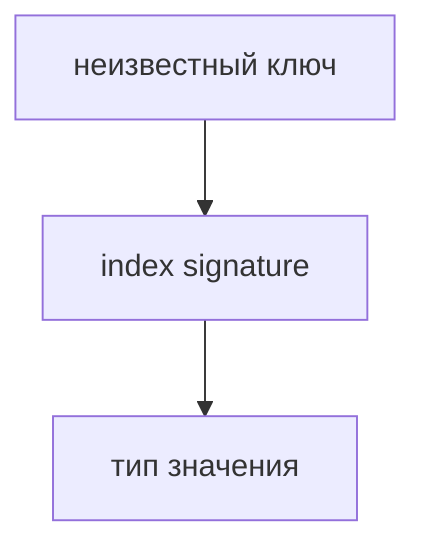

# Index Signatures

## Связь с предыдущей главой

Предыдущие главы описывали объекты с известными свойствами.

Но иногда объект работает как словарь: ключи заранее неизвестны, а тип значений должен быть одинаковым.

## Главный вопрос

> Как типизировать объект со заранее неизвестными ключами?

Короткий ответ: index signature описывает тип ключей и тип значений для объекта-словаря.

## Мотивация

В QA-коде такие объекты встречаются в headers, metadata и наборах параметров.

Ключи могут отличаться от запроса к запросу, но значения должны оставаться предсказуемыми.

## Теория

Index signature записывается так:

```typescript
const headers: { [name: string]: string } = {
  accept: 'application/json',
  authorization: 'Bearer token',
};
```

Это означает: любой строковый ключ должен иметь строковое значение.



## Внутренний механизм

TypeScript не знает все будущие ключи объекта.

Но он знает правило: если ключ строковый, значение должно соответствовать указанному типу.

Number index signature работает похожим образом, но для числового индекса.

В JavaScript числовые ключи обычного объекта в runtime становятся строковыми ключами, поэтому при совместном использовании string и number index signatures тип значения для number-индекса должен подходить под правило string-индекса.

Если у типа есть string index signature, явно названные свойства тоже должны иметь значения, совместимые с типом этой signature.

В текущей конфигурации проверки обращение по неизвестному ключу имеет указанный тип значения, но отсутствующий ключ в runtime все равно может вернуть `undefined`.

## Главная ментальная модель

Index signature — это правило для словаря.

Не список конкретных свойств, а договор для всех ключей определенного вида.

## Практические примеры

Примеры находятся в:

```text
examples/02-typescript/chapter-110/
```

`01-string-index-signature.ts` показывает словарь строк.

`02-number-index-signature.ts` показывает числовой индекс.

`03-headers-metadata.ts` показывает headers и metadata.

## Automation QA

HTTP headers удобно описывать как словарь строк:

```typescript
const headers: { [key: string]: string } = {
  accept: 'application/json',
};
```

Так request builder не примет случайное числовое значение в header.

## Распространённые ошибки

### Ошибка 1. Использовать index signature для любого объекта

Если свойства известны заранее, object type обычно яснее.

### Ошибка 2. Делать значения слишком широкими

`unknown` или `any` в словаре резко снижает полезность проверки.

### Ошибка 3. Думать, что index signature проверяет реальные внешние данные

TypeScript проверяет код, но не валидирует runtime-объекты.

## Практика

Практика находится в:

```text
practice/02-typescript/110-index-signatures.md
```

Решения находятся в:

```text
solutions/02-typescript/110-index-signatures.md
```

## Краткие итоги

Главное:

* index signature описывает словарь;
* ключи могут быть заранее неизвестны;
* значения должны соответствовать одному правилу;
* headers и metadata часто подходят под такую модель;
* для известных свойств лучше обычный object type.

## Переход

Теперь мы умеем описывать даже динамические наборы свойств.

Дальше нужно дать имя сложным типам, чтобы не повторять одну и ту же форму объекта снова и снова.
